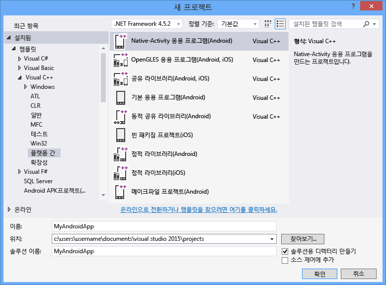

# Android Native Activity 앱 만들기
플랫폼 간 모바일 개발용 Visual C++ 옵션을 설치하는 경우 Visual Studio 2015를 사용하여 완벽하게 작동하는 Android Native Activity 앱을 만들 수 있습니다. Android NDK(네이티브 개발 키트)는 순수 C/C++ 코드를 사용하여 Android 앱의 대부분을 구현할 수 있게 해주는 도구 집합입니다. 일부 Java JNI 코드는 C/C++ 코드가 Android와 상호 작용할 수 있게 해주는 글루 역할을 합니다. Android NDK에서는 Android API 수준 9로 Native Activity 앱을 만들 수 있는 기능이 도입되었습니다. Native Activity 코드는 Unreal Engine 또는 OpenGL을 사용하는 게임 및 그래픽 집약적인 앱을 만드는 데 널리 사용됩니다. 이 항목에서는 OpenGL을 사용하는 간단한 Native Activity 앱을 만드는 과정을 안내합니다. 추가 항목에서는 Native Activity 코드를 편집, 빌드, 디버그 및 배포하는 개발자 수명 주기를 안내합니다.  
  
 [요구 사항](#req)   
 [새 Native Activity 프로젝트 만들기](#Create)   
 [기본 Android Native Activity 앱 빌드 및 실행](#BuildHello)  
  
##   요구 사항  
 Android Native Activity 앱을 만들기 전에 모든 시스템 요구 사항을 충족하고 Visual Studio 2015의 Visual C++ 모바일 개발 옵션을 설치했는지 확인해야 합니다. 자세한 내용은 [Install Visual C++ for Cross-Platform Mobile Development](../cross-platform/install-visual-cpp-for-cross-platform-mobile-development.md)를 참조하세요. 필요한 타사 도구 및 SDK가 설치에 포함되어 있고 Android용 Microsoft Visual Studio 에뮬레이터가 설치되어 있는지 확인합니다.  
  
##   새 Native Activity 프로젝트 만들기  
 이 자습서에서는 먼저 새 Android Native Activity 프로젝트를 만든 후 Visual Studio Emulator for Android에서 기본 앱을 빌드 및 실행합니다.  
  
#### 새 프로젝트를 만들려면  
  
1. Visual Studio를 엽니다. 메뉴 모음에서 **파일** > **새로 만들기** > **프로젝트**를 선택합니다.  
  
2. **새 프로젝트** 대화 상자의 **템플릿**에서 **Visual C++** > **플랫폼 간**을 차례로 선택한 후 **Native-Activity 응용 프로그램(Android)** 템플릿을 선택합니다.  
  
3. 앱의 이름을 `MyAndroidApp`과 같이 지정하고 **확인**를 참조하세요.  
  
      
  
    새 솔루션이 만들어지고 솔루션 탐색기가 열립니다.  
  
      
  
   새 Android Native Activity 앱 솔루션에는 다음 두 프로젝트가 포함되어 있습니다.  
  
-   `MyAndroidApp.NativeActivity`에는 앱을 Android에서 Native Activity로 실행하기 위한 참조 및 글루 코드가 포함되어 있습니다. 글루 코드의 진입점 구현은 *main.cpp*에 있습니다. 미리 컴파일된 헤더는 *pch.h*에 있습니다. 이 Native Activity 앱 프로젝트는 공유 라이브러리 *.so* 파일로 컴파일되며 패키징 프로젝트에서 이 라이브러리를 선택합니다.  
  
-   `MyAndroidApp.Packaging`은 Android 장치 또는 에뮬레이터에서 배포하기 위한 *.apk* 파일을 만듭니다. 이 프로젝트에는 리소스와 매니페스트 속성을 설정하는 *AndroidManifest.xml* 파일이 포함되어 있습니다. Ant 빌드 프로세스를 제어하는 *build.xml* 파일도 포함되어 있습니다. 이 프로젝트는 기본적으로 시작 프로젝트로 설정되므로 Visual Studio에서 직접 배포 및 실행할 수 있습니다.  
  
##   기본 Android Native Activity 앱 빌드 및 실행  
 템플릿을 통해 생성된 앱을 제작 및 실행하여 설치 및 설정을 확인합니다. 이 초기 테스트의 경우 Android용 Visual Studio 에뮬레이터에 의해 설치된 디바이스 프로필 중 하나에서 앱을 실행합니다. 다른 대상에서 앱을 테스트하려는 경우 대상 에뮬레이터를 로드하거나 디바이스를 컴퓨터에 연결할 수 있습니다.  
  
#### 기본 NativeActivity 앱을 빌드하고 실행하려면  
  
1.  아직 선택하지 않은 경우 **솔루션 플랫폼** 드롭다운 목록에서 **x86** 을 선택합니다.  
  
       
  
     **솔루션 플랫폼** 목록이 표시되지 않으면 **단추 추가/제거** 목록에서 **솔루션 플랫폼**을 선택한 후 플랫폼을 선택합니다.  
  
2.  메뉴 모음에서 **빌드** > **솔루션 빌드**를 선택합니다.  
  
     출력 창에 솔루션의 두 프로젝트에 대한 빌드 프로세스 출력이 표시됩니다.  
  
3.  배포 대상으로 VS 에뮬레이터 Android Phone(x86) 프로필 중 하나를 선택합니다.  
  
     다른 에뮬레이터를 설치했거나 Android 디바이스를 연결한 경우 배포 대상 드롭다운 목록에서 선택할 수 있습니다.  
  
4.  **F5** 키를 눌러 디버깅을 시작하거나 Shift+F5를 눌러 디버깅하지 않고 시작합니다.  
  
     다음은 Visual Studio Emulator for Android에서 기본 앱이 나타나는 모양입니다.  
  
       
  
     에뮬레이터가 시작됩니다. 코드를 로드하고 배포하는 데 몇 초 정도 걸릴 수 있습니다. 앱이 시작되면 중단점을 설정하고 디버거를 사용하여 코드를 단계별로 실행하고 지역을 검토하고 값을 조사할 수 있습니다.  
  
5.  **Shift**+**F5**를 눌러 디버깅을 중지합니다.  
  
     에뮬레이터는 별도의 프로세스로 계속 실행됩니다. 코드를 편집 및 컴파일하여 동일한 에뮬레이터에 여러 번 배포할 수 있습니다.