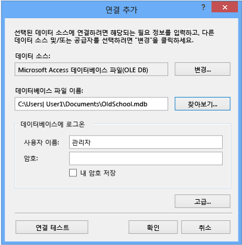

# Access 데이터베이스의 데이터에 연결(Windows Forms)

Access 데이터베이스에 연결할 수 있습니다 (중 하나는 *.mdf* 파일 또는 *.accdb* 파일) Visual Studio를 사용 하 여 합니다. 연결을 정의한 후 **데이터 원본** 창에 데이터가 나타납니다. 그 창에서 테이블 또는 뷰를 폼으로 끌 수 있습니다.

## 전제 조건

이런 절차를 사용하려면 Windows Forms 애플리케이션 프로젝트와 Access 데이터베이스(*.accdb* 파일) 또는 Access 2000-2003 데이터베이스(*.mdb* 파일)가 필요합니다. 파일 형식에 해당하는 절차를 따릅니다.

## .accdb 파일에 대한 데이터 세트 만들기

다음 절차를 사용 하 여 Access 2013, Office 365, Access 2010 또는 Access 2007을 통해 만든 데이터베이스에 연결할 수 있습니다.

### 데이터 집합을 만들려면

1.  데이터를 연결하려는 Windows Forms 애플리케이션을 엽니다.

2.  열려는 **데이터 원본** 창에서를 **보기** 메뉴를 선택 **다른 Windows** > **데이터 원본**합니다.

     

3.  **데이터 소스** 창에서 **새 데이터 소스 추가**를 클릭합니다.

     **데이터 원본 구성** 마법사가 열립니다.

4.  선택 **데이터베이스** 에 **데이터 소스 형식 선택** 페이지를 선택한 후 **다음**합니다.

5.  선택 **데이터 집합** 에 **데이터베이스 모델 선택** 페이지를 선택한 후 **다음**합니다.

6.  **데이터 연결 선택** 페이지에서 **새 연결**을 선택하여 새 데이터 연결을 구성합니다.

     **연결 추가** 대화 상자가 열립니다.

7.  선택 된 **변경** 단추 옆에 **데이터 원본** 입력란.

     합니다 **데이터 소스 변경** 대화 상자가 열립니다.

8.  데이터 원본 목록에서 선택  **\<다른\>** 합니다. 에 **데이터 공급자** 드롭다운 목록에서 선택 **.NET Framework Data Provider for OLE DB**를 선택한 **확인**합니다.

9. 다시 합니다 **연결 추가** 대화 상자에서 **Microsoft Office 12.0 Access Database Engine OLE DB Provider** 에서 **OLE DB Provider** 드롭 다운 합니다.

     

     > [!NOTE]
     > 찾을 수 없으면 **Microsoft Office 12.0 Access Database Engine OLE DB Provider** 드롭다운 목록에는 OLE DB 공급자에 설치 해야 합니다 [2007 Office system 드라이버: 데이터 연결 구성 요소](https://www.microsoft.com/download/confirmation.aspx?id=23734)합니다.

9. 에 **서버 또는 파일 이름** 텍스트 상자에 경로 지정 하 고 파일 이름을 *.accdb* 파일에 연결 하 고 클릭 하려는 **확인**합니다. (데이터베이스 파일에 있으면 사용자 이름 및 암호를 지정 하 선택 하기 전에 **확인**.)

10. 선택 **다음** 에 **데이터 연결 선택** 페이지입니다.

     데이터 파일이 현재 프로젝트의 없습니다 수를 알리는 대화 상자가 표시 될 수 있습니다. **예** 또는 **아니요**를 선택합니다.

11. 선택 **다음** 에 **응용 프로그램 구성 파일에 연결 문자열 저장** 페이지입니다.

12. **데이터베이스 개체 선택** 페이지에서 **테이블** 노드를 확장합니다.

13. 모든 테이블 또는 뷰에서 데이터 집합에 원하는 하 고 선택 하면 선택 **완료**합니다.

     데이터 세트가 프로젝트에 추가되고 테이블과 뷰가 **데이터 원본** 창에 나타납니다.

## .Mdb 파일에 대 한 데이터 집합을 만들려면

데이터 세트는 **데이터 원본 구성 마법사**를 실행하여 만듭니다.

### 데이터 집합을 만들려면

1.  데이터를 연결하려는 Windows Forms 애플리케이션을 엽니다.

2.  에 **뷰** 메뉴에서 **기타 Windows** > **데이터 원본**합니다.

     

3.  **데이터 소스** 창에서 **새 데이터 소스 추가**를 클릭합니다.

     **데이터 원본 구성** 마법사가 열립니다.

4.  선택 **데이터베이스** 에 **데이터 소스 형식 선택** 페이지를 선택한 후 **다음**합니다.

5.  선택 **데이터 집합** 에 **데이터베이스 모델 선택** 페이지를 선택한 후 **다음**합니다.

6.  **데이터 연결 선택** 페이지에서 **새 연결**을 선택하여 새 데이터 연결을 구성합니다.

7.  데이터 원본에 없는 경우 **Microsoft Access 데이터베이스 파일 (OLE DB)** 를 선택 **변경** 열려는 합니다 **데이터 소스 변경** 대화 상자 **Microsoft 데이터베이스 파일에 액세스할**를 선택한 후 **확인**합니다.

8.  에 **데이터베이스 파일 이름**의 이름과 경로 지정 합니다 *.mdb* 파일에 연결 하 고 클릭 하려는 **확인**.

     

9. 선택 **다음** 에 **데이터 연결 선택** 페이지입니다.

10. 선택 **다음** 에 **응용 프로그램 구성 파일에 연결 문자열 저장** 페이지입니다.

11. **데이터베이스 개체 선택** 페이지에서 **테이블** 노드를 확장합니다.

12. 모든 테이블 또는 뷰에서 데이터 집합에 원하는 하 고 선택 하면 선택 **완료**합니다.

     데이터 세트가 프로젝트에 추가되고 테이블과 뷰가 **데이터 원본** 창에 나타납니다.

## 보안

중요한 정보(예: 암호)를 저장하면 응용 프로그램 보안 문제가 발생할 수 있습니다. 데이터베이스 액세스를 제어할 경우에는 통합 보안이라고도 하는 Windows 인증을 사용하는 방법이 더 안전합니다. 자세한 내용은 [연결 정보 보호](/dotnet/framework/data/adonet/protecting-connection-information)를 참조하세요.

## 다음 단계

방금 만든 데이터 집합에서 제공 됩니다. 합니다 **데이터 원본** 창입니다. 다음 작업 중 어떤 작업이든 수행할 수 있습니다.

-   항목을 선택 합니다 **데이터 원본** 창에서 폼으로 끌어와 (참조 [Visual Studio에서 데이터 바인딩 Windows Forms 컨트롤](../data-tools/bind-windows-forms-controls-to-data-in-visual-studio.md)).

-   **데이터 세트 디자이너**에서 데이터 원본을 열어 데이터 세트를 구성하는 개체를 추가하거나 편집합니다.

-   유효성 검사 논리를 추가 합니다 <xref:System.Data.DataTable.ColumnChanging> 또는 <xref:System.Data.DataTable.RowChanging> 데이터 집합에 있는 데이터 테이블의 이벤트 (참조 [데이터 집합의 데이터 유효성 검사](../data-tools/validate-data-in-datasets.md)).

## 참고 항목

- [연결 추가](../data-tools/add-new-connections.md)