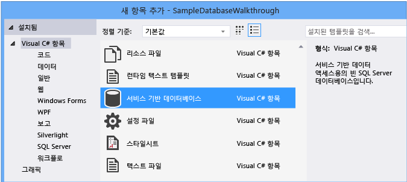

# <a name="create-a-database-and-add-tables-in-visual-studio"></a>데이터베이스를 만들고 Visual Studio에서 테이블을 추가 합니다.

만들기 및 SQL Server Express LocalDB의 로컬 데이터베이스 파일을 업데이트 하려면 Visual Studio를 사용할 수 있습니다. TRANSACT-SQL 문을 실행 하 여 데이터베이스를 만들 수도 있습니다는 **SQL Server 개체 탐색기** Visual Studio의 도구 창입니다. 이 항목에서는 만듭니다는 *.mdf* 파일 및 테이블 디자이너를 사용 하 여 테이블 및 키를 추가 합니다.

## <a name="prerequisites"></a>전제 조건

이 연습을 완료 하려면 선택적 있어야 **데이터 저장소 및 처리** 워크 로드가 Visual Studio에서 설치 합니다. 을 설치 하려면 엽니다 **Visual Studio 설치 관리자** 선택 합니다 **워크 로드** 탭 합니다. 아래 **웹 및 클라우드**, 선택 **데이터 저장 및 처리**합니다. 선택 된 **수정** Visual Studio에 작업을 추가 하려면 단추입니다.

## <a name="create-a-project-and-a-local-database-file"></a>프로젝트 및 로컬 데이터베이스 파일 만들기

1. **SampleDatabaseWalkthrough**로 명명된 Windows Form 프로젝트를 만듭니다.

2. 메뉴 모음에서 선택 **프로젝트** > **새 항목 추가**합니다.

3. 선택한 항목 템플릿 목록에서 아래로 스크롤하여 **서비스 기반 데이터베이스**합니다.

     

4. 데이터베이스 이름을 **SampleDatabase**를 선택한 후 합니다 **추가** 단추입니다.

### <a name="add-a-data-source"></a>데이터 원본 추가

1. 경우는 **데이터 원본** 창이 열려 있지 않으면, 키를 눌러 엽니다 **Shift**+**Alt**+**D** 선택 **뷰** > **기타 Windows** > **데이터 원본을** 메뉴 모음에서.

1. 에 **데이터 원본** 창에서 합니다 **새 데이터 소스 추가** 링크 합니다.

   **데이터 원본 구성** 마법사가 열립니다.

1. 에 **데이터 소스 형식 선택** 페이지에서 **데이터베이스** 를 선택한 후 **다음**합니다.

1. 에 **데이터베이스 모델 선택** 페이지에서 **다음** 기본값 (데이터 집합)을 합니다.

1. 에 **데이터 연결 선택** 페이지에서 선택 합니다 **SampleDatabase.mdf** 드롭 다운 목록에서 파일을 선택한 **다음**.

1. 에 **응용 프로그램 구성 파일에 연결 문자열 저장** 페이지에서 **다음**합니다.

1. 하나는 **데이터베이스 개체 선택** 페이지 표시를 알리는 메시지를 데이터베이스 개체를 포함 하지 않습니다. **마침**을 선택합니다.

### <a name="view-properties-of-the-data-connection"></a>데이터 연결의 속성 보기

에 대 한 연결 문자열을 볼 수 있습니다 합니다 *SampleDatabase.mdf* 데이터 연결의 속성 창을 열어 파일:

- Visual Studio에서 선택 **뷰** > **SQL Server 개체 탐색기** 창이 열려 있지 않은 경우. 확장 하 여 속성 창을 엽니다는 **데이터 연결** 에 대 한 바로 가기 메뉴를 열고 노드를 *SampleDatabase.mdf*를 선택한 다음 **속성**.

- 선택할 수 있습니다 **뷰** > **서버 탐색기**창이 아직 열려 있지 않은 경우. 확장 하 여 속성 창을 엽니다는 **데이터 연결** 노드. 바로 가기 메뉴를 열고 *SampleDatabase.mdf*를 선택한 후 **속성**합니다.

## <a name="create-tables-and-keys-by-using-table-designer"></a>테이블 디자이너를 사용 하 여 테이블 및 키 만들기

이 섹션에서는 두 개의 테이블, 각 테이블 및 몇 가지 샘플 데이터 행의 기본 키를 만들어야 합니다. 한 테이블의 레코드가 다른 테이블의 레코드에 해당 하는 방법을 지정 하는 외래 키도 만들어야 합니다.

### <a name="create-the-customers-table"></a>Customers 테이블을 만들려면

1. **서버 탐색기** 또는 **SQL Server 개체 탐색기**를 확장 합니다 **데이터 연결** 노드를 펼친 다음는 **SampleDatabase.mdf**노드.

2. 바로 가기 메뉴를 열고 **테이블**를 선택한 후 **새 테이블 추가**합니다.

     **테이블 디자이너**가 열리고 사용자가 만드는 테이블의 단일 열을 나타내는 한 개의 기본 행이 포함된 표가 표시됩니다. 표에 행을 추가하여 테이블에 열을 추가합니다.

3. 표에서 다음 각 항목에 대한 행을 추가합니다.

    |열 이름|데이터 형식|null 허용|
    |-----------------|---------------|-----------------|
    |`CustomerID`|`nchar(5)`|False(선택 취소)|
    |`CompanyName`|`nvarchar(50)`|False(선택 취소)|
    |`ContactName`|`nvarchar (50)`|True(선택)|
    |`Phone`|`nvarchar (24)`|True(선택)|

4. 바로 가기 메뉴를 열고 합니다 `CustomerID` 행을 선택한 후 **기본 키 설정**합니다.

5. 기본 행에 대 한 바로 가기 메뉴를 열고 선택한 **삭제**합니다.

6. 다음 샘플과 일치하도록 스크립트 창에서 첫 번째 줄을 업데이트하여 Customers 테이블 이름을 지정합니다.

    ```sql
    CREATE TABLE [dbo].[Customers]
    ```

    다음과 같이 표시되어야 합니다.

    

7. 왼쪽 위 모서리에는 **테이블 디자이너**를 선택 합니다 **업데이트** 단추입니다.

8. 에 **데이터베이스 업데이트 미리 보기** 대화 상자를 선택 합니다 **데이터베이스 업데이트** 단추입니다.

    변경 내용이 로컬 데이터베이스 파일에 저장됩니다.

### <a name="create-the-orders-table"></a>Orders 테이블을 만들려면

1. 다른 테이블을 추가한 다음, 다음 표의 각 항목에 대한 행을 추가합니다.

    |열 이름|데이터 형식|null 허용|
    |-----------------|---------------|-----------------|
    |`OrderID`|`int`|False(선택 취소)|
    |`CustomerID`|`nchar(5)`|False(선택 취소)|
    |`OrderDate`|`datetime`|True(선택)|
    |`OrderQuantity`|`int`|True(선택)|

2. 설정할 **OrderID** 기본 키와 기본 행을 한 다음 삭제 합니다.

3. 다음 샘플과 일치하도록 스크립트 창에서 첫 번째 줄을 업데이트하여 Orders 테이블 이름을 지정합니다.

    ```sql
    CREATE TABLE [dbo].[Orders]
    ```

4. 왼쪽 위 모서리에는 **테이블 디자이너**를 선택 합니다 **업데이트** 단추입니다.

5. 에 **데이터베이스 업데이트 미리 보기** 대화 상자를 선택 합니다 **데이터베이스 업데이트** 단추입니다.

    변경 내용이 로컬 데이터베이스 파일에 저장됩니다.

### <a name="create-a-foreign-key"></a>외래 키 만들기

1. 그리드의 오른쪽에 컨텍스트 창에서 바로 가기 메뉴를 열고 **외래 키**를 선택한 후 **새 외래 키 추가**다음 그림과 같이 합니다.

     

2. 표시되는 텍스트 상자에서 **ToTable**을 **Customers**로 바꿉니다.

3. T-SQL 창에서 마지막 줄 다음 샘플과 일치 하도록 업데이트 합니다.

    ```sql
    CONSTRAINT [FK_Orders_Customers] FOREIGN KEY ([CustomerID]) REFERENCES [Customers]([CustomerID])
    ```

4. 왼쪽 위 모서리에는 **테이블 디자이너**를 선택 합니다 **업데이트** 단추입니다.

5. 에 **데이터베이스 업데이트 미리 보기** 대화 상자를 선택 합니다 **데이터베이스 업데이트** 단추입니다.

    변경 내용이 로컬 데이터베이스 파일에 저장됩니다.

## <a name="populate-the-tables-with-data"></a>데이터로 테이블 채우기

1. **서버 탐색기** 하거나 **SQL Server 개체 탐색기**, 샘플 데이터베이스에 대 한 노드를 확장 합니다.

2. 에 대 한 바로 가기 메뉴를 열고를 **테이블** 노드를 선택 **새로 고침**를 차례로 확장 하 고는 **테이블** 노드.

3. Customers 테이블에 대 한 바로 가기 메뉴를 열고 선택한 **테이블 데이터 표시**합니다.

4. 일부 고객에 대해 원하는 모든 데이터를 추가 합니다.

    고객 ID를 5자로 지정할 수 있지만 나중에 이 절차에서 사용할 수 있도록 기억하기 쉬운 1자 정도를 선택하면 됩니다.

5. Orders 테이블에 대 한 바로 가기 메뉴를 열고 선택한 **테이블 데이터 표시**합니다.

6. 일부 주문에 대 한 데이터를 추가 합니다.

    > [!IMPORTANT]
    > 모든 주문 ID와 주문 수량이 정수이고 각 고객 ID가 Customers 테이블의 **CustomerID** 열에 지정한 값과 일치하는지 확인합니다.

7. 메뉴 모음에서 선택 **파일** > **모두 저장**합니다.

## <a name="see-also"></a>참고 항목

- [Visual Studio에서 데이터 액세스](accessing-data-in-visual-studio.md)