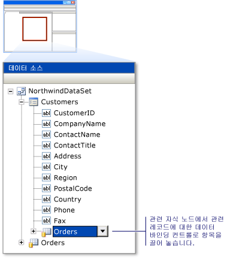

# 방법: WPF 응용 프로그램에서 관련 데이터 표시
일부 응용 프로그램에서는 부모\-자식 관계로 서로 관련된 여러 테이블이나 엔터티의 데이터로 작업해야 할 수 있습니다.  예를 들어, `Customers` 테이블의 고객을 표시하는 표를 표시해야 할 수 있습니다.  사용자가 특정 고객을 선택하면 관련 `Orders` 테이블에서 가져온 해당 고객의 주문이 다른 표에 표시됩니다.  
  
 **데이터 소스** 창에서 WPF Designer로 항목을 끌어 관련 데이터를 표시하는 데이터 바인딩된 컨트롤을 만들 수 있습니다.  
  
### 관련 레코드를 표시하는 컨트롤을 만들려면  
  
1.  **데이터** 메뉴에서 **데이터 소스 표시**를 클릭하여 **데이터 소스** 창을 엽니다.  
  
2.  **새 데이터 소스 추가**를 클릭하고 **데이터 소스 구성 마법사**를 완료합니다.  
  
3.  WPF Designer를 열고 **데이터 소스** 창의 항목을 끌어 놓을 수 있는 컨테이너가 있는지 확인합니다.  
  
     유효한 놓기 대상에 대한 자세한 내용은 [Visual Studio에서 데이터에 WPF 컨트롤 바인딩](../data-tools/bind-wpf-controls-to-data-in-visual-studio1.md)을 참조하십시오.  
  
4.  **데이터 소스** 창에서 관계에서 부모 테이블이나 개체를 나타내는 노드를 확장합니다.  부모 테이블이나 개체는 일대다 관계에서 "일"에 해당합니다.  
  
5.  부모 노드\(또는 부모 노드의 개별 항목\)를 **데이터 소스** 창에서 디자이너의 유효한 놓기 대상으로 끕니다.  
  
     Visual Studio에서 끌어 오는 각 항목에 대한 새 데이터 바인딩된 컨트롤을 만드는 XAML을 생성합니다.  또한 XAML은 부모 테이블이나 개체의 새 <xref:System.Windows.Data.CollectionViewSource>를 놓기 대상의 리소스에 추가합니다.  일부 데이터 소스의 경우 Visual Studio에서 데이터를 부모 테이블이나 개체에 로드하는 코드도 생성합니다.  자세한 내용은 [Visual Studio에서 데이터에 WPF 컨트롤 바인딩](../data-tools/bind-wpf-controls-to-data-in-visual-studio1.md)을 참조하십시오.  
  
6.  **데이터 소스** 창에서 관련 자식 테이블이나 개체를 찾습니다.  관련 자식 테이블과 개체는 부모 노드의 데이터 목록 아래쪽에 확장 가능한 노드로 표시됩니다.  
  
7.  자식 노드\(또는 자식 노드의 개별 항목\)를 **데이터 소스** 창에서 디자이너의 유효한 놓기 대상으로 끕니다.  
  
     Visual Studio에서 끌어 오는 각 항목에 대한 새 데이터 바인딩된 컨트롤을 만드는 XAML을 생성합니다.  또한 XAML은 자식 테이블이나 개체의 새 <xref:System.Windows.Data.CollectionViewSource>를 놓기 대상의 리소스에 추가합니다.  이 새 <xref:System.Windows.Data.CollectionViewSource>는 방금 디자이너로 끌어 온 부모 테이블이나 개체의 속성에 바인딩됩니다.  일부 데이터 소스의 경우 Visual Studio에서 데이터를 자식 테이블이나 개체에 로드하는 코드도 생성합니다.  
  
     다음 그림에서는 **데이터 소스** 창에 있는 데이터 집합의 **Customers** 테이블과 관련된 **Orders** 테이블을 보여 줍니다.  
  
       
  
## 참고 항목  
 [Visual Studio에서 데이터에 WPF 컨트롤 바인딩](../data-tools/bind-wpf-controls-to-data-in-visual-studio1.md)   
 [방법: Visual Studio에서 데이터에 WPF 컨트롤 바인딩](../data-tools/bind-wpf-controls-to-data-in-visual-studio2.md)   
 [방법: WPF 응용 프로그램에서 조회 테이블 만들기](../data-tools/create-lookup-tables-in-wpf-applications.md)   
 [연습: WPF 응용 프로그램에서 관련 데이터 표시](../data-tools/walkthrough-displaying-related-data-in-a-wpf-application.md)