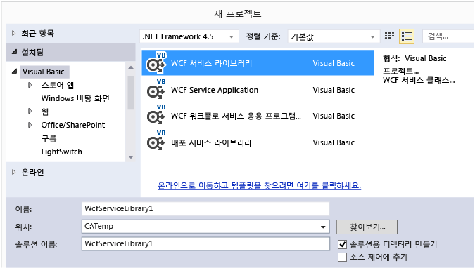
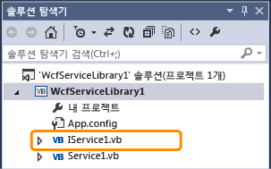
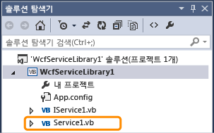
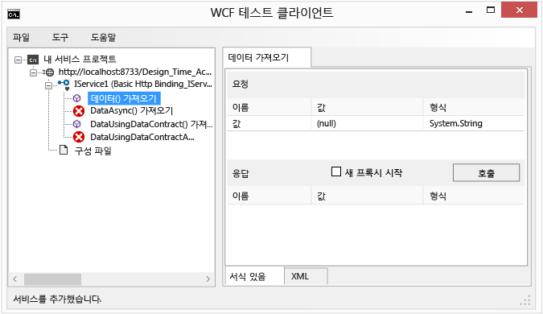
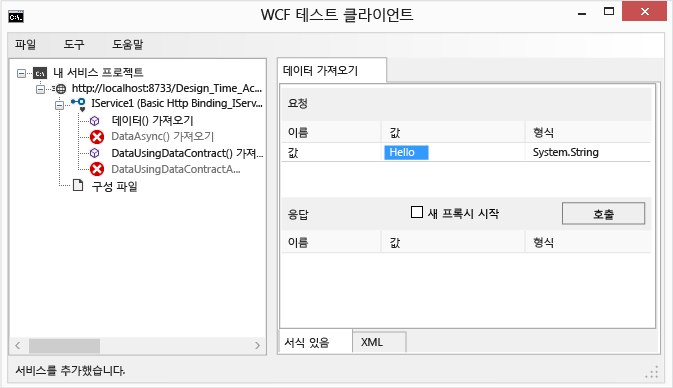
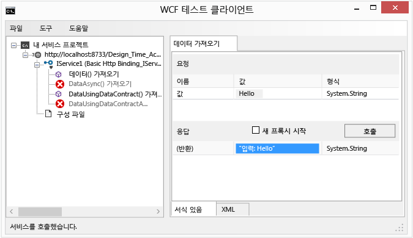
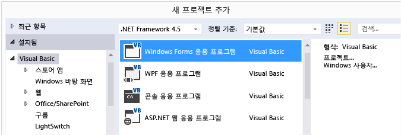
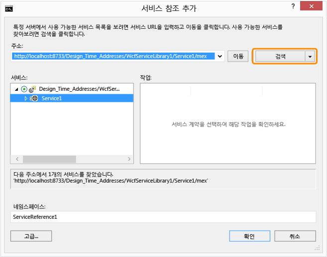
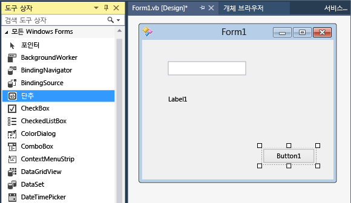
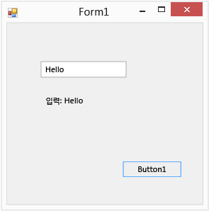

# 연습: Windows Forms에서 간단한 WCF 서비스 만들기
이 연습에서는 간단한 [!INCLUDE[vsindigo](../data-tools/includes/vsindigo_md.md)] 서비스를 만들고 테스트한 다음 Windows Forms 응용 프로그램에서 액세스하는 방법을 보여 줍니다.  
  
[!INCLUDE[note_settings_general](../data-tools/includes/note_settings_general_md.md)]  
  
## 서비스 만들기  
  
#### WCF 서비스를 만들려면  
  
1.  **파일** 메뉴에서 **새로 만들기** 를 가리킨 다음 **프로젝트**를 클릭합니다.  
  
2.  에 **새 프로젝트** 대화 상자에서 **Visual Basic** 또는 **Visual C#** 노드와 클릭 **WCF**옵니다 **WCF 서비스 라이브러리**합니다. 클릭 **확인** 여 프로젝트를 엽니다.  
  
       
  
    > [!NOTE]
    >  이렇게 하면 테스트 및 액세스할 수 있는 작업 서비스가 만들어집니다. 다음 두 단계는 다른 데이터 형식을 사용하도록 기본 메서드를 수정하는 방법을 보여 줍니다. 실제 응용 프로그램에서는 서비스에 사용자 고유의 함수를 추가할 수도 있습니다.  
  
3.    
  
     **솔루션 탐색기**IService1.vb 또는 IService1.cs를 두 번 클릭 하 고 다음 줄을 찾습니다.  
  
     [!code-csharp[WCFWalkthrough#4](../data-tools/codesnippet/CSharp/walkthrough-creating-a-simple-wcf-service-in-windows-forms_1.cs)]
     [!code-vb[WCFWalkthrough#4](../data-tools/codesnippet/VisualBasic/walkthrough-creating-a-simple-wcf-service-in-windows-forms_1.vb)]  
  
     에 대 한 형식을 변경는 `value` 매개 변수를 문자열:  
  
     [!code-csharp[WCFWalkthrough#1](../data-tools/codesnippet/CSharp/walkthrough-creating-a-simple-wcf-service-in-windows-forms_2.cs)]
     [!code-vb[WCFWalkthrough#1](../data-tools/codesnippet/VisualBasic/walkthrough-creating-a-simple-wcf-service-in-windows-forms_2.vb)]  
  
     위의 코드에서 `<OperationContract()>` 또는 `[OperationContract]` 특성을 확인합니다. 이러한 특성은 서비스에서 노출하는 모든 메서드에 필요합니다.  
  
4.    
  
     **솔루션 탐색기**Service1.vb 또는 Service1.cs를 두 번 클릭 하 고 다음 줄을 찾습니다.  
  
     [!code-vb[WCFWalkthrough#5](../data-tools/codesnippet/VisualBasic/walkthrough-creating-a-simple-wcf-service-in-windows-forms_3.vb)]
     [!code-csharp[WCFWalkthrough#5](../data-tools/codesnippet/CSharp/walkthrough-creating-a-simple-wcf-service-in-windows-forms_3.cs)]  
  
     값 매개 변수의 형식을 문자열로 변경 합니다.  
  
     [!code-csharp[WCFWalkthrough#2](../data-tools/codesnippet/CSharp/walkthrough-creating-a-simple-wcf-service-in-windows-forms_4.cs)]
     [!code-vb[WCFWalkthrough#2](../data-tools/codesnippet/VisualBasic/walkthrough-creating-a-simple-wcf-service-in-windows-forms_4.vb)]  
  
## 서비스 테스트  
  
#### WCF 서비스를 테스트하려면  
  
1.  키를 눌러 **F5** 서비스를 실행 합니다. A **WCF 테스트 클라이언트** 폼이 표시 되 고 서비스가 로드 됩니다.  
  
2.  에 **WCF 테스트 클라이언트** 양식에서 두 번 클릭은 **getdata ()** 아래 메서드의 **IService1**합니다. **GetData** 탭이 표시 됩니다.  
  
       
  
3.  에 **요청** 상자는 **값** 필드와 형식 `Hello`합니다.  
  
       
  
4.  클릭는 **Invoke** 단추입니다. 경우는 **보안 경고** 대화 상자가 표시 됩니다, 클릭 **확인**합니다. 결과에 표시 됩니다는 **응답** 상자입니다.  
  
       
  
5.  에 **파일** 메뉴를 클릭 하 여 **종료** 테스트 폼을 닫습니다.  
  
## 서비스 액세스  
  
#### WCF 서비스를 참조하려면  
  
1.  에 **파일** 메뉴에서 **추가** 클릭 하 고 **새 프로젝트**합니다.  
  
2.  에 **새 프로젝트** 대화 상자에서 **Visual Basic** 또는 **Visual C#** 노드 선택한 **Windows**를 선택한 후 **Windows Forms 응용 프로그램**합니다. 클릭 **확인** 여 프로젝트를 엽니다.  
  
       
  
3.  마우스 오른쪽 단추로 클릭 **WindowsApplication1** 클릭 **서비스 참조 추가**합니다. **서비스 참조 추가** 대화 상자가 표시 됩니다.  
  
4.  에 **서비스 참조 추가** 대화 상자를 클릭 **Discover**합니다.  
  
       
  
     **Service1** 에 표시 됩니다는 **서비스** 창.  
  
5.  클릭 **확인** 서비스 참조를 추가 합니다.  
  
#### 클라이언트 응용 프로그램을 빌드하려면  
  
1.  **솔루션 탐색기**를 두 번 클릭 **Form1.vb** 또는 **Form1.cs** 를 아직 열지 않은 경우 Windows Forms 디자이너를 엽니다.  
  
2.  **도구 상자**를 끌어는 `TextBox` 컨트롤은 `Label` 컨트롤 및 `Button` 컨트롤을 폼으로 합니다.  
  
       
  
3.  `Button`을 두 번 클릭하고 다음 코드를 `Click` 이벤트 처리기에 추가합니다.  
  
     [!code-csharp[WCFWalkthrough#3](../data-tools/codesnippet/CSharp/walkthrough-creating-a-simple-wcf-service-in-windows-forms_5.cs)]
     [!code-vb[WCFWalkthrough#3](../data-tools/codesnippet/VisualBasic/walkthrough-creating-a-simple-wcf-service-in-windows-forms_5.vb)]  
  
4.  **솔루션 탐색기**를 마우스 오른쪽 단추로 클릭 **WindowsApplication1** 클릭 **시작 프로젝트로 설정**합니다.  
  
5.  키를 눌러 **F5** 프로젝트를 실행 합니다. 텍스트를 입력하고 단추를 클릭합니다. 레이블에 "입력한 내용:"과 입력한 텍스트가 표시됩니다.  
  
       
  
## 참고 항목  
 [Windows Communication Foundation 서비스 및 Visual Studio의 WCF Data Services](../data-tools/windows-communication-foundation-services-and-wcf-data-services-in-visual-studio.md)