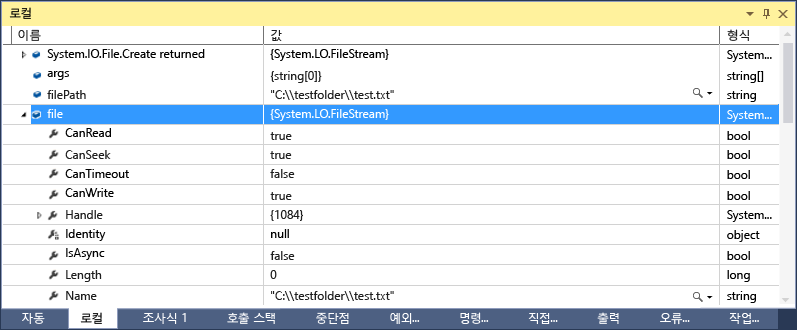

# <a name="inspect-variables-in-the-autos-and-locals-windows"></a>자동 및 지역 창에서 변수 검사

합니다 **자동** 하 고 **지역** windows 디버깅 하는 동안 변수 값을 표시 합니다. Windows는 디버깅 세션 중만 사용할 수 있습니다. 합니다 **자동** 창에 현재 중단점 사용 된 변수가 표시 됩니다. 합니다 **지역** 창 현재 함수나 메서드는 일반적으로 로컬 범위에 정의 된 변수를 표시 합니다. 코드를 처음으로 디버그하는 경우 이 문서를 진행하기 전에 먼저 [완전 초보자를 위한 디버깅](../debugger/debugging-absolute-beginners.md) 및 [더 나은 C# 코드를 작성하여 버그 수정](../debugger/write-better-code-with-visual-studio.md)을 읽어보는 것이 좋습니다.

 합니다 **자동** 창은 사용할 수 있습니다 C#, Visual Basic, c + + 및 Python 코드를 JavaScript에 대 한 또는 F#합니다.
  
열려는 합니다 **자동** 창에서 디버그 하는 동안 **디버그** > **Windows** > **자동**를 누르거나 **Ctrl**+**Alt**+**V** > **A**합니다.  

열려는 합니다 **지역** 창에서 디버그 하는 동안 **디버그** > **Windows** > **지역**를 누르거나 **Alt**+**4**합니다.

> [!NOTE]
> 이 토픽은 Windows의 Visual Studio에 적용됩니다. Mac 용 Visual Studio에 대 한 참조 [Mac 용 Visual Studio에서 데이터 시각화](/visualstudio/mac/data-visualizations)합니다.

## <a name="use-the-autos-and-locals-windows"></a>자동 및 지역 창 사용

배열 및 개체에 표시 합니다 **자동** 하 고 **지역** 트리 컨트롤로 windows. 필드 및 속성을 표시 하도록 보기를 확장 하는 변수 이름의 왼쪽에 있는 화살표를 선택 합니다. 예로 <xref:System.IO.FileStream?displayProperty=fullName> 개체를 **지역** 창:



빨간색 값을 **지역** 또는 **자동** 창 값은 마지막 평가 이후 변경 된 것을 의미 합니다. 이전 디버깅 세션에서 변경 될 수 없거나 창에서 값을 변경 합니다.

기본 숫자 형식을 디버거 창에는 10 진수입니다. 16 진수를 변경 하려면 마우스 오른쪽 단추로 클릭 합니다 **지역** 하거나 **자동** 창과 선택 **16 진수 표시**합니다. 이 변경에는 모든 디버거 창에 적용 합니다.

## <a name="edit-variable-values-in-the-autos-or-locals-window"></a>자동 또는 지역 창에서 변수 값 편집

대부분의 변수 값을 편집 하는 **자동** 또는 **지역** windows에서 값을 두 번 클릭 하 고 새 값을 입력 합니다.

값에 대해 식을 입력할 수 있습니다(예: `a + b`). 디버거는 유효한 언어 식을 대부분 받아들입니다.

네이티브 C++ 코드에서 변수 이름의 컨텍스트를 한정해야 할 수 있습니다. 자세한 내용은 [컨텍스트 연산자(C++)](../debugger/context-operator-cpp.md)를 참조하세요.

>[!CAUTION]
>값 및 식 변경 하기 전에 결과 이해 해야 합니다. 가능한 몇 가지 문제는:
>
>-   일부 경우에는 식을 계산하면 변수 값이 바뀌거나 프로그램 상태에 영향이 미칠 수 있습니다. 예를 들어, 평가할 `var1 = ++var2` 둘 다의 값을 변경 `var1` 및 `var2`합니다. 이러한 식은 있다고 [부작용](https://en.wikipedia.org/wiki/Side_effect_\(computer_science\))합니다. 부작용의 인식할 수 없는 경우 예기치 않은 결과가 발생할 수 있습니다.
>
>-   부동 소수점 값을 편집하면 소수 부분이 10진수에서 이진수로 변환되면서 약간의 오차가 발생할 수 있습니다. 무해 한 것 처럼 보이는 편집도 부동 소수점 변수의 비트 중 일부에 대 한 변경 될 수 있습니다.

## <a name="change-the-context-for-the-autos-or-locals-window"></a>자동 또는 지역 창에 대 한 컨텍스트를 변경 합니다.

사용할 수는 **디버그 위치** 도구 모음을 원하는 함수, 스레드 또는 프로세스에 대 한 컨텍스트를 변경 하는 선택 합니다 **자동** 및 **지역** windows.

사용 하도록 설정 합니다 **디버그 위치** 도구 모음에서 선택한 도구 모음 영역의 빈 부분에는 클릭 **디버그 위치** 드롭다운 목록에서 선택 **뷰**  >   **도구 모음** > **디버그 위치**합니다.

중단점을 설정하고 디버깅을 시작합니다. 중단점이 적중 될 때 실행 일시 중지 하면 확인할 수 있습니다 위치 합니다 **디버그 위치** 도구 모음입니다.


## <a name="bkmk_whatvariables"></a> 자동 창에서 변수 (C#, Visual Basic, c + +, Python)

 다른 코드 언어에 다른 변수를 표시 합니다 **자동** 창입니다.

 - C# 및 Visual Basic에서 **자동** 창에는 현재 또는 이전 줄에 사용된 모든 변수가 표시됩니다. 예를 들어, C# 또는 Visual Basic 코드를 다음 4 개의 변수를 선언 합니다.

   ```csharp
       public static void Main()
       {
          int a, b, c, d;
          a = 1;
          b = 2;
          c = 3;
          d = 4;
       }
   ```

   줄에 중단점을 설정할 `c = 3;`, 고 디버거를 시작 합니다. 실행이 일시 중지 하는 경우는 **자동** 창에 표시 됩니다.

   

   변수의 `c` 때문에 0 이면 줄 `c = 3` 아직 실행 되지 않았습니다.

 - C + +에서는 합니다 **자동** 실행이 일시 중지 적어도 세 줄은 현재 줄 앞에 사용 된 변수 창에 표시 됩니다. 예를 들어, c + + 코드에서 6 개의 변수를 선언 합니다.

   ```C++
       void main() {
           int a, b, c, d, e, f;
           a = 1;
           b = 2;
           c = 3;
           d = 4;
           e = 5;
           f = 6;
       }
   ```

    줄에 중단점을 설정할 `e = 5;` 디버거를 실행 합니다. 실행이 중지 되는 경우는 **자동** 창에 표시 됩니다.

    

    변수의 `e` 아니므로 초기화 줄 `e = 5` 아직 실행 되지 않았습니다.

##  <a name="bkmk_returnValue"></a> View return values of method calls
 .NET 및 c + + 코드의 반환 값을 검사할 수 있습니다 합니다 **자동** 창 프로시저 단위로 실행 하거나 메서드 호출 합니다. 보기 메서드 호출에서 반환 값 로컬 변수에 저장 되지 않습니다 하는 경우 유용할 수 있습니다. 메서드가 다른 메서드의 반환 값 또는 매개 변수로 사용할 수 있습니다.

 예를 들어, 다음 C# 코드는 두 함수의 반환 값을 추가 합니다.

```csharp
static void Main(string[] args)
{
    int a, b, c, d;
    a = 1;
    b = 2;
    c = 3;
    d = 4;
    int x = sumVars(a, b) + subtractVars(c, d);
}

private static int sumVars(int i, int j)
{
    return i + j;
}

private static int subtractVars(int i, int j)
{
    return j - i;
}
```

반환 값을 확인할 수는 `sumVars()` 및 `subtractVars()` 자동 창의 메서드를 호출 합니다.

1. `int x = sumVars(a, b) + subtractVars(c, d);` 줄에 중단점을 설정합니다.  
   
1. 디버깅을 시작 하 고 실행이 중단점에서 일시 중지 하는 경우 선택 **단계씩** 누르거나 **F10**합니다. 다음 반환 값이 표시 되어야 합니다 **자동** 창:  
   
    
  
## <a name="see-also"></a>참고 항목  
 [디버깅이란?](../debugger/what-is-debugging.md)  
 [더 나은 C# 코드 작성으로 버그 수정](../debugger/write-better-code-with-visual-studio.md)  
 [디버깅 소개](../debugger/debugger-feature-tour.md) [디버거 창](../debugger/debugger-windows.md)
