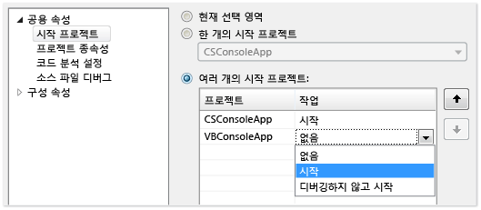
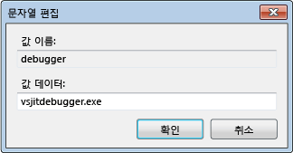
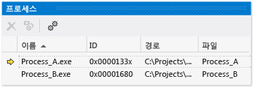

# Visual Studio에서 하나 이상의 프로세스 디버깅
[!INCLUDE[vs2017banner](../code-quality/includes/vs2017banner.md)]

프로세스 디버깅 시작, 프로세스 간 전환, 실행 중단 및 계속 실행, 소스 단계별 실행, 디버깅 중지 및 프로세스 종료 또는 프로세스에서 분리를 수행하는 방법을 설명합니다.  
  
##   콘텐츠  
 [여러 프로세스의 실행 동작 구성](#BKMK_Configure_the_execution_behavior_of_multiple_processes)  
  
 [소스 및 기호(.pdb) 파일 찾기](#BKMK_Find_the_source_and_symbol___pdb__files)  
  
 [VS 솔루션의 여러 프로세스 시작, 프로세스에 연결, 디버거에서 자동으로 프로세스 시작](#BKMK_Start_multiple_processes_in_a_VS_solution__attach_to_a_process__automatically_start_a_process_in_the_debugger)  
  
 [프로세스 전환, 실행 중단 및 계속 실행, 소스 단계별 실행](#BKMK_Switch_processes__break_and_continue_execution__step_through_source)  
  
 [디버깅 중지, 프로세스 종료 또는 프로세스에서 분리](#BKMK_Stop_debugging__terminate_or_detach_from_processes)  
  
##   여러 프로세스의 실행 동작 구성  
 여러 프로세스가 디버거에서 실행되는 경우 기본적으로 디버거 명령을 중단하고 단계별로 실행하고 중지하면 대개 모든 프로세스가 영향을 받습니다.  예를 들어 한 프로세스가 중단점에서 일시 중단되면 다른 모든 프로세스의 실행도 일시 중단됩니다.  이 기본 동작을 변경하여 실행 명령의 대상을 더욱 세부적으로 제어할 수 있습니다.  
  
1.  **디버그** 메뉴에서 **옵션 및 설정**을 선택합니다.  
  
2.  **디버깅**, **일반** 페이지에서 **한 프로세스가 중단될 때 모든 프로세스 중단** 확인란의 선택을 취소합니다.  
  
  [콘텐츠](#BKMK_Contents)  
  
##   소스 및 기호\(.pdb\) 파일 찾기  
 프로세스의 소스 코드를 탐색하려면 디버거가 프로세스의 소스 파일과 기호 파일에 액세스할 수 있어야 합니다.  [기호 파일\(.pdb\) 및 원본 파일 지정](../debugger/specify-symbol-dot-pdb-and-source-files-in-the-visual-studio-debugger.md)를 참조하십시오.  
  
 프로세스의 파일에 액세스할 수 없는 경우 디스어셈블리 창을 사용하여 탐색할 수 있습니다.  [방법: 디스어셈블리 창 사용](../debugger/how-to-use-the-disassembly-window.md)을 참조하십시오.  
  
  [콘텐츠](#BKMK_Contents)  
  
##   VS 솔루션의 여러 프로세스 시작, 프로세스에 연결, 디버거에서 자동으로 프로세스 시작  
  
-   [Visual Studio 솔루션의 여러 프로세스 디버깅 시작](#BKMK_Start_debugging_multiple_processes_in_a_Visual_Studio_solution) • [시작 프로젝트 변경](#BKMK_Change_the_startup_project) • [솔루션의 특정 프로젝트 시작](#BKMK_Start_a_specific_project_in_a_solution) • [솔루션의 여러 프로젝트 시작](#BKMK_Start_multiple_projects_in_a_solution) • [프로세스에 연결](#BKMK_Attach_to_a_process) • [디버거에서 자동으로 프로세스 시작](#BKMK_Automatically_start_an_process_in_the_debugger)  
  
> [!NOTE]
>  자식 프로젝트가 동일한 솔루션에 있는 경우에도 디버거는 디버깅된 프로세스에서 시작되는 자식 프로세스에 자동으로 연결되지 않습니다.  자식 프로세스를 디버깅하려면:  
>   
>  -   자식 프로세스가 시작된 후 자식 프로세스에 연결합니다.  
>   
>      또는  
> -   디버거의 새 인스턴스에서 자식 프로세스를 자동으로 시작하도록 Windows를 구성합니다.  
  
###   Visual Studio 솔루션의 여러 프로세스 디버깅 시작  
 독립적으로 실행될 수 있는 Visual Studio 솔루션에 프로젝트가 두 개 이상 있는 경우\(각기 다른 프로세스에서 실행되는 프로젝트\) 디버거가 시작하는 프로젝트를 선택할 수 있습니다.  
  
   
  
####   시작 프로젝트 변경  
 솔루션의 시작 프로젝트를 변경하려면 솔루션 탐색기에서 프로젝트를 선택하고 상황에 맞는 메뉴에서 **시작 프로젝트로 설정**을 선택합니다.  
  
####   솔루션의 특정 프로젝트 시작  
 기본 시작 프로젝트를 변경하지 않고 솔루션의 프로젝트를 시작하려면 솔루션 탐색기에서 프로젝트를 선택한 다음 상황에 맞는 메뉴에서 **디버그**를 선택합니다.  그런 다음 **새 인스턴스 시작** 또는 **새 인스턴스 한 단계씩 코드 실행**을 선택할 수 있습니다.  
  
  [VS 솔루션의 여러 프로세스 시작, 프로세스에 연결, 디버거에서 자동으로 프로세스 시작](../debugger/debug-multiple-processes.md#BKMK_Start_multiple_processes_in_a_VS_solution__attach_to_a_process__automatically_start_a_process_in_the_debugger)  
  
  [콘텐츠](#BKMK_Contents)  
  
####   솔루션의 여러 프로젝트 시작  
  
1.  솔루션 탐색기에서 솔루션을 선택하고 상황에 맞는 메뉴에서 **속성**을 선택합니다.  
  
2.  **속성** 대화 상자에서 **공용 속성**, **시작 프로젝트**를 선택합니다.  
  
3.  변경하려는 각 프로젝트에 대해 **시작**, **디버깅하지 않고 시작** 또는 **없음**을 선택합니다.  
  
  [VS 솔루션의 여러 프로세스 시작, 프로세스에 연결, 디버거에서 자동으로 프로세스 시작](../debugger/debug-multiple-processes.md#BKMK_Start_multiple_processes_in_a_VS_solution__attach_to_a_process__automatically_start_a_process_in_the_debugger)  
  
  [콘텐츠](#BKMK_Contents)  
  
###   프로세스에 연결  
 디버거는 원격 장치에서 실행되는 프로그램을 비롯하여 Visual Studio 외부의 프로세스에서 실행되는 프로그램에 *연결*될 수도 있습니다.  일단 프로그램에 연결되면 디버거 실행 명령을 사용하고 프로그램 상태를 검사하는 등의 작업을 수행할 수 있습니다.  디버그 정보를 사용하여 프로그램을 빌드했는지 여부, 프로그램의 소스 코드에 액세스할 수 있는지 여부 및 공용 언어 런타임 JIT 컴파일러가 디버그 정보를 추적하고 있는지 여부에 따라 프로그램 검사 기능이 제한될 수 있습니다.  
  
 자세한 내용은 [실행 중인 프로세스에 연결](../debugger/attach-to-running-processes-with-the-visual-studio-debugger.md)을 참조하십시오.  
  
 **로컬 컴퓨터에서 실행되는 프로세스에 연결**  
  
 **디버그**, **프로세스에 연결**을 선택합니다.  **프로세스에 연결** 대화 상자의 **사용 가능한 프로세스** 목록에서 프로세스를 선택한 다음 **연결**을 선택합니다.  
  
   
  
  [콘텐츠](#BKMK_Contents)  
  
###   디버거에서 자동으로 프로세스 시작  
 경우에 따라 다른 프로세스에서 시작된 프로그램의 시작 코드를 디버깅해야 할 수도 있습니다.  서비스 및 사용자 지정 설치 작업을 예로 들 수 있습니다.  이러한 시나리오에서는 응용 프로그램을 시작할 때 디버거를 시작하고 자동으로 연결할 수 있습니다.  
  
1.  레지스트리 편집기\(**regedit.exe**\)를 시작합니다.  
  
2.  **HKEY\_LOCAL\_MACHINE\\Software\\Microsoft\\Windows NT\\CurrentVersion\\Image File Execution Options** 폴더로 이동합니다.  
  
3.  디버거에서 시작할 응용 프로그램의 폴더를 선택합니다.  
  
     응용 프로그램 이름이 하위 폴더로 나열되지 않는 경우 **Image File Execution Options**를 선택한 다음 상황에 맞는 메뉴에서 **새로 만들기**, **키**를 선택합니다.  새 키를 선택하고 바로 가기 메뉴에서 **이름 바꾸기**를 선택한 다음 응용 프로그램의 이름을 입력합니다.  
  
4.  응용 프로그램 폴더의 상황에 맞는 메뉴에서 **새로 만들기**, **문자열 값**을 선택합니다.  
  
5.  새 값의 이름을 **New Value**에서 `debugger`로 변경합니다.  
  
6.  debugger 항목의 상황에 맞는 메뉴에서 **수정**을 선택합니다.  
  
7.  문자열 편집 대화 상자에서 **값 데이터** 상자에 `vsjitdebugger.exe`를 입력합니다.  
  
       
  
   
  
  [콘텐츠](#BKMK_Contents)  
  
##   프로세스 전환, 실행 중단 및 계속 실행, 소스 단계별 실행  
  
-   [프로세스 간 전환](#BKMK_Switch_between_processes) • [명령 중단, 단계별 실행 및 계속 실행](#BKMK_Break__step__and_continue_commands)  
  
###   프로세스 간 전환  
 디버깅하는 동안 여러 프로세스에 연결할 수 있지만 한 번에 프로세스 하나만 디버거에서 활성화됩니다.  디버그 위치 도구 모음이나 **프로세스** 창에서 활성 또는 *현재* 프로세스를 설정할 수 있습니다.  프로세스 간에 전환하려면 두 프로세스가 모두 중단 모드여야 합니다.  
  
 **현재 프로세스를 설정하려면**  
  
-   디버그 위치 도구 모음에서 **프로세스**를 선택하여 **프로세스** 목록 상자를 표시합니다.  현재 프로세스로 지정할 프로세스를 선택합니다.  
  
       
  
     **디버그 위치** 도구 모음이 표시되지 않으면 **도구**, **사용자 지정**을 선택합니다.  **도구 모음** 탭에서 **디버그 위치**를 선택합니다.  
  
-   **프로세스** 창을 열고\(바로 가기 **Ctrl\+Alt\+Z**\) 현재 프로세스로 설정할 프로세스를 찾아 두 번 클릭합니다.  
  
       
  
     현재 프로세스는 노란색 화살표로 표시됩니다.  
  
 프로젝트로 전환하면 해당 프로젝트가 디버깅 목적의 현재 프로세스로 설정됩니다.  사용자에게 표시되는 모든 디버거 창은 현재 프로세스의 상태를 보여 주며, 모든 단계별 실행 명령은 현재 프로세스에만 영향을 미칩니다.  
  
  [프로세스 전환, 실행 중단 및 계속 실행, 소스 단계별 실행](../debugger/debug-multiple-processes.md#BKMK_Switch_processes__break_and_continue_execution__step_through_source)  
  
  [콘텐츠](#BKMK_Contents)  
  
###   명령 중단, 단계별 실행 및 계속 실행  
  
> [!NOTE]
>  기본적으로 디버거 명령을 중단하고 계속 실행하고 단계별로 실행하면 디버그 중인 모든 프로세스가 영향을 받습니다.  이 동작을 변경하려면 [여러 프로세스의 실행 동작 구성](#BKMK_Configure_the_execution_behavior_of_multiple_processes)을 참조하십시오.  
  
||||  
|-|-|-|  
|**명령**|**한 프로세스가 중단될 때 모든 프로세스 중단**   선택됨\(기본값\)|**한 프로세스가 중단될 때 모든 프로세스 중단**   선택 취소됨|  
|**디버그** 메뉴:   -   **모두 중단**|모든 프로세스가 중단됩니다.|모든 프로세스가 중단됩니다.|  
|**디버그** 메뉴:   -   **Continue**|모든 프로세스가 다시 시작됩니다.|일시 중단된 모든 프로세스가 다시 시작됩니다.|  
|**디버그** 메뉴:   -   **한 단계씩 코드 실행** -   **프로시저 단위 실행** -   **프로시저 나가기**|현재 프로세스가 단계별로 실행되는 동안 모든 프로세스가 실행됩니다.   그런 다음 모든 프로세스가 중단됩니다.|현재 프로세스가 단계별로 실행됩니다.   일시 중단된 프로세스가 다시 시작됩니다.   실행 중인 프로세스가 계속 실행됩니다.|  
|**디버그** 메뉴:   -   **현재 프로세스 한 단계씩 코드 실행** -   **현재 프로세스 프로시저 단위 실행** -   **현재 프로세스 프로시저 나가기**|N\/A|현재 프로세스가 단계별로 실행됩니다.   다른 프로세스가 기존 상태\(일시 중단됨 또는 실행 중\)를 유지합니다.|  
|소스 창   -   **중단점**|모든 프로세스가 중단됩니다.|소스 창 프로세스만 중단됩니다.|  
|소스 창 상황에 맞는 메뉴:   -   **커서까지 실행**   소스 창이 현재 프로세스에 있어야 합니다.|모든 프로세스가 소스 창 프로세스가 커서까지 실행되는 동안 실행되었다가 중단됩니다.   그런 다음 다른 모든 프로세스가 중단됩니다.|소스 창 프로세스가 커서까지 실행됩니다.   다른 프로세스가 기존 상태\(일시 중단됨 또는 실행 중\)를 유지합니다.|  
|**프로세스** 창 상황에 맞는 메뉴:   -   **프로세스 중단**|N\/A|선택한 프로세스가 중단됩니다.   다른 프로세스가 기존 상태\(일시 중단됨 또는 실행 중\)를 유지합니다.|  
|**프로세스** 창 상황에 맞는 메뉴:   -   **프로세스 계속**|N\/A|선택한 프로세스가 다시 시작됩니다.   다른 프로세스가 기존 상태\(일시 중단됨 또는 실행 중\)를 유지합니다.|  
  
  [프로세스 전환, 실행 중단 및 계속 실행, 소스 단계별 실행](../debugger/debug-multiple-processes.md#BKMK_Switch_processes__break_and_continue_execution__step_through_source)  
  
  [콘텐츠](#BKMK_Contents)  
  
##   디버깅 중지, 프로세스 종료 또는 프로세스에서 분리  
  
-   [중지, 종료 및 분리 명령](#BKMK_Stop__terminate__and_detach_commands)  
  
 여러 프로세스가 디버거에서 열려 있는 경우 **디버그**, **디버깅 중지**를 선택하면 프로세스가 디버거에서 어떻게 열려 있었는지에 따라 디버거는 기본적으로 모든 프로세스를 종료하거나 모든 프로세스에서 분리됩니다.  
  
-   현재 프로세스가 디버거에서 시작된 경우 프로세스가 종료됩니다.  
  
-   디버거를 현재 프로세스에 연결한 경우 디버거는 프로세스에서 분리되며 프로세스는 계속 실행됩니다.  
  
 예를 들어 Visual Studio 솔루션의 프로세스 디버깅을 시작하고 이미 실행 중인 다른 프로세스에 연결한 다음 **디버깅 중지**를 선택하는 경우, 디버깅 세션이 종료되고 Visual Studio에서 시작된 프로세스가 종료되지만 연결한 프로세스는 계속 실행됩니다.  다음 절차를 사용하여 디버깅을 중지하는 방법을 제어할 수 있습니다.  
  
> [!NOTE]
>  **한 프로세스가 중단될 때 모든 프로세스 중단** 옵션은 디버깅 중지나 프로세스 종료 및 프로세스에서 분리에 영향을 미치지 않습니다.  
  
 **디버깅 중지가 개별 프로세스에 영향을 미치는 방식을 변경하려면**  
  
-   **프로세스** 창을 엽니다\(바로 가기 **Ctrl\+Alt\+Z**\).  프로세스를 선택한 다음 **디버깅 중지 시 분리** 확인란을 선택하거나 선택 취소합니다.  
  
###   중지, 종료 및 분리 명령  
  
|||  
|-|-|  
|**명령**|**설명**|  
|**디버그** 메뉴:   -   **디버깅 중지**|**프로세스** 창에서 동작이 변경되지 않는 한 **디버깅 중지 시 분리** 옵션은 다음을 수행합니다.   1.  디버거에서 시작된 프로세스가 종료됩니다. 2.  연결된 프로세스가 디버거에서 분리됩니다.|  
|**디버그** 메뉴:   -   **모두 종료**|모든 프로세스가 종료됩니다.|  
|**디버그** 메뉴:   -   **모두 분리**|디버거가 모든 프로세스에서 분리됩니다.|  
|**프로세스** 창 상황에 맞는 메뉴:   -   **프로세스 분리**|디버거가 선택된 프로세스에서 분리됩니다.   다른 프로세스가 기존 상태\(일시 중단됨 또는 실행 중\)를 유지합니다.|  
|**프로세스** 창 상황에 맞는 메뉴:   -   **프로세스 종료**|선택한 프로세스가 종료됩니다.   다른 프로세스가 기존 상태\(일시 중단됨 또는 실행 중\)를 유지합니다.|  
|**프로세스** 창 상황에 맞는 메뉴:   -   **디버깅 중지 시 분리**|선택한 프로세스에 대한 **디버그**, **디버깅 중지**의 동작을 전환합니다.   -   선택됨: 디버거가 프로세스에서 분리됩니다. -   선택 취소됨: 프로세스가 종료됩니다.|  
  
  [디버깅 중지, 프로세스 종료 또는 프로세스에서 분리](../debugger/debug-multiple-processes.md#BKMK_Stop_debugging__terminate_or_detach_from_processes)  
  
  [콘텐츠](#BKMK_Contents)  
  
## 참고 항목  
 [기호 파일\(.pdb\) 및 원본 파일 지정](../debugger/specify-symbol-dot-pdb-and-source-files-in-the-visual-studio-debugger.md)   
 [실행 중인 프로세스에 연결](../debugger/attach-to-running-processes-with-the-visual-studio-debugger.md)   
 [디버거로 코드 탐색](../debugger/navigating-through-code-with-the-debugger.md)   
 [Just\-In\-Time 디버깅](../debugger/just-in-time-debugging-in-visual-studio.md)   
 [다중 스레드 응용 프로그램 디버깅](../debugger/debug-multithreaded-applications-in-visual-studio.md)