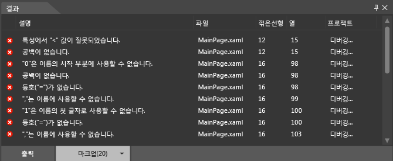
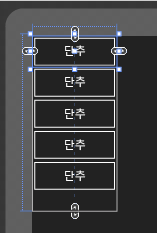

# <a name="debug-xaml-in-blend"></a>Blend에서 XAML 디버그
[!INCLUDE[blend_first](../debugger/includes/blend_first_md.md)]의 도구를 사용하여 앱에서 XAML을 디버그할 수 있습니다. 프로젝트를 빌드할에 오류가 표시 됩니다는 **결과** 패널입니다. 오류를 두 번 클릭하여 오류와 관련된 태그를 찾습니다. 작업 공간이 더 필요한 경우 숨길 수 있습니다는 **결과** F12 키를 눌러 패널입니다.  
  
## <a name="syntax-errors"></a>구문 오류  
 구문 오류는 XAML 또는 코드 숨김 파일이 언어의 서식 설정 규칙을 준수하지 않는 경우에 발생합니다. 오류 설명을 보면 오류 해결 방법을 파악할 수 있습니다. 오류가 발생하는 파일의 이름 및 줄 번호도 함께 설명됩니다. XAML 오류에 나열 되는 **태그** 탭에 **결과** 패널입니다.  
  
> [!TIP]
>  XAML은 XML을 기반으로 하는 태그 언어로 XML 구문 규칙을 따릅니다.  
  
 XAML 구문 오류의 몇 가지 일반적인 원인은 다음과 같습니다.  
  
-   키워드에 맞춤법 오류가 있거나 대문자 표시가 잘못되었습니다.  
  
-   특성 또는 텍스트 문자열 주위에 따옴표가 없습니다.  
  
-   XAML 요소에 닫는 태그가 없습니다.  
  
-   XAML 요소가 허용되지 않는 위치에 있습니다.  
  
 공용 XAML 구문에 대 한 자세한 내용은 참조 하십시오. [기본 XAML 구문 가이드](http://go.microsoft.com/fwlink/?LinkId=329942)합니다.  
  
 [!INCLUDE[blend_subs](../debugger/includes/blend_subs_md.md)]에서 간단한 코드 숨김 구문 오류, 컴파일 오류, 런타임 오류를 식별 및 해결할 수도 있습니다. 하지만 코드 숨김 오류는 Visual Studio에서 더욱 쉽게 식별 및 해결할 수 있습니다.  
  
### <a name="debugging-sample-xaml-code"></a>디버깅 샘플 XAML 코드  
 다음 예제는 [!INCLUDE[blend_subs](../debugger/includes/blend_subs_md.md)]의 XAML 디버깅 세션을 단계별로 안내합니다.  
  
##### <a name="to-create-a-project"></a>프로젝트를 만들려면  
  
1.  [!INCLUDE[blend_subs](../debugger/includes/blend_subs_md.md)]열고는 **파일** 메뉴를 차례로 클릭 **새 프로젝트**합니다.  
  
     에 **새 프로젝트** 대화 상자 왼쪽에 프로젝트 형식 목록이 표시 됩니다. 프로젝트 형식을 클릭하면 해당 프로젝트와 연결된 프로젝트 템플릿이 오른쪽에 표시됩니다.  
  
2.  프로젝트 형식 목록에서 클릭 **Windows 유니버설**합니다.  
  
3.  프로젝트 템플릿 목록에서 클릭 **비어 있는 앱 (유니버설 Windows)**합니다.  
  
4.  에 **이름** 텍스트 상자에서 `DebuggingSample`합니다.  
  
5.  에 **위치** 텍스트 상자에서 프로젝트의 위치를 확인 합니다.  
  
6.  에 **언어** 목록에서 클릭 **Visual C#**, 클릭 하 고 **확인** 프로젝트를 만듭니다.  
  
7.  디자인 화면에서 마우스 오른쪽 단추로 누른 **소스 보기** 전환할 **분할** 보기.  
  
8.  클릭 하 여 다음 코드를 복사는 **복사** 코드의 오른쪽 위 모서리에 링크 합니다.  
  
    ```  
    <Grid HorizontalAlignment="Left" Height="222" VerticalAlignment="Top>  
         <Button content="Button" x:Mame="Home" HorizontalAlignment="Left" VerticalAlignment="Top"/>  
         <Button Content="Button" HorizontalAlignment="Left" VerticalAlignment="Top" Margin="0,38,0,0">  
         <Button Content="Button" HorizontalAlignment="Left" VerticalAlignment="Top" Margin="0,75,0,0"/>  
         <Button Content="Button" HorizontalAlignment="Left" VerticalAlignment="Top" Margin="0,112,0,0"/>  
         <Button Content="Button" HorizontalAlignment="Left" VerticalAlignment="Top Margin="0,149,0,0"/>  
    </Grid>  
  
    ```  
  
9. 기본 찾습니다 **그리드**, 열기 및 닫기 사이 코드를 붙여 **그리드** 태그입니다. 작업을 마치면 코드가 다음과 같이 됩니다.  
  
    ```  
    <Grid Background="{ThemeResource ApplicationPageBackgroundThemeBrush}">  
         <Grid HorizontalAlignment="Left" Height="222" VerticalAlignment="Top>  
              <Button content="Button" x:Mame="Home" HorizontalAlignment="Left" VerticalAlignment="Top"/>  
              <Button Content="Button" HorizontalAlignment="Left" VerticalAlignment="Top" Margin="0,38,0,0">  
              <Button Content="Button" HorizontalAlignment="Left" VerticalAlignment="Top" Margin="0,75,0,0"/>  
              <Button Content="Button" HorizontalAlignment="Left" VerticalAlignment="Top" Margin="0,112,0,0"/>  
              <Button Content="Button" HorizontalAlignment="Left" VerticalAlignment="Top Margin="0,149,0,0"/>  
         </Grid>  
    </Grid>  
  
    ```  
  
10. Ctrl+Shift+B를 눌러 프로젝트를 빌드합니다.  
  
 프로젝트를 빌드할 수 있는 경고 오류 메시지가 표시 되 고 **결과** 오류를 나열 패널이 앱 하단에 나타납니다.  
  
   
  
### <a name="resolving-xaml-errors"></a>XAML 오류 해결  
 XAML 오류가 감지되면 디자인 화면에서 프로젝트에 잘못된 태그가 포함되어 있다는 경고를 표시합니다. 오류 목록에 오류를 해결할 때는 **결과** 패널 업데이트 됩니다. 모든 오류를 해결하면 디자인 화면을 사용할 수 있게 되고 앱이 디자인 화면에 표시됩니다.  
  
##### <a name="to-resolve-the-xaml-errors"></a>XAML 오류를 해결하려면  
  
1.  목록에서 첫 번째 오류를 두 번 클릭합니다. 설명은 "값 '<'는 특성에서 사용할 수 없습니다."입니다. 오류를 두 번 클릭하면 포인터가 코드에서 해당하는 위치를 찾습니다. `<` 앞의 `Button`은(는) 유효하지만 오류 메시지에서 제시한 대로 특성은 아닙니다. 코드의 이전 줄을 살펴보면 특성 `Top`의 닫는 따옴표가 누락되어 있습니다. 닫는 따옴표를 입력합니다. 이 오류는 **결과** 패널 변경 내용을 반영 하도록 업데이트 합니다.  
  
2.  설명을 두 번 클릭 "'0' 올바르지 이름의 시작 부분에 있습니다." `Margin="0,149,0,0"` 형식이 올바른 것으로 나타납니다. 그러나 `Margin`의 색 코딩이 해당 코드에서 `Margin`의 다른 인스턴스와 일치하지 않습니다. 이전 이름/값 쌍(`VerticalAlignment="Top`)에 닫는 따옴표가 누락되어 있기 때문에, `Margin="`은 이전 특성 값의 일부분으로 읽고 0은 이름/값 쌍의 시작으로 읽습니다. `Top`의 닫는 따옴표를 입력합니다. 오류 목록에는 **결과** 패널 변경 내용을 반영 하도록 업데이트 합니다.  
  
3.  나머지 오류 "닫는 XML 태그 '단추'가 일치하지 않습니다."를 두 번 클릭합니다. 포인터는 닫는 위치한 **그리드** 태그 (`</Grid>`), 제안 오류 내에 있는 `Grid` 개체입니다. 두 번째 `Button` 개체에 닫는 태그가 누락되어 있습니다. 닫는 추가한 후 `/`, **결과** 패널 목록이 업데이트 됩니다. 이러한 초기 오류를 해결했으므로 두 가지의 추가 오류가 식별되었습니다.  
  
4.  "멤버 '콘텐츠'를 인식할 수 없거나 액세스할 수 없습니다."를 두 번 클릭합니다. `c`의 `content`는 대문자여야 합니다. 소문자 "c"를 대문자 "c"로 바꿉니다.  
  
5.  두 번 클릭 "'Mame'에 존재 하지 않는 속성은 'http://schemas.microsoft.com/winfx/2006/xaml' 네임 스페이스입니다." "Mame"의 "M"은 "N"이어야 합니다. "M"을 "N"으로 바꿉니다. XAML을 구문 분석할 수 있으므로 응용 프로그램이 디자인 화면에 나타납니다.  
  
       
  
     Ctrl+Shift+B를 눌러 프로젝트를 빌드하고 나머지 오류가 없음을 확인합니다.  
  
## <a name="debugging-in-visual-studio"></a>Visual Studio의 디버깅  
 앱의 코드를 더 쉽게 디버깅하려면 Visual Studio에서 [!INCLUDE[blend_subs](../debugger/includes/blend_subs_md.md)] 프로젝트를 열어도 됩니다. 열려는 [!INCLUDE[blend_subs](../debugger/includes/blend_subs_md.md)] Visual Studio에서 프로젝트를에서 프로젝트를 마우스 오른쪽 단추로 클릭는 **프로젝트** 를 클릭 한 다음 클릭 **Visual Studio에서 편집**합니다. Visual Studio에서 디버깅 세션을 마친 후 Ctrl+Shift+S를 눌러 변경 내용을 모두 저장한 다음 [!INCLUDE[blend_subs](../debugger/includes/blend_subs_md.md)]로 다시 전환합니다. 프로젝트를 다시 로드할 것인지 묻는 메시지가 나타납니다. 클릭 **모두 예** 에서 계속 작업 하려면 [!INCLUDE[blend_subs](../debugger/includes/blend_subs_md.md)]합니다.  
  
 응용 프로그램을 디버깅 하는 방법에 대 한 자세한 내용은 참조 [Visual Studio에서 디버그 하는 UWP 앱](http://go.microsoft.com/fwlink/?LinkId=329944)합니다.  
  
## <a name="getting-help"></a>도움말 보기  
 자세한 도움말 디버깅 해야 할 경우 프로그램 [!INCLUDE[blend_subs](../debugger/includes/blend_subs_md.md)] 앱의 경우를 검색할 수 있습니다는 [UWP 앱 커뮤니티 포럼](http://go.microsoft.com/fwlink/?LinkId=280308) 게시물에서 문제와 관련 된 하거나 질문을 게시 합니다.