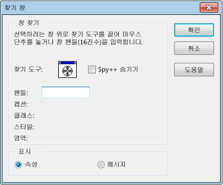

# How to: Use the Finder Tool
[!INCLUDE[vs2017banner](../code-quality/includes/vs2017banner.md)]

**창 찾기** 대화 상자의 찾기 도구를 사용하여 창 속성이나 메시지를 표시할 수 있습니다.  또한 찾기 도구를 사용하면 비활성화된 자식 창을 찾고 비활성화된 자식 창이 겹쳐 있는 경우 강조 표시할 창을 확인할 수도 있습니다.  
  
   
창 찾기 대화 상자의 찾기 도구  
  
 위의 그림에서는 아래의 세 단계가 완료된 후의 창 찾기 대화 상자를 보여 줍니다.  
  
### 창 속성이나 메시지를 표시하려면  
  
1.  Spy\+\+와 대상 창이 보이도록 창을 정렬합니다.  
  
2.  **Spy** 메뉴에서 **창 찾기**를 선택합니다.  
  
     [창 찾기 대화 상자](../debugger/find-window-dialog-box.md)가 열립니다.  
  
3.  **찾기 도구**를 대상 창 위로 끌어 옵니다.  
  
     이 도구를 끌어 올 때 **창 찾기** 대화 상자에는 선택된 창의 세부 내용이 표시됩니다.  
  
     – 또는 –  
  
     검사하려는 창의 핸들\(예를 들면 디버거에서 복사됨\)이 있으면 **핸들** 텍스트 상자에 이 핸들을 입력합니다.  
  
    > [!TIP]
    >  화면을 간결하게 만들려면 **Spy 숨기기** 옵션을 선택합니다.  이 옵션은 Spy\+\+의 주 창을 숨기고 **창 찾기** 대화 상자만 다른 응용 프로그램 위에 표시된 상태로 둡니다.  **확인** 또는 **취소**를 클릭하거나 **Spy\+\+ 숨기기** 옵션의 선택을 취소하면 Spy\+\+의 주 창이 복원됩니다.  
  
4.  **표시** 아래에서 **속성** 또는 **메시지**를 선택합니다.  
  
5.  **확인**을 누릅니다.  
  
     **속성**을 선택한 경우 [창 속성 대화 상자](../debugger/window-properties-dialog-box.md)가 열리고  **메시지**를 선택한 경우 [메시지 뷰](../debugger/messages-view.md) 창이 열립니다.  
  
## 참고 항목  
 [Spy\+\+ Views](../debugger/spy-increment-views.md)   
 [Using Spy\+\+](../debugger/using-spy-increment.md)   
 [Spy\+\+ Reference](../debugger/spy-increment-reference.md)