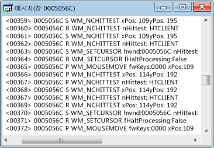

# 메시지 뷰
각 창에는 관련된 메시지 스트림을 합니다. 메시지 보기 창에는이 메시지 스트림을 표시 됩니다. 창 핸들, 메시지 코드 및 메시지 표시 됩니다. 스레드 또는 프로세스에 대 한 메시지 보기를 만들 수 있습니다. 이 옵션을 사용 하면 특정 프로세스 또는 스레드는 창 초기화 메시지를 캡처하는 데 특히 유용가 소유 하는 모든 창에 보낸 메시지를 볼 수 있습니다.  
  
 일반적인 메시지 뷰 창 아래에 나타납니다. 첫 번째 열 창 핸들을 포함 하 고 메시지 코드를 포함 하는 두 번째 열 (에 설명 된 [메시지 코드](../debugger/message-codes.md)). 디코딩된 메시지 매개 변수 및 반환 값은 오른쪽에 있습니다.  
  
   
Spy++ 메시지 뷰  
  
## 절차  
  
#### 창, 프로세스 또는 스레드에 대 한 메시지 보기를 열려면  
  
1.  포커스를 이동 하는 [창 뷰](../debugger/windows-view.md), [프로세스 뷰](../debugger/processes-view.md), 또는 [스레드 뷰](../debugger/threads-view.md) 창.  
  
2.  항목을 검사 하려면 메시지에 대 한 노드를 찾아 선택 합니다.  
  
3.  **Spy** 메뉴 선택 **로그 메시지**합니다.  
  
     [메시지 옵션 대화 상자](../debugger/message-options-dialog-box.md) 열립니다.  
  
4.  표시할 메시지에 대 한 옵션을 선택 합니다.  
  
5.  키를 눌러 **확인** 에 메시지 로깅을 시작 합니다.  
  
     메시지 보기 창이 열리고 점과 **메시지** 메뉴가 Spy + + 도구 모음에 추가 됩니다. 선택한 옵션에 따라, 활성 메시지 뷰 창으로 스트리밍되 기 시작 합니다.  
  
6.  충분 한 메시지를 사용 하는 경우 선택 **로깅 중지** 에서 **메시지** 메뉴.  
  
## 섹션 내용  
 [메시지 뷰 제어](../debugger/how-to-control-messages-view.md)  
 메시지 보기를 관리 하는 방법에 설명 합니다.  
  
 [창 찾기에서 메시지 뷰 열기](../debugger/how-to-open-messages-view-from-find-window.md)  
 창 찾기 대화 상자에서 메시지 뷰를 여는 방법에 설명 합니다.  
  
 [메시지 뷰에서 메시지 검색](../debugger/how-to-search-for-a-message-in-messages-view.md)  
 메시지 보기에서 특정 메시지를 확인 하는 방법에 설명 합니다.  
  
 [시작 및 중지 메시지 로그 표시](../debugger/how-to-start-and-stop-the-message-log-display.md)  
 메시지 로깅을 시작 및 중지 하는 방법에 설명 합니다.  
  
 [메시지 코드](../debugger/message-codes.md)  
 메시지 보기에 나열 된 메시지에 대 한 코드를 정의 합니다.  
  
 [메시지 속성 표시](../debugger/how-to-display-message-properties.md)  
 메시지에 대 한 자세한 정보를 표시 하는 방법.  
  
## 관련 단원  
 [Spy++ 뷰](../debugger/spy-increment-views.md)  
 Windows, 메시지, 프로세스 및 스레드의 Spy + + 트리 보기에 설명합니다.  
  
 [Spy++ 사용](../debugger/using-spy-increment.md)  
 Spy + + 도구를 소개 하 고 사용할 수 있는 방법을 설명 합니다.  
  
 [메시지 옵션 대화 상자](../debugger/message-options-dialog-box.md)  
 현재 메시지 보기에 표시 되는 메시지를 선택 하는 데 사용 합니다.  
  
 [메시지 검색 대화 상자](../debugger/message-search-dialog-box.md)  
 메시지 보기에서 특정 메시지에 대 한 노드를 찾을 하는 데 사용 합니다.  
  
 [메시지 속성 대화 상자](../debugger/message-properties-dialog-box.md)  
 메시지 보기에서 선택한 메시지의 속성을 표시 하는 데 사용 합니다.  
  
 [Spy++ 참조](../debugger/spy-increment-reference.md)  
 각 Spy + + 메뉴 및 대화 상자를 설명 하는 섹션이 포함 됩니다.