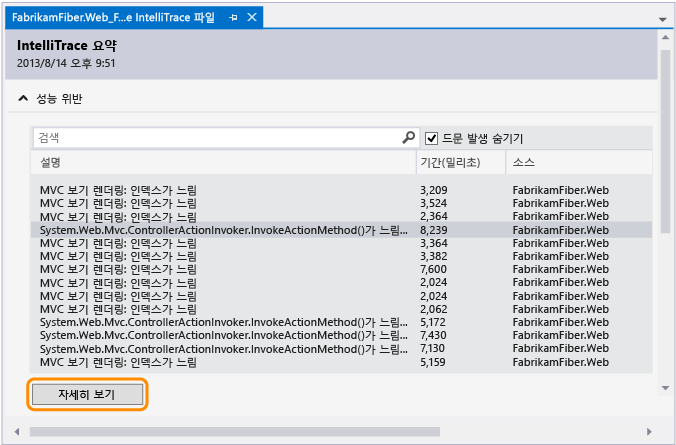
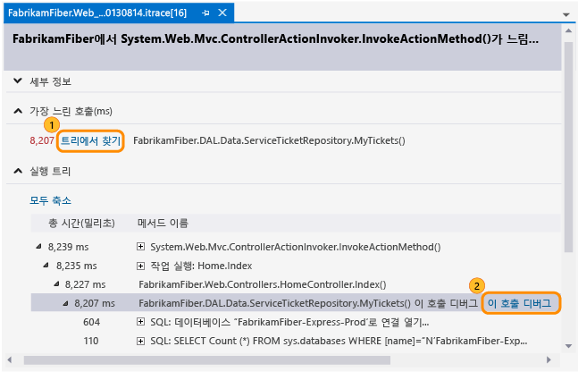
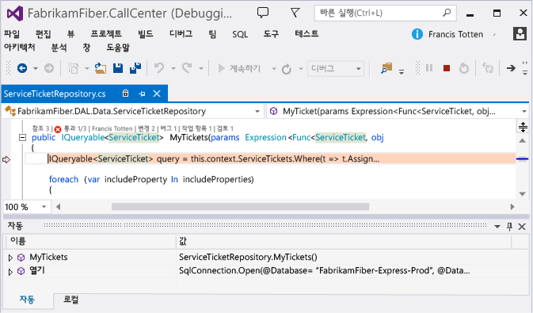
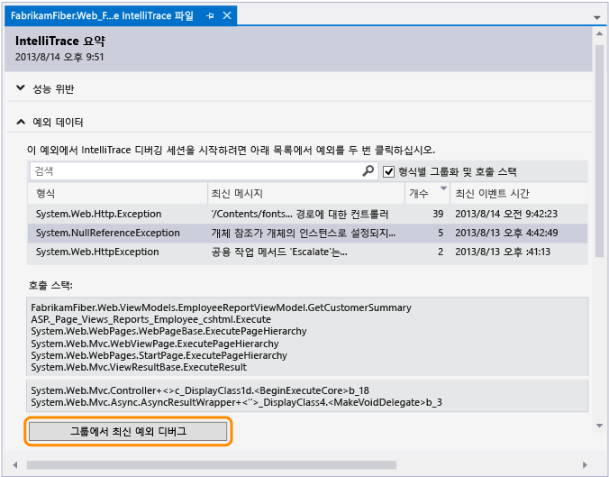
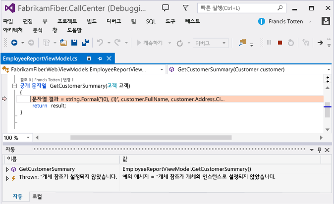
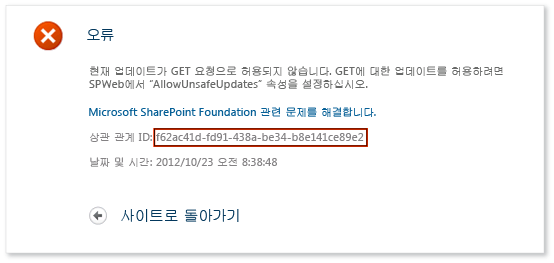
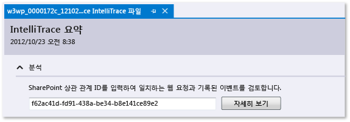
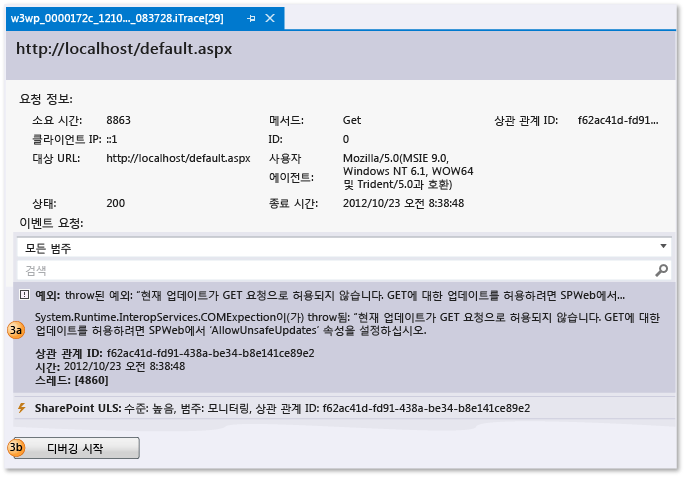
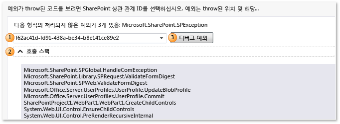

# 저장된 IntelliTrace 데이터 사용
IntelliTrace 로그(.iTrace) 파일에서 디버깅을 시작할 때 응용 프로그램 실행의 특정 지점으로 이동합니다. 이 파일에는 응용 프로그램이 실행되는 동안 IntelliTrace가 기록하는 성능 이벤트, 예외, 스레드, 테스트 단계 및 기타 시스템 정보가 포함될 수 있습니다.

 아래와 같은 파일과 버전이 있어야 합니다.

-   응용 프로그램 코드에 일치하는 소스 파일과 기호 파일(.pdb) 이 파일이 없으면 Visual Studio에서 소스 위치를 확인할 수 없어 "기호를 찾을 수 없습니다." 메시지가 표시됩니다. 참조 [지정할 기호 (.pdb) 및 소스 파일](../debugger/specify-symbol-dot-pdb-and-source-files-in-the-visual-studio-debugger.md) 하 고 [배포 후 문제 진단](../debugger/diagnose-problems-after-deployment.md)합니다.

-   개발 컴퓨터 또는 다른 컴퓨터에서 .iTrace 파일을 열기 위한 Visual Studio Enterprise(Professional 또는 Community Edition 아님)

-   다음 소스 중 하나의 .iTrace 파일:

    |**소스**|**참조**|
    |----------------|-------------|
    |Visual Studio Enterprise(Professional 또는 Community Edition 아님)의 IntelliTrace 세션|[IntelliTrace 기능](../debugger/intellitrace-features.md)|
    |Microsoft Test Manager의 테스트 세션. 이는 Team Foundation Server 작업 항목에 .iTrace 파일을 연결합니다.|[수동 테스트에서 추가 진단 데이터 수집](/azure/devops/test/mtm/collect-more-diagnostic-data-in-manual-tests?view=vsts)|
    |배포에서 실행 중인 ASP.NET 웹앱 및 SharePoint 응용 프로그램에 대해 Microsoft Monitoring Agent 단독으로 또는 System Center 2012 R2 Operations Manager와 함께 사용|-   [배포 후 문제 진단](../debugger/diagnose-problems-after-deployment.md) -   [System Center 2012 R2 Operations Manager의 새로운 기능](http://technet.microsoft.com/library/dn249700.aspx)|

##   원하는 작업을 선택하세요.

-   [IntelliTrace 로그 열기](#Open)

-   [IntelliTrace 로그 이해](#Understand)

-   [IntelliTrace 로그에서 디버깅 시작](#StartDebugging)

##   IntelliTrace 로그 열기
 Visual Studio Enterprise가 설치된 컴퓨터에서 .iTrace 파일을 엽니다.

-   Visual Studio 외부에서 .iTrace 파일을 두 번 클릭하거나 Visual Studio 내부에서 파일을 엽니다.

     \- 또는 -

-   .iTrace 파일이 Team Foundation Server 작업 항목에 연결되어 있는 경우 작업 항목에서 다음 단계를 수행하세요.

    -   **모든 링크**에서 .iTrace 파일을 찾습니다. 파일을 엽니다.

         \- 또는 -

    -   **재현 단계**에서 **IntelliTrace** 링크를 선택합니다.

> [!TIP]
>  디버깅하는 동안 IntelliTrace 파일을 닫은 경우 쉽게 다시 열 수 있습니다. **디버그** 메뉴로 가서 **IntelliTrace**와 **로그 요약 표시**를 차례로 선택합니다. **IntelliTrace** 창에서 **로그 요약 표시** 를 선택할 수도 있습니다. 이 명령은 IntelliTrace를 사용하여 디버깅할 때만 사용할 수 있습니다.

##   IntelliTrace 로그 이해
 .iTrace 파일에 있는 다음 섹션 중 일부는 Test Manager 또는 SharePoint 응용 프로그램 등의 특정 소스에서 데이터를 수집한 경우에만 나타납니다.

|**섹션**|**포함**|**컬렉션 소스**|
|-----------------|------------------|---------------------------|
|[성능 위반](#Performance)|구성된 임계값을 초과하는 함수 호출을 사용하는 성능 이벤트|Microsoft Monitoring Agent를 독립 실행형 수집기 하거나 또는 IIS에서 호스팅된 ASP.NET 웹 앱에 대 한 System Center 2012 R2 Operations Manager를 사용 하 여|
|[예외 데이터](#ExceptionData)|각 예외에 대한 전체 호출 스택을 포함하는 예외|모든 소스|
|[분석](#Analysis)|SharePoint 2010 및 SharePoint 2013 응용 프로그램만 해당합니다. 디버거 이벤트, ULS 이벤트, 처리되지 않은 예외 및 Microsoft Monitoring Agent가 기록한 기타 데이터 등 IntelliTrace 및 SharePoint 이벤트를 진단합니다.|Microsoft Monitoring Agent를 독립 실행형 수집기 중 하나 또는 System Center 2012 R2 Operations Manager를 사용 하 여|
|[시스템 정보](#SystemInfo)|호스트 시스템의 설정 및 사양|모든 소스|
|[스레드 목록](#ThreadsList)|수집하는 동안 실행되는 스레드|모든 소스|
|[테스트 데이터](#TestData)|테스트 세션의 테스트 단계 및 해당 결과|테스트 관리자|
|[모듈](#Modules)|대상 프로세스가 로드된 순서대로 로드된 모듈|모든 소스|
|[웹 요청](#Modules)|프로덕션 IIS에 대 한 웹 요청 데이터를 웹 응용 프로그램 및 SharePoint 2010 및 SharePoint 2013|Microsoft Monitoring Agent를 독립 실행형 수집기|

 다음은 각 섹션에서 정보를 찾는 데 도움이 되는 몇 가지 팁입니다.

-   데이터를 정렬하려면 열 머리글을 선택합니다.

-   데이터를 필터링하려면 검색 상자를 사용합니다. 일반 텍스트 검색은 시간 열을 제외하고 모든 열에서 가능합니다. 열당 하나의 필터를 사용하여 특정 열에 대한 검색을 필터링할 수도 있습니다. 공백 없이 열 이름, 콜론(**:**) 및 검색 값을 입력합니다. 여기에 세미콜론(**;**)을 사용하여 다른 열 및 검색 값을 추가합니다.

     예를 들어 **설명** 열에서 "느림"이라는 단어가 있는 성능 이벤트를 찾으려면 다음을 입력합니다.

     `Description:slow`

##   IntelliTrace 로그에서 디버깅 시작

###   성능 위반
 응용 프로그램에 기록된 성능 이벤트를 검토합니다. 자주 발생하지 않는 이러한 이벤트를 숨길 수 있습니다.

##### 성능 이벤트에서 디버깅을 시작하려면

1.  **성능 위반**에서 기록된 성능 이벤트, 총 실행 시간 및 기타 이벤트 정보를 검토합니다. 그런 다음 특정 성능 이벤트 중 호출된 메서드를 자세히 살펴봅니다.

     

     이벤트를 두 번 클릭할 수도 있습니다.

2.  이벤트 페이지에서 이러한 호출의 실행 시간을 검토합니다. 실행 트리에서 느린 호출을 찾습니다.

     가장 느린 호출은 여러 번 호출하거나 중첩될 때 등의 경우 자신의 섹션에 나타납니다.

3.  해당 호출을 확장하여 특정 시점에 기록된 중첩 호출과 매개 변수 값을 검토합니다.

     (키보드: 중첩된 호출을 표시하거나 숨기려면 **오른쪽 화살표** 또는 **왼쪽 화살표** 키를 각각 누릅니다. 중첩된 호출에 대한 매개 변수 값을 표시하거나 숨기려면 **Space** 키를 누릅니다.)

     해당 호출에서 디버깅을 시작합니다.

     

     호출을 두 번 클릭하거나 **Enter** 키를 누를 수도 있습니다.

     메서드가 응용 프로그램 코드에 있는 경우 Visual Studio가 해당 메서드로 이동합니다.

     

     이제 다른 기록된 값, 호출 스택을 검토하고 코드를 단계적으로 실행하거나 **IntelliTrace** 창을 사용하여 이 성능 이벤트 동안 호출된 [다른 메서드 사이에 "in time"을 뒤나 앞으로 이동](../debugger/intellitrace.md) 합니다.

###   예외 데이터
 응용 프로그램에 대해 throw 및 기록된 예외를 검토합니다. 가장 최근에 발생한 예외만 볼 수 있도록 동일한 형식 및 호출 스택을 가진 예외를 그룹화할 수 있습니다.

##### 예외에서 디버깅을 시작하려면

1.  **예외 데이터**에서 기록된 예외 이벤트, 해당 유형, 메시지 및 예외가 발생한 시간을 검토합니다. 코드를 자세히 살펴보려면 예외 그룹의 가장 최근 이벤트부터 디버깅을 시작합니다.

     

     이벤트를 두 번 클릭할 수도 있습니다. 이벤트가 그룹화되지 않으면 **이 이벤트 디버그**를 선택합니다.

     응용 프로그램 코드에서 예외가 발생하는 경우 Visual Studio가 예외가 발생한 위치로 이동합니다.

     

     이제 다른 기록된 값, 호출 스택을 검토하거나 **IntelliTrace** 창을 사용하여 [다른 기록된 이벤트 사이의 "in time"](../debugger/intellitrace.md), 관련 코드 및 이 시점에 기록된 값을 뒤나 앞으로 이동합니다.

    |**열**|**표시**|
    |----------------|-------------------|
    |**형식**|예외의 .NET 형식|
    |그룹화된 예외에 대한**최신 메시지** 또는 그룹화되지 않은 예외에 대한 **메시지** |예외에서 제공된 메시지|
    |그룹화된 예외에 대한**개수** |예외가 throw된 횟수|
    |그룹화되지 않은 예외에 대한**스레드 ID** |예외를 throw한 스레드의 ID|
    |**최신 이벤트 시간** 또는 **이벤트 시간**|예외가 throw되었을 때 기록된 타임스탬프|
    |**호출 스택**|예외에 대한 호출 스택   호출 스택을 보려면 목록에서 예외를 선택합니다. 호출 스택은 예외 목록 아래에 나타납니다.|

###   분석
 SharePoint 상관 관계 ID를 사용하여 SharePoint 2010 및 SharePoint 2013 응용 프로그램의 문제를 진단하거나 Microsoft Monitoring Agent가 발견한 처리되지 않은 예외를 검토합니다.

-   SharePoint 상관 관계 ID를 사용하여 일치하는 웹 요청과 이벤트를 찾습니다. 이벤트를 선택한 다음 이벤트가 발생한 장소와 시간에 디버깅을 시작합니다.

-   Microsoft Monitoring Agent가 처리되지 않은 예외를 발견한 경우 예외를 선택한 다음 예외가 발생한 장소와 시간에 디버깅을 시작합니다.

##### SharePoint 상관 관계 ID로 디버깅 시작

1. 해당 소스에서 SharePoint 상관 관계 ID를 복사합니다.

    예를 들어:

    

2. 일치하는 웹 요청 및 기록된 이벤트를 검토하려면 iTrace 파일을 연 다음 **분석** 으로 이동하여 SharePoint 상관 관계 ID를 입력합니다.

    

3. **이벤트 요청**에서 이벤트를 검사합니다. 위에서 시작하여 이벤트가 발생하는 순서대로 나타납니다.

   1. 이벤트를 선택하여 세부 정보를 확인합니다.

   2. 이벤트가 발생한 지점에서 디버깅을 시작하려면 **디버깅 시작** 을 선택합니다.

      

   이러한 종류의 SharePoint 이벤트를 IntelliTrace 이벤트와 함께 볼 수 있습니다.

-   **사용자 프로필 이벤트**

     이러한 이벤트는 SharePoint가 사용자 프로필을 로드하고 사용자 프로필 속성을 읽거나 변경할 때 발생합니다.

-   **ULS(Unified Logging System) 이벤트**

     Microsoft Monitoring Agent는 SharePoint ULS 이벤트 및 이 필드의 하위 집합을 기록합니다.

    |**IntelliTrace 필드**|**SharePoint ULS 필드**|
    |----------------------------|------------------------------|
    |**ID**|**EventID**|
    |**수준**|**수준**|
    |**범주 ID**|**범주 ID**|
    |**범주**|**범주**|
    |**영역**|**제품**|
    |**출력**|**메시지**|
    |**상관 관계 ID**|**상관 관계 ID**|

##### 처리되지 않은 예외에서 디버깅 시작

1. 예외에 대한 SharePoint 상관 관계 ID를 선택합니다. 예외는 유형과 호출 스택별로 그룹화됩니다.

2. (선택 사항) 예외의 그룹에 대한 호출 스택을 보려면 **호출 스택** 을 확장합니다.

3. 예외가 발생한 위치와 시간에 디버깅을 시작하려면 **예외 디버그** 를 선택합니다.

    

   연습을 참조 하세요 [연습: IntelliTrace를 사용 하 여 SharePoint 응용 프로그램을 디버깅](../sharepoint/walkthrough-debugging-a-sharepoint-application-by-using-intellitrace.md)합니다. 에이전트에서 기록에 표시 되는 데이터의 종류에 대 한 [IntelliTrace 기능](../debugger/intellitrace-features.md)합니다.

###   스레드 목록
 대상 프로세스에서 실행하는 기록된 스레드를 검사합니다. 선택한 스레드에서 첫 번째로 유효한 IntelliTrace 이벤트부터 디버깅을 시작할 수 있습니다.

##### 특정 스레드에서 디버깅을 시작하려면

1. **스레드 목록**에서 스레드를 선택합니다.

2. **스레드 목록**아래쪽에서 **디버깅 시작**을 선택합니다. 스레드를 두 번 클릭할 수도 있습니다.

    응용 프로그램의 시작 지점에서 디버깅을 시작하려면 **주 스레드**를 두 번 클릭합니다. 참조 [IntelliTrace 기능](../debugger/intellitrace-features.md)합니다.

   사용자가 만드는 스레드 데이터는 서버가 만들고 IIS를 호스트하는 웹 응용 프로그램을 관리하는 스레드보다 더 유용할 수 있습니다.

|**열**|**표시**|
|----------------|-------------------|
|**ID**|스레드 ID 번호|
|**이름**|스레드 이름. 으로 명명 되지 않은 스레드 표시 "\<이름 없음 >"입니다.|
|**시작 시간**|스레드를 만든 시간|
|**종료 시간**|스레드를 완료한 시간|

###   테스트 데이터
 앱을 테스트하는 동안 테스트 관리자가 기록한 IntelliTrace 데이터를 검사합니다.

##### 특정 테스트 단계에서 디버깅을 시작하려면

1.  **테스트 단계 표**를 확장합니다. 테스트 단계를 선택합니다.

2.  **테스트 단계 표**아래쪽에서 **디버깅 시작**을 선택합니다. 테스트 단계를 두 번 클릭할 수도 있습니다.

     그러면 선택한 테스트 단계 이후 첫 번째로 유효한 IntelliTrace 이벤트부터 IntelliTrace 디버깅이 시작됩니다.

     테스트 데이터가 존재하는 경우 IntelliTrace는 테스트 실행을 수행하는 데 사용된 관련 Team Foundation Server 빌드를 확인하려고 합니다. 빌드가 발견되면 응용 프로그램의 관련 기호가 자동으로 확인됩니다.

|**필드**|**표시**|
|---------------|-------------------|
|**테스트 세션**|기록된 테스트 세션입니다. 일반적으로 하나만 있습니다. 수동 예비 테스트를 사용하여 테스트 데이터를 만든 경우 이 목록을 비울 수 있습니다.|
|**테스트 사례**|선택한 테스트 세션의 테스트 사례. 수동 예비 테스트를 사용하여 테스트 데이터를 만든 경우 이 목록을 비울 수 있습니다.|
|**테스트 단계 표**|통과 또는 실패의 테스트 결과와 함께 기록된 테스트 단계|

###   시스템 정보
 이 섹션에는 앱을 호스팅한 시스템에 대한 자세한 정보(예: 하드웨어, 운영 체제, 환경 및 프로세스별 정보)가 표시됩니다.

###   모듈
 이 섹션에는 대상 프로세스에서 로드한 모듈이 표시됩니다. 모듈은 로드된 순서대로 나타납니다.

|**열**|**표시**|
|----------------|-------------------|
|**모듈 이름**|모듈 파일 이름|
|**모듈 경로**|모듈이 로드된 디스크 위치|
|**모듈 ID**|버전별로 다르고 일치하는 기호(PDB) 파일에 적용되는 모듈의 고유 식별자. [Finding symbol (.pdb) files and source files](/visualstudio/debugger/specify-symbol-dot-pdb-and-source-files-in-the-visual-studio-debugger)를 참조하세요.|

### 추가 정보는 어디서 확인할 수 있나요?
 [IntelliTrace 독립 실행형 수집기 사용](../debugger/using-the-intellitrace-stand-alone-collector.md)

 [IntelliTrace 기능](../debugger/intellitrace-features.md)

 [수동 테스트에서 추가 진단 데이터 수집](/azure/devops/test/mtm/collect-more-diagnostic-data-in-manual-tests?view=vsts)

 [IntelliTrace](../debugger/intellitrace.md)

#### 포럼
 [Visual Studio 디버거](http://go.microsoft.com/fwlink/?LinkId=262263)

#### 지침
 [Testing for Continuous Delivery with Visual Studio 2012-6 장: 테스트 도구 상자](http://go.microsoft.com/fwlink/?LinkID=255203)