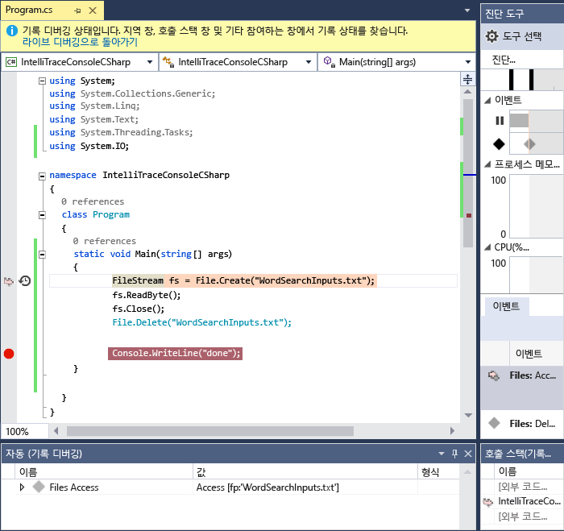

# 연습: IntelliTrace 사용
[!INCLUDE[vs2017banner](../code-quality/includes/vs2017banner.md)]

IntelliTrace를 사용하여 특정 이벤트 또는 이벤트 범주나 이벤트 외에 개별 함수 호출에 대한 정보를 수집할 수 있습니다. 다음 절차에서는 이 작업을 수행하는 방법을 보여 줍니다.  
  
 Visual Studio Enterprise Edition\(Professional 또는 Community Edition 아님\)에서 IntelliTrace를 사용할 수 있습니다.  
  
##  <a name="GettingStarted"></a> 이벤트에만 IntelliTrace 사용  
 IntelliTrace 이벤트로만 디버그를 시도할 수 있습니다. IntelliTrace 이벤트에는 디버거 이벤트, 예외, .NET Framework 이벤트 및 기타 시스템 이벤트가 있습니다. 특정 이벤트를 켜거나 꺼서 디버깅을 시작하기 전에 IntelliTrace에서 기록하는 이벤트를 제어할 수 있습니다. 자세한 내용은 [IntelliTrace 기능](../debugger/intellitrace-features.md)을 참조하세요.  
  
 다음 단계에서는 IntelliTrace 이벤트만 사용하여 디버그하는 방법을 보여 줍니다.  
  
1.  파일 액세스에 대한 IntelliTrace 이벤트 켜기**도구 \/ 옵션 \/ IntelliTrace \/ IntelliTrace 이벤트** 페이지로 이동하고 및 **파일** 범주를 확장합니다.**파일** 이벤트 범주를 확인합니다. 이렇게 하면 모든 파일 이벤트\(액세스, 닫기, 삭제\)가 확인됩니다.  
  
2.  C\# 콘솔 응용 프로그램을 만듭니다. Program.cs 파일에서 다음 `using` 문을 추가합니다.  
  
    ```c#  
    using System.IO;  
    ```  
  
3.  Main 메서드에서 <xref:System.IO.FileStream>을 만들고 여기에서 읽고 닫고 파일을 삭제합니다. 다른 줄을 추가하여 중단점을 설정할 위치 지정합니다.  
  
    ```c#  
    static void Main(string[] args) { FileStream fs = File.Create("WordSearchInputs.txt"); fs.ReadByte(); fs.Close(); File.Delete("WordSearchInputs.txt"); Console.WriteLine("done"); }  
    ```  
  
4.  `Console.WriteLine("done");`에서 중단점 설정  
  
5.  일반적인 방법으로 디버깅을 시작합니다. \(**F5** 키를 누르거나 **디버그 \/ 디버깅 시작**을 클릭합니다.  
  
    > [!TIP]
    >  **지역** 및 **자동** 창에서 값을 보고 기록하기 위해 디버그하는 동안 해당 창은 열어 두세요.  
  
6.  중단점에서 실행이 중지됩니다.**진단 도구** 창이 표시되지 않으면, **디버그 \/ Windows \/ IntelliTrace 이벤트**를 클릭하세요.  
  
     **진단 도구** 창에서 **이벤트** 탭을 찾으세요\(**이벤트**, **메모리 사용량** 및 **CPU 사용량**, 이렇게 3개의 탭이 표시되어야 함\).**이벤트** 탭에는 디버거 실행이 중단되기 전에 마지막 이벤트로 끝나는 시간 순 이벤트 목록이 표시됩니다.**WordSearchInputs.txt 액세스**라는 이벤트가 표시되어야 합니다.  
  
     다음 스크린샷은 Visual Studio 2015 업데이트 1에서 시작됩니다.  
  
       
  
7.  이벤트를 선택하여 해당 세부 정보를 확장합니다.  
  
     다음 스크린샷은 Visual Studio 2015 업데이트 1에서 시작됩니다.  
  
       
  
     경로 이름 링크를 선택하여 파일을 열 수 있습니다. 전체 경로 이름을 사용할 수 없는 경우에는 **파일 열기** 대화 상자가 나타납니다.  
  
     **기록 디버깅 활성화**를 클릭합니다. 이 옵션은 디버거의 컨텍스트를 선택한 이벤트가 수집된 시간으로 설정하고 **호출 스택**, **지역** 및 기타 참여 디버거 창에 기록 데이터를 표시합니다. 소스 코드를 사용할 수 있는 경우 Visual Studio가 소스 창에서 포인터를 해당 코드로 이동하여 검사할 수 있게 합니다.  
  
     다음 스크린샷은 Visual Studio 2015 업데이트 1에서 시작됩니다.  
  
       
  
8.  버그를 찾지 못한 경우 버그를 발생시키는 기타 이벤트를 검사합니다. 함수 호출을 단계별로 실행할 수 있도록 IntelliTrace에서 호출 정보를 기록하게 할 수도 있습니다.  
  
## 이벤트 및 함수 호출에서 IntelliTrace 사용  
 IntelliTrace는 이벤트와 함께 함수 호출을 기록할 수 있습니다. 이렇게 하면 호출 스택 이력을 참조하고 코드에서 호출을 통해 앞뒤로 이동할 수 있습니다. IntelliTrace는 함수 이름, 함수 진입 지점과 종료 지점, 특정 매개 변수 값 및 반환 값 등의 데이터를 기록합니다.[IntelliTrace 기능](../debugger/intellitrace-features.md)을 참조하세요.  
  
1.  호출 수집을 켭니다. \(**도구 \/ 옵션 \/ IntelliTrace \/ 일반**에서 **IntelliTrace 이벤트 및 호출 정보**를 선택합니다. IntelliTrace는 다음 디버깅 세션이 시작되면 이 정보의 수집을 시작합니다.  
  
    > [!TIP]
    >  이 경우 응용 프로그램의 속도가 느려지고 디스크에 저장하는 IntelliTrace 로그 파일\(.iTrace 파일\)의 크기가 커질 수 있습니다. 영향을 최소화하면서 가져오는 호출 데이터를 최대화하려면 관심 있는 모듈의 데이터만 기록합니다. .iTrace 파일의 최대 크기를 변경하려면 **도구 \/ 옵션 \/ IntelliTrace \/ 고급**으로 이동하고 디스크 공간의 최대 크기를 지정합니다. 기본값은 250MB입니다.  
  
2.  이전 섹션에서 만든 C\# 콘솔 응용 프로그램의 디버깅을 시작합니다. 중단점에서 실행이 중지됩니다.**진단 도구** 창이 표시되지 않으면, **디버그 \/ Windows \/ IntelliTrace 이벤트**를 클릭하세요.  
  
3.  **호출** 탭으로 전환합니다.  
  
     이제 응용 프로그램의 함수 호출이 표시되며, 이 호출은 루트 호출\(현재 솔루션의 주 진입점\)에서 시작하여 실행이 중단된 위치로 끝납니다.  
  
     함수 호출 중 하나를 선택하고 두 번 클릭합니다. 함수 진입 지점과 종료 지점이 표시되고 현재 호출이 다른 함수 및 해당 호출에 의해 발생한 IntelliTrace 이벤트에 수행된 호출도 표시됩니다. 기록 디버깅이 켜져 있지 않은 경우 이 동작으로 기록 디버깅이 켜집니다. 기록 디버깅에 대한 자세한 내용은 [기록 디버깅](../debugger/historical-debugging.md)을 참조하세요.  
  
    > [!NOTE]
    >  일부 호출이 흐리게 표시될 수 있습니다. 이것은 IntelliTrace에서 해당 모듈의 데이터를 기록하지 않았기 때문입니다. 이 데이터를 보려면 IntelliTrace에서 해당 모듈의 데이터를 수집하게 합니다. 모듈을 지정하는 방법에 대한 자세한 내용은 [IntelliTrace 기능](../debugger/intellitrace-features.md)을 참조하세요.  
  
## 다음 단계