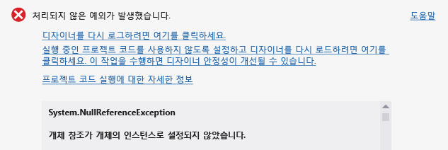
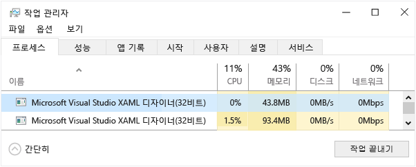
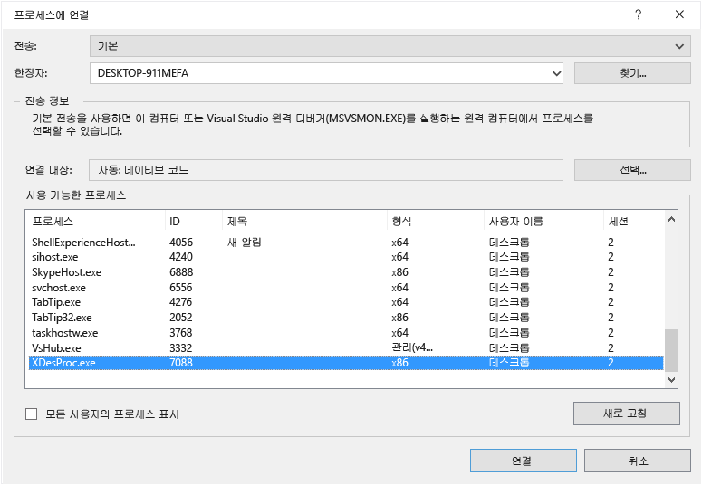

# XAML 디자이너에서 프로젝트 코드 디버그 또는 사용하지 않도록 설정

많은 경우 **XAML** 디자이너의 처리되지 않은 예외는 디자이너에서 애플리케이션이 실행 중일 때 다른 방식으로 작동하거나 다른 값을 반환하는 속성 또는 메서드에 액세스하려는 프로젝트 코드로 인해 발생할 수 있습니다. 이러한 예외는 Visual Studio의 다른 인스턴스에서 프로젝트 코드를 디버그하여 해결하거나 디자이너에서 프로젝트 코드를 사용하지 않도록 설정하여 임시로 방지할 수 있습니다.

프로젝트 코드는 다음을 포함합니다.

-   사용자 지정 컨트롤 및 사용자 지정 컨트롤

-   클래스 라이브러리

-   값 변환기

-   프로젝트 코드에서 생성된 디자인 타임 데이터에 대한 바인딩

프로젝트 코드를 사용할 수 없을 경우 Visual Studio는 자리 표시자를 표시합니다. 예를 들어 Visual Studio에서는 데이터를 더 이상 사용할 수 없는 바인딩에 대한 속성 이름 또는 더 이상 실행하지 않는 컨트롤에 대한 자리 표시자를 보여 줍니다.

## 프로젝트 코드가 예외를 발생시키는지 확인하려면

1.  처리되지 않은 예외 대화 상자에서 **디자이너를 다시 로드하려면 여기를 클릭** 링크를 선택합니다.

2.  메뉴 모음에서 **디버그** > **디버깅 시작**을 선택하여 애플리케이션을 빌드하고 실행합니다.

     애플리케이션이 성공적으로 빌드되고 실행되면 디자이너에서 실행 중인 프로젝트 코드로 인해 디자인 타임 예외가 발생할 수 있습니다.

## 디자이너에서 실행되는 프로젝트 코드를 디버그하려면

1.  처리되지 않은 예외 대화 상자에서 **프로젝트 코드 실행을 사용하지 않도록 설정하고 디자이너를 다시 로드하려면 여기를 클릭** 링크를 선택합니다.

2.  Windows 작업 관리자에서 **작업 끝내기** 단추를 선택하여 현재 실행 중인 Visual Studio XAML 디자이너의 모든 인스턴스를 닫습니다.

     

3.  Visual Studio에서 디버그하려는 코드 또는 컨트롤이 포함된 XAML 페이지를 엽니다.

4.  Visual Studio의 새 인스턴스를 연 다음 프로젝트의 두 번째 인스턴스를 엽니다.

5.  프로젝트 코드에서 중단점을 설정합니다.

6.  Visual Studio의 새 인스턴스 메뉴 모음에서 **디버그** > **프로세스에 연결**을 선택합니다.

7.  **프로세스에 연결** 대화 상자의 **사용 가능한 프로세스** 목록에서 **XDesProc.exe**를 선택한 다음 **연결** 단추를 선택합니다.

     

     이는 Visual Studio의 첫 번째 인스턴스의 XAML 디자이너에 대한 프로세스입니다.

8.  Visual Studio의 첫 번째 인스턴스 메뉴 모음에서 **디버그** > **디버깅 시작**을 선택합니다.

     이제 디자이너에서 실행 중인 코드를 한 단계씩 실행할 수 있습니다.

## 디자이너에서 프로젝트 코드를 사용하지 않도록 설정하려면

-   처리되지 않은 예외 대화 상자에서 **프로젝트 코드 실행을 사용하지 않도록 설정하고 디자이너를 다시 로드하려면 여기를 클릭** 링크를 선택합니다.

-   또는 **XAML 디자이너**의 도구 모음에서 **프로젝트 코드를 사용하지 않도록 설정** 단추를 선택합니다.

     

     단추를 다시 토글하여 프로젝트 코드를 다시 사용하도록 설정할 수 있습니다.

    > [!NOTE]
    > ARM 또는 X64 프로세서를 대상으로 하는 프로젝트의 경우 Visual Studio가 디자이너에서 프로젝트 코드를 실행할 수 없으므로 디자이너에서 **프로젝트 코드를 사용하지 않도록 설정** 단추가 사용하지 않도록 설정됩니다.

-   두 옵션 모두 디자이너가 다시 로드한 다음, 연결된 프로젝트에 대한 모든 코드를 사용하지 않도록 설정합니다.

    > [!NOTE]
    > 프로젝트 코드를 사용하지 않도록 설정하면 디자인 타임 데이터가 손실될 수 있습니다. 그러므로 디자이너에서 실행되는 코드를 디버그하는 것이 좋습니다.

## 컨트롤 표시 옵션

> [!NOTE]
> **컨트롤 표시 옵션**은 Windows 10 Fall Creators Update(빌드 16299) 이상을 대상으로 하는 유니버설 Windows 플랫폼 애플리케이션에만 사용할 수 있습니다. **컨트롤 표시 옵션** 기능은 Visual Studio 2017 버전 15.9 이상에서 사용할 수 있습니다. 

XAML 디자이너에서 Windows SDK의 플랫폼 컨트롤만 표시하도록 컨트롤 표시 옵션을 변경할 수 있습니다. 이로 인해 XAML 디자이너의 안정성이 향상될 수 있습니다.

컨트롤 표시 옵션을 변경하려면 디자이너 창의 왼쪽 아래에서 아이콘을 클릭하고 **컨트롤 표시 옵션** 아래의 옵션을 선택합니다.

**플랫폼 컨트롤만 표시**를 선택하면 SDK, 고객 사용자 정의 컨트롤 등에서 제공되는 모든 사용자 지정 컨트롤이 완벽하게 렌더링되지 않습니다. 대신, 대체 컨트롤로 바뀌어 컨트롤의 크기와 위치를 보여 줍니다.

## 참고 항목

- [Visual Studio 및 Blend for Visual Studio에서 XAML 디자인](../designers/designing-xaml-in-visual-studio.md)
