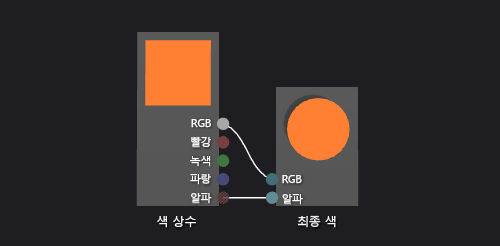

# 방법: 기본 색 셰이더 만들기

이 문서에서는 셰이더 디자이너 및 DGSL(Directed Graph Shader Language)을 사용하여 단색 셰이더를 만드는 방법을 보여 줍니다. 이 셰이더는 최종 색을 상수 RGB 색 값으로 설정합니다.

## 단색 셰이더 만들기

최종 출력 색에 대한 RGB 색 상수의 색 값을 작성하여 최종 색 셰이더를 구현할 수 있습니다.

시작하기 전에 **속성** 창과 **도구 상자**가 표시되는지 확인하세요.

1.  사용할 DGSL 셰이더를 만듭니다. DGSL 셰이더를 프로젝트에 추가하는 방법에 대한 내용은 [셰이더 디자이너](../designers/shader-designer.md)의 시작 섹션을 참조하세요.

2.  **점 색** 노드를 삭제합니다. **선택** 도구를 사용하여 **점 색** 노드를 선택하고 메뉴 표시줄에서 **편집**, **삭제**를 선택합니다.

3.  **색 상수** 노드를 그래프에 추가합니다. **도구 상자**의 **상수**에서 **색 상수**를 선택하고 디자인 화면으로 이동합니다.

4.  **색 상수** 노드의 색 값을 지정합니다. **선택** 도구를 사용하여 **색 상수** 노드를 선택하고 **속성** 창의 **출력** 속성에서 색 값을 지정합니다. 주황색의 경우 (1.0, 0.5, 0.2, 1.0) 값을 지정합니다.

5.  색 상수를 최종 색에 연결합니다. 연결을 만들려면 **색 상수** 노드의 **RGB** 터미널을 **최종 색** 노드의 **RGB** 터미널로 이동하고 **색 상수** 노드의 **알파** 터미널을 **최종 색** 노드의 **알파** 터미널로 이동합니다. 이러한 연결은 최종 색을 이전 단계에서 정의된 색 상수로 설정합니다.

다음 그림은 정육면체에 적용된 셰이더의 완료된 셰이더 그래프 및 미리 보기를 보여 줍니다.

> [!NOTE]
> 그림에서 주황색은 셰이더 효과를 더 잘 보여 주기 위해 지정되었습니다.

일부 셰이더의 경우 특정 도형을 사용하면 미리 보기가 더 잘 표시될 수 있습니다. 셰이더 디자이너에서 셰이더를 미리 보는 방법에 대한 자세한 내용은 [셰이더 디자이너](../designers/shader-designer.md)를 참조하세요.

## 참고 항목

- [방법: 3D 모델에 셰이더 적용](../designers/how-to-apply-a-shader-to-a-3-d-model.md)
- [방법: 셰이더 내보내기](../designers/how-to-export-a-shader.md)
- [셰이더 디자이너](../designers/shader-designer.md)
- [셰이더 디자이너 노드](../designers/shader-designer-nodes.md)