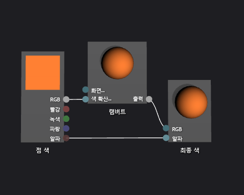
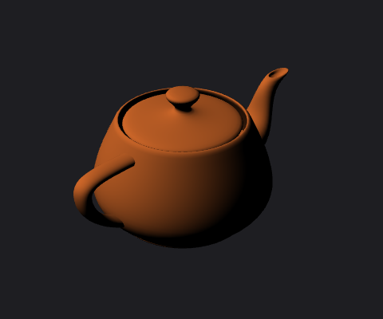

# 방법: 기본 램버트 셰이더 만들기
[!INCLUDE[vs2017banner](../code-quality/includes/vs2017banner.md)]

이 문서에서는 셰이더 디자이너와 DGSL\(Directed Graph Shader Language\)을 사용하여 전통적인 Lambert 조명 모델을 구현하는 조명 셰이더를 만드는 방법을 보여줍니다.  
  
 이 문서는 다음과 같은 활동을 보여줍니다.  
  
-   셰이더 그래프에 노드 추가  
  
-   노드 연결 해제  
  
-   노드 연결  
  
## 램버트 조명 모델  
 램버트 조명 모델은 3차원 장면에서 주변 및 방향성 조명을 셰이드 개체에 통합합니다.  주변 구성 요소는 3차원 장면에서 조명의 기본 수준을 제공합니다.  방향성 구성 요소는 방향성\(원거리\) 광원 소스에서 추가 조명을 제공합니다.  앰비언트 조명은 방향에 관계 없이 동일하게 장면의 모든 표면에 영향을 줍니다.  지정된 화면에서 이것은 화면의 주변색, 장면의 색 및 주변 빛 강도에 의해 만들어집니다.  방향성 광원은 광원의 방향에 대한 표면의 방향에 기반하여 장면에 있어서의 모든 표면에 차별적으로 영향을 줍니다.  이는 표면의 확산 색과 방향 그리고 광원 소스의 색, 강도 및 방향의 제품입니다.  직접 광원 쪽을 향하는 표면이 최대 영향을 받고 광원과 멀리 떨어진 표면은 영향을 받지 않습니다.  Lambert 조명 모델 아래에서 개체의 각 지점의 전체 혼합 색상 및 조명 강도를 확인하려면 주변 구성 요소와 하나 이상의 방향 구성 요소를 결합합니다.  
  
 시작하기 전에 **속성** 창과 **도구 상자**가 표시되는지 확인하십시오.  
  
#### 램버트 셰이더를 만들려면  
  
1.  사용할 DGSL 셰이더를 만듭니다.  DGSL 셰이더를 프로젝트에 추가하는 방법에 대한 내용은 [셰이더 디자이너](../designers/shader-designer.md)의 시작 단원을 참조하십시오.  
  
2.  **최종 색상** 노드로부터 **꼭짓점 색** 노드를 연결해제 합니다.  **꼭짓점 색** 노드의 **RGB** 터미널을 선택하고 **링크 끊기**를 선택합니다.  연결된 **알파** 터미널에서 나갑니다.  
  
3.  **램버트** 노드를 그래프에 추가합니다.  **도구 상자**의 **유틸리티** 아래에서 **램버트**를 선택하고 디자인 화면으로 이동합니다.  램버트 노드 확산 및 앰비언트 조명 매개 변수는 픽셀의 총 확산 색 기여도 계산 합니다.  
  
4.  **꼭짓점 색상** 노드를 **램버트** 노드로 연결합니다.  **선택** 모드에서, **꼭짓점 색상** 노드의 **RGB** 터미널을 **램버트** 노드의 **확산 색** 터미널로 이동시킵니다.  이 연결은 픽셀의 보간된 확산 색을 사용한 램버트 노드를 제공 합니다.  
  
5.  계산된 색 값을 최종 색으로 연결합니다.  **램버트** 노드의 **출력** 터미널을 **최종 색** 노드의 **RGB** 터미널로 이동합니다.  
  
 다음 그림에서는 완성된 셰이더 그래프와 주전자 모델에 적용된 셰이더의 미리 보기를 보여 줍니다.  
  
> [!NOTE]
>  이 그림에서 셰이더 효과를 보다 잘 보여 주기 위해, 주황색을 셰이더의 **MaterialDiffuse** 매개변수를 사용함으로써 지정해줍니다.  게임이나 응용 프로그램은 각 개체에 대해 고유한 색상 값을 제공하기 위해, 이 매개 변수를 사용할 수 있습니다.  더 많은 재료 매개 변수에 대한 정보는 셰이더 미리 보기 섹션을 참조 하십시오. [셰이더 디자이너](../designers/shader-designer.md).  
  
   
  
 특정 셰이프는 일부 셰이더에 대해 더 나은 미리 보기를 제공할 수 있습니다.  미리 보는 방법에 대한 자세한 내용은 셰이더 디자이너에서 셰이더 미리 단원을 참조합니다 [셰이더 디자이너](../designers/shader-designer.md).  
  
 다음 그림은 3차원 모델에 적용되었고, 이 문서에서 설명하는 셰이더를 보여줍니다.  
  
   
  
 셰이더를 3D모델에 적용하는 방법에 대한 자세한 내용은 [방법: 3차원 모델에 셰이더 적용](../designers/how-to-apply-a-shader-to-a-3-d-model.md)을 참조하십시오.  
  
## 참고 항목  
 [방법: 3차원 모델에 셰이더 적용](../designers/how-to-apply-a-shader-to-a-3-d-model.md)   
 [방법: 셰이더 내보내기](../designers/how-to-export-a-shader.md)   
 [방법: 기본 퐁 셰이더 만들기](../designers/how-to-create-a-basic-phong-shader.md)   
 [셰이더 디자이너](../designers/shader-designer.md)   
 [셰이더 디자이너 노드](../designers/shader-designer-nodes.md)