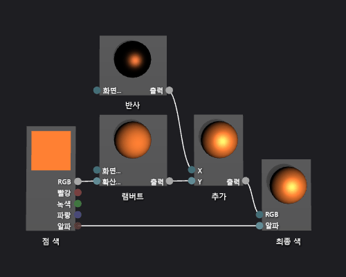

# 방법: 기본 퐁 셰이더 만들기

이 문서에서는 셰이더 디자이너 및 DGSL(Directed Graph Shader Language)을 사용하여 기본형 퐁 조명 모델을 구현하는 조명 셰이더를 만드는 방법을 보여 줍니다.

## 퐁 조명 모델

퐁 조명 모델은 표면의 반사 속성을 시뮬레이트하는 반사 상조 표시를 포함하도록 램버트 조명 모델을 확장합니다. 반사 구성 요소는 램버트 조명 모델에 사용되는 동일한 방향성 광원에서 추가적인 조명을 제공하지만 최종 색에 대한 기여도는 다르게 처리됩니다. 반사 강조 표시는 뷰 방향, 광원 방향 및 표면 방향 간의 관계에 따라 장면의 모든 표면에 다른 영향을 미칩니다. 표면의 확산 색, 반사 강도 및 방향과 광원의 색, 강도 및 방향을 기반으로 결과가 생성됩니다. 뷰어에서 직접 광원을 반사하는 표면은 최대 기여도를 받고 뷰어에서 떨어져 광원을 반사하는 표면은 기여도를 받지 않습니다. 퐁 조명 모델에서 하나 이상의 반사 구성 요소가 결합되어 개체의 각 점에 대한 반사 강조 표시의 색 및 강도를 결정하고 램버트 조명의 결과에 추가되어 픽셀의 최종 색을 생성합니다.

램버트 조명 모델에 대한 자세한 내용은 [방법: 기본 램버트 셰이더 만들기](../designers/how-to-create-a-basic-lambert-shader.md)를 참조하세요.

시작하기 전에 **속성** 창과 **도구 상자**가 표시되는지 확인하세요.

1.  [방법: 기본 램버트 셰이더 만들기](../designers/how-to-create-a-basic-lambert-shader.md)에 설명된 대로 램버트 셰이더를 만듭니다.

2.  **최종 색** 노드에서 **램버트** 노드의 연결을 끊습니다. **램버트** 노드의 **RGB** 터미널을 선택하고 **연결 끊기**를 선택합니다. 그러면 다음 단계에서 추가되는 노드에 대한 공간이 생깁니다.

3.  **더하기** 노드를 그래프에 추가합니다. **도구 상자**의 **수학**에서 **더하기**를 선택하고 디자인 화면으로 이동합니다.

4.  **반사** 노드를 그래프에 추가합니다. **도구 상자**의 **유틸리티**에서 **반사**를 선택하고 디자인 화면으로 이동합니다.

5.  반사 기여도를 추가합니다. **반사** 노드의 **출력** 터미널을 **더하기** 노드의 **X** 터미널로 이동하고 **램버트** 노드의 **출력** 터미널을 **더하기** 노드의 **Y** 터미널로 이동합니다. 이러한 연결은 픽셀에 대한 총 확산 및 반사 색 기여도를 결합합니다.

6.  계산된 색 값을 최종 색에 연결합니다. **더하기** 노드의 **출력** 터미널을 **최종 색** 노드의 **RGB** 터미널로 이동합니다.

 다음 그림은 주전자 모델에 적용된 셰이더의 완료된 셰이더 그래프 및 미리 보기를 보여 줍니다.

> [!NOTE]
> 이 그림에서 셰이더의 효과를 더 잘 보여 주기 위해 셰이더의 **MaterialDiffuse** 매개 변수를 사용하여 주황색이 지정되었고, **MaterialSpecular** 및 **MaterialSpecularPower** 매개 변수를 사용하여 금속 재질 마감이 지정되었습니다. 재질 매개 변수에 대한 자세한 내용은 [셰이더 디자이너](../designers/shader-designer.md)의 셰이더 미리 보기 섹션을 참조하세요.

 

 일부 셰이더의 경우 특정 도형을 사용하면 미리 보기가 더 잘 표시될 수 있습니다. 셰이더 디자이너에서 셰이더를 미리 보는 방법에 대한 자세한 내용은 [셰이더 디자이너](../designers/shader-designer.md)의 셰이더 미리 보기 섹션을 참조하세요.

 다음 그림은 3D 모델에 적용되는 이 문서에서 설명된 셰이더를 보여줍니다. **MaterialSpecular** 속성은 (1.00, 0.50, 0.20, 0.00)으로 설정되고 해당 **MaterialSpecularPower** 속성은 16으로 설정됩니다.

> [!NOTE]
> **MaterialSpecular** 속성은 표면 재질의 외관 마감을 결정합니다. 유리 또는 플라스틱과 같은 고광택 표면은 흰색의 밝은 음영인 반사 색을 가지는 경향이 있습니다. 금속성 표면은 확산 색에 가까운 반사 색을 가지는 경향이 있습니다. 새틴 마감 표면은 회색의 어두운 음영인 반사 색을 가지는 경향이 있습니다.
>
> **MaterialSpecularPower** 속성은 반사 강조 표시의 강도를 결정합니다. 높은 반사 강도는 더 무디고 더 집중적인 강조 표시를 시뮬레이트합니다. 매우 낮은 반사 강도는 전체 표면의 색을 과포화시키고 숨길 수 있는 강도가 높고 포괄적인 강조 표시를 시뮬레이트합니다.

 

 3D 모델에 셰이더를 적용하는 방법에 대한 자세한 내용은 [방법: 3D 모델에 셰이더 적용](../designers/how-to-apply-a-shader-to-a-3-d-model.md)을 참조하세요.

## 참고 항목

- [방법: 3D 모델에 셰이더 적용](../designers/how-to-apply-a-shader-to-a-3-d-model.md)
- [방법: 셰이더 내보내기](../designers/how-to-export-a-shader.md)
- [방법: 기본 램버트 셰이더 만들기](../designers/how-to-create-a-basic-lambert-shader.md)
- [셰이더 디자이너](../designers/shader-designer.md)
- [셰이더 디자이너 노드](../designers/shader-designer-nodes.md)