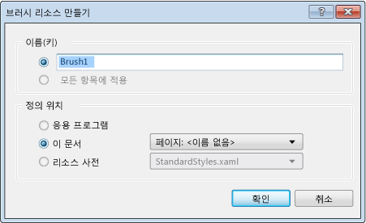

# 방법: 리소스 만들기 및 적용
XAML 디자이너의 요소에 대한 스타일 및 템플릿은 리소스라는 다시 사용 가능한 엔터티에 저장됩니다. 스타일을 사용하면 요소 속성을 설정하고 여러 요소에 걸쳐 일관된 모양을 위해 이러한 설정을 통해 다시 사용할 수 있습니다. [ControlTemplate](/uwp/api/Windows.UI.Xaml.Controls.ControlTemplate)은 컨트롤의 모양을 정의하며 리소스로 적용될 수도 있습니다. 자세한 내용은 [빠른 시작: 컨트롤 스타일 지정](http://go.microsoft.com/fwlink/?LinkID=248239) 및 [빠른 시작: 컨트롤 템플릿](http://go.microsoft.com/fwlink/?LinkID=247982)을 참조하세요.

 기존 속성인 [스타일](/uwp/api/Windows.UI.Xaml.Style) 또는 `ControlTemplate`으로 새 리소스를 만들 때마다 **리소스 만들기** 대화 상자를 사용하여 애플리케이션 수준, 문서 수준 또는 요소 수준에서 리소스를 정의할 수 있습니다. 이러한 수준에 따라 리소스를 사용할 수 있는 위치가 결정됩니다. 예를 들어 요소 수준에서 리소스를 정의하는 경우 리소스 만든 요소에만 적용할 수 있습니다. 또한 다른 프로젝트에서 다시 사용할 수 있는 별도 파일인 리소스 사전에 리소스를 저장할 수 있습니다.

### 새 리소스를 만들려면

1.  XAML 디자이너에서 XAML 파일을 연 상태에서, 요소를 만들거나 문서 개요 창에서 요소를 선택합니다.

2.  속성 창에서 속성 값의 오른쪽에 있는 상자 기호로 나타나는 속성 표식을 선택한 다음 **새 리소스로 변환**을 선택합니다. 흰색 상자 기호는 기본값을 나타내고 검은색 상자 기호는 일반적으로 로컬 리소스가 적용된 것을 나타냅니다.

     리소스를 만들 수 있는 적절한 대화 상자가 나타납니다. 이 대화 상자는 브러시에서 리소스를 만들 때 나타납니다.

     

3.  **이름(키)** 상자에 키 이름을 입력합니다. 이 이름은 다른 요소가 리소스를 참조하도록 할 때 사용할 수 있습니다.

4.  **정의 위치**에서 리소스를 정의할 위치를 지정하는 옵션을 선택합니다.

    -   애플리케이션의 모든 문서에 리소스를 사용할 수 있도록 하려면 **애플리케이션**을 선택합니다.

    -   현재 문서에서만 리소스를 사용할 수 있도록 하려면 **이 문서**를 선택합니다.

    -   리소스를 만든 요소 또는 그 자식 요소에만 리소스를 사용할 수 있도록 하려면 요소에만 **이 문서**를 선택하고 드롭다운 목록에서 **요소**: **이름**을 선택합니다.

    -   다른 프로젝트에서 다시 사용할 수 있는 리소스 사전 파일에 리소스를 정의하려면 **리소스 사전**을 클릭한 다음 드롭다운 목록에서 **StandardStyles.xaml**과 같은 기존 리소스 사전 파일을 선택합니다.

5.  **확인** 단추를 선택하여 리소스를 만들고 리소스를 만든 요소에 적용합니다.

### 요소 또는 속성에 리소스를 적용하려면

1. 문서 개요 창에서 리소스를 적용하려는 요소를 선택합니다.

2. 다음 작업 중 하나를 수행합니다.

   - 속성에 리소스를 적용합니다. [속성] 창에서 속성 값 옆에 있는 속성 표식을 선택하고, **로컬 리소스** 또는 **시스템 리소스**를 선택한 다음, 표시되는 목록에서 사용 가능한 리소스를 선택합니다.

      보려는 리소스가 표시되지 않으면 리소스 종류가 속성 유형과 맞지 않기 때문일 수 있습니다.

   - 컨트롤에 스타일 또는 컨트롤 템플릿 리소스를 적용합니다. [문서 개요] 창에서 컨트롤의 오른쪽 클릭 메뉴(상황에 맞는 메뉴)를 열고, **템플릿 편집** 또는 **추가 템플릿 편집**을 선택하고, **리소스 적용**을 선택한 다음, 표시되는 목록에서 컨트롤 템플릿의 이름을 선택합니다.

     > [!NOTE]
     > **템플릿 편집**은 컨트롤 템플릿을 적용합니다. **추가 템플릿 편집**은 다른 템플릿 형식을 적용합니다.

     호환되는 모든 위치에 리소스를 적용할 수 있습니다. 예를 들어 <xref:Windows.UI.Xaml.Controls.TextBox> 컨트롤의 **Foreground** 속성에 브러시 리소스를 적용할 수 있습니다.

### 리소스를 편집하려면

1.  아트보드 또는 문서 개요 창에서 요소를 선택합니다.

2.  [속성] 창에서 속성의 오른쪽에 있는 기본 또는 로컬 속성 표식을 선택하고 **리소스 편집**을 선택하여 **리소스 편집** 대화 상자를 엽니다.

3.  리소스에 대한 옵션을 수정합니다.

## 참고 항목

- [XAML 디자이너를 사용하여 UI 만들기](../designers/creating-a-ui-by-using-xaml-designer-in-visual-studio.md)