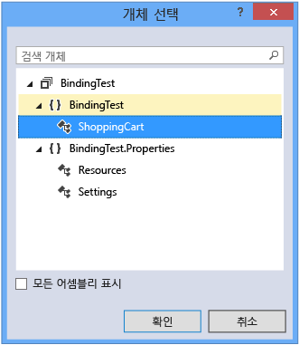
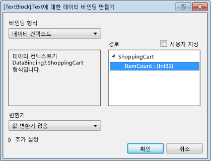

# <a name="walkthrough-binding-to-data-in-xaml-designer"></a>연습: XAML 디자이너의 데이터 바인딩
XAML 디자이너에서 아트보드와 속성 창을 사용하여 데이터 바인딩 속성을 설정할 수 있습니다. 이 연습의 예제에서는 데이터를 컨트롤에 바인딩하는 방법을 보여줍니다. 특히 이 연습에서는 `ItemCount`라는 [DependencyProperty](http://msdn.microsoft.com/library/windows/apps/windows.ui.xaml.dependencyproperty.aspx)가 포함된 간단한 쇼핑 카트 클래스를 만든 다음, [TextBlock](http://msdn.microsoft.com/library/windows/apps/windows.ui.xaml.controls.textblock.aspx) 컨트롤의 **Text** 속성에 `ItemCount` 속성을 바인딩하는 방법을 보여 줍니다.  
  
### <a name="to-create-a-class-to-use-as-a-data-source"></a>데이터 원본으로 사용할 클래스를 만들려면  
  
1.  **파일** 메뉴에서 **새로 만들기**, **프로젝트**를 차례로 선택합니다.  
  
2.  **새 프로젝트** 대화 상자에서 **Visual C#** 또는 **Visual Basic** 노드를 선택하고, **Windows 바탕 화면** 노드를 펼친 다음, **WPF 응용 프로그램** 템플릿을 선택합니다.  
  
3.  **BindingTest** 프로젝트 이름을 지정한 다음 **확인** 단추를 선택합니다.  
  
4.  MainWindow.xaml.cs(또는 MainWindow.xaml.vb) 파일을 열고 다음 코드를 추가합니다. C#에서 `BindingTest` 네임스페이스에(파일의 마지막 닫는 괄호 앞에) 코드를 추가합니다. Visual Basic에서, 새 클래스를 추가합니다.  
  
    ```csharp  
    public class ShoppingCart : DependencyObject  
    {  
        public int ItemCount  
        {  
            get { return (int)GetValue(ItemCountProperty); }  
            set { SetValue(ItemCountProperty, value); }  
        }  
  
        public static readonly DependencyProperty ItemCountProperty =  
             DependencyProperty.Register("ItemCount", typeof(int),  
             typeof(ShoppingCart), new PropertyMetadata(0));  
    }  
  
    ```  
  
    ```vb  
    Public Class ShoppingCart  
        Inherits DependencyObject  
  
        Public Shared ReadOnly ItemCountProperty As DependencyProperty = DependencyProperty.Register(  
            "ItemCount", GetType(Integer), GetType(ShoppingCart), New PropertyMetadata(0))  
        Public Property ItemCount As Integer  
            Get  
                ItemCount = CType(GetValue(ItemCountProperty), Integer)  
            End Get  
            Set(value As Integer)  
                SetValue(ItemCountProperty, value)  
            End Set  
        End Property  
    End Class  
    ```  
  
     이 코드는 [PropertyMetadata](http://msdn.microsoft.com/library/windows/apps/windows.ui.xaml.propertymetadata.aspx) 개체를 사용하여 기본 항목 수로 값 0을 설정합니다.  
  
5.  **파일** 메뉴에서 **빌드**, **솔루션 빌드**를 차례로 선택합니다.  
  
### <a name="to-bind-the-itemcount-property-to-a-textblock-control"></a>ItemCount 속성을 TextBlock 컨트롤에 바인딩하려면  
  
1.  [솔루션 탐색기]에서 MainWindow.xaml에 대한 바로 가기 메뉴를 연 다음 **뷰 디자이너**를 선택합니다.  
  
2.  도구 상자에서 [그리드](http://msdn.microsoft.com/library/windows/apps/windows.ui.xaml.controls.grid.aspx) 컨트롤을 선택하여 양식에 추가합니다.  
  
3.  `Grid`를 선택하고, [속성] 창에서 **DataContext** 속성 옆에 있는 **새로 만들기** 단추를 선택합니다.  
  
4.  **개체 선택** 대화 상자에서, **모든 어셈블리 표시** 확인란을 선택 취소하고, **BindingTest** 네임스페이스 아래에서 **ShoppingCart**를 선택한 다음, **확인** 단추를 선택합니다.  
  
     다음 그림에서는 **ShoppingCart**가 선택된 **개체 선택** 대화 상자를 보여 줍니다.  
  
       
  
5.  **도구 상자**에서, `TextBlock` 컨트롤을 선택하여 양식에 추가합니다.  
  
6.  `TextBlock` 컨트롤을 선택하고, [속성] 창에서 **Text** 속성의 오른쪽에 속성 마커를 선택한 다음, **데이터 바인딩 만들기**를 선택합니다. (속성 표식은 작은 상자처럼 보입니다.)  
  
7.  [데이터 바인딩 만들기] 대화 상자의 **경로** 상자에서 **ItemCount : (int32)** 속성을 선택한 다음 **확인** 단추를 선택합니다.  
  
     다음 그림에서는 **ItemCount** 속성이 선택된 **데이터 바인딩 만들기** 대화 상자를 보여 줍니다.  
  
       
  
8.  F5 키를 눌러 앱을 실행합니다.  
  
     `TextBlock` 컨트롤은 0의 기본값을 텍스트로 표시해야 합니다.  
  
## <a name="see-also"></a>참고 항목  
 [XAML 디자이너를 사용하여 UI 만들기](../designers/creating-a-ui-by-using-xaml-designer-in-visual-studio.md)   
 [값 변환기 추가 대화 상자](https://msdn.microsoft.com/en-us/c5f3d110-a541-4b55-8bca-928f77778af8)