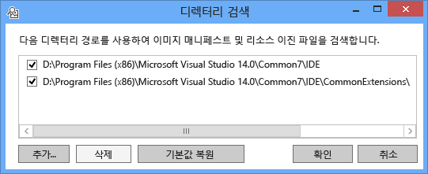
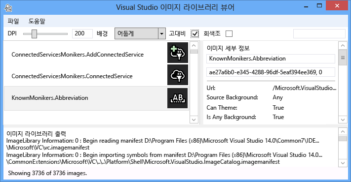
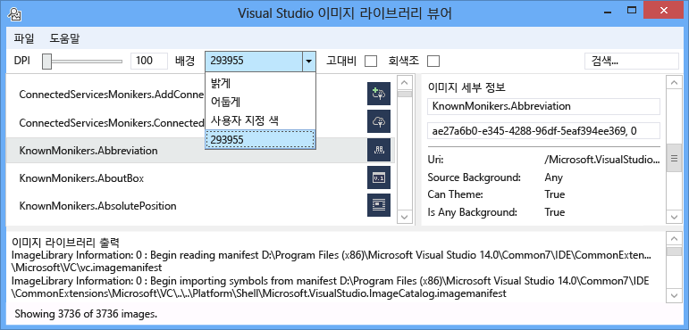
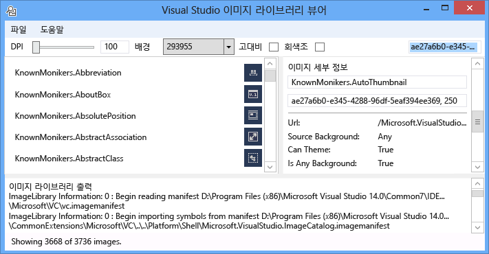
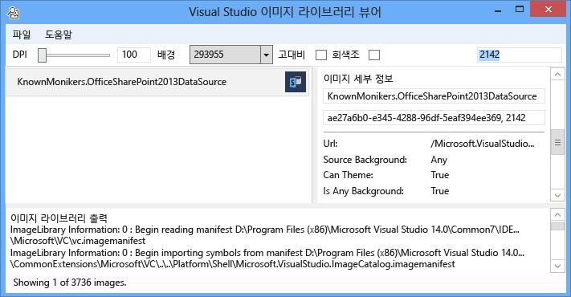

# <a name="image-library-viewer"></a>이미지 라이브러리 뷰어
Visual Studio 이미지 라이브러리 뷰어 도구를 로드 하 고 Visual Studio는 동일한 방식으로 조작할 수 있도록 이미지 매니페스트를 검색할 수 있습니다. 백그라운드, 크기, DPI, 고대비 등 및 기타 설정을 변경할 수 있습니다. 또한 도구는 각 이미지 매니페스트에 대 한 정보를 로드를 표시 하 고 이미지 매니페스트에서 각 이미지에 대 한 소스 정보를 표시 합니다. 이 도구에 유용합니다.  
  
1. 오류 진단  
  
2. 사용자 지정 이미지 매니페스트에서 올바르게 보장 특성 설정  
  
3. Visual Studio 확장 Visual Studio의 스타일에 맞는 이미지를 사용할 수 있도록 Visual Studio 이미지 카탈로그에 대 한 이미지 검색  
  
     
  
   **이미지 모니커**  
  
   이미지 모니커 (또는 줄여서 모니커)는 고유 하 게 이미지 자산 또는 이미지 라이브러리에서 이미지 목록 자산을 식별 하는 guid: id 쌍.  
  
   **이미지 매니페스트 파일**  
  
   이미지 매니페스트 (.imagemanifest) 파일은 이미지 자산, 자산 및 실제 이미지 또는 각 자산을 나타내는 이미지를 나타내는 모니커 집합을 정의 하는 XML 파일입니다. 이미지 매니페스트 독립 실행형 이미지를 정의할 수 있습니다 또는 레거시 UI 지원에 대 한 이미지를 나열 합니다. 또한, 시기 및 해당 자산을 표시 하는 방법을 변경 하려면 각각의 자산 뒤 개별 이미지 또는 자산에서 설정할 수 있는 속성이 있습니다.  
  
   **이미지 매니페스트 스키마**  
  
   이미지 완료 매니페스트는 다음과 같습니다.  
  
```xml  
<ImageManifest>  
      <!-- zero or one Symbols elements -->  
      <Symbols>  
        <!-- zero or more Guid, ID, or String elements -->  
      </Symbols>  
      <!-- zero or one Images elements -->  
      <Images>  
        <!-- zero or more Image elements -->  
      </Images>  
      <!-- zero or one ImageLists elements -->  
      <ImageLists>  
        <!-- zero or more ImageList elements -->  
      </ImageLists>  
</ImageManifest>  
```  
  
 **기호**  
  
 가독성 및 유지 관리를 지 원하는 대로 이미지 매니페스트 특성 값에 대 한 기호를 사용할 수 있습니다. 기호는 다음과 같이 정의 됩니다.  
  
```xml  
<Symbols>  
      <Import Manifest="manifest" />  
      <Guid Name="ShellCommandGuid" Value="8ee4f65d-bab4-4cde-b8e7-ac412abbda8a" />  
      <ID Name="cmdidSaveAll" Value="1000" />  
      <String Name="AssemblyName" Value="Microsoft.VisualStudio.Shell.UI.Internal" />  
</Symbols>  
```  
  
|||  
|-|-|  
|**하위 요소**|**정의**|  
|가져오기|현재 매니페스트에서 사용 하 여 지정 된 매니페스트 파일의 기호를 가져옵니다.|  
|GUID|GUID를 나타내는 기호와 GUID 서식 지정과 일치 해야 합니다.|  
|ID|기호 ID를 나타내며 음수가 아닌 정수 여야 합니다.|  
|문자열|기호는 임의의 문자열 값을 나타냅니다.|  
  
 기호는 대/소문자 구분, 및 $(symbol-name) 구문을 사용 하 여 참조입니다.  
  
```xml  
<Image Guid="$(ShellCommandGuid)" ID="$(cmdidSaveAll)" >  
      <Source Uri="/$(AssemblyName);Component/Resources/image.xaml" />  
</Image>  
```  
  
 일부 기호는 모든 매니페스트에 대 한 미리 정의 됩니다. 이러한 Uri 특성에 사용할 수 있습니다 합니다 \<소스 > 또는 \<가져오기 > 로컬 컴퓨터의 참조 경로 요소입니다.  
  
|||  
|-|-|  
|**기호**|**설명**|  
|CommonProgramFiles|% CommonProgramFiles % 환경 변수 값|  
|LocalAppData|% LocalAppData % 환경 변수 값|  
|ManifestFolder|매니페스트 파일을 포함 하는 폴더|  
|내 문서|현재 사용자의 내 문서 폴더의 전체 경로|  
|ProgramFiles|% ProgramFiles % 환경 변수 값|  
|시스템|Windows\System32 폴더|  
|WinDir|% WinDir % 환경 변수 값|  
  
 **Image**  
  
 \<이미지 > 요소는 모니커를 참조할 수 있는 이미지를 정의 합니다. GUID 및 ID 종합해 이미지 모니커를 형성 합니다. 이미지에 대 한 모니커는 전체 이미지 갤러리에서 고유 해야 합니다. 라이브러리를 빌드하는 동안 발생 한 첫 번째 지정 된 모니커를 갖도록 하는 둘 이상의 이미지를 경우 유지 되는 것입니다.  
  
 소스가 하나 이상 있어야 합니다. 크기와 무관 원본 크기의 광범위 한 범위에서 최상의 결과 나옴, 있지만 필요 하지 않습니다. 서비스에서 정의 되지 않은 크기의 이미지에 대 한 요청을 \<이미지 > 요소 및 크기와 무관 원본이 없는, 서비스는 가장 좋은 크기 관련 소스를 선택 하 고 요청 된 크기 조정 합니다.  
  
```xml  
<Image Guid="guid" ID="int" AllowColorInversion="true/false">  
      <Source ... />  
      <!-- optional additional Source elements -->  
</Image>  
```  
  
|||  
|-|-|  
|**특성**|**정의**|  
|GUID|[필수] 이미지 모니커의 GUID 부분|  
|ID|[필수] 이미지 모니커 ID 부분|  
|AllowColorInversion|[선택 사항, 기본값은 true] 이미지를 프로그래밍 방식으로 어두운 배경을 사용 하는 경우 반전 된 색을 가질 수 있는지 여부를 나타냅니다.|  
  
 **소스**  
  
 \<소스 > 요소 (XAML 및 PNG)을 단일 이미지 원본 자산을 정의 합니다.  
  
```xml  
<Source Uri="uri" Background="background">  
      <!-- optional NativeResource element -->  
 </Source>  
```  
  
|||  
|-|-|  
|**특성**|**정의**|  
|URI|[필수] 이미지를 로드할 수 있는 정의 하는 URI입니다. 다음 중 하나일 수 있습니다.<br /><br /> -A [Pack URI](/dotnet/framework/wpf/app-development/pack-uris-in-wpf) 응용 프로그램을 사용 하 여: / / / 기관<br /><br /> -절대 구성 요소 리소스 참조<br /><br /> -네이티브 리소스를 포함 하는 파일 경로|  
|배경|[선택 사항] 어떤 종류의 원본으로 사용할 목적이 백그라운드에서 나타냅니다.<br /><br /> 다음 중 하나일 수 있습니다.<br /><br /> - *Light*:는 밝은 배경의에서 소스를 사용할 수 있습니다.<br /><br /> - *어두운*: 어두운 배경을에서 소스를 사용할 수 있습니다.<br /><br /> - *고 대비*: 고대비 모드에서 백그라운드에서 소스를 사용할 수 있습니다.<br /><br /> - *HighContrastLight*: 소스는 밝은 배경의 고대비 모드에서 사용할 수 있습니다.<br /><br /> -*HighContrastDark*: 원본 어두운 배경을 고대비 모드에서 사용할 수 있습니다.<br /><br /> 경우는 **백그라운드** 특성을 생략 하면, 백그라운드에서 소스를 사용할 수 있습니다.<br /><br /> 경우 **백그라운드** 됩니다 *Light*를 *어두운*를 *HighContrastLight*, 또는 *HighContrastDark*, 원본의 색 반전 되지 않습니다. 하는 경우 **백그라운드** 생략 되거나로 *고 대비*, 소스의 색 반전을 이미지의 의해 제어 됩니다 **AllowColorInversion** 특성입니다.|  
  
 \<소스 > 요소는 다음 선택적 하위 요소 중 하나만 포함할 수 있습니다.  
  
||||  
|-|-|-|  
|**요소**|**특성 (모두 필요)**|**정의**|  
|\<크기 >|값|원본 장치 단위로 지정된 된 크기의 이미지에 대 한 사용 됩니다. 이미지는 사각형 됩니다.|  
|\<SizeRange >|MinSize, MaxSize|원본 장치 단위로 최대 크기로 MinSize에서 이미지에 대 한 포괄적 사용 됩니다. 이미지는 사각형 됩니다.|  
|\<크기 >|너비, 높이|원본은 이미지의 지정 된 너비와 높이 (장치 단위)에 대 한 사용 됩니다.|  
|\<DimensionRange >|MinWidth, MinHeight<br /><br /> MaxWidth, 최대 높이|원본 장치 단위로 최대 너비/높이에 최소 너비/높이의 이미지에 대 한 포괄적 사용 됩니다.|  
  
 A \<소스 > 요소는 선택적 수도 있습니다 \<NativeResource > 하위 요소를 정의 하는 \<원본 > 관리 되는 어셈블리 대신 네이티브 어셈블리에서 로드 되는 합니다.  
  
```xml  
<NativeResource Type="type" ID="int" />  
```  
  
|||  
|-|-|  
|**특성**|**정의**|  
|형식|[필수] 네이티브 리소스를 XAML 또는 PNG 형식|  
|ID|[필수] 네이티브 리소스의 정수 ID 부분|  
  
 **ImageList**  
  
 \<ImageList > 요소를 단일 줄에에서 반환 될 수 있는 이미지의 컬렉션을 정의 합니다. 줄 필요에 따라 주문형으로 빌드됩니다.  
  
```xml  
<ImageList>  
      <ContainedImage Guid="guid" ID="int" External="true/false" />  
      <!-- optional additional ContainedImage elements -->  
 </ImageList>  
```  
  
|||  
|-|-|  
|**특성**|**정의**|  
|GUID|[필수] 이미지 모니커의 GUID 부분|  
|ID|[필수] 이미지 모니커 ID 부분|  
|외부|[선택 사항, 기본값: false] 이미지 모니커를 사용 하 여 현재 매니페스트에서 이미지를 참조 하는지 여부를 나타냅니다.|  
  
 포함 된 이미지에 대 한 모니커 현재 매니페스트에 정의 된 이미지를 참조할 필요가 없습니다. 이미지 라이브러리에 포함 된 이미지를 찾지 못하면 빈 자리 표시자 이미지를 해당 위치에 됩니다.  
  
## <a name="how-to-use-the-tool"></a>이 도구를 사용 하는 방법  
 **사용자 지정 이미지 매니페스트 유효성 검사**  
  
 사용자 지정 매니페스트를 만들려면 ManifestFromResources 도구 자동 생성 된 매니페스트를 사용 하는 것이 좋습니다. 사용자 지정 매니페스트 유효성을 검사할 이미지 라이브러리 뷰어를 시작 하 고 파일을 선택 > 경로 설정... 검색 디렉터리 대화 상자를 엽니다. 도구 검색 디렉터리를 사용 하 여 이미지 매니페스트를 로드 하는 것도 사용 됩니다 있지만 매니페스트, 이미지를 포함 하는.dll 파일을 찾을 수 세워야이 대화 상자에서 매니페스트 및 DLL 디렉터리를 포함 합니다.  
  
   
  
 클릭 **추가...**  매니페스트 및 해당 해당 Dll에 대 한 검색 하는 새 검색 디렉터리를 선택 합니다. 도구 이러한 검색 디렉터리에 저장 됩니다 하 고 이러한 여 전환할 수 있습니다 또는 해제 하거나 디렉터리를 선택 취소 합니다.  
  
 기본적으로 도구를 Visual Studio 설치 디렉터리를 찾고 검색 디렉터리 목록에 해당 디렉터리를 추가 하려고 합니다. 도구를 찾지 못하면 디렉터리를 수동으로 추가할 수 있습니다.  
  
 전환 하려면 도구를 사용할 수 모든 매니페스트 로드 되 면 **백그라운드** 색 **DPI**합니다 **고대비**, 또는 **색상 및 농도가 \** 에 대 한 이미지를 사용자에는 다양 한 설정에 대 한 제대로 렌더링 되는 확인 하려면 이미지 자산 시각적으로 확인할 수 있도록 합니다.  
  
   
  
 밝게, 어둡게, 또는 사용자 지정 값을 배경색을 설정할 수 있습니다. "사용자 지정 색"을 선택 하면 색 선택 대화 상자를 열고를 나중에 쉽게 재현 율에 대 한 백그라운드 콤보 상자의 아래쪽에는 사용자 지정 색을 추가 합니다.  
  
   
  
 이미지 모니커로 선택 하면 오른쪽 이미지 세부 정보 창에서 해당 모니커 뒤 각 실제 이미지에 대 한 정보를 표시 합니다. 창에는 또한 사용자가 이름별 또는 원시 guid: id 값으로는 모니커를 복사할 수 있습니다.  
  
   
  
 각 이미지 원본에 대해 표시 되는 정보 테마를 적용할 수 있는지 여부를에 표시할 배경의 종류를 포함 하거나 어떤 크기에 대해 올바르지 고대비를 지원 또는 크기-neutral, 인지 및 이미지를 네이티브 어셈블리에서 제공 하는 여부.  
  
   
  
 프로그램 이미지 매니페스트 유효성을 검사 하는 경우에 매니페스트 및 DLL은 실제 위치에 이미지를 배포 하는 것이 좋습니다. 상대 경로로 올바르게 작동 하는지 및는 이미지 라이브러리를 찾아 로드할 수 있습니다 매니페스트 및 DLL 이미지를 확인 합니다.  
  
 **이미지 카탈로그 KnownMonikers 검색**  
  
 Visual Studio 스타일을 더 잘 일치 시키려면 Visual Studio 확장은 Visual Studio 이미지 카탈로그를 만들어 않고 자체를 사용 하 여 이미지를 사용할 수 있습니다. 이 이러한 이미지를 유지 하지 않고 이점이 하 고 이미지 되어 높은 DPI 지원 이미지를 Visual Studio에서 지 원하는 모든 DPI 설정에서 올바른 보여야 하므로 보장 합니다.  
  
 이미지 라이브러리 뷰어 매니페스트를 사용자 이미지 자산을 나타내는 모니커를 찾을 하 고 코드에서 해당 모니커를 사용할 수 있도록 검색할 수 있습니다. 이미지를 검색 하려면 검색 상자에 원하는 검색 용어를 입력 하 고 Enter 키를 누릅니다. 아래쪽 상태 표시줄은 매니페스트의 모든 총 이미지에서 얼마나 일치 하는 항목이 표시 됩니다.  
  
   
  
 기존 매니페스트에 대 한 이미지 모니커를 검색할 때는 검색만 Visual Studio 이미지 카탈로그의 모니커, 의도적으로 공개적으로 액세스할 수 있는 다른 모니커 또는 사용자 고유의 사용자 지정 모니커를 사용 하는 것이 좋습니다. Public이 아닌 모니커를 사용 하는 경우 사용자 지정 UI를 손상 될 수 있습니다 또는 해당 이미지를 변경한 예기치 않게에서 아니면 public이 아닌 모니커와 이미지 변경 또는 업데이트 될 때.  
  
 또한 GUID로 검색 가능 합니다. 이 유형의 검색은 매니페스트를 단일 목록 필터링에 대 한 유용 또는 여러 Guid를 포함 하는 경우 해당 매니페스트 매니페스트의 단일 하위 섹션입니다.  
  
   
  
 마지막으로, ID 별 검색 가능한도 됩니다.  
  
   
  
## <a name="notes"></a>노트  
  
-   기본적으로 도구는 Visual Studio 설치 디렉터리에 여러 이미지 매니페스트 가져오게 됩니다. 공개적으로 사용할 수 있는 모니커 있는 하나만 합니다 **Microsoft.VisualStudio.ImageCatalog** 매니페스트 합니다. GUID: ae27a6b0-e345-4288-96df-5eaf394ee369 (수행 **되지** 이 GUID는 사용자 지정 매니페스트 재정의) 형식: KnownMonikers  
  
-   실제로 표시 하도록 응용 프로그램에 대 한 몇 초가 걸릴 수 있으므로 찾으면 모든 이미지 매니페스트를 로드 하는 시작 시 도구를 시도 합니다. 느리거나 응답이 없는 매니페스트를 로드 하는 동안 수도 수 있습니다.  
  
## <a name="sample-output"></a>샘플 출력  
 이 도구는 모든 출력을 생성 하지 않습니다.