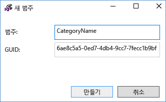
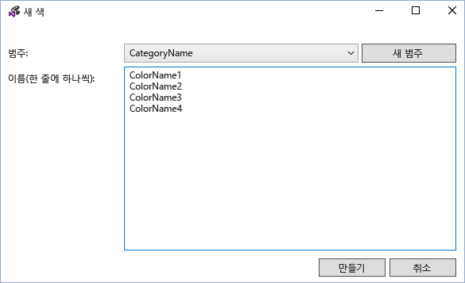
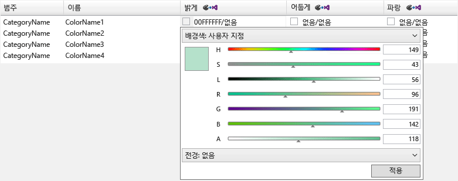
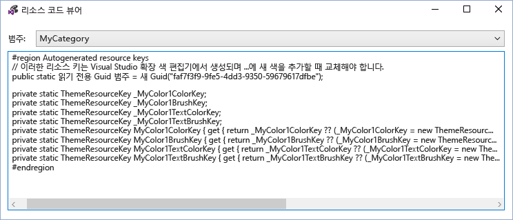

# <a name="vsix-color-editor"></a>VSIX 색 편집기
Visual Studio 확장 색 편집기 도구를 만들고 Visual Studio에 대 한 사용자 지정 색을 편집할 수 있습니다. 또한 도구는 코드에서 색을 사용할 수 있도록 테마 리소스 키를 생성 해야 합니다. 이 도구는 Visual Studio 확장을 지 원하는 테마 설정에 대 한 색을 만드는 데 유용 합니다. 이 도구는.pkgdef 및.xml 파일을 열 수 있습니다. Visual Studio 테마 (.vstheme 파일)를.xml으로 파일 확장명을 변경 하 여 Visual Studio 확장 색 편집기와 사용할 수 있습니다. 또한 현재.xml 파일로.vstheme 파일을 가져올 수 있습니다.  
  
   
  
 **패키지 정의 파일**  
  
 패키지 정의 (.pkgdef) 파일은 테마를 정의 하는 파일입니다. 색 자체가.pkgdef 파일에 컴파일되는 테마 색.xml 파일에 저장 됩니다. .Pkgdef 파일이 Visual Studio 검색 가능한 위치에 배포, 런타임 시 처리 되 고 테마를 정의 하는 병합 있습니다.  
  
 **색 토큰**  
  
 색 토큰은 네 가지 요소로 구성 됩니다.  
  
-   **범주 이름:** 색의 집합에 대 한 논리적 그룹화입니다. 원하는 UI 요소 또는 UI 요소의 그룹에만 적용 되는 색 이미 있는 경우 기존 범주 이름을 사용 합니다.  
  
-   **토큰 이름:** 색 토큰 및 토큰 집합에 대 한 설명이 포함 된 이름입니다. 집합의 모든 상태 뿐만 아니라 배경 및 전경 (텍스트) 토큰 이름을 포함 하 고 이러한 이름을 지정 해야 하는 쌍에 적용 되는 상태를 식별 하는 것이 쉽습니다.  
  
-   **색 값 (또는 색상을 바꿉니다):** 각 색이 지정 된 테마에 필요 합니다. 항상 만들기 배경색과 텍스트 색 값 쌍에서입니다. 색은 텍스트 (전경) 색을 그리는 데 배경색에 대 한 읽을 수 있는 항상에 대 한 배경/전경 쌍을 이룹니다. 이러한 색 연결 되 고 UI에서 함께 사용할 수 있습니다. 텍스트와 함께 사용할 백그라운드 없는 경우에 전경색을 정의 하지 않습니다.  
  
-   **시스템 색 이름:** 고대비 디스플레이에서 사용 하기 위해 합니다.  
  
## <a name="how-to-use-the-tool"></a>이 도구를 사용 하는 방법  
 가능한 한 새로 만드는 대신 기존 Visual Studio 색을 다시 사용 해야 적절 한 경우. 그러나 없는 적절 한 색 정의 되어 있는 경우에 대 한 사용자 지정 색 만들어야 호환 확장 테마를 유지 하 합니다.  
  
 **새 색 토큰 만들기**  
  
 Visual Studio 확장 색 편집기를 사용 하 여 사용자 지정 색을 만들려면 다음이 단계를 수행 합니다.  
  
1.  새 색 토큰에 대 한 범주 및 토큰 이름을 결정 합니다.  
  
2.  고대비 테마 마다 및 시스템 색상에 대 한 UI 요소 사용할 색상을 선택 합니다.  
  
3.  색 편집기 새 색 토큰을 만드는 사용 합니다.  
  
4.  Visual Studio 확장에서 색을 사용 합니다.  
  
5.  Visual Studio에서 변경 내용을 테스트 합니다.  
  
 **1 단계: 새 색 토큰에 대 한 토큰 이름이 및 범주를 확인 합니다.**  
  
 VSColor에 대 한 스키마 기본 명명 **[Category] [UI 유형] [상태]**합니다. 중복 되는 대로 VSColor 이름에 "color" 이라는 단어를 사용 하지 마십시오.  
  
 범주 이름 제공 논리 그룹 및 좁은 최대한으로 정의 해야 합니다. 예를 들어 단일 도구 창의 이름, 범주 이름을 변경할 수 있지만 전체 비즈니스 단위 또는 프로젝트 팀 이름이 아닙니다. 범주에 항목을 그룹화 이름이 같은 색상 사이의 혼동을 방지할 수 있습니다.  
  
 토큰 이름 요소 형식이 된 경우 또는 "상태를" 색을 적용할에 명확 하 게 지정 해야 합니다. 예를 들어,는 현재 데이터 팁의 **[UI type]** 이름을 지정할 수 있습니다 "**DataTip**" 및 **[상태]** 이름을 지정할 수 있습니다 "**활성**,"의 결과 이름을 "**DataTipActive**." 데이터 팁 텍스트 않았으므로 전경색과 배경색을 모두 정의 해야 합니다. 배경/전경 쌍을 사용 하 여 색 편집기에서 자동으로 만듭니다 색 "**DataTipActive**" 배경에 대 한 및 "**DataTipActiveText**" 전경에 대 한 합니다.  
  
 UI의 일부가 된 하나의 상태는 **[상태]** 이름의 일부를 생략할 수 있습니다. 예를 들어, 검색 상자에 테두리가 테두리의 색에 영향을 미치므로 상태 변경 되지 않은 경우 다음 테두리의 색 토큰에 대 한 이름을 간단히 호출할 수 있습니다 "**SearchBoxBorder**."  
  
 몇 가지 일반적인 상태 이름은 다음과 같습니다.  
  
-   활성  
  
-   비활성  
  
-   MouseOver  
  
-   MouseDown  
  
-   선택함  
  
-   포커스 있음  
  
 목록 항목 컨트롤의 일부에 대해 몇 가지 토큰 이름의 예:  
  
-   ListItem  
  
-   ListItemBorder  
  
-   ListItemMouseOver  
  
-   ListItemMouseOverBorder  
  
-   ListItemSelected  
  
-   ListItemSelectedBorder  
  
-   ListItemDisabled  
  
-   ListItemDisabledBorder  
  
 **2 단계: 선택 고대비 테마 마다 및 시스템 색상에 대 한 UI 요소 사용할 색상을 바꿉니다.**  
  
 UI에 대 한 사용자 지정 색을 선택할 때 비슷한 기존 UI 요소를 선택 하 고 기준으로 색을 사용 합니다. 기본에서 UI 요소에 대 한 색 바로잡을 검토 및 테스트, 하므로 적절 한 확인 하 고 모든 테마에서 올바르게 작동 합니다.  
  
 **3 단계: 새 색 토큰을 만드는 색 편집기를 사용 합니다.**  
  
 색 편집기를 시작 하 고 열거나 새 사용자 지정 테마 색.xml 파일을 만듭니다. 선택 **편집 > 새 색** 메뉴에서 합니다. 해당 범주 내의 색 항목에 대 한 하나 이상의 이름 및 범주를 지정 하기 위한 대화 상자를 엽니다.  
  
   
  
 기존 범주를 선택 하거나 선택 **새 범주** 새 범주를 만듭니다. 새 범주 이름을 만드는 또 다른 대화 상자가 열립니다.  
  
   
  
 새 범주를 다음에 사용할 수 있는 **새로운 색** 범주 드롭 다운 메뉴. 범주를 선택한 후 각 새 색 토큰에 대 한 줄당 하나의 이름을 입력 하 고 완료 되 면 "만들기"를 선택 합니다.  
  
   
  
 색 값은 "None" 색 정의 되지 않은 나타내는와 배경/전경 쌍으로 표시 됩니다. 참고: 색을 텍스트 색/배경 색 쌍이 없는 경우 다음 배경만 정의 해야 합니다.  
  
   
  
 색 토큰을 편집 하려면 해당 토큰의 테마 (열)에 대 한 색 항목을 선택 합니다. 8 자리 ARGB 형식에 16 진수 색 값을 입력, 셀에 시스템 색 이름을 입력 하거나 색 슬라이더의 집합 또는 시스템 색 목록을 통해 원하는 색을 선택 하려면 드롭다운 메뉴를 사용 하 여 색 값을 추가 합니다.  
  
   
  
   
  
 텍스트를 표시 하는 필요 하지 않은 구성 요소에 대 한 한 가지 색 으로만 값 입력: 명령 프롬프트 창의 배경색입니다. 그렇지 않으면 슬래시로 구분 된 배경색과 텍스트 색에 대 한 값을 입력 합니다.  
  
 고대비에 대 한 값을 입력할 때 올바른 Windows 시스템 색 이름을 입력 합니다. 하드 코드 된 ARGB 값을 입력 하지 마십시오. 색 값 드롭 다운 메뉴에서 "배경:: 시스템" 또는 "전경:: System"을 선택 하 여 유효한 시스템 색 이름 목록을 볼 수 있습니다. 텍스트 구성 요소를 가진 요소를 만들 때 올바른 배경/텍스트 시스템 색 쌍을 사용 하거나 텍스트를 읽을 수 없습니다.  
  
 만들기, 설정, 및 색 토큰을 편집을 완료 하면 원하는.xml 나.pkgdef 형식으로 저장 합니다. 두 배경의 색 토큰 또는 전경 집합은.xml 형식의 빈 색으로 저장 되지만 삭제.pkgdef 형태로 표시 합니다. 빈 색.pkgdef 파일을 저장 하 려 할 경우 대화 상자 색 손실 하는 경우 경고 나타납니다.  
  
 **4 단계: Visual Studio 확장에서 색을 사용 합니다.**  
  
 새 색을 정의한 후 토큰을 "빌드 동작" "콘텐츠"로 설정 된 프로젝트 파일에는.pkgdef를 포함 및 "VSIX에 포함"이 "True"로 설정  
  
   
  
 Visual Studio 확장 색 편집기에서 파일을 선택 > 사용자 지정에 액세스 하기 위해 사용 되는 코드를 보려면 리소스 코드 보기 WPF 기반 UI에 색을 지정 합니다.  
  
   
  
 프로젝트에는 정적 클래스에이 코드를 포함 합니다. 에 대 한 참조 **Microsoft.VisualStudio.Shell.\< VSVersion >.0.dll** 사용 하려면 프로젝트에 추가 해야 하는 경우는 **ThemeResourceKey** 유형입니다.  
  
```csharp  
namespace MyCustomColors  
{  
    public static class MyCategory  
    {  
        #region Autogenerated resource keys  
        // These resource keys are generated by Visual Studio Extension Color Editor, and should be replaced when new colors are added to this category.  
        public static readonly Guid Category = new Guid("faf7f3f9-9fe5-4dd3-9350-59679617dfbe");  
  
        private static ThemeResourceKey _MyColor1ColorKey;  
        private static ThemeResourceKey _MyColor1BrushKey;  
        private static ThemeResourceKey _MyColor1TextColorKey;  
        private static ThemeResourceKey _MyColor1TextBrushKey;  
        public static ThemeResourceKey MyColor1ColorKey { get { return _MyColor1ColorKey ?? (_MyColor1ColorKey = new ThemeResourceKey(Category, "MyColor1", ThemeResourceKeyType.BackgroundColor)); } }  
        public static ThemeResourceKey MyColor1BrushKey { get { return _MyColor1BrushKey ?? (_MyColor1BrushKey = new ThemeResourceKey(Category, "MyColor1", ThemeResourceKeyType.BackgroundBrush)); } }  
        public static ThemeResourceKey MyColor1TextColorKey { get { return _MyColor1TextColorKey ?? (_MyColor1TextColorKey = new ThemeResourceKey(Category, "MyColor1", ThemeResourceKeyType.ForegroundColor)); } }  
        public static ThemeResourceKey MyColor1TextBrushKey { get { return _MyColor1TextBrushKey ?? (_MyColor1TextBrushKey = new ThemeResourceKey(Category, "MyColor1", ThemeResourceKeyType.ForegroundBrush)); } }  
        #endregion  
    }  
}  
```  
  
 이 XAML 코드의 색상에 대 한 액세스 있으며 UI 테마 변경에 응답할 수 있습니다.  
  
```xaml  
<UserControl x:Class="NewTestProject.TestPackageControl" Name="MyToolWindow"  
             xmlns="http://schemas.microsoft.com/winfx/2006/xaml/presentation"  
             xmlns:x="http://schemas.microsoft.com/winfx/2006/xaml"  
             xmlns:ns="clr-namespace:MyCustomColors">  
  <Grid>  
    <TextBlock Background="{DynamicResource {x:Static ns:MyCategory.MyColor1BrushKey}}"  
               Foreground="{DynamicResource {x:Static ns:MyCategory.MyColor1TextBrushKey}}"  
      >Sample Text</TextBlock>  
  
  </Grid>  
</UserControl>  
```  
  
 **5 단계: Visual Studio에서 변경 내용을 테스트 합니다.**  
  
 일시적으로 색 편집기 확장 패키지를 다시 작성 하지 않고 색에 라이브 변경 내용을 보려면 Visual Studio의 실행 중인 인스턴스를 색 토큰을 적용할 수 있습니다. 이렇게 하려면 각 테마 열의 머리글에 있는 "Visual Studio windows를 실행 하려면이 테마를 적용" 단추를 클릭 합니다. VSIX 색 편집기를 닫을 때이 임시 테마 다른 페이지로 전환 됩니다.  
  
   
  
 변경 내용을 영구적, 다시 작성 한.pkgdef 파일에 새 색을 추가 하 고 해당 색을 사용 하는 코드를 작성 한 후 Visual Studio 확장을 다시 배포 합니다. Visual Studio 확장을 다시 작성은 테마의 나머지 부분에 새 색에 대 한 레지스트리 값을 병합 합니다. 그런 다음 Visual Studio를 다시 시작 하 고 UI를 볼 새 색 예상 대로 나타나는지 확인 합니다.  
  
## <a name="notes"></a>노트  
 이 도구는 기존 Visual Studio 테마에 대 한 또는 사용자 지정 Visual Studio 테마 색 편집을 위해 사용자 지정 색을 만드는 데 사용 하는 데 사용 됩니다. 사용자 지정 전체 Visual Studio 테마를 만들려면 다운로드는 [Visual Studio 색 테마 편집기 확장](http://visualstudiogallery.msdn.microsoft.com/6f4b51b6-5c6b-4a81-9cb5-f2daa560430b) Visual Studio 확장 갤러리에서 합니다.  
  
## <a name="sample-output"></a>샘플 출력  
 **XML 색 출력**  
  
 도구에서 생성 된.xml 파일은 다음과 유사 하 게 됩니다.  
  
```xml  
<Themes>  
  <Theme Name="Light" GUID="{de3dbbcd-f642-433c-8353-8f1df4370aba}">  
    <Category Name="CategoryName" GUID="{eee9d521-dac2-48d9-9a5e-5c625ba2040c}">  
      <Color Name="ColorName1">  
        <Background Type="CT_RAW" Source="FFFFFFFF" />  
      </Color>  
      <Color Name="ColorName2">  
        <Background Type="CT_RAW" Source="FFFFFFFF" />  
        <Foreground Type="CT_RAW" Source="FF000000" />  
      </Color>  
      <Color Name="ColorName3">  
        <Background Type="CT_RAW" Source="FFFF0000" />  
      </Color>  
      <Color Name="ColorName4">  
        <Background Type="CT_RAW" Source="FF000088" />  
        <Foreground Type="CT_RAW" Source="FFFFFFFF" />  
      </Color>  
    </Category>  
  </Theme>  
  <Theme Name="Dark" GUID="{1ded0138-47ce-435e-84ef-9ec1f439b749}">...</Theme>  
  <Theme Name="Blue" GUID="{a4d6a176-b948-4b29-8c66-53c97a1ed7d0}">...</Theme>  
  <Theme Name="HighContrast" GUID="{a5c004b4-2d4b-494e-bf01-45fc492522c7}">...</Theme>  
</Themes>  
  
```  
  
 **PKGDEF 컬러 출력**  
  
 도구에서 생성 되는.pkgdef 파일은 다음과 유사 하 게 됩니다.  
  
```  
[$RootKey$\Themes\{de3dbbcd-f642-433c-8353-8f1df4370aba}\CategoryName]  
"Data"=hex:78,00,00,00,0b,00,00,00,01,00,00,00,21,d5,e9,ee,c2,da,d9,48,9a,5e,5c,62,5b,a2,04,0c,04,00,00,00,0a,00,00,00,43,6f,6c,6f,72,4e,61,6d,65,31,01,ff,ff,ff,ff,00,0a,00,00,00,43,6f,6c,6f,72,4e,61,6d,65,32,01,ff,ff,ff,ff,01,00,00,00,ff,0a,00,00,00,43,6f,6c,6f,72,4e,61,6d,65,33,01,ff,00,00,ff,00,0a,00,00,00,43,6f,6c,6f,72,4e,61,6d,65,34,01,00,00,88,ff,01,ff,ff,ff,ff  
[$RootKey$\Themes\{1ded0138-47ce-435e-84ef-9ec1f439b749}\CategoryName]  
"Data"=hex:...  
[$RootKey$\Themes\{a4d6a176-b948-4b29-8c66-53c97a1ed7d0}\CategoryName]  
"Data"=hex:...  
[$RootKey$\Themes\{a5c004b4-2d4b-494e-bf01-45fc492522c7}\CategoryName]  
"Data"=hex:...  
  
```  
  
 **C# 리소스 키 래퍼**  
  
 도구에서 생성 된 색 리소스 키 다음과 유사 하 게 됩니다.  
  
```csharp  
namespace MyNamespace  
{  
    public static class MyColors  
    {  
        #region Autogenerated resource keys  
        // These resource keys are generated by Visual Studio Extension Color Editor, and should be replaced when new colors are added to this category.  
  
        public static string ColorName1ColorKey { get { return "ColorName1ColorKey"; } }  
        public static string ColorName1BrushKey { get { return "ColorName1BrushKey"; } }  
  
        public static string ColorName2ColorKey { get { return "ColorName2ColorKey"; } }  
        public static string ColorName2BrushKey { get { return "ColorName2BrushKey"; } }  
        public static string ColorName2TextColorKey { get { return "ColorName2TextColorKey"; } }  
        public static string ColorName2TextBrushKey { get { return "ColorName2TextBrushKey"; } }  
  
        public static string ColorName3ColorKey { get { return "ColorName4ColorKey"; } }  
        public static string ColorName3BrushKey { get { return "ColorName4BrushKey"; } }  
        public static string ColorName3TextColorKey { get { return "ColorName4TextColorKey"; } }  
        public static string ColorName3TextBrushKey { get { return "ColorName4TextBrushKey"; } }  
        #endregion  
    }  
}  
```  
  
 **WPF 리소스 사전 래퍼**  
  
 색 **ResourceDictionary** 도구에서 생성 된 키 다음과 유사 하 게 됩니다.  
  
```xaml  
<ResourceDictionary xmlns="http://schemas.microsoft.com/winfx/2006/xaml/presentation"  
        xmlns:x="http://schemas.microsoft.com/winfx/2006/xaml"  
        xmlns:colors="clr-namespace:MyNamespace">  
  
  <SolidColorBrush x:Key="{x:Static colors:MyColors.ColorName1BrushKey}" Color="#FFFFFFFF" />  
  <Color x:Key="{x:Static colors:MyColors.ColorName1ColorKey}" A="255" R="255" G="255" B="255" />  
  
  <SolidColorBrush x:Key="{x:Static colors:MyColors.ColorName2BrushKey}" Color="#FFFFFFFF" />  
  <Color x:Key="{x:Static colors:MyColors.ColorName2ColorKey}" A="255" R="255" G="255" B="255" />  
  <SolidColorBrush x:Key="{x:Static colors:MyColors.ColorName2TextBrushKey}" Color="#FF000000" />  
  <Color x:Key="{x:Static colors:MyColors.ColorName2TextColorKey}" A="255" R="0" G="0" B="0" />  
  
  <SolidColorBrush x:Key="{x:Static colors:MyColors.ColorName3BrushKey}" Color="#FFFF0000" />  
  <Color x:Key="{x:Static colors:MyColors.ColorName3ColorKey}" A="255" R="255" G="0" B="0" />  
  
  <SolidColorBrush x:Key="{x:Static colors:MyColors.ColorName4BrushKey}" Color="#FF000088" />  
  <Color x:Key="{x:Static colors:MyColors.ColorName4ColorKey}" A="255" R="0" G="0" B="136" />  
  <SolidColorBrush x:Key="{x:Static colors:MyColors.ColorName4TextBrushKey}" Color="#FFFFFFFF" />  
  <Color x:Key="{x:Static colors:MyColors.ColorName4TextColorKey}" A="255" R="255" G="255" B="255" />  
</ResourceDictionary>  
```