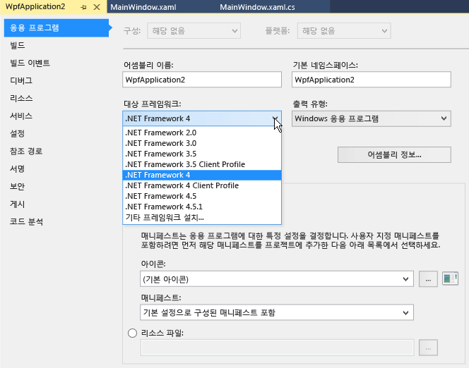

# 방법: 한 버전의 .NET Framework를 대상으로 지정

이 문서에서는 프로젝트를 만들 때 특정 버전의 .NET Framework를 대상으로 지정하는 방법 및 기존 Visual Basic, C# 또는 Visual F# 프로젝트에서 대상 버전을 변경하는 방법에 대해 설명합니다.

> [!IMPORTANT]
> C++ 프로젝트용 대상 버전을 변경하는 방법에 대한 자세한 내용은 [방법: 대상 프레임워크 및 플랫폼 도구 세트 수정](/cpp/build/how-to-modify-the-target-framework-and-platform-toolset)을 참조하세요.

## 프로젝트를 만들 때 버전을 대상으로 지정하려면

프로젝트를 만들 때 사용 가능한 .NET Framework 버전은 설치된 버전과 **새 프로젝트** 대화 상자에서 선택한 템플릿에 따라 달라집니다.

1. 메뉴 모음에서 **파일** > **새로 만들기** > **프로젝트**를 선택합니다.

1. 설치된 템플릿 목록에서 만들려는 프로젝트 형식을 선택하고 프로젝트 이름을 입력합니다.

1. **새 프로젝트** 대화 상자의 맨 아래에 있는 **Framework** 드롭다운 목록에서 프로젝트의 대상으로 지정할 .NET Framework 버전을 선택합니다.

    프레임워크 목록에는 사용자가 선택한 템플릿에 적용 가능한 버전만 표시됩니다. .NET Core와 같은 일부 프로젝트 형식에는 .NET Framework가 필요하지 않습니다. 이러한 경우 **Framework** 드롭다운 목록이 숨겨집니다.

    

1. **확인** 단추를 선택합니다.

## 대상 버전을 변경하려면

이 절차를 수행하여 Visual Basic, C# 또는 Visual F# 프로젝트에서 .NET Framework의 대상 버전을 변경할 수 있습니다.

C++ 프로젝트용 대상 버전을 변경하는 방법에 대한 자세한 내용은 [방법: 대상 프레임워크 및 플랫폼 도구 세트 수정](/cpp/build/how-to-modify-the-target-framework-and-platform-toolset)을 참조하세요.

1. **솔루션 탐색기**에서 변경하려는 프로젝트의 바로 가기 메뉴를 연 후 **속성**을 선택합니다.

    

1. **속성** 창의 왼쪽 열에서 **애플리케이션** 탭을 선택합니다.

    

    > [!NOTE]
    > UWP 앱을 만든 후에는 Windows 또는 .NET Framework의 대상 버전을 변경할 수 없습니다.

1. **대상 프레임워크** 목록에서 원하는 버전을 선택합니다.

1. [확인] 대화 상자가 나타나면 **예** 단추를 선택합니다.

    프로젝트가 언로드됩니다. 다시 로드되면 이 프로젝트는 방금 선택한 .NET Framework 버전을 대상으로 지정합니다.

    > [!NOTE]
    > 코드에 사용자가 대상으로 지정한 것과 다른 버전의 .NET Framework에 대한 참조가 포함된 경우, 코드를 컴파일하거나 실행할 때 오류 메시지가 나타날 수 있습니다. 이러한 오류를 해결하려면 참조를 수정해야 합니다. [.NET Framework 대상 지정 오류 문제 해결](../msbuild/troubleshooting-dotnet-framework-targeting-errors.md)을 참조하세요.

## 참고 항목

- [Visual Studio 멀티 타기팅 개요](../ide/visual-studio-multi-targeting-overview.md)
- [.NET Framework 대상 지정 오류 문제 해결](../msbuild/troubleshooting-dotnet-framework-targeting-errors.md)
- [애플리케이션 페이지, 프로젝트 디자이너(C#)](../ide/reference/application-page-project-designer-csharp.md)
- [애플리케이션 페이지, 프로젝트 디자이너(Visual Basic)](../ide/reference/application-page-project-designer-visual-basic.md)
- [방법: 대상 프레임워크 및 플랫폼 도구 세트 수정(C++)](/cpp/build/how-to-modify-the-target-framework-and-platform-toolset)