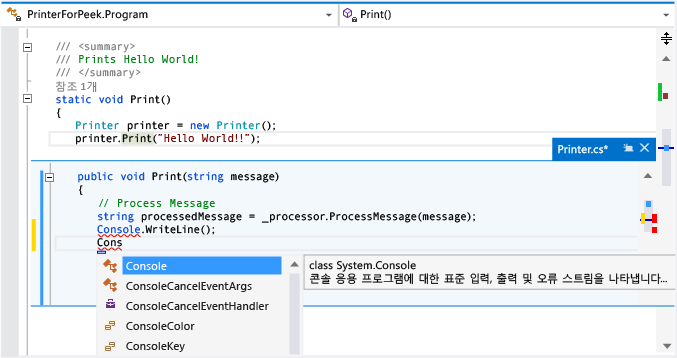

# 방법: 정의 피킹(Peeking)을 사용하여 코드 보기 및 편집(Alt+F12)
**정의 피킹(Peeking)** 명령을 사용하여 작성하고 있는 코드에서 전환하지 않고 코드를 보고 편집할 수 있습니다. **정의 피킹(Peeking)** 및 **정의로 이동**은 같은 정보를 표시하지만 **정의 피킹(Peeking)**은 팝업 창에 표시하고 **정의로 이동**은 별도의 코드 창에 코드를 표시합니다. **정의로 이동**을 사용하면 컨텍스트(즉, 활성 코드 창, 현재 줄 및 커서 위치)를 정의 코드 창으로 전환합니다. **정의 피킹(Peeking)**을 사용하면 정의를 보고 편집하며 정의 파일 내부로 이동하여 원래 코드 파일을 유지할 수 있습니다.  
  
 **정의 피킹(Peeking)**은 C#, Visual Basic 및 C++ 코드에서 사용할 수 있습니다. Visual Basic에서 **정의 피킹(Peeking)**은 정의 메타데이터가 없는 기호에 대한 **개체 브라우저** 링크를 보여 줍니다(예: 기본 제공되는 .NET Framework 형식).  
  
> [!IMPORTANT]
>  이 명령은 Visual Studio 2013 Express 버전에서 사용할 수 없습니다.  
  
## 정의 피킹(Peeking)으로 작업  
  
#### 정의 피킹(Peeking) 창을 열려면  
  
1.  탐색하고 싶은 메서드에 대한 바로 가기 메뉴를 열어 **정의 피킹(Peeking)**을 찾을 수 있습니다. (키보드: Alt+F12)  
  
     이 그림은 `Print()`라는 메서드에 대한 **정의 피킹(Peeking)** 창을 보여 줍니다.  
  
       
  
     정의 창은 원본 파일에서 아래에 표시된 `printer.Print("Hello World!")` 줄로 나타납니다. 창에 기존 파일의 코드를 전부 숨기지 않습니다. `printer.Print("Hello World!")` 호출 뒤에 나오는 줄은 정의 창 아래에 나타납니다.  
  
2.  코드 정의 창에서 여러 위치로 커서를 이동할 수 있습니다. 정의 창 위 또는 아래의 원본 코드 창에서 계속 이동할 수 있습니다.  
  
3.  정의 창에서 문자열을 복사하여 원본 코드에 붙여 넣을 수 있습니다. 정의 창에서 삭제하지 않고도 정의 창에서 원래 코드로 문자열을 끌어서 놓을 수도 있습니다.  
  
4.  Esc 키를 선택하거나 정의 창 탭에서 **닫기** 단추를 선택하여 정의 창을 닫을 수 있습니다.  
  
#### 정의 피킹(Peeking) 창에서 정의 피킹(Peeking) 창을 열려면  
  
-   이미 **정의 피킹(Peeking)** 창이 열려 있는 경우 해당 창에 있는 코드에서 **정의 피킹(Peeking)**을 다시 호출할 수 있습니다. 다른 정의 창이 열립니다. 일련의 breadcrumb 점은 정의 창 사이를 탐색하는 데 사용할 수 있는 정의 창 탭 옆에 나타납니다. 각 점의 도구 설명에는 점이 나타내는 파일 이름 및 정의 파일의 경로가 나와 있습니다.  
  
       
  
#### 여러 결과에서 정의 피킹(Peeking)을 사용하려면  
  
-   둘 이상의 정의가 있는 코드에서 **정의 피킹(Peeking)**을 사용하는 경우(예: 부분 클래스) 결과 목록이 코드 정의 보기 오른쪽에 나타납니다. 목록에서 결과를 선택하여 해당 정의를 표시할 수 있습니다.  
  
       
  
#### 정의 피킹(Peeking) 창 내에서 편집하려면  
  
-   이 **정의 피킹(Peeking)** 창 내에서 편집을 시작하는 경우, 수정하고 있는 파일은 코드 편집기의 별도 탭으로 자동으로 열리고 이미 변경한 내용을 반영합니다. **정의 피킹(Peeking)** 창에서 계속 변경, 실행 취소, 변경 내용 저장을 할 수 있고 탭은 그러한 변경 내용을 계속 반영합니다. 변경 내용을 저장하지 않고 창을 닫더라도 정확히 창에서 중단한 지점에서 탭의 더 많은 내용을 변경, 실행 취소, 저장할 수 있습니다.  
  
       
  
#### 정의 피킹(Peeking)에 대해 키보드 바로 가기를 사용하려면  
  
-   **정의 피킹(Peeking)** 창에 사용할 수 있는 바로 가기 키는 다음과 같습니다.  
  
    |기능|바로 가기 키|  
    |-------------------|-----------------------|  
    |정의 창 열기|Alt+F12|  
    |정의 창 닫기|Esc|  
    |정의 창을 일반 문서 탭으로 승격|Shift+Alt+Home|  
    |정의창 사이 탐색|Ctrl+Alt+- 및 Ctrl+Alt+=|  
    |여러 결과 사이 이동|F8 및 Shift+F8|  
    |코드 편집기 창 또는 정의 창으로 전환|Shift+Esc|  
  
    > [!NOTE]
    >  **정의 피킹(Peeking)** 창에서 코드를 편집하기 위해 Visual Studio의 다른 위치에서 사용할 때와 같은 바로 가기 키를 사용할 수도 있습니다.  
  
## 참고 항목  
 [생산성 팁](../ide/productivity-tips-for-visual-studio.md)
