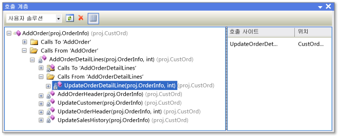

# 호출 계층 구조
[!INCLUDE[vs2017banner](../../code-quality/includes/vs2017banner.md)]

호출 계층 구조를 선택한 메서드, 속성 또는 생성자에서 모든 통화를 표시 하 여 코드를 탐색 하는 데 있습니다.  이 기능을 사용하면 코드 흐름을 보다 잘 이해하고 코드 변경의 영향을 평가할 수 있습니다.  여러 코드 수준을 검사하여 복잡한 메서드 호출 체인 및 코드에 대한 추가 진입점을 보고 가능한 모든 실행 경로를 살펴볼 수 있습니다.  
  
 호출 계층 구조는 디버거에 표시되는 호출 스택과는 달리 디자인 타임에 사용할 수 있습니다.  
  
## 호출 계층 구조 사용  
 **호출 계층 구조** 창을 표시하려면 메서드, 속성 또는 생성자 호출의 이름을 마우스 오른쪽 단추로 클릭하고 **호출 계층 구조 보기**를 클릭합니다.  
  
 **호출 계층 구조** 창의 트리 뷰 창에 멤버 이름이 표시됩니다.  멤버 노드를 확장하면 **호출 대상** *멤버 이름* 및 **호출 소스** *멤버 이름* 하위 노드가 표시됩니다.  다음 그림에서는 이러한 노드가 **호출 계층 구조** 창에 표시된 모습을 보여 줍니다.  
  
   
호출 계층 구조 창  
  
-   **호출 대상** 노드를 확장하면 선택된 멤버를 호출하는 모든 멤버가 표시됩니다.  
  
-   **호출 소스** 노드를 확장하면 선택된 멤버에서 호출되는 모든 멤버가 표시됩니다.  
  
 그런 다음 이러한 각각의 하위 노드 멤버를 **호출 대상** 및 **호출 소스** 노드로 확장할 수 있습니다.  이 기능을 사용하면 다음 그림과 같이 호출자의 스택으로 이동할 수 있습니다.  
  
   
호출 계층 구조 창  
  
 가상 또는 추상으로 정의된 멤버의 경우 **Overrides method name** 노드가 표시됩니다.  인터페이스 멤버의 경우 **Implements method name** 노드가 표시됩니다.  이러한 확장 가능한 노드는 **호출 대상** 및 **호출 소스** 노드와 같은 수준으로 표시됩니다.  
  
 도구 모음의 **검색 범위** 상자에서는 **사용자 솔루션**, **현재 프로젝트** 및 **현재 문서**를 선택할 수 있습니다.  
  
 **호출 계층 구조** 트리 뷰 창에서 자식 멤버를 선택하면 다음과 같은 작업이 수행됩니다.  
  
-   **호출 계층 구조** 세부 정보 창에는 부모 멤버에 있는 코드 줄 중에서 해당 자식 멤버가 호출되는 모든 코드 줄이 표시됩니다.  
  
-   **코드 정의 창**열려 있으면, 선택된 된 구성원에 대 한 코드를 표시 합니다.  이 창은 C\# 및 C\+\+에서 사용할 수 있습니다.  이 창에 대한 자세한 내용은 [코드 구조 보기](../../ide/viewing-the-structure-of-code.md)를 참조하십시오.  
  
> [!NOTE]
>  호출 계층 구조에서는 메서드가 이벤트 처리기로 추가되거나 대리자에 할당되는 위치를 포함하는 메서드 그룹 참조를 찾지 않습니다.  메서드에 대한 참조를 모두 찾으려면 **모든 참조 찾기** 명령을 사용하면 됩니다.  
  
## 바로 가기 메뉴 항목  
 다음 표에서는 트리 뷰 창에서 노드를 마우스 오른쪽 단추로 클릭할 때 사용할 수 있는 여러 가지 바로 가기 메뉴 옵션에 대해 설명합니다.  
  
|상황에 맞는 메뉴 항목|설명|  
|------------------|--------|  
|**새 루트로 추가**|선택된 노드를 트리 뷰 창에 새 루트 노드로 추가합니다.  이렇게 하면 특정 하위 트리에 집중할 수 있습니다.|  
|**루트 제거**|트리 뷰 창에서 선택한 루트 노드를 제거합니다.  이 옵션은 루트 노드에서만 사용할 수 있습니다.   **루트 제거** 도구 모음 단추를 사용하여 선택한 루트 노드를 제거할 수도 있습니다.|  
|**정의로 이동**|선택한 노드에서 정의로 이동 명령을 실행합니다.  이 명령은 멤버 호출 또는 변수 정의에 대한 원래 정의를 탐색합니다.   정의로 이동 명령을 실행하려면 선택한 노드를 두 번 클릭하거나 선택한 노드에서 F12 키를 눌러도 됩니다.|  
|**모든 참조 찾기**|선택한 노드에서 모든 참조 찾기 명령을 실행합니다.  이 명령은 프로젝트에서 클래스나 멤버를 참조하는 모든 코드 줄을 찾습니다.   Shift\+F12를 사용하여 선택한 노드에서 모든 참조 찾기 명령을 실행할 수도 있습니다.|  
|**복사**|선택한 노드\(하위 노드 제외\)의 내용을 복사합니다.|  
|**새로 고침**|선택한 노드를 축소하며 다시 확장하면 현재 정보가 표시됩니다.|