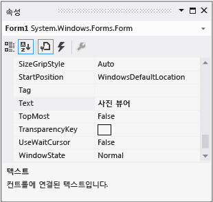

# 3단계: 폼 속성 설정
이제 **속성** 창을 사용하여 폼의 모양을 변경합니다.  
  
 이 항목의 비디오 버전을 보려면 [Tutorial 1: Create a picture viewer in Visual Basic - Video 1](http://go.microsoft.com/fwlink/?LinkId=205209)(자습서 1: Visual Basic에서 사진 뷰어 만들기 - 비디오 1) 또는 [Tutorial 1: Create a picture viewer in C# - Video 1](http://go.microsoft.com/fwlink/?LinkId=205199)(자습서 1: C#에서 사진 뷰어 만들기 - 비디오 1)을 참조하세요. 이러한 비디오에서는 이전 버전의 Visual Studio를 사용하므로 일부 메뉴 명령과 기타 사용자 인터페이스 요소가 약간 다를 수 있습니다. 그러나 개념 및 절차는 Visual Studio의 현재 버전에서 비슷하게 작동합니다.  
  
## 폼 속성을 설정하려면  
  
1.  **Windows Forms 디자이너**가 열려 있는지 확인합니다. Visual Studio IDE(통합 개발 환경)에서 **Form1.cs[디자인]** 탭(또는 Visual Basic의 **Form1.vb[디자인]** 탭)을 선택합니다.  
  
2.  **Form1** 폼 내부의 아무 곳이나 선택하여 해당 폼을 선택합니다. **속성** 창에 선택한 폼의 속성이 표시됩니다. 폼에는 다양한 속성이 있습니다. 예를 들어 전경색, 배경색, 폼의 맨 위에 표시되는 제목 텍스트 및 기타 속성을 설정할 수 있습니다.  

    > [!NOTE]
    >  **속성** 창이 나타나지 않으면 도구 모음에서 사각형 **디버깅 중지** 단추를 선택하여 프로그램을 중지하거나 창을 닫습니다. 프로그램이 중지되었는데도 **속성** 창이 나타나지 않는 경우 메뉴 모음에서 **보기** > **속성 창**을 차례로 선택합니다.  
  
3.  폼을 선택한 후 **속성** 창에서 **텍스트** 속성을 찾습니다. 목록을 정렬 방법에 따라 아래로 스크롤해야 할 수도 있습니다. **텍스트**를 선택하고 **사진 뷰어**를 입력한 다음, **Enter** 키를 선택합니다.  이제 폼의 제목 표시줄에 **사진 뷰어**라는 텍스트가 표시되고 **속성** 창이 다음 그림과 같이 표시됩니다.  
  
       
**속성** 창  
  
    > [!NOTE]
    >  속성은 **항목별** 뷰 또는 **사전순** 뷰로 정렬할 수 있는데, **속성** 창에 있는 단추를 사용하면 이러한 두 뷰 간에 전환할 수 있습니다. 이 자습서에서는 **사전순** 뷰에서 속성을 더 쉽게 찾을 수 있습니다.  
  
4.  **Windows Forms 디자이너**로 돌아갑니다. 폼의 오른쪽 아래에 있는 흰색의 작은 사각형인 끌기 핸들을 선택합니다. 끌기 핸들은 다음과 같이 생겼습니다.  
  
       
끌기 핸들  

     핸들을 끌어 폼의 너비와 높이를 늘립니다.  
  
5.  **속성** 창을 살펴보면 **크기** 속성이 변경되었음을 알 수 있습니다. **크기** 속성은 폼의 크기를 조정할 때마다 변경됩니다. 폼의 핸들을 끌어 폼의 크기를 이 프로젝트에 적합한 크기인 약 **550, 350**(정확할 필요는 없음)으로 조정합니다. 또는 **크기** 속성에 값을 직접 입력한 다음, **Enter** 키를 선택할 수도 있습니다.  
  
6.  프로그램을 다시 실행합니다. 프로그램을 실행하려면 다음 방법 중 하나를 사용할 수 있습니다.  

    -   **F5** 키를 선택합니다.  
  
    -   메뉴 모음에서 **디버그** > **디버깅 시작**을 차례로 선택합니다.  
  
    -   도구 모음에서 **디버깅 시작** 단추를 선택하면 다음과 같이 표시됩니다.  

           
**디버깅 시작** 도구 모음 단추  
  
     이전과 마찬가지로 IDE에 의해 프로그램이 빌드되고 실행되며 창이 나타납니다.  

7.  다음 단계로 이동하기 전에 프로그램을 중지합니다. 이는 IDE가 프로그램이 실행 중일 때 프로그램을 변경하는 것을 허용하지 않기 때문입니다. 프로그램을 중지하려면 다음 방법 중 하나를 사용할 수 있습니다.  

    -   도구 모음에서 **디버깅 중지** 단추를 선택합니다.  
  
    -   메뉴 모음에서 **디버그** > **디버깅 중지**를 차례로 선택합니다.  
  
    -   **Form1** 창의 위쪽 모퉁이에 있는 **X** 단추를 선택합니다.  
  
## 계속하거나 검토하려면  
  
-   다음 자습서 단계로 이동하려면 [4단계: TableLayoutPanel 컨트롤을 사용하여 폼 레이아웃](../ide/step-4-lay-out-your-form-with-a-tablelayoutpanel-control.md)을 참조하세요.  
  
-   이전 자습서 단계로 돌아가려면 [2단계: 프로그램 실행](../ide/step-2-run-your-program.md)을 참조하세요.
