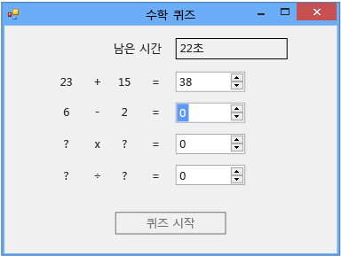

# 6단계: 빼기 문제 추가
[!INCLUDE[vs2017banner](../code-quality/includes/vs2017banner.md)]

이 자습서의 6단계에서는 빼기 문제를 추가하고 다음 작업을 수행하는 방법을 알아봅니다.  
  
-   빼기 값을 저장합니다.  
  
-   문제를 위한 난수를 생성합니다. 답은 0에서 100 사이여야 합니다.  
  
-   답을 확인하는 메서드를 업데이트하여 새로 추가한 빼기 문제도 확인하도록 합니다.  
  
-   시간이 다 되면 자동으로 올바른 답을 채우도록 타이머의 Tick 이벤트 처리기를 업데이트합니다.  
  
### 빼기 문제를 추가하려면  
  
1.  빼기 문제의 두 정수 변수를 폼에 추가합니다. 더하기 문제의 정수 변수와 타이머 사이에 추가하면 됩니다.  이 코드는 다음과 같습니다.  
  
     [!code-vb[VbExpressTutorial3Step5_6#12](../ide/codesnippet/VisualBasic/step-6-add-a-subtraction-problem_1.vb)]
     [!code-cs[VbExpressTutorial3Step5_6#12](../ide/codesnippet/CSharp/step-6-add-a-subtraction-problem_1.cs)]  
  
     새 정수 변수의 이름인 **minuend**와 **subtrahend**는 프로그래밍 용어가 아닙니다.  이러한 이름은 뺌수\(subtrahend\)와 빼임수\(minuend\)를 산술 형식으로 표현한 일반적인 이름입니다.  차는 피감수에서 감수를 뺀 값입니다.  프로그램에서 변수, 컨트롤, 구성 요소 또는 메서드에 특정 이름을 사용하도록 요구하지 않기 때문에 다른 이름을 사용할 수도 있습니다.  이름을 숫자로 시작하면 안 된다는 것과 같은 몇 가지 규칙이 있지만 일반적으로 x1, x2, x3, x4 등과 같은 이름을 사용할 수 있습니다.  그러나 이 경우 코드를 읽기 어렵고 문제를 추적하기가 거의 불가능할 수 있습니다.  변수 이름을 고유하고 알아보기 쉽게 만들기 위해 이 자습서의 뒷부분에서는 곱하기\(multiplicand × multiplier \= product\)와 나누기\(dividend ÷ divisor \= quotient\)에 일반적인 이름을 사용합니다.  
  
     다음으로 빼기 문제에 대해 난수 값을 제공하도록 `StartTheQuiz()` 메서드를 수정합니다.  
  
2.  "Fill in the subtraction problem" 주석 뒤에 다음 코드를 추가합니다.  
  
     [!code-vb[VbExpressTutorial3Step5_6#13](../ide/codesnippet/VisualBasic/step-6-add-a-subtraction-problem_2.vb)]
     [!code-cs[VbExpressTutorial3Step5_6#13](../ide/codesnippet/CSharp/step-6-add-a-subtraction-problem_2.cs)]  
  
     빼기 문제에 대해 음수 답이 나오지 않도록 하기 위해 이 코드에서는 `Random` 클래스의 `Next()` 메서드를 더하기 문제와는 약간 다른 방식으로 사용합니다.  `Next()` 메서드에 두 개의 값을 제공하면 첫 번째 값보다는 크거나 같고 두 번째 값보다는 작은 난수가 선택됩니다.  다음 코드에서는 1에서 100 사이의 난수를 선택하여 minuend 변수에 저장합니다.  
  
     [!code-vb[VbExpressTutorial3Step5_6#21](../ide/codesnippet/VisualBasic/step-6-add-a-subtraction-problem_3.vb)]
     [!code-cs[VbExpressTutorial3Step5_6#21](../ide/codesnippet/CSharp/step-6-add-a-subtraction-problem_3.cs)]  
  
     이 자습서의 앞부분에서 "randomizer"로 이름을 지정한 `Random` 클래스의 `Next()` 메서드를 여러 가지 방법으로 호출할 수 있습니다.  여러 가지 방법으로 호출할 수 있는 메서드를 오버로드된 메서드라고 하며, IntelliSense를 사용하여 이를 탐색해 볼 수 있습니다.  `Next()` 메서드에 대한 IntelliSense 창의 도구 설명을 다시 살펴봅니다.  
  
       
Intellisense 창 도구 설명  
  
     도구 설명에 **\(\+2개 오버로드\)**가 표시되며, 이는 `Next()` 메서드를 두 가지 다른 방법으로 호출할 수 있음을 나타냅니다.  오버로드에는 저마다 다른 개수와 형식의 인수가 포함되어 있으므로 작동 방식도 서로 조금씩 다릅니다.  예를 들어 메서드는 단일 정수 인수를 사용하지만 메서드 오버로드 중 하나는 정수 하나와 문자열 하나를 사용할 수 있습니다.  수행하려는 작업을 기반으로 올바른 오버로드를 선택합니다.  `StartTheQuiz()` 메서드에 코드를 추가할 때 `randomizer.Next(`를 입력하는 즉시 Intellisense 창에 추가 정보가 나타납니다.  다음 그림과 같이 위쪽 화살표 키와 아래쪽 화살표 키를 선택하여 오버로드를 순환할 수 있습니다.  
  
       
IntelliSense에 표시된 Next\(\) 메서드의 오버로드  
  
     이 경우 최소값 및 최대값을 지정할 수 있도록 마지막 오버로드를 선택하는 것이 좋습니다.  
  
3.  올바른 빼기 답을 확인하도록 `CheckTheAnswer()` 메서드를 수정합니다.  
  
     [!code-vb[VbExpressTutorial3Step5_6#14](../ide/codesnippet/VisualBasic/step-6-add-a-subtraction-problem_4.vb)]
     [!code-cs[VbExpressTutorial3Step5_6#14](../ide/codesnippet/CSharp/step-6-add-a-subtraction-problem_4.cs)]  
  
     Visual C\#에서 `&&`는 `logical and` 연산자입니다.  Visual Basic에서 이에 해당하는 연산자는 `AndAlso`입니다.  이러한 연산자는 "addend1과 addend2를 더한 값이 sum NumericUpDown 값과 같고 minuend에서 subtrahend를 뺀 값이 difference NumericUpDown의 값과 같은 경우"라는 것을 나타냅니다. 즉, `CheckTheAnswer()` 메서드는 더하기 문제와 빼기 문제의 답이 모두 올바른 경우에만 `true`를 반환합니다.  
  
4.  시간이 다 되면 올바른 답이 채워지도록 타이머의 Tick 이벤트 처리기 마지막 부분을 다음 코드로 바꿉니다.  
  
     [!code-vb[VbExpressTutorial3Step5_6#22](../ide/codesnippet/VisualBasic/step-6-add-a-subtraction-problem_5.vb)]
     [!code-cs[VbExpressTutorial3Step5_6#22](../ide/codesnippet/CSharp/step-6-add-a-subtraction-problem_5.cs)]  
  
5.  코드를 저장하고 실행합니다.  
  
     다음 그림과 같이 프로그램에 빼기 문제가 포함되었습니다.  
  
       
빼기 문제가 있는 수학 퀴즈  
  
### 계속하거나 검토하려면  
  
-   다음 자습서 단계로 이동하려면 [7단계: 곱하기 및 나누기 문제 추가](../ide/step-7-add-multiplication-and-division-problems.md)를 참조하십시오.  
  
-   이전 자습서 단계로 돌아가려면 [5단계: NumericUpDown 컨트롤에 대한 Enter 이벤트 처리기 추가](../ide/step-5-add-enter-event-handlers-for-the-numericupdown-controls.md)를 참조하십시오.