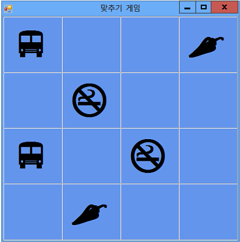

# 자습서 3: 일치 게임 만들기
이 자습서에서는 플레이어가 숨겨진 아이콘의 쌍을 찾는 일치 게임을 빌드합니다. 여기에서는 다음과 같은 작업을 수행하는 방법에 대해 배우게 됩니다.  

-   아이콘과 같은 개체를 <xref:System.Collections.Generic.List%601> 개체에 저장합니다.  

-   Visual C#의 `foreach` 루프 또는 Visual Basic의 `For Each` 루프를 사용하여 목록의 개체를 반복합니다.  

-   참조 변수를 사용하여 폼 상태를 추적합니다.  

-   여러 개체에 사용할 수 있는 이벤트에 응답하는 이벤트 처리기를 빌드합니다.  

-   시작된 후 카운트다운을 실시하고 단 한 번만 이벤트를 발생시키는 타이머를 만듭니다.  

 이 자습서를 마치면 다음 그림과 같은 프로그램이 만들어집니다.  

   
이 자습서에서 만드는 게임  

## 자습서 링크

 샘플의 전체 버전을 다운로드하려면 [Complete matching game tutorial sample](http://code.msdn.microsoft.com/Complete-Matching-Game-4cffddba)(전체 일치 게임 자습서 샘플)을 참조하세요.  

> [!NOTE]
>  이 자습서에는 Visual C#과 Visual Basic이 둘 다 설명되어 있으므로 사용 중인 프로그래밍 언어와 관련된 정보를 참조하세요.  

 어려운 점이 있거나 프로그래밍 관련 질문이 있는 경우 MSDN 포럼에 질문을 게시해 보세요. [Visual Basic 포럼](http://social.msdn.microsoft.com/Forums/home?forum=vbgeneral) 및 [Visual C# 포럼](http://social.msdn.microsoft.com/Forums/home?forum=csharpgeneral)을 참조하세요. 또한 훌륭한 비디오 학습 자료가 무료로 제공됩니다. Visual Basic의 프로그래밍에 대한 자세한 내용은 [Visual Basic fundamentals: Development for absolute beginners](http://channel9.msdn.com/Series/Visual-Basic-Development-for-Absolute-Beginners)(Visual Basic 기초: 완전 초보자를 위한 개발)를 참조하세요. Visual C#의 프로그래밍에 대한 자세한 내용은 [C# fundamentals: Development for absolute beginners](http://channel9.msdn.com/Series/C-Sharp-Fundamentals-Development-for-Absolute-Beginners)(C# 기초: 완전 초보자를 위한 개발)를 참조하세요.  

## 관련 항목  

|제목|설명|  
|-----------|-----------------|  
|[1단계: 프로젝트 만들기 및 폼에 테이블 추가](../ide/step-1-create-a-project-and-add-a-table-to-your-form.md)|먼저 프로젝트를 만들고 `TableLayoutPanel` 컨트롤을 추가하여 컨트롤을 올바르게 정렬된 상태로 유지합니다.|  
|[2단계: 임의의 개체 및 아이콘 목록 추가](../ide/step-2-add-a-random-object-and-a-list-of-icons.md)|`Random` 및 `List` 개체를 추가하여 아이콘 목록을 만듭니다.|  
|[3단계: 각 레이블에 임의 아이콘 할당](../ide/step-3-assign-a-random-icon-to-each-label.md)|`Label` 컨트롤에 임의로 아이콘을 할당하여 매 게임마다 달라지도록 합니다.|  
|[4단계: 각 레이블에 클릭 이벤트 처리기 추가](../ide/step-4-add-a-click-event-handler-to-each-label.md)|클릭된 레이블의 색을 변경하는 `Click` 이벤트 처리기를 추가합니다.|  
|[5단계: 레이블 참조 추가](../ide/step-5-add-label-references.md)|어떤 레이블이 클릭되었는지 추적하기 위해 참조 변수를 추가합니다.|  
|[6단계: 타이머 추가](../ide/step-6-add-a-timer.md)|게임이 경과된 시간을 추적하는 타이머를 폼에 추가합니다.|  
|[7단계: 쌍 표시](../ide/step-7-keep-pairs-visible.md)|일치하는 쌍이 선택되면 해당 아이콘 쌍을 표시합니다.|  
|[8단계: 게임 플레이어가 이겼는지 여부를 확인하는 메서드 추가](../ide/step-8-add-a-method-to-verify-whether-the-player-won.md)|플레이어가 게임에 이겼는지 여부를 확인하기 위해 `CheckForWinner()` 메서드를 추가합니다.|  
|[9단계: 기타 기능 사용](../ide/step-9-try-other-features.md)|아이콘과 색을 변경하고 모눈과 소리를 추가하는 등 다른 기능을 테스트해 봅니다. 보드를 크게 하거나 타이머를 조정해 볼 수 있습니다.|
