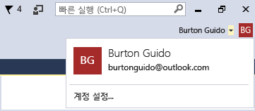

# Work with multiple user accounts

여러 Microsoft 계정 및/또는 회사나 학교 계정이 있는 경우 별도로 로그인하지 않고도 모든 계정에서 리소스에 액세스할 수 있도록 모든 계정을 Visual Studio에 추가할 수 있습니다. Azure, Application Insights, Azure DevOps 및 Office 365 서비스는 모두 간소화된 로그인 환경을 지원합니다.

한 대의 머신에서 여러 계정을 추가한 후 다른 머신에서 Visual Studio에 로그인하면 해당 계정 집합이 사용자와 함께 로밍됩니다.

> [!NOTE]
> 계정 이름은 로밍되지만 자격 증명은 그렇지 않습니다. 새 머신에서 처음으로 해당 리소스를 사용하려고 할 경우 다른 계정에 대한 자격 증명을 입력하라는 메시지가 표시됩니다.

이 문서에서는 Visual Studio에 여러 계정을 추가하는 방법을 보여줍니다. 또한 **연결된 서비스 추가** 대화 상자, **서버 탐색기** 및 **팀 탐색기**와 같은 위치에 해당 계정에서 액세스할 수 있는 리소스를 확인하는 방법을 보여줍니다.

## Visual Studio에 로그인

Microsoft 계정 또는 조직 계정으로 Visual Studio에 로그인합니다. 다음과 같이 창의 위쪽 모서리에 사용자 이름이 나타나야 합니다.

### 서버 탐색기에서 Azure 계정 액세스

**Ctrl**+**Alt**+**S**를 눌러 **서버 탐색기**를 엽니다. **Azure** 아이콘을 확장하고 Visual Studio에 로그인할 때 사용한 계정과 연결된 Azure 계정에서 사용할 수 있는 리소스가 포함되어 있습니다. 다음 이미지와 비슷하게 나타납니다.

특정 디바이스에서 Visual Studio를 처음 사용할 경우 로그인 대화 상자에 로그인한 계정 아래에 등록된 구독만 표시됩니다. **Azure** 노드를 마우스 오른쪽 단추로 클릭하고 **구독 관리 및 필터링**을 선택한 다음, 계정 선택 컨트롤에서 계정을 추가하여 다른 계정에 대한 리소스를 **서버 탐색기**에서 직접 액세스할 수 있습니다. 원할 경우 아래쪽 화살표를 클릭하고 계정 목록 중에서 선택하여 다른 계정을 선택할 수 있습니다. 계정을 선택한 후 해당 계정 아래에서 **서버 탐색기**에 표시할 구독을 사용자 지정할 수 있습니다.

다음번에 **서버 탐색기**를 열면 해당 구독에 대한 리소스가 표시됩니다.

### 연결된 서비스 추가 대화 상자를 통해 Azure 계정 액세스

1. 기존 프로젝트를 열거나 새 프로젝트를 만듭니다.

1. **솔루션 탐색기**에서 프로젝트 노드를 선택한 다음, 오른쪽 단추로 클릭하고 **추가** > **연결된 서비스**를 선택합니다.

   **연결된 서비스 추가** 마법사가 나타나고 Visual Studio 개인 설정 계정과 연결된 Azure 계정의 서비스 목록이 표시됩니다. 별도로 Azure에 로그인할 필요가 없습니다. 그렇지만 다른 머신에서 처음으로 해당 리소스에 액세스하려고 할 경우 다른 계정으로 로그인해야 합니다.

### 웹 프로젝트에서 Azure Active Directory 액세스

AAD(Azure Active Directory)는 ASP.NET MVC 웹앱에서의 최종 사용자 Single Sign-In 또는 웹 API 서비스에서의 AD 인증을 지원합니다. 도메인 인증은 개별 사용자 계정 인증과 다릅니다. Active Directory 도메인에 액세스할 수 있는 사용자는 기존 AAD 계정을 사용하여 웹 애플리케이션에 연결할 수 있습니다. Office 365 앱은 도메인 인증도 사용할 수 있습니다.

이 작업을 보려면 새 **ASP.NET 웹 애플리케이션** 프로젝트를 만듭니다. **새 ASP.NET 프로젝트** 대화 상자에서 **인증 변경**을 선택합니다. 인증 마법사가 나타나고 애플리케이션에서 사용할 인증 종류를 선택할 수 있습니다.

ASP.NET의 다양한 종류의 인증에 대한 자세한 내용은 [Visual Studio에서 ASP.NET 웹 프로젝트 만들기](/aspnet/visual-studio/overview/2013/creating-web-projects-in-visual-studio#authentication-methods)를 참조하세요.

### Azure DevOps 조직에 액세스

기본 메뉴에서 **팀** > **연결 관리**를 선택하여 **팀 탐색기 - 연결** 창을 엽니다. **연결 관리** > **프로젝트에 연결**을 선택합니다. **프로젝트에 연결** 대화 상자의 프로젝트 목록에서 프로젝트를 선택합니다(또는 **TFS 서버 추가**를 선택하고 서버에 대한 URL을 입력). URL을 선택하면 자격 증명을 다시 입력하지 않고도 로그인할 수 있습니다.

자세한 내용은 [팀 탐색기의 프로젝트에 연결](connect-team-project.md)을 참조하세요.

## Visual Studio에 추가 계정 추가

Visual Studio에 추가 계정을 추가하려면:

1. **파일** > **계정 설정**을 선택합니다.

1. **모든 계정** 아래에서 **계정 추가**를 선택합니다.

1. **계정에 로그인** 페이지에서 계정을 선택하거나 **다른 계정 사용**을 선택합니다. 표시되는 메시지에 따라 새 계정 자격 증명을 입력합니다.

(선택 사항) 이제 **서버 탐색기**로 이동하여 방금 추가한 계정과 연결된 Azure 서비스를 확인합니다. **서버 탐색기**에서 **Azure** 노드를 마우스 오른쪽 단추로 클릭하고 **구독 관리 및 필터링**을 선택합니다. 현재 계정 옆에 있는 드롭다운 화살표를 클릭하여 새 계정을 선택하고 **서버 탐색기**에서 표시할 구독을 선택합니다. 지정된 구독과 연결된 모든 서비스가 표시되어야 합니다. 현재 두 번째 계정을 사용하여 Visual Studio에 로그인하지 않더라도 해당 계정의 서비스 및 리소스에 로그인됩니다. **프로젝트** > **연결된 서비스 추가** 및 **팀** > **Team Foundation Server에 연결**의 경우에도 마찬가지입니다.

### 디바이스 코드 흐름을 사용하여 계정 추가

일부 경우에는 로그인하거나 계정을 일반적인 방식으로 추가할 수 없습니다. 이 문제는 Internet Explorer가 어떤 이유로 차단되었거나 네트워크가 방화벽 뒤에 있는 경우에 발생할 수 있습니다. 이 문제를 해결하려면 *디바이스 코드 흐름*을 사용하여 계정을 추가하거나 계정을 다시 인증합니다. 디바이스 코드 흐름을 통해 다른 브라우저나 다른 머신&mdash;물리적이거나 가상(VM)을 사용하여 로그인할 수 있습니다.

디바이스 코드 흐름을 사용하여 로그인하려면:

1. **도구** > **옵션** > **환경** 아래의 [**계정**](reference/accounts-environment-options-dialog-box.md) 페이지를 연 다음, **계정 추가 또는 재인증 시 디바이스 코드 흐름 사용**을 선택합니다. **확인**을 선택하여 옵션 페이지를 닫습니다.

1. **파일** > **계정 설정**을 선택하여 계정 관리 페이지를 엽니다.

1. **모든 계정** 아래에서 **계정 추가**를 선택합니다.

   대화 상자에는 웹 브라우저에 붙여넣을 URL과 코드가 표시됩니다.

   

1. **Ctrl**+**C**를 눌러 대화 상자의 텍스트를 복사한 다음, **확인**을 선택하여 대화 상자를 닫습니다. 복사한 텍스트를 메모장과 같은 텍스트 편집기에 붙여넣습니다. 이렇게 하면 다음 단계에서 코드를 더 쉽게 복사할 수 있습니다.

1. Visual Studio에 로그인하는 데 사용할 머신 또는 웹 브라우저에서 디바이스 로그인 URL로 이동한 다음, 복사한 코드를 **코드**라는 상자에 붙여넣거나 입력합니다.

   **Visual Studio** 앱 이름이 페이지 아래쪽에 나타나야 합니다.

1. **Visual Studio** 아래에서 **계속**을 선택합니다.

   

1. 프롬프트에 따라 계정 자격 증명을 입력합니다.

   디바이스에서 Visual Studio에 로그인했으며 브라우저 창을 닫을 수 있음을 알리는 페이지가 나타납니다.

   

1. Visual Studio의 계정 페이지로 돌아가면 새로 추가된 계정이 **모든 계정** 아래에 나열됩니다. **닫기**를 선택합니다.

## 참고 항목

- [Visual Studio에 로그인](signing-in-to-visual-studio.md)
- [Mac용 Visual Studio에 로그인](/visualstudio/mac/signing-in)
