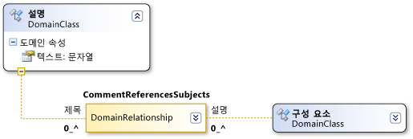

# 도메인 경로 구문
[!INCLUDE[vs2017banner](../code-quality/includes/vs2017banner.md)]

DSL 정의는 XPath 유형 구문을 사용하여 모델에서 특정 요소를 찾습니다.  
  
 일반적으로는 이 구문을 직접 사용할 필요가 없습니다.  DSL 정보 또는 속성 창에서 이 구문이 표시되면 아래쪽 화살표를 클릭하고 경로 편집기를 사용할 수 있습니다.  그러나 경로는 편집기를 사용하고 나면 이 폼의 필드에 표시됩니다.  
  
 도메인 경로의 형식은 다음과 같습니다.  
  
 *RelationshipName.PropertyName\/\!Role*  
  
   
  
 구문은 모델 트리를 트래버스합니다.  예를 들어 위 그림의 CommentReferencesSubjects 도메인 관계에는 Subjects 역할이 있습니다.  경로 세그먼트 \/\!Subjectt는 Subjects 역할을 통해 액세스하는 요소에서 경로가 종료되도록 지정합니다.  
  
 각 세그먼트는 도메인 관계의 이름으로 시작됩니다.  요소에서 관계로 트래버스하는 경우 경로 세그먼트는 *Relationship.PropertyName*으로 표시됩니다.  링크에서 요소로의 홉에서는 경로 세그먼트가 *Relationship\/\!RoleName*으로 표시됩니다.  
  
 경로 구문은 슬래시로 구분됩니다.  각 경로 세그먼트는 요소에서 링크\(관계 인스턴스\) 또는 링크에서 요소로의 홉입니다.  경로 세그먼트는 쌍으로 나타나는 경우가 많습니다.  이 쌍의 경로 세그먼트 하나는 요소에서 링크로의 홉을 나타내고 다음 세그먼트는 링크에서 반대쪽 요소로의 홉을 나타냅니다.  모든 링크는 관계 자체의 소스나 대상일 수도 있습니다.  
  
 요소에서 링크로의 홉에 사용하는 이름은 역할의 `Property Name` 값입니다.  링크에서 요소로의 홉에 사용하는 이름은 대상 역할 이름입니다.  
  
## 참고 항목  
 [모델, 클래스 및 관계 이해](../modeling/understanding-models-classes-and-relationships.md)