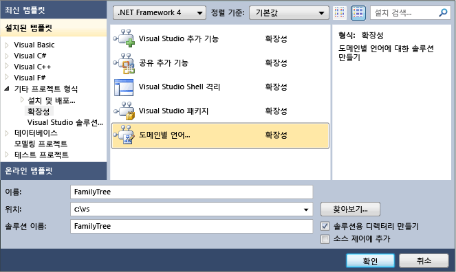

# 방법: 도메인별 언어 솔루션 만들기
도메인 특정 언어 DSL ()는 특수화 된를 사용 하 여 만들어집니다. [!INCLUDE[vsprvs](../code-quality/includes/vsprvs_md.md)] 솔루션입니다.  
  
## 필수 구성 요소  
 이 절차를 시작 하려면 먼저 이러한 구성 요소를 먼저 설치 해야 합니다.  
  
|||  
|-|-|  
|[!INCLUDE[vsprvs](../code-quality/includes/vsprvs_md.md)]|[http://go.microsoft.com/fwlink/?LinkID=185579](http://go.microsoft.com/fwlink/?LinkID=185579)|  
|[!INCLUDE[vssdk_current_short](../modeling/includes/vssdk_current_short_md.md)]|[http://go.microsoft.com/fwlink/?LinkID=185580](http://go.microsoft.com/fwlink/?LinkID=185580)|  
|Visual Studio Visualization and Modeling SDK||  

[!INCLUDE[modeling_sdk_info](includes/modeling_sdk_info.md)]

  
## 도메인 특정 언어 솔루션 만들기  
  
#### 도메인 특정 언어 솔루션을 만들려면  
  
1.  DSL 마법사를 시작 합니다.  
  
    1.  **파일** 메뉴에서 **새로 만들기**를 가리킨 다음 **프로젝트**를 클릭합니다.  
  
    2.  **새 프로젝트** 대화 상자가 나타납니다.  
  
    3.  **프로젝트 형식**를 확장 하 고는 **기타 프로젝트 형식** 노드를 마우스 클릭 **확장성**합니다.  
  
    4.  클릭 **도메인 특정 언어 디자이너**합니다.  
  
    5.  에 **이름** 상자는 솔루션에 대 한 이름을 입력 합니다. **확인**을 클릭합니다.  
  
         **도메인 특정 언어 디자이너 마법사** 나타납니다.  
  
        > [!NOTE]
        >  문구를 입력 하는 이름은 코드 생성에 사용할 수 있으므로는 유효한 Visual C# 식별자를 해야 합니다.  
  
       
  
2.  DSL 템플릿을 선택 합니다.  
  
     에 **도메인 특정 언어 옵션 선택** 페이지와 같은 솔루션 템플릿 중 하나를 선택 합니다 **최소 언어**합니다. 만들려는 DSL 비슷한 템플릿을 선택 합니다.  
  
     솔루션 템플릿에 대 한 자세한 내용은 참조 하십시오. [도메인별 언어 솔루션 템플릿을 선택](../modeling/choosing-a-domain-specific-language-solution-template.md)합니다.  
  
3.  파일 이름 확장명을 입력에서 **파일 확장명** 페이지. 사용자 컴퓨터에서 고유 해야 및 DSL 설치 하려는 모든 컴퓨터에 있습니다. 메시지 표시 되어야 **응용 프로그램이 나 Visual Studio 편집기는이 확장을 사용**합니다.  
  
    -   완전히 설치 되지 않은 이전 실험적 Dsl의 파일 이름 확장명을 사용한 경우 지울 수는 있습니다 축소를 사용 하 여는 **실험적 인스턴스 다시 설정** 에서 찾을 수 있는 도구는 [!INCLUDE[vsprvs](../code-quality/includes/vsprvs_md.md)] SDK 메뉴.  
  
    -   다른 경우 [!INCLUDE[vsprvs](../code-quality/includes/vsprvs_md.md)] 이 파일 확장명을 사용 하 여 확장 완벽 하 게 컴퓨터에 설치 되 면 제거는 것이 좋습니다. 에 **도구** 메뉴를 클릭 하 여 **확장 관리자**합니다.  
  
4.  를 검사 하 고 필요한 경우 필드를 조정, 마법사의 나머지 페이지의 키를 누릅니다. 설정을 사용 하 여 만족 했으면 클릭 **마침**합니다. 설정에 대 한 자세한 내용은 참조 [DSL 디자이너 마법사 페이지](#settings)합니다.  
  
     마법사 라는 두 개의 프로젝트가 포함 된 솔루션이 만들어집니다 **Dsl** 및 **DslPackage**합니다.  
  
    > [!NOTE]
    >  신뢰할 수 없는 소스에서 텍스트 템플릿을 실행를 클릭 합니다. 사용자에 게 하지 경고 메시지가 표시 되 면 **확인**합니다. 이 메시지가 다시 표시 하지를 설정할 수 있습니다.  
  
##  DSL 디자이너 마법사 페이지  
 기본값에서 변경 되지 않은 필드 중 몇 개 둘 수 있습니다. 그러나 파일 확장명 필드를 설정 해야 합니다.  
  
### 솔루션 설정 페이지  
 **도메인 특정 언어를 기준으로 사용할 템플릿을 지정 하 시겠습니까?**  
 만들려는 DSL 비슷한 템플릿을 선택 합니다. 다른 서식 파일에는 편리 하 게 시작 지점을 제공 합니다. 솔루션 템플릿을 선택 하면 마법사에 대 한 설명을 표시 합니다. 솔루션 템플릿에 대 한 자세한 내용은 참조 하십시오. [도메인별 언어 솔루션 템플릿을 선택](../modeling/choosing-a-domain-specific-language-solution-template.md)합니다.  
  
 **도메인 특정 언어 이름을 지정 하 시겠습니까?**  
 솔루션 이름에 대 한 기본값입니다. 이 값에서 코드가 생성 됩니다. C# 클래스 이름으로 유효 해야 합니다.  
  
### 파일 확장명 페이지  
 **어떤 확장 모델 해야 파일에서 사용?**  
 새 파일 확장명을 입력 합니다.  
  
 이 파일 확장명 등록 되지 않은 이미이 컴퓨터에서 사용 하기 위해 다음과 같이 확인 합니다.  
  
 **이 확장을 처리 하는 다른 도구 및 응용 프로그램 등록**합니다. 메시지가 표시 되 면 **응용 프로그램이 나 Visual Studio 편집기는이 확장을 사용**,이 파일 확장명을 사용할 수 있습니다.  
  
 도구 또는 패키지의 목록이 표시 되 면 다음 중 하나를 수행 해야 합니다.  
  
-   다른 파일 확장명을 입력 합니다.  
  
     \- 또는 -  
  
-   다시 설정 된 [!INCLUDE[vsprvs](../code-quality/includes/vsprvs_md.md)] 실험적 인스턴스. 이전에 만들어 Dsl의 모든 등록을 취소 합니다. 에 **시작** 메뉴를 클릭 하 여 **모든 프로그램**, **Microsoft Visual Studio 2010 SDK**, **도구**, 차례로 **다시 설정는 Microsoft Visual Studio 2010 실험적 인스턴스**합니다. 다시 사용 하려는 다른 모든 Dsl 다시 작성할 수 있습니다.  
  
     \- 또는 -  
  
-   경우는 [!INCLUDE[vsprvs](../code-quality/includes/vsprvs_md.md)] 이 파일 확장명을 사용 하 여 확장 완벽 하 게 컴퓨터에 설치 되 면 제거 합니다. 에 **도구** 메뉴를 클릭 하 여 **확장 관리자**합니다.  
  
### 제품 설정 페이지  
 **새 도메인 특정 언어에 속하는 제품의 이름은 무엇입니까?**  
 DSL 이름에 대 한 기본값입니다.  
  
 이 값은이 파일 확장명을 가진 파일을 설명 하기 위해 Windows 탐색기 (또는 파일 탐색기)에서 사용 됩니다.  
  
 **회사에 속하는 제품의 이름은 무엇입니까?**  
 회사 이름입니다.  
  
 이 값은 DSL 패키지의 어셈블리 정보 속성에 포함 됩니다.  
  
 **이 솔루션의 프로젝트에 대 한 루트 네임 스페이스는 무엇입니까?**  
 이 회사에서 구성 된 이름 및 제품 이름에는 기본값입니다.  
  
### 서명 페이지  
 **강력한 이름 키 파일 만들기**  
 DSL 어셈블리에 서명 하려면 새 키를 만들려면 기본 옵션이입니다.  
  
 **기존 강력한 이름 키를 사용 하 여**  
 DSL 다른 어셈블리와 통합 하려면이 옵션을 사용 합니다.  
  
 강력한 이름에 대 한 자세한 내용은 참조 [and using strong-named Assemblies](http://go.microsoft.com/fwlink/?LinkId=186073)합니다.  
  
## 참고 항목  
 [도메인 특정 언어를 정의 하는 방법](../modeling/how-to-define-a-domain-specific-language.md)   
 [도메인 특정 언어 도구 용어집](http://msdn.microsoft.com/en-us/ca5e84cb-a315-465c-be24-76aa3df276aa)
