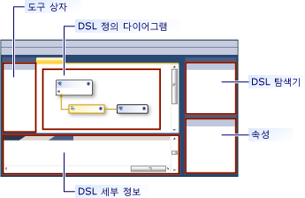
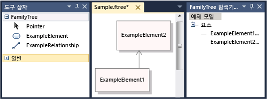
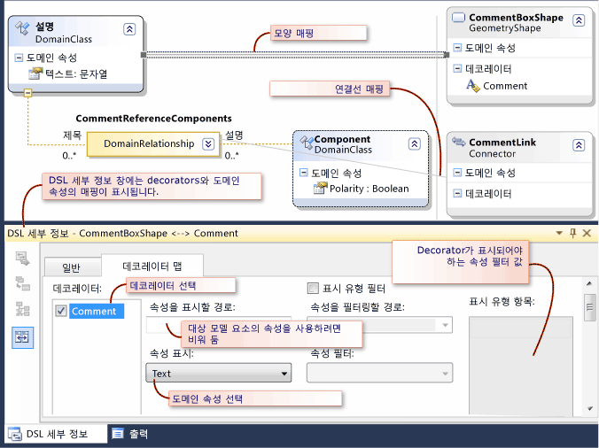
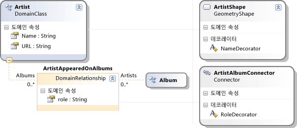
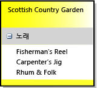
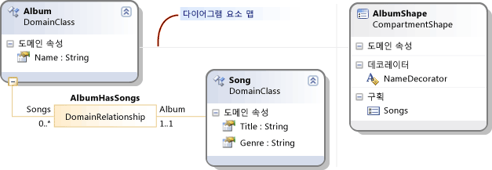

# 도메인별 언어 정의 방법
DSL(Domain-Specific Language)을 정의하려면 템플릿에서 [!INCLUDE[vsprvs](../code-quality/includes/vsprvs_md.md)] 솔루션을 만듭니다. 이 솔루션의 중요한 요소는 DslDefinition.dsl에 저장되는 DSL 정의 다이어그램입니다. DSL 정의는 DSL의 클래스와 모양을 정의합니다. 이러한 요소를 수정하고 필요한 내용을 추가한 후에 프로그램 코드를 추가하여 DSL을 보다 자세하게 사용자 지정할 수 있습니다.  
  
 Dsl을 처음 접하는 경우를 통해 작업 하는 것이 좋습니다는 **DSL 도구 Lab**,이 사이트에서 찾을 수 있는: [사용 및 모델링 SDK](http://go.microsoft.com/fwlink/?LinkID=186128)  

[!INCLUDE[modeling_sdk_info](includes/modeling_sdk_info.md)]

  
##  템플릿 솔루션 선택  
 DSL을 정의하려면 다음 구성 요소를 설치해야 합니다.  
  
|||  
|-|-|  
|[!INCLUDE[vsprvs](../code-quality/includes/vsprvs_md.md)]|[http://go.microsoft.com/fwlink/?LinkId=185579](http://go.microsoft.com/fwlink/?LinkId=185579)|  
|[!INCLUDE[vssdk_current_short](../modeling/includes/vssdk_current_short_md.md)]|[http://go.microsoft.com/fwlink/?LinkId=185580](http://go.microsoft.com/fwlink/?LinkId=185580)|  
|Visual Studio Visualization and Modeling SDK||  

[!INCLUDE[modeling_sdk_info](includes/modeling_sdk_info.md)]

  
 새 DSL(Domain-Specific Language)을 만들려면 DSL 프로젝트 템플릿을 사용하여 새 [!INCLUDE[vsprvs](../code-quality/includes/vsprvs_md.md)] 솔루션을 만듭니다.  
  
#### DSL 솔루션을 만들려면  
  
1.  사용 하 여 솔루션을 만들기는 **도메인별 언어** 서식 파일에서 찾을 수 있는 **기타 프로젝트 형식/확장성** 에 **새 프로젝트** 대화 상자입니다.  
  
       
  
     클릭할 때 **확인**, **도메인별 언어 마법사** 열리고 템플릿 DSL 솔루션 목록이 표시 됩니다.  
  
2.  각 템플릿을 클릭하여 설명을 확인합니다. 만들려는 DSL과 가장 비슷한 솔루션을 선택합니다.  
  
     각 DSL 템플릿은 기본적인 작업 DSL을 정의합니다. 요구 사항에 맞게 이 DSL을 편집합니다.  
  
     각 샘플을 클릭하면 자세한 내용을 확인할 수 있습니다.  
  
    -   선택 **작업 흐름** 스윔 레인이 있는 DSL을 만들려고 합니다. 스윔 레인은 다이어그램의 수직 또는 수평 파티션입니다.  
  
    -   선택 **구성 요소 모델** 포트가 있는 DSL을 만들려고 합니다. 포트는 큰 모양의 모서리에 있는 작은 모양입니다.  
  
    -   선택 **클래스 다이어그램** 구획 모양이 있는 DSL을 정의할 수 있습니다. 구획 모양에는 항목 목록이 포함됩니다.  
  
    -   선택 **최소 언어** 다른 경우에 확실 하지 않은 경우.  
  
    -   선택 **최소 WinForm Designer** 또는 **최소 WPF Designer** 하는 Windows Forms 또는 WPF 화면에 표시 되는 DSL을 만들 수 있습니다. 편집기를 정의하려면 코드를 작성해야 합니다. 자세한 내용은 다음 항목을 참조하세요.  
  
         [Windows Forms 기반 도메인별 언어 만들기](../modeling/creating-a-windows-forms-based-domain-specific-language.md)  
  
         [WPF 기반 도메인별 언어 만들기](../modeling/creating-a-wpf-based-domain-specific-language.md)  
  
3.  해당하는 마법사 페이지에서 DSL의 파일 이름 확장명을 입력합니다. 이 확장명은 DSL의 인스턴스가 포함된 파일에 사용됩니다.  
  
    -   현재 사용 중인 컴퓨터 또는 DSL을 설치할 컴퓨터의 응용 프로그램과 연결되지 않은 파일 이름 확장명을 선택합니다. 예를 들어 **docx** 및 **htm** 허용 되지 않는 파일 이름 확장명을 수 있습니다.  
  
    -   입력한 확장명이 DSL로 사용되고 있으면 경고가 표시됩니다. 이 경우 다른 파일 이름 확장명을 사용해야 합니다. Visual Studio SDK 실험적 인스턴스를 다시 설정하여 오래된 실험적 디자이너를 지울 수도 있습니다. 클릭 **시작**, 클릭 **모든 프로그램**, **Microsoft Visual Studio 2010 SDK**, **도구**, 차례로 **Microsoft Visual Studio 2010 실험적 인스턴스 다시 설정**합니다.  
  
4.  다른 페이지에서 설정을 조정하거나 기본값을 그대로 사용할 수 있습니다.  
  
5.  **마침**을 클릭합니다.  
  
     2~3개 프로젝트가 포함된 솔루션이 만들어지고 DSL 정의에서 코드가 생성됩니다.  
  
 이제 사용자 인터페이스는 다음 그림과 같이 표시됩니다.  
  
   
  
 이 솔루션은 DSL을 정의합니다. 자세한 내용은 참조 [도메인별 언어 도구 사용자 인터페이스 개요](../modeling/overview-of-the-domain-specific-language-tools-user-interface.md)합니다.  
  
### 솔루션 테스트  
 템플릿 솔루션에서 제공하는 작업 DSL을 수정하거나 그대로 사용할 수 있습니다.  
  
 솔루션을 테스트하려면 F5 키나 Ctrl+F5를 누릅니다. 새 [!INCLUDE[vsprvs](../code-quality/includes/vsprvs_md.md)] 인스턴스가 실험적 모드에서 열립니다.  
  
 새 [!INCLUDE[vsprvs](../code-quality/includes/vsprvs_md.md)] 인스턴스의 솔루션 탐색기에서 샘플 파일을 엽니다. 샘플 파일은 도구 상자가 포함된 다이어그램으로 열립니다.  
  
 만든 솔루션을 실행 하는 경우는 **최소 언어** 템플릿, 실험적 [!INCLUDE[vsprvs](../code-quality/includes/vsprvs_md.md)] 다음 예와 비슷하게 표시 됩니다.  
  
   
  
 도구를 사용해 보고 요소를 만들어 서로 연결합니다.  
  
 실험적 [!INCLUDE[vsprvs](../code-quality/includes/vsprvs_md.md)] 인스턴스를 닫습니다.  
  
> [!NOTE]
>  DSL을 수정하면 샘플 테스트 파일에 모양이 더 이상 표시되지 않습니다. 그러나 새 요소를 만들 수는 있습니다.  
  
### 템플릿 DSL 수정  
 템플릿 DSL 정의에서 일부 또는 모든 도메인 클래스 및 모양 클래스의 이름을 바꾸고 저장합니다. 새 클래스 이름은 공백이나 문장 부호가 없는 올바른 CLR 이름이어야 합니다.  
  
 이러한 클래스를 저장하면 특히 다음과 같은 경우에 유용합니다.  
  
-   루트 클래스는 DSL 정의 다이어그램의 왼쪽 위에 아래 나타납니다 **클래스 및 관계**합니다. 해당 클래스의 이름을 DSL과 다르게 바꿉니다. 예를 들어 라는 DSL **MusicLibrary** 이라는 루트 클래스가 있을 수 **음악**합니다.  
  
-   다이어그램 클래스에는 DSL 정의 다이어그램 오른쪽 아래에 표시 된 **다이어그램 요소** 열입니다. 해당 열을 보려면 오른쪽으로 스크롤해야 할 수 있습니다. 이름은 일반적으로 *YourDsl***다이어그램**합니다.  
  
-   사용 하는 경우는 **작업 흐름** 서식 파일을 하려면 스윔 레인이 포함 된 다이어그램을 만들을 유지 하며 Actor 도메인 클래스 및 ActorSwimlane 모양의 이름을 바꿀 수 있습니다.  
  
 나머지 클래스는 요구 사항에 맞게 삭제하거나 이름을 바꿉니다.  
  
##  DSL 정의 패턴  
 한 번에&1;~2개 기능을 추가하거나 조정하여 DSL을 개발하는 것이 좋습니다. 기능 하나를 추가하고 DSL을 실행하여 테스트한 다음&1;~2개 기능을 더 추가합니다. DSL의 일반적인 기능은 다음과 같습니다.  
  
-   도메인 클래스, 모델에 요소를 연결하는 포함 관계, 다이어그램에서 해당 클래스의 요소를 표시하는 데 필요한 모양, 사용자가 요소를 만드는 데 사용할 수 있는 요소 도구  
  
-   도메인 클래스의 도메인 속성 및 모양에 이러한 속성을 표시하는 Decorator  
  
-   참조 관계, 다이어그램에 참조 관계를 표시하는 연결선 및 사용자가 링크를 만드는 데 사용할 수 있는 연결선 도구  
  
-   유효성 제약 조건 또는 메뉴 명령과 같이 프로그램 코드가 필요한 사용자 지정 항목  
  
 다음 섹션에서는 가장 유용한 유형의 SDL 기능을 생성하는 방법을 설명합니다. DSL을 생성하는 데 사용할 수 있는 기타 여러 패턴이 있지만 여기서는 가장 자주 사용되는 패턴에 대해 설명합니다.  
  
> [!NOTE]
>  기능을 추가한 후 잊지 말고 클릭 **모든 템플릿 변환** 하기 전에 솔루션 탐색기의 도구 모음에서 빌드 및 DSL을 실행 합니다.  
  
 다음 그림에는 이 항목에서 예로 사용되는 DSL의 클래스 및 관계 부분이 나와 있습니다.  
  
   
  
 그리고 다음 그림에는 이 DSL의 예제 모델이 나와 있습니다.  
  
   
  
> [!NOTE]
>  여기서 "모델"은 사용자가 만드는 DSL 인스턴스를 지칭하며 대개 다이어그램으로 표시됩니다. 이 항목에서는 DSL 사용 시에 표시되는 DSL 정의 다이어그램 및 모델 다이어그램 둘 다에 대해 설명합니다.  
  
##  도메인 클래스 정의  
 도메인 클래스는 DSL의 개념을 나타냅니다. 인스턴스는 *모델 요소*합니다. 예를 들어 한 **MusicLibrary** DSL 이라는 도메인 클래스가 할 수 있습니다 **앨범** 및 **노래**합니다.  
  
 도메인 클래스를 만들려면에서 끌 수는 **명명 된 도메인 클래스** 도구 다이어그램을 클릭 한 다음 클래스의 이름을 바꿉니다.  
  
 자세한 내용은 참조 [도메인 클래스 속성](../modeling/properties-of-domain-classes.md)합니다.  
  
### 각 도메인 클래스에 대해 포함 관계 만들기  
 루트 클래스를 제외한 모든 도메인 클래스는 하나 이상되는 포함 관계의 대상이거나 포함 관계의 대상인 클래스에서 상속해야 합니다.  
  
 모델에서 모든 모델 요소는 포함 관계의 단일 트리에 포함된 노드입니다. 포함 관계의 소스와 대상을 대개 부모와 자식이라고 합니다.  
  
 도메인 클래스의 부모는 다른 요소를 기준으로 클래스 요소의 수명을 지정할 방법에 따라 선택합니다. 일반적으로 트리의 노드를 삭제하면 해당 하위 트리도 삭제됩니다. 그러므로 독립적인 요소의 클래스는 루트 클래스 바로 아래에 포함됩니다.  
  
 대개 다른 요소 내에 요소를 표시할 때는 소유자 관계를 지정합니다. 이 경우 가장 적절한 부모 클래스는 컨테이너의 클래스입니다. 단, 컨테이너 내에 표시되는 항목이 실제로는 단순히 독립 요소의 참조 링크인 경우는 예외입니다. 이 경우에는 컨테이너를 삭제하면 참조만 삭제되며 대상은 삭제되지 않습니다.  
  
 이 항목에서 설명하는 DSL 정의 패턴에서는 컨테이너를 삭제하면 컨테이너 내에 표시되는 요소도 삭제된다고 가정합니다. 규칙을 정의하면 더 복잡한 체계도 사용할 수 있습니다.  
  
|요소 표시 방식|부모(포함) 클래스|DSL 솔루션 템플릿의 예|  
|------------------------------|--------------------------------|--------------------------------------|  
|다이어그램에 표시된 모양   스윔 레인|DSL의 루트 클래스|최소 언어   작업 흐름: 행위자 클래스|  
|스윔 레인의 모양|스윔 레인으로 표시되는 요소의 도메인 클래스|작업 흐름: 작업 클래스|  
|컨테이너를 삭제하면 항목도 삭제되는 모양 내 목록의 항목   모양 모서리의 포트|컨테이너 모양에 매핑되는 도메인 클래스|클래스 다이어그램: 특성 클래스   구성 요소 다이어그램: 포트 클래스|  
|컨테이너를 삭제해도 삭제되지 않는 목록의 항목|DSL의 루트 클래스   목록에 참조 링크가 표시됩니다.||  
|직접 표시되지 않음|부분을 구성하는 클래스||  
  
 MusicLibrary 예에서 앨범은 사각형으로 표시되며 그 안에 노래 제목이 나열됩니다. 따라서 Album의 부모는 루트 클래스인 Music이고 Song의 부모는 Album입니다.  
  
 도메인 클래스와 동시에 포함을 만들려면 클릭는 **포함 관계** 도구를 클릭 한 다음 부모 클래스를 클릭 한 후 다이어그램의 빈 부분을 클릭 합니다.  
  
 일반적으로 포함 관계와 해당 역할은 클래스 이름을 자동으로 추적하므로 해당 이름을 조정할 필요가 없습니다.  
  
 자세한 내용은 참조 [도메인 관계의 속성](../modeling/properties-of-domain-relationships.md) 및 [도메인 역할의 속성](../modeling/properties-of-domain-roles.md)합니다.  
  
> [!NOTE]
>  포함은 상속과는 다릅니다. 포함 관계에 있는 자식은 부모로부터 기능을 상속하지 않습니다.  
  
### 각 도메인 클래스에 도메인 속성 추가  
 도메인 속성에는 값이 저장됩니다. 예를 들어 이름, 제목, 게시 날짜 등이 저장될 수 있습니다.  
  
 클릭 **도메인 속성** 클래스에서 ENTER 키를 누른 다음 속성의 이름을 입력 합니다. 도메인 속성의 기본 형식은 문자열입니다. 형식을 변경 하려는 경우 도메인 속성을 선택 하 고 설정의 **형식** 에 **속성** 창입니다. 원하는 형식을 드롭다운 목록에 없는 경우 참조 [속성 형식 추가](#addTypes)합니다.  
  
 **요소 이름 속성을 설정 합니다.** 언어 탐색기에서 요소를 식별 하는 데 사용할 수 있는 도메인 속성을 선택 합니다. 예를 들어 Song 도메인 클래스에서는 Title 도메인 속성을 선택할 수 있습니다. 에 **속성** 창의 설정 **Is Element Name** 를 `true`합니다.  
  
### 파생된 도메인 클래스 만들기  
 도메인 클래스에 해당 속성과 관계를 상속하는 변형을 포함하려면 해당 클래스에서 파생되는 클래스를 만듭니다. 예를 들어 Album에는 WMA 및 MP3 파생 클래스가 포함될 수 있습니다.  
  
 사용 하 여 파생된 클래스를 만들기는 **도메인 클래스** 도구입니다.  
  
 클릭 하 고 **상속** 도구, 파생된 클래스를 클릭 한 다음 기본 클래스를 클릭 합니다.  
  
 설정의 **상속 한정자** 기본 클래스의 **추상**합니다. 기본 클래스 인스턴스가 필요한 경우에는 기본 클래스에 대해 별도의 파생 클래스를 만들 수 있습니다.  
  
 파생 클래스는 기본 클래스의 속성과 역할을 상속합니다.  
  
### DSL 정의 다이어그램 정리  
 관계를 추가할 때 일부 클래스는 두 곳 이상에 표시됩니다. 발생 횟수를 줄이고 다이어그램을 더 넓히려면, 하려면 관계의 대상 클래스를 마우스 오른쪽 단추로 클릭 한 다음 클릭 **여기로 트리 가져오기**합니다. 선택한 관계의 대상 클래스를 마우스 오른쪽 단추로 클릭 반대 효과 대 한 **트리 분할**합니다. 이러한 메뉴 명령이 표시되지 않으면 도메인 클래스만 선택했는지 확인하세요.  
  
 Ctrl+위쪽 및 Ctrl+아래쪽 화살표를 사용하여 도메인 클래스와 모양 클래스를 이동합니다.  
  
### 도메인 클래스 테스트  
  
##### 새 도메인 클래스를 테스트하려면  
  
1.  **모든 템플릿 변환을 클릭** DSL 디자이너 코드를 생성 하려면 솔루션 탐색기의 도구 모음에서입니다. 이 단계는 자동화할 수 있습니다. 자세한 내용은 참조 [모든 템플릿 변환 자동화 하는 방법을](http://msdn.microsoft.com/en-us/b63cfe20-fe5e-47cc-9506-59b29bca768a)합니다.  
  
2.  **빌드하고 DSL을 실행 합니다.** 새 인스턴스를 실행 하려면 F5 또는 CTRL + f&5;를 눌러 [!INCLUDE[vsprvs](../code-quality/includes/vsprvs_md.md)] 실험 모드에 있습니다. 실험적 [!INCLUDE[vsprvs](../code-quality/includes/vsprvs_md.md)] 인스턴스에서 DSL의 파일 이름 확장명이 지정된 파일을 열거나 만듭니다.  
  
3.  **탐색기를 엽니다.** 다이어그램의 측면은 일반적으로 이름으로 지정 된 언어 탐색기 창이 *YourLanguage* 탐색기. 이 창이 표시되지 않으면 솔루션 탐색기 아래쪽의 탭에 있을 수 있습니다. 이 찾을 수 없는 경우는 **보기** 메뉴에서 **다른 창**를 클릭 하 고 *YourLanguage***탐색기**합니다.  
  
     탐색기에 모델의 트리 뷰가 표시됩니다.  
  
4.  **새 요소를 만듭니다.** 맨 위에 있는 루트 노드를 마우스 오른쪽 단추로 누른 **새로 추가***YourClass*합니다.  
  
     새 클래스 인스턴스가 언어 탐색기에 표시됩니다.  
  
5.  새 인스턴스를 만들 때는 각 인스턴스의 이름이 서로 다른지 확인합니다. 설정한 경우에 전송 됩니다는 **Is Element Name** 도메인 속성에 대 한 플래그입니다.  
  
6.  **도메인 속성을 점검합니다. 옵션을 선택 하 여 클래스의 인스턴스와** 속성 창을 검사 합니다. 그러면 이 도메인 클래스에 대해 정의한 도메인 속성이 표시되어야 합니다.  
  
7.  **파일을 저장, 닫았다가 다시 엽니다**합니다. 노드를 확장하고 나면 작성한 모든 인스턴스가 탐색기에 표시되어야 합니다.  
  
##  다이어그램에서 모양 정의  
 다이어그램에 사각형, 타원 또는 아이콘으로 표시되는 요소 클래스를 정의할 수 있습니다.  
  
#### 다이어그램에 모양으로 표시되는 요소 클래스를 정의하려면  
  
1.  **정의에 설명 된 대로 도메인 클래스를 테스트 하 고**[도메인 클래스 정의](#classes) **합니다.  **  
  
    -   클래스의 부모는 루트 클래스여야 합니다. 즉 루트 클래스와 새 도메인 클래스 간에 포함 관계가 있어야 합니다.  
  
    -   다이어그램에 스윔 레인이 있으면 부모는 스윔 레인에 매핑되는 도메인 클래스일 수 있습니다. 이 절차를 계속 하기 전에 [스윔 레인이 있는 DSL 정의](#swimlanes)합니다.  
  
2.  **Shape 클래스 추가** 모델 다이어그램에서 요소를 나타냅니다. 이렇게 하려면 다음 도구 중 하나에서 DSL 정의 다이어그램으로 클래스를 끌어 놓습니다.  
  
    -   **기 하 도형** 사각형 또는 타원을 제공 합니다.  
  
    -   **이미지 모양** 사용자가 제공한 이미지를 표시 합니다.  
  
    -   **구획 모양** 하나 이상의 항목 목록을 포함 하는 사각형입니다.  
  
     모양 클래스의 이름을 바꿉니다. 이 이름은 DSL 정의 다이어그램 오른쪽의 모양 및 연결선 아래에 표시됩니다.  
  
3.  **이미지 모양을 만든 경우 이미지를 정의**합니다.  
  
    1.  원하는 크기로 이미지 파일을 만듭니다. BMP, JPEG, GIF, EMF 형식이 지원됩니다.  
  
    2.  솔루션 탐색기의 Dsl\Resources에서 파일을 솔루션에 추가합니다.  
  
    3.  DSL 정의 다이어그램으로 돌아와 새 이미지 모양 클래스를 선택합니다.  
  
    4.  속성 창에서 클릭 된 **이미지** 속성입니다.  
  
    5.  에 **이미지 선택** 대화 상자 아래에 있는 드롭다운 메뉴를 클릭 합니다 **파일 이름**, 이미지를 선택 하 고 있습니다.  
  
4.  **도메인 속성을 표시 하는 모양에 텍스트 decorator를 추가 합니다.**  
  
     모델 요소의 이름이나 제목을 표시하려면 텍스트 Decorator가 하나 이상 필요할 수 있습니다.  
  
     Shape 클래스의 헤더를 마우스 오른쪽 **추가**를 클릭 하 고 **텍스트 Decorator**합니다. 속성 창 집합 decorator의 이름을 설정의 **위치**합니다.  
  
5.  **다이어그램 요소 맵을 표시 해야 하는 도메인 클래스를 사용 하 여 각 셰이프를 연결**합니다.  
  
     클릭는 **다이어그램 요소 맵을** 도구를 도메인 클래스 차례로 shape 클래스를 클릭 합니다.  
  
6.  **속성을을 텍스트 decorator에 매핑하십시오.**  
  
    1.  다이어그램 요소 맵을 나타내는 모양 클래스와 도메인 클래스 사이의 회색 선을 선택합니다.  
  
    2.  에 **DSL 정보** 창 클릭는 **Decorator 맵** 탭 합니다. 표시 되지 않으면는 **DSL 정보** 창에는 **보기** 메뉴에서 **다른 창** 클릭 하 고 **DSL 정보**합니다. 모든 내용을 보려면 이 창 위쪽을 올려야 하는 경우가 많습니다.  
  
    3.  Decorator의 이름을 선택합니다. 아래에서 **표시 속성**, 도메인 클래스 속성의 이름을 선택 합니다. 각 Decorator에 대해 이 단계를 반복합니다.  
  
         관련 요소의 속성을 표시 하려면 클릭 아래 드롭다운 트리 탐색기 **속성을 표시할 경로**합니다.  
  
    4.  각 Decorator 이름 옆에 확인 표시가 나타나는지 확인합니다.  
  
       
  
7.  **도메인 클래스의 요소를 만들기 위한 도구 상자 항목을 확인 합니다.**  
  
    1.  **DSL 탐색기**를 확장 하 고는 **편집기** 노드 및 모든 하위 노드.  
  
    2.  아래에 있는 노드를 마우스 오른쪽 단추로 클릭 **도구 상자 탭** 예를 들어 MusicLibrary DSL과 같은 이름을 가진 합니다. 클릭 **요소 도구 추가**합니다.  
  
        > [!NOTE]
        >  마우스 오른쪽 단추로 클릭 하 고 **도구** 노드를 표시 되지 것입니다 **요소 도구 추가**. 도구 노드 위의 노드를 클릭해야 합니다.  
  
    3.  새 요소 도구를 선택한 속성 창의 설정 **클래스** 최근에 추가한 도메인 클래스에 있습니다.  
  
    4.  설정 **캡션** 및 **도구 설명**합니다.  
  
    5.  설정 **도구 상자 아이콘** 도구 상자에 표시 될 아이콘으로 표시 합니다. 이 아이콘은 새 아이콘 또는 다른 도구에 이미 사용한 아이콘으로 설정할 수 있습니다.  
  
         새 아이콘을 만들려면에서 Dsl\Resources를 열고 **솔루션 탐색기**합니다. 기존 요소 도구 BMP 파일 중 하나를 복사하여 붙여넣습니다. 붙여넣은 복사본의 이름을 바꾼 다음 두 번 클릭하여 편집합니다.  
  
         DSL 정의 다이어그램으로 돌아가서 도구를 선택 하 고 속성 창에서 클릭 **[...] ** 에서 **도구 상자 아이콘**합니다. 에 **비트맵 선택** 대화 상자를 선택 하면 합니다. 드롭 다운 메뉴에서 BMP 파일입니다.  
  
 자세한 내용은 참조 [기 하 도형의 속성](../modeling/properties-of-geometry-shapes.md) 및 [이미지 모양의 속성](../modeling/properties-of-image-shapes.md)합니다.  
  
#### 모양을 테스트하려면  
  
1.  **모든 템플릿 변환을 클릭** DSL 디자이너 코드를 생성 하려면 솔루션 탐색기의 도구 모음에서입니다.  
  
2.  **빌드하고 DSL을 실행 합니다.** 새 인스턴스를 실행 하려면 F5 또는 CTRL + f&5;를 눌러 [!INCLUDE[vsprvs](../code-quality/includes/vsprvs_md.md)] 실험 모드에 있습니다. 실험적 [!INCLUDE[vsprvs](../code-quality/includes/vsprvs_md.md)] 인스턴스에서 DSL의 파일 이름 확장명이 지정된 파일을 열거나 만듭니다.  
  
3.  **도구 상자에 요소 도구가 표시 되는지 확인 합니다.**  
  
4.  **도형을 만들** 는 도구에서 모델 다이어그램에서 끌어 합니다.  
  
5.  **각 텍스트 decorator가 표시 되는지 확인** 하 고 있습니다.  
  
    1.  설정 하지 않는 한, 편집할 수는 **Is UI Read Only** 도메인 속성에 대 한 플래그입니다.  
  
    2.  속성 창이나 Decorator에서 속성을 편집하면 다른 뷰가 업데이트됩니다.  
  
 모양을 처음으로 테스트한 후에 일부 속성을 조정하고 몇 가지 고급 기능을 더 추가할 수 있습니다. 자세한 내용은 참조 [사용자 지정 및 도메인별 언어 확장](../modeling/customizing-and-extending-a-domain-specific-language.md)합니다.  
  
##  참조 관계 정의  
 소스 도메인 클래스와 대상 도메인 클래스 간에 참조 관계를 정의할 수 있습니다. 참조 관계는 보통 다이어그램에 연결선(모양 사이의 선)으로 표시됩니다.  
  
 예를 들어 음악 앨범 및 아티스트가 다이어그램에 모양으로 표시되는 경우에는 아티스트를 참여 앨범에 연결하는 ArtistsAppearedOnAlbums 관계를 정의할 수 있습니다. 아래 그림의 예를 참조하세요.  
  
   
  
 참조 관계는 같은 유형의 요소를 연결할 수도 있습니다. 예를 들어 가족 구성도를 나타내는 DSL에서는 부모와 자식의 관계가 개인 간 참조 관계입니다.  
  
### 참조 관계 정의  
 참조 관계 도구, 관계의 소스 도메인 클래스, 대상 도메인 클래스를 차례로 클릭합니다. 대상 클래스는 소스 클래스와 같을 수 있습니다.  
  
 각 관계에는 관계 상자 양쪽에 선으로 표시되는 두 역할이 있습니다. 각 역할을 선택하고 속성 창에서 해당 속성을 설정할 수 있습니다.  
  
 **역할 이름을 바꿀**합니다. 예를 들어 개인 간 관계에서는 기본 이름을 부모/자식, 관리자/부하 직원, 교사/학생 등으로 변경할 수 있습니다.  
  
 **각 역할의 다중성을 조정**, 필요한 경우. 각 개인에게 관리자를 한 명까지만 지정하려면 다이어그램의 관리자 레이블 아래에 표시되는 다중성을 0..1로 설정합니다.  
  
 **관계에 도메인 속성을 추가 합니다.** 그림에서 Artist-album 관계 역할의 속성을 있습니다.  
  
 **관계의 Allows Duplicates 속성 설정** 경우 동일한 클래스의 여러 개의 링크 모델 요소의 같은 쌍 사이 존재할 수 있습니다. 예를 들어 교사 한 명이 같은 학생에게 둘 이상의 과목을 가르치도록 허용할 수 있습니다.  
  
   
  
 자세한 내용은 참조 [도메인 관계의 속성](../modeling/properties-of-domain-relationships.md) 및 [도메인 역할의 속성](../modeling/properties-of-domain-roles.md)합니다.  
  
### 관계를 표시할 연결선 정의  
 연결선은 모델 다이어그램의 두 모양 사이에 선을 표시합니다.  
  
 끌기의 **커넥터** 도구에서 DSL 정의 다이어그램입니다.  
  
 연결선에 레이블을 표시하려면 텍스트 Decorator를 추가하고 해당 위치를 설정합니다. 설정, 사용자가 텍스트 decorator를 이동할 수 있도록 해당 **Is Moveable** 속성입니다.  
  
 사용 된 **다이어그램 요소 맵을** 참조 관계에 커넥터를 연결 하는 도구입니다.  
  
 선택한 다이어그램 요소 맵을 사용 하 여 열에서 **DSL 정보** 창과 열기는 **Decorator 맵** 탭 합니다.  
  
 각 선택 **데코레이터** 설정 **표시 속성** 올바른 도메인 속성에 있습니다.  
  
 각 항목 옆에 확인 표시가 나타나는지 확인은 **데코레이터** 목록입니다.  
  
### 연결 작성기 도구 정의  
 에 **DSL 탐색기** 창 확장은 **편집기** 노드 및 모든 하위입니다.  
  
 DSL와 동일한 이름을 가진 노드를 마우스 오른쪽 단추로 누른 **새 연결 도구 추가**합니다.  
  
 새 도구를 선택한 상태로 속성 창에서 다음 단계를 수행합니다.  
  
-   설정의 **캡션** 및 **도구 설명**합니다.  
  
-   클릭 **연결 작성기** 하 고 새 관계에 대 한 적절 한 작성기를 선택 합니다.  
  
-   설정 **도구 상자 아이콘** 도구 상자에 표시할 아이콘입니다. 이 아이콘은 새 아이콘 또는 다른 도구에 이미 사용한 아이콘으로 설정할 수 있습니다.  
  
     새 아이콘을 만들려면에서 Dsl\Resources를 열고 **솔루션 탐색기**합니다. 기존 요소 도구 BMP 파일 중 하나를 복사하여 붙여넣습니다. 붙여넣은 복사본의 이름을 바꾼 다음 두 번 클릭하여 편집합니다.  
  
     DSL 정의 다이어그램으로 돌아가서 도구를 선택 하 고 속성 창에서 클릭 **[...] ** 에서 **도구 상자 아이콘**합니다. 에 **비트맵 선택** 대화 상자를 선택 하면 합니다. 드롭 다운 메뉴에서 BMP 파일입니다.  
  
##### 참조 관계 및 연결선을 테스트하려면  
  
1.  **모든 템플릿 변환을 클릭** DSL 디자이너 코드를 생성 하려면 솔루션 탐색기의 도구 모음에서입니다.  
  
2.  **빌드하고 DSL을 실행 합니다.** 새 인스턴스를 실행 하려면 F5 또는 CTRL + f&5;를 눌러 [!INCLUDE[vsprvs](../code-quality/includes/vsprvs_md.md)] 실험 모드에 있습니다. 실험적 [!INCLUDE[vsprvs](../code-quality/includes/vsprvs_md.md)] 인스턴스에서 DSL의 파일 이름 확장명이 지정된 파일을 열거나 만듭니다.  
  
3.  **도구 상자에 연결 도구가 표시 되는지 확인 합니다.**  
  
4.  **도형을 만들** 는 도구에서 모델 다이어그램에서 끌어 합니다.  
  
5.  **연결을 만들** 셰이프 사이입니다. 연결선 도구와 모양을 차례로 클릭하고 다른 모양을 클릭합니다.  
  
6.  **부적절 한 클래스 간의 연결을 만들 수 있는지 확인 합니다.** 예를 들어 Album과 Artist 간에 관계를 경우 Artist를 Artist에 연결할 수 없습니다 있는지 확인 합니다.  
  
7.  **다중성이 올바른지 확인 합니다. 예를 들어 사람 둘 이상의 관리자에 연결할 수 있는지 확인 합니다.**  
  
8.  **각 텍스트 decorator가 표시 되는지 확인** 하 고 있습니다.  
  
    1.  설정 하지 않는 한, 편집할 수는 **Is UI Read Only** 도메인 속성에 대 한 플래그입니다.  
  
    2.  속성 창이나 Decorator에서 속성을 편집하면 다른 뷰가 업데이트됩니다.  
  
 연결선을 처음으로 테스트한 후에 일부 속성을 조정하고 몇 가지 고급 기능을 더 추가할 수 있습니다. 자세한 내용은 참조 [사용자 지정 및 도메인별 언어 확장](../modeling/customizing-and-extending-a-domain-specific-language.md)합니다.  
  
##  목록을 포함 하는 모양 정의: 구획 모양  
 구획 모양은 항목 목록을 하나 이상 포함합니다. 예를 들어 MusicLibrary DSL에서는 구획 모양을 사용하여 음악 Album을 표시할 수 있습니다. 각 Album에는 노래 목록이 있습니다.  
  
   
  
 DSL 정의에서 이러한 모양을 적용하는 가장 간단한 방법은 컨테이너와 각 목록에 대해 도메인 클래스를 하나씩 정의하는 것입니다. 컨테이너 클래스는 구획 모양에 매핑됩니다.  
  
   
  
 자세한 내용은 참조 [구획 모양 속성](../modeling/properties-of-compartment-shapes.md)합니다.  
  
#### 구획 모양을 정의하려면  
  
1.  **컨테이너 도메인 클래스를 만들고**합니다. 클릭 하 고 **포함 관계** 도구, 모델의 루트 클래스를 클릭 한 다음 DSL 정의 다이어그램의 빈 부분을 클릭 합니다. 그러면 예제 그림과 같이 Album이라는 도메인 클래스가 만들어집니다.  
  
     루트 클래스에 포함하는 대신 스윔 레인에 매핑되는 도메인 클래스에 컨테이너를 포함할 수 있습니다.  
  
     이름 등의 도메인 속성을 클래스에 추가 하 고 설정의 **Is Element Name** 속성 창에서 플래그입니다.  
  
2.  **목록 항목 도메인 클래스 만들기**합니다. 클릭 하 고 **포함 관계** 도구, 컨테이너 클래스 (Album)를 클릭 한 다음 다이어그램의 빈 부분을 클릭 합니다. 그러면 예제 그림과 같이 Song이라는 도메인 클래스가 만들어집니다.  
  
     클래스에 제목 등의 도메인 속성을 추가 하 고 설정의 **Is Element Name** 플래그입니다.  
  
     다른 도메인 속성을 추가합니다.  
  
     표시할 각 목록에 대해 다른 목록 항목 도메인 클래스를 추가합니다.  
  
3.  **여러 목록에서 항목 형식을 혼합**, list 클래스에서 상속 하는 클래스를 만듭니다. 설정 하 여 목록 클래스를 추상 만들 해당 **상속 한정자**합니다.  
  
     예를 들어 클래식 음악을 아티스트가 아닌 작곡가를 기준으로 정렬하려면 Song의 두 서브클래스 ClassicalSong 및 NonClassicalSong을 만들 수 있습니다.  
  
4.  **구획 모양을 만듭니다**합니다. 끌어는 **구획 모양** 도구에서 DSL 정의 다이어그램입니다.  
  
     텍스트 Decorator를 추가하고 해당 이름을 설정합니다.  
  
     구획을 추가하고 해당 이름을 설정합니다.  
  
5.  사용자가 목록 구획 숨기기, 구획 모양 클래스를 마우스 오른쪽 단추로 클릭 수를 가리킨 **추가**를 클릭 하 고 **Decorator 확장/축소**합니다. 속성 창에서 Decorator의 위치를 설정합니다.  
  
6.  클릭 된 **다이어그램 요소 맵을** 도구, 컨테이너 도메인 클래스를 클릭 한 다음 구획 모양을 클릭 합니다.  
  
7.  모양과 도메인 클래스 사이의 다이어그램 요소 맵 링크를 선택하고 에 **DSL 정보** 창:  
  
    1.  클릭 하 고 **데코레이터** 탭 합니다. Decorator의 이름을 클릭 한 다음 아래에서 적절 한 항목을 선택 **표시 속성**합니다. Decorator 이름 옆에 확인 표시가 나타나는지 확인합니다.  
  
    2.  클릭 하 고 **구획 맵** 탭 합니다.  
  
         구획의 이름을 클릭합니다.  
  
         아래에서 **표시 되는 요소 컬렉션 경로**, 목록 요소 클래스 (Song)로 이동 합니다. 탐색기 도구를 사용하려면 드롭다운 화살표를 클릭합니다.  
  
         아래에서 **표시 속성**를 목록에 표시 해야 하는 속성을 선택 합니다. 이 예에서 해당 속성은 Title입니다.  
  
> [!NOTE]
>  Decorator 맵의 경로 필드와 구획 맵 필드를 사용하면 도메인 클래스와 구획 모양 간에 더 복잡한 관계를 만들 수 있습니다.  
  
#### 도형을 만들 도구를 정의하려면  
  
1.  **도메인 클래스의 요소를 만들기 위한 도구 상자 항목을 확인 합니다.**  
  
2.  **DSL 탐색기**를 확장 하 고는 **편집기** 노드 및 모든 하위 노드.  
  
3.  아래에 있는 노드를 마우스 오른쪽 단추로 클릭 **도구 상자 탭** 예를 들어 MusicLibrary DSL과 같은 이름을 가진 합니다. 클릭 **요소 도구 추가**합니다.  
  
    > [!NOTE]
    >  마우스 오른쪽 단추로 클릭 하 고 **도구** 노드를 표시 되지 것입니다 **요소 도구 추가**. 도구 노드 위의 노드를 클릭해야 합니다.  
  
4.  새 요소 도구를 선택한 속성 창의 설정 **클래스** 최근에 추가한 도메인 클래스에 있습니다.  
  
5.  설정 **캡션** 및 **도구 설명**합니다.  
  
6.  설정 **도구 상자 아이콘** 도구 상자에 표시 될 아이콘으로 표시 합니다. 이 아이콘은 새 아이콘 또는 다른 도구에 이미 사용한 아이콘으로 설정할 수 있습니다.  
  
     새 아이콘을 만들려면에서 Dsl\Resources를 열고 **솔루션 탐색기**합니다. 기존 요소 도구 .BMP 파일 중 하나를 복사하여 붙여넣습니다. 붙여넣은 복사본의 이름을 바꾼 다음 두 번 클릭하여 편집합니다.  
  
     DSL 정의 다이어그램으로 돌아가서 도구를 선택 하 고 속성 창에서 클릭 **[...] ** 에서 **도구 상자 아이콘**합니다. 에 **비트맵 선택** 대화 상자, 드롭 다운 메뉴에서 BMP 파일을 선택 합니다.  
  
#### 구획 모양을 테스트하려면  
  
1.  **모든 템플릿 변환을 클릭** DSL 디자이너 코드를 생성 하려면 솔루션 탐색기의 도구 모음에서입니다.  
  
2.  **빌드하고 DSL을 실행 합니다.** 새 인스턴스를 실행 하려면 F5 또는 CTRL + f&5;를 눌러 [!INCLUDE[vsprvs](../code-quality/includes/vsprvs_md.md)] 실험 모드에 있습니다. 실험적 [!INCLUDE[vsprvs](../code-quality/includes/vsprvs_md.md)] 인스턴스에서 DSL의 파일 이름 확장명이 지정된 파일을 열거나 만듭니다.  
  
3.  **도구 상자에 도구가 표시 되는지 확인 합니다.**  
  
4.  도구를 모델 다이어그램으로 끌어 놓습니다. 모양이 만들어집니다.  
  
     요소 이름이 표시되며 기본값으로 자동 설정되는지 확인합니다.  
  
5.  새 모양의 헤더를 마우스 오른쪽 단추로 클릭 하 고 추가 클릭 한 다음 *Your 목록 항목입니다.* 이 예제에서 해당 명령은 노래 추가입니다.  
  
     목록에 항목이 표시되며 새 이름이 적용되어 있는지 확인합니다.  
  
6.  목록 항목 중 하나를 클릭하고 속성 창을 점검합니다. 목록 항목의 속성이 표시되어야 합니다.  
  
7.  언어 탐색기를 엽니다. 내부에 목록 항목 노드가 포함된 컨테이너 노드가 표시되는지 확인합니다.  
  
   
  
 구획 모양을 처음으로 테스트한 후에 일부 속성을 조정하고 몇 가지 고급 기능을 더 추가할 수 있습니다. 자세한 내용은 참조 [사용자 지정 및 도메인별 언어 확장](../modeling/customizing-and-extending-a-domain-specific-language.md)합니다.  
  
### 구획에 참조 링크 표시  
 일반적으로 구획에 표시하는 요소는 구획 모양으로 표시되는 요소의 자식입니다. 그러나 참조 관계를 통해 구획에 연결되는 요소를 표시하는 경우도 있습니다.  
  
 예를 들어 Album에 연결된 Artist 목록을 표시하는 두 번째 구획을 AlbumShape에 추가할 수 있습니다.  
  
 이 경우 구획에는 참조되는 요소가 아닌 링크가 표시되어야 합니다. 사용자가 구획에서 항목을 선택하고 Delete 키를 누르면 참조되는 요소가 아닌 링크가 삭제되어야 하기 때문입니다.  
  
 참조되는 요소의 이름이 구획에 표시되도록 할 수도 있습니다.  
  
 다음 절차에서는 이 섹션 앞부분에서 설명한 대로 도메인 클래스, 참조 관계, 구획 모양 및 다이어그램 요소 맵을 이미 만들었다고 가정합니다.  
  
##### 구획에 참조 링크를 표시하려면  
  
1.  **구획 모양에 구획을 추가**합니다. DSL 정의 다이어그램에서 구획 모양 클래스를 마우스 오른쪽 **추가**를 클릭 하 고 **구획**합니다.  
  
2.  설정 **표시 되는 요소 컬렉션 경로** 대상 요소가 아닌 링크가 탐색할 수 있습니다. 드롭다운 메뉴를 클릭한 다음 트리 보기를 사용하여 대상이 아닌 참조 관계를 선택합니다. 예제에서 관계는 **ArtistAppearedOnAlbums**합니다.  
  
3.  설정 **속성을 표시할 경로** 대상 요소에 링크에서 이동할 수 있습니다. 이 예제에서는 **아티스트**합니다.  
  
4.  설정 **표시 속성** 예를 들어 대상 요소의 해당 속성에 **이름**합니다.  
  
5.  **모든 템플릿 변환**, 빌드 및 DSL, 실행 및 테스트 모델을 엽니다.  
  
6.  모델 다이어그램에서 모양의 해당 클래스를 만들고 이름을 설정한 후에 클래스 간 링크를 만듭니다. 구획 모양에 연결된 요소의 이름이 표시됩니다.  
  
7.  구획 모양에서 링크나 항목을 선택합니다. 링크와 항목이 모두 사라져야 합니다.  
  
##  다른 모양의 경계에 있는 포트 정의  
 포트는 다른 모양의 경계에 있는 모양입니다.  
  
 포트를 사용하여 다른 모양에 고정 연결점을 제공할 수 있습니다. 사용자는 이 연결점에 연결선을 그릴 수 있습니다. 이 경우 포트 모양을 투명하게 지정할 수 있습니다.  
  
 포트를 사용 하는 예제를 보려면 선택은 **구성 요소 다이어그램** 새 DSL 솔루션을 만들 경우 서식 파일입니다. 이 예에서는 포트를 정의할 때 고려할 수 있는 주요 항목을 제시합니다.  
  
-   포트의 컨테이너를 나타내는 `Component` 도메인 클래스가 있습니다.  
  
-   포트를 나타내는 도메인 클래스가 있습니다. 이 예에서 해당 클래스는 `ComponentPort`입니다.  
  
-   컨테이너 도메인 클래스에서 포트 도메인 클래스로의 포함 관계가 있습니다. 자세한 내용은 참조 [도메인 클래스 정의](#classes)합니다.  
  
-   같은 컨테이너에서 여러 포트 형식을 혼합하여 사용하려는 경우 포트 도메인 클래스의 서브클래스를 만들 수 있습니다. 이 예에서는 `InPort` 및 `OutPort`가 `ComponentPort`에서 상속합니다.  
  
-   컨테이너 도메인 클래스를 모든 종류의 모양에 매핑할 수 있습니다. 이 예에서 해당 모양은 `ComponentShape`입니다. 자세한 내용은 참조 [모양 정의](#shapes)합니다.  
  
-   포트 도메인 클래스는 포트 모양에 매핑됩니다. 파생 클래스의 개별 포트 모양 클래스에 매핑할 수도 있고 기본 클래스를 포트 모양 클래스에 매핑할 수도 있습니다.  
  
 다른 측면에서 포트 셰이프 동작에 설명 된 대로 [모양 정의](#shapes)합니다.  
  
 자세한 내용은 참조 [포트 셰이프 속성](../modeling/properties-of-port-shapes.md)합니다.  
  
##  스윔 레인이 있는 DSL 정의  
 스윔 레인은 다이어그램의 수평 또는 수직 파티션입니다. 각 스윔 레인은 모델 요소에 해당합니다. DSL 정의에서는 스윔 레인 요소당 도메인 클래스가 하나씩 있어야 합니다.  
  
 스윔 레인이 포함된 DSL을 만드는 가장 효율적인 방법은 새 DSL 솔루션을 만들고 작업 흐름 솔루션 템플릿을 선택하는 것입니다. DSL 정의에서 Actor 클래스는 스윔 레인에 매핑되는 도메인 클래스입니다. 이 클래스와 기타 클래스의 이름을 프로젝트에 맞게 바꿉니다.  
  
 스윔 레인 내에 모양으로 표시할 클래스를 추가하려면 스윔 레인 클래스와 새 클래스 간에 포함 관계를 만듭니다. 사용자는 스윔 레인 간에 요소를 끌 수 있지만 각 요소는 항상 특정 스윔 레인 내에 포함됩니다. 작업 흐름 솔루션 템플릿에서 FlowElement는 스윔 레인 클래스의 자식입니다.  
  
 스윔 레인과 독립적인 모양으로 표시할 클래스를 추가하려면 루트 클래스와 새 클래스 간에 포함 관계를 만듭니다. 사용자는 스윔 레인 경계와 외부를 비롯하여 다이어그램의 원하는 위치에 이러한 모양을 배치할 수 있습니다. 작업 흐름 솔루션 템플릿에서 Comment는 루트 클래스의 자식입니다.  
  
 자세한 내용은 참조 [스윔 레인의 속성](../modeling/properties-of-swimlanes.md)합니다.  
  
##  속성 형식 추가  
  
### 도메인 열거형 및 리터럴  
 도메인 열거형은 여러 리터럴 값을 포함하는 형식입니다.  
  
 도메인 열거형을 추가 하려면 마우스 오른쪽 단추로 클릭에서 모델의 루트는 **DSL 탐색기** 클릭 하 고 **새 도메인 열거형 추가**합니다. 요소에 표시 됩니다는 **DSL 탐색기** 아래는 **도메인 형식** 노드. 다이어그램에는 이 요소가 표시되지 않습니다.  
  
 도메인 열거형에 열거형 리터럴을 추가 하려면 마우스 오른쪽 단추로 클릭 도메인 열거형에는 **DSL 탐색기** 클릭 하 고 **새 열거형 리터럴 추가**합니다.  
  
 기본적으로 열거형 형식의 속성은 한 번에 하나의 열거형 값으로만 설정할 수 있습니다. 사용자와 프로그래머가 값 조합 하 여 설정할 수 있게 되기를 원하는 경우 "비트 필드에서" 설정의 **IsFlags** 열거형의 속성입니다.  
  
### 외부 형식  
 원하는 형식을 찾을 수 없는 경우 도메인 속성의 유형을 설정 하는 경우는 **형식** 드롭 다운 목록에서 외부 형식을 추가할 수 있습니다. 예를 들어, 추가할 수는 **System.Drawing.Color** 형식 목록입니다.  
  
 형식을 추가 하려면 DSL 탐색기에서 모델의 루트를 마우스 오른쪽 단추로 클릭 하 고 클릭 한 다음 **새 외부 형식 추가**합니다. 속성 창에서 이름을로 설정 **색** 및 네임 스페이스를 **System.Drawing**합니다. 이 형식이 DSL 탐색기의 아래에 표시 됩니다 **도메인 형식**합니다. 도메인 속성 형식을 설정할 때마다 이 형식을 선택할 수 있습니다.  
  
##  DSL 사용자 지정  
 이 항목에서 설명하는 기술을 사용하면 다이어그램 표기법, 읽을 수 있는 XML 형식 및 코드와 기타 아티팩트를 생성하는 데 필요한 기본적인 도구를 사용해 DSL을 빠르게 만들 수 있습니다.  
  
 두 가지 방법으로 DSL 정의를 확장할 수 있습니다.  
  
1.  DSL 정의 기능을 추가로 사용해 DSL을 미세 조정합니다. 예를 들어 여러 연결선 형식을 만들 수 있는 단일 연결선 도구를 만들고, 특정 요소를 삭제하면 관련 요소도 삭제되는 규칙을 제어할 수 있습니다. 이러한 기술은 대부분 DSL 정의에서 값을 설정하는 방식으로 사용하지만 프로그램 코드를 몇 줄 작성해야 하는 기술도 있습니다.  
  
     자세한 내용은 참조 [사용자 지정 및 도메인별 언어 확장](../modeling/customizing-and-extending-a-domain-specific-language.md)합니다.  
  
2.  보다 고급 효과를 적용하려면 프로그램 코드를 사용하여 모델링 도구를 확장합니다. 예를 들어 모델을 변경할 수 있는 메뉴 명령을 만들고, 둘 이상의 DSL을 통합하는 도구를 만들 수 있습니다. VMSDK는 DSL 정의에서 생성된 코드를 사용하여 확장을 쉽게 통합할 수 있도록 설계되었습니다.  자세한 내용은 참조 [도메인별 언어 사용자 지정 하는 코드 작성](../modeling/writing-code-to-customise-a-domain-specific-language.md)합니다.  
  
### DSL 정의 변경  
 DSL 정의에서 항목을 만들면 대부분의 기본값은 자동으로 설정됩니다. 설정된 기본값은 변경할 수 있습니다. 따라서 DSL 개발은 간소화하는 동시에 유용한 사용자 지정 기능을 추가할 수 있습니다.  
  
 예를 들어 모양을 요소에 매핑하면 도메인 클래스의 포함 관계에 따라 매핑의 부모 요소 경로가 자동으로 설정됩니다. 그러나 포함 관계를 나중에 변경하는 경우에는 부모 요소 경로가 자동으로 변경되지 않습니다.  
  
 그러므로 DSL 정의에서 일부 관계를 변경하는 경우 주의해야 합니다. 정의를 저장하거나 모든 템플릿 변환을 실행할 때 오류가 보고되는 경우가 있기 때문입니다. 이러한 오류는 대부분 쉽게 해결할 수 있습니다. 오류 보고서를 두 번 클릭하면 오류의 위치를 확인할 수 있습니다.  
  
 참고 항목 [하는 방법: 도메인별 언어의 Namespace 변경](../modeling/how-to-change-the-namespace-of-a-domain-specific-language.md)합니다.  
  
##  문제 해결  
 아래 테이블에는 DSL을 디자인할 때 가장 흔히 발생하는 몇 가지 문제와 제안 해결 방법이 나와 있습니다. 확인할 수는 [시각화 도구 문제 포럼](http://go.microsoft.com/fwlink/?LinkId=186074)합니다.  
  
|문제점|제안 해결 방법|  
|-------------|----------------|  
|DSL 정의 파일에서 수행한 변경 내용이 적용되지 않습니다.|클릭 **모든 템플릿 변환** 솔루션 탐색기 및 솔루션을 다시 빌드합니다 위의 도구 모음에 있습니다.|  
|모양에 속성 값이 아닌 Decorator 이름이 표시됩니다.|Decorator 매핑을 설정합니다. 이렇게 하려면 DSL 정의 다이어그램에서 모양 클래스와 도메인 클래스 사이의 회색 선인 다이어그램 요소 맵을 클릭합니다.   열기는 **DSL 정보** 창입니다. 표시 되지 않는 경우, 보기 메뉴를 가리킨 **다른 창**를 클릭 하 고 **DSL 정보**합니다.   클릭 하 고 **Decorator 맵** 탭 합니다. Decorator의 이름을 선택합니다. 이름 옆의 확인란이 선택되어 있는지 확인합니다. 아래에서 **표시 속성**, 도메인 속성의 이름을 선택 합니다.   자세한 내용은 참조 [다이어그램에서 모양을](#shapes)합니다.|  
|DSL 탐색기에서 컬렉션에 항목을 추가할 수 없습니다. 예를 들어 도구를 마우스 오른쪽 단추로 클릭해도 메뉴에 "도구 추가" 명령이 표시되지 않습니다.   DSL 탐색기에서 목록에 요소를 추가할 수 없습니다.|요소를 추가하려는 노드 위의 항목을 마우스 오른쪽 단추로 클릭합니다. 목록에 항목을 추가하려는 경우 추가 명령은 목록 노드가 아닌 해당 소유자에 있습니다.|  
|도메인 클래스를 만들었는데 언어 탐색기에서 인스턴스를 만들 수 없습니다.|루트를 제외한 모든 도메인 클래스는 포함 관계의 대상이어야 합니다.|  
|DSL 탐색기에는 요소와 형식 이름만 표시됩니다.|DSL 정의에서 클래스의 도메인 속성을 선택 하 고 속성 창의 설정 **Is Element Name** true입니다.|  
|DSL이 항상 XML 편집기에서 열립니다.|파일을 읽는 동안 오류가 발생하면 이러한 현상이 발생할 수 있습니다. 그러나 해당 오류를 해결한 후에도 명시적으로 편집기를 DSL 디자이너로 다시 설정해야 합니다.   프로젝트 항목을 마우스 오른쪽 단추로 클릭 하 여, **Open With** 선택 하 고 *YourLanguage***디자이너 (기본값)**합니다.|  
|어셈블리 이름을 변경한 후 DSL의 도구 상자가 표시되지 않습니다.|검사 하 고 업데이트 **DslPackage\GeneratedCode\Package.tt** 자세한 내용은 참조 [하는 방법: 도메인별 언어의 Namespace 변경](../modeling/how-to-change-the-namespace-of-a-domain-specific-language.md)합니다.|  
|어셈블리 이름을 변경하지 않았는데 DSL의 도구 상자가 표시되지 않습니다.   또는 확장을 로드하지 못했음을 보고하는 메시지 상자가 표시됩니다.|실험적 인스턴스를 다시 설정하고 솔루션을 다시 빌드합니다.   1.  Windows 시작 메뉴의 **모든 프로그램**, 확장 [!INCLUDE[vssdk_current_long](../misc/includes/vssdk_current_long_md.md)], 다음 **도구**를 클릭 하 고 **Microsoft Visual Studio 실험적 인스턴스 다시 설정**합니다. 2.  에 [!INCLUDE[vsprvs](../code-quality/includes/vsprvs_md.md)] **빌드** 메뉴를 클릭 하 여 **솔루션 다시 빌드**합니다.|  
  
## 참고 항목  
 [도메인별 언어 시작](../modeling/getting-started-with-domain-specific-languages.md)   
 [Windows Forms 기반 도메인별 언어 만들기](../modeling/creating-a-windows-forms-based-domain-specific-language.md)   
 [WPF 기반 도메인별 언어 만들기](../modeling/creating-a-wpf-based-domain-specific-language.md)

[!INCLUDE[modeling_sdk_info](includes/modeling_sdk_info.md)]

