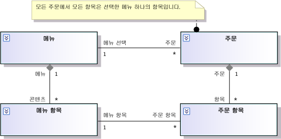

# 사용자 요구 사항 모델링

Visual Studio는 사용자 동작 및 목표 달성을 위해 시스템이 수행하는 작업에 대한 다이어그램을 그려 사용자 요구 사항을 이해, 논의 및 전달할 수 있도록 도와줍니다. 요구 사항 모델은 각각 사용자 요구의 다른 측면에 중점을 두는 다이어그램 집합입니다. 비디오 데모를 참조 하세요. [비즈니스 도메인 모델링](https://channel9.msdn.com/blogs/clinted/uml-with-vs-2010-part-3-modeling-the-business-domain)합니다.

각 모델 형식을 지원하는 Visual Studio 버전을 확인하려면 [Version support for architecture and modeling tools](../modeling/what-s-new-for-design-in-visual-studio.md#VersionSupport)를 참조하세요.

요구 사항 모델은 다음 작업에 도움이 됩니다.

- 내부 디자인과 별도로 시스템의 외부 동작에 집중합니다.

- 사용자 및 이해 관계자의 요구를 자연어보다 훨씬 명확하게 설명합니다.

- 사용자, 개발자 및 테스터가 사용할 수 있는 일관된 용어집을 정의합니다.

- 요구 사항의 차이 및 불일치를 줄입니다.

- 요구 사항 변경에 응답하는 데 필요한 작업을 줄입니다.

- 기능이 개발되는 순서를 계획합니다.

- 시스템 테스트의 기초로 모델을 사용하여 테스트 및 요구 사항 간의 관계를 명확하게 합니다. 요구 사항이 변경될 때 이 관계는 테스트를 올바르게 업데이트하는 데 도움이 됩니다. 이렇게 하면 시스템이 새 요구 사항을 충족합니다.

요구 사항 모델은 사용자 또는 해당 담당자와 논의에 집중하는 데 사용하고 반복을 시작할 때마다 다시 살펴보는 경우에 가장 큰 혜택을 제공합니다. 코드를 작성하기 전에 자세히 완료할 필요는 없습니다. 일반적으로 훨씬 간소화된 경우에도 부분적으로 작동하는 애플리케이션이 사용자와 요구 사항을 논의하는 데 가장 효율적인 기초가 됩니다. 모델은 이러한 논의의 결과를 요약하는 효과적인 방법입니다. 자세한 내용은 [모델을 사용 하 여 개발 프로세스에서](../modeling/use-models-in-your-development-process.md)합니다.

> [!NOTE]
> 이러한 항목 전체에서 "시스템"은 개발 중인 시스템 또는 애플리케이션을 의미합니다. 다양한 소프트웨어 및 하드웨어 구성 요소의 큰 컬렉션이거나, 단일 애플리케이션이거나, 큰 시스템 내의 소프트웨어 구성 요소일 수 있습니다. 어떤 경우에든, 요구 사항 모델은 사용자 인터페이스 또는 API를 통해 시스템 외부에서 표시되는 동작을 설명합니다.

## 일반 작업

사용자 요구 사항의 여러 가지 뷰를 만들 수 있습니다.  각 뷰는 특정 유형의 정보를 제공합니다.  이러한 뷰를 만들 때는 뷰 간에 자주 이동하는 것이 좋습니다. 임의 뷰에서 시작할 수 있습니다.

|다이어그램 또는 문서|요구 사항 모델에서 설명하는 항목|단원|
|-|-|-|
|개념적 클래스 다이어그램|요구 사항을 설명하는 데 사용되는 형식 용어집으로, 형식은 시스템 인터페이스에 표시됩니다.||
|추가 문서 또는 작업 항목|성능, 보안, 유용성 및 안정성 기준입니다.|[서비스 품질 요구 사항 설명](#QoSRequirements)|
|추가 문서 또는 작업 항목|특정 사용 사례와 관련이 없는 제약 조건 및 규칙|[비즈니스 규칙 표시](#BusinessRules)|

대부분의 다이어그램 형식은 다른 용도로 사용할 수 있습니다. 다이어그램 유형에 대 한 개요를 참조 하세요 [앱에 대 한 모델을 만들](../modeling/create-models-for-your-app.md)합니다.

##   Showing Business Rules

비즈니스 규칙은 특정 사용 사례와 연결되지 않은 요구 사항이며 시스템 전체에서 관찰되어야 합니다.

대부분의 비즈니스 규칙은 개념적 클래스 간의 관계에 대한 제약 조건입니다. 이 작성할 수 있습니다 *정적 비즈니스 규칙* 개념적 클래스 다이어그램의 관련 클래스를 사용 하 여 연결 된 주석으로 합니다. 예를 들어:

*동적 비즈니스 규칙* 은 허용되는 이벤트 시퀀스를 제한합니다. 예를 들어 시퀀스 또는 동작 다이어그램을 사용하여 사용자가 시스템에서 다른 작업을 수행하기 전에 로그인해야 함을 표시합니다.

그러나 대부분의 동적 규칙은 정적 규칙으로 대체하여 보다 효과적이고 일반적으로 지정할 수 있습니다. 예를 들어 개념적 클래스 모델의 클래스에 부울 특성 'Logged In'을 추가할 수 있습니다. 로그인 사용 사례의 사후 조건으로 Logged In을 추가하고, 대부분의 다른 사용 사례에 사전 조건으로 추가합니다. 이 접근 방식을 사용하면 이벤트 시퀀스의 가능한 모든 조합을 정의할 필요가 없습니다. 모델에 새 사용 사례를 추가해야 하는 경우에도 더 유연합니다.

여기서 선택 항목은 요구 사항을 정의하는 방법과 관련이 있으며 프로그램 코드에서 요구 사항을 구현하는 방법과는 독립적입니다.

자세한 내용은 다음 항목을 참조하세요.

|자세한 정보|읽기|
|-|-|
|비즈니스 규칙을 준수하는 코드를 개발하는 방법|[앱의 아키텍처 모델링](../modeling/model-your-app-s-architecture.md)|

##   Describing Quality of Service Requirements

여러 범주의 서비스 품질 요구 사항이 있습니다. 이러한 형식은 다음과 같습니다.

-   성능

-   보안

-   유용성

-   안정성

-   견고성

특정 사용 사례의 설명에 이러한 요구 사항 중 일부를 포함할 수 있습니다. 기타 요구 사항은 사용 사례와 관련이 없으며 별도 문서에 작성하는 것이 가장 효과적입니다. 가능하면 요구 사항 모델에서 정의된 어휘를 준수하는 것이 유용합니다. 다음 예제에서는 요구 사항에 사용된 주요 단어가 위 그림에서 행위자, 사용 사례 및 클래스의 제목입니다.

고객이 음식을 주문하는 동안 식당이 메뉴 항목을 삭제하는 경우 해당 메뉴 항목을 참조하는 주문 항목은 모두 빨간색으로 표시됩니다.

참조 [앱의 아키텍처 모델링](../modeling/model-your-app-s-architecture.md) 서비스 품질 요구 사항 따르는 코드를 개발 하는 방법입니다.

## 참고자료

- [개발 프로세스에서 모델 사용](../modeling/use-models-in-your-development-process.md)
- [앱의 아키텍처 모델링](../modeling/model-your-app-s-architecture.md)
