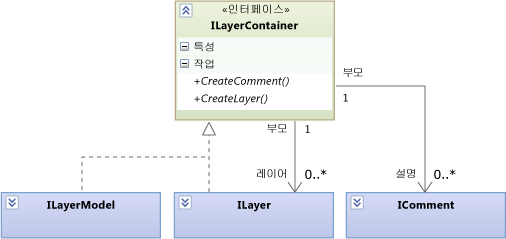
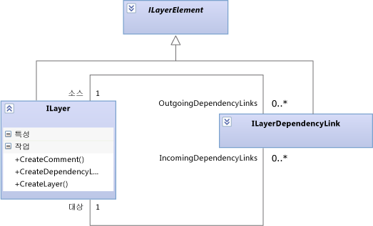
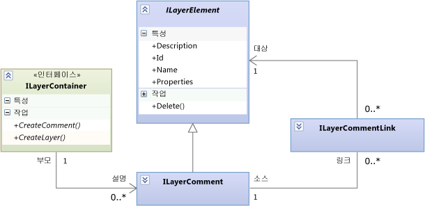
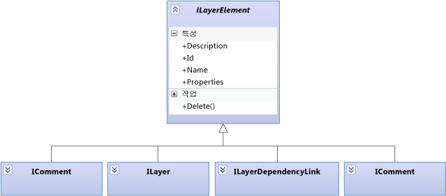

# <a name="navigate-and-update-layer-models-in-program-code"></a>프로그램 코드에서 레이어 모델 탐색 및 업데이트

이 문서에 요소 및 탐색 하 고 프로그램 코드를 사용 하 여 업데이트할 수 있는 레이어 모델의 관계를 설명 합니다. 사용자의 관점에서 종속성 다이어그램에 대 한 자세한 내용은 참조 하세요. [종속성 다이어그램: 참조](../modeling/layer-diagrams-reference.md) 하 고 [종속성 다이어그램: 지침](../modeling/layer-diagrams-guidelines.md)합니다.

합니다 <xref:Microsoft.VisualStudio.ArchitectureTools.Extensibility.Layer> 이 항목에서 설명 하는 모델은 보다 일반적인의 단순한 버전 <xref:Microsoft.VisualStudio.GraphModel> 모델입니다. 작성 하는 경우는 [메뉴 명령 또는 제스처 확장이](../modeling/add-commands-and-gestures-to-layer-diagrams.md)를 사용 하 여는 `Layer` 모델. 작성 하는 경우는 [레이어 유효성 검사 확장](../modeling/add-custom-architecture-validation-to-layer-diagrams.md)를 사용 하는 것이 쉽습니다는 `GraphModel`합니다.

## <a name="transactions"></a>트랜잭션

모델을 업데이트 하는 경우의 변경 내용을 포함할 고려를 `ILinkedUndoTransaction`, 변경 내용을 하나의 트랜잭션으로 그룹화 하는 합니다. 변경 작업에 실패 하면 전체 트랜잭션이 롤백됩니다. 사용자 변경 내용을 취소 하는 경우 모든 변경 내용을 모두 실행 취소 됩니다.

```csharp
using (ILinkedUndoTransaction t =
        LinkedUndoContext.BeginTransaction("a name"))
{
    // Make changes here ....
    t.Commit(); // Don't forget this!
}
```

## <a name="containment"></a>포함



레이어(<xref:Microsoft.VisualStudio.ArchitectureTools.Extensibility.Layer.ILayer>) 및 레이어 모델(<xref:Microsoft.VisualStudio.ArchitectureTools.Extensibility.Layer.ILayerModel>)은 주석과 레이어를 포함할 수 있습니다.

레이어(`ILayer`)는 레이어 모델(`ILayerModel`)에 포함될 수도 있고 다른 `ILayer` 내에 중첩될 수도 있습니다.

주석이나 레이어를 만들려면 해당 컨테이너에 대해 creation 메서드를 사용합니다.

## <a name="dependency-links"></a>종속성 링크

종속성 링크는 개체로 표시되며 양방향으로 탐색할 수 있습니다.



종속성 링크를 만들려면 `source.CreateDependencyLink(target)`를 호출합니다.

## <a name="comments"></a>설명

주석은 레이어 또는 레이어 모델에 포함될 수 있으며 레이어 요소에 연결할 수도 있습니다.



원하는 수만큼의 요소에 주석을 연결하거나 아무 요소에 연결하지 않을 수도 있습니다.

레이어 요소에 연결된 주석을 가져오려면 다음 코드를 사용합니다.

```csharp
ILayerModel model = diagram.GetLayerModel();
IEnumerable<ILayerComment> comments =
   model.Comments.Where(comment =>
      comment.Links.Any(link => link.Target == layerElement));
```

> [!CAUTION]
> `Comments`의 `ILayer` 속성은 `ILayer` 내에 포함된 주석을 가져옵니다. 그러나 이 속성은 그에 연결된 주석은 가져오지 않습니다.

호출 하 여 주석을 만들 `CreateComment()` 적절 한 컨테이너입니다.

주석에 대해 `CreateLink()`를 사용하여 링크를 만듭니다.

## <a name="layer-elements"></a>레이어 요소

모델에 포함할 수 있는 모든 형식의 요소는 레이어 요소입니다.



## <a name="properties"></a>속성

각 `ILayerElement`에는 `Properties`라는 문자열 디렉터리가 있습니다. 이 디렉터리를 사용하여 임의의 정보를 레이어 요소에 연결할 수 있습니다.

## <a name="artifact-references"></a>아티팩트 참조

아티팩트 참조(<xref:Microsoft.VisualStudio.ArchitectureTools.Extensibility.Layer.ILayerArtifactReference>)는 파일, 클래스, 폴더 등의 프로젝트 항목과 레이어 간 링크를 나타냅니다. 사용자 계층을 만들거나 솔루션 탐색기, 클래스 뷰 또는 개체 브라우저에서 종속성 다이어그램으로 항목을 끌어 추가할 때 아티팩트를 만듭니다. 아티팩트 참조는 원하는 수만큼 레이어에 연결할 수 있습니다.

레이어 탐색기의 각 행은 아티팩트 참조를 표시합니다. 자세한 내용은 [코드에서 종속성 다이어그램 만들기](../modeling/create-layer-diagrams-from-your-code.md)합니다.

아티팩트 참조와 관련된 기본 형식 및 메서드는 다음과 같습니다.

<xref:Microsoft.VisualStudio.ArchitectureTools.Extensibility.Layer.ILayerArtifactReference>. Categories 속성은 클래스, 실행 파일, 어셈블리 등 참조되는 아티팩트의 종류를 나타내며 Categories 속성 식별자 대상 아티팩트를 식별 하는 방법을 결정 합니다.

<xref:Microsoft.VisualStudio.ArchitectureTools.Extensibility.Layer.ArtifactReferenceExtensions.CreateArtifactReferenceAsync%2A>는 <xref:EnvDTE.Project>또는 <xref:EnvDTE.ProjectItem>에서 아티팩트 참조를 만듭니다. 이 작업은 비동기 작업입니다. 따라서 일반적으로 생성이 완료 되 면 호출 되는 콜백을 제공 합니다.

레이어 아티팩트 참조 사용 사례 다이어그램에서 아티팩트와 다릅니다.

## <a name="shapes-and-diagrams"></a>모양 및 다이어그램

레이어 모델의 각 요소를 나타내는 데 사용되는 두 개체는 <xref:Microsoft.VisualStudio.ArchitectureTools.Extensibility.Layer.ILayerElement> 및 <xref:Microsoft.VisualStudio.ArchitectureTools.Extensibility.Presentation.IShape>입니다. `IShape`는 다이어그램의 모양 크기와 위치를 나타냅니다. 레이어 모델의 모든 `ILayerElement` 하나가 `IShape`, 매 `IShape` 종속성 다이어그램에 하나 `ILayerElement`합니다. `IShape`는 UML 모델에도 사용됩니다. 그러므로 모든 `IShape`에 레이어 요소가 있는 것은 아닙니다.

마찬가지로 <xref:Microsoft.VisualStudio.ArchitectureTools.Extensibility.Layer.ILayerModel>도 <xref:Microsoft.VisualStudio.ArchitectureTools.Extensibility.Presentation.IDiagram> 하나에 표시됩니다.

사용자 지정 명령 또는 제스처 처리기의 코드에서는 `DiagramContext` 가져오기에서 현재 다이어그램 및 현재 모양 선택을 가져올 수 있습니다.

```csharp
public class ... {
[Import]
    public IDiagramContext DiagramContext { get; set; }
...
public void ... (...)
{ IDiagram diagram = this.DiagramContext.CurrentDiagram;
  ILayerModel model = diagram.GetLayerModel();
  if (model != null)
  { foreach (ILayer layer in model.Layers) { ... }}
  foreach (IShape selected in diagram.SelectedShapes)
  { ILayerElement element = selected.GetLayerElement();
    if (element != null) ... }}
```


<xref:Microsoft.VisualStudio.ArchitectureTools.Extensibility.Presentation.IShape> 및 <xref:Microsoft.VisualStudio.ArchitectureTools.Extensibility.Presentation.IDiagram>은 UML 모델을 표시할 때도 사용됩니다.

## <a name="see-also"></a>참고 항목

- [종속성 다이어그램에 명령 및 제스처 추가](../modeling/add-commands-and-gestures-to-layer-diagrams.md)
- [종속성 다이어그램에 사용자 지정 아키텍처 유효성 검사 추가](../modeling/add-custom-architecture-validation-to-layer-diagrams.md)
- [종속성 다이어그램에 사용자 지정 속성 추가](../modeling/add-custom-properties-to-layer-diagrams.md)
- [종속성 다이어그램: 참조](../modeling/layer-diagrams-reference.md)
- [종속성 다이어그램: 지침](../modeling/layer-diagrams-guidelines.md)
