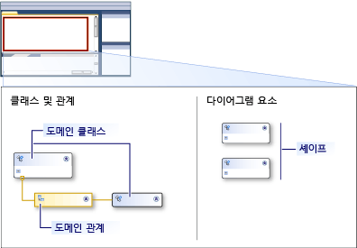

# 도메인별 언어 도구 사용자 인터페이스 개요
에 도메인 특정 언어 도구 (DSL 도구) 솔루션을 처음 열 [!INCLUDE[vsprvs](../code-quality/includes/vsprvs_md.md)], 사용자 인터페이스는 다음 그림과 유사 합니다.  
  
   
  
 다음 표에서 UI의 부분을 사용 하는 방법을 설명 합니다.  
  
|**요소**|**정의**|  
|-----------------|--------------------|  
|다이어그램|다이어그램은 도메인 모델을 표시합니다.   다이어그램에는 양측이 있습니다. 한 쪽 하면 모델에서 요소 형식을 정의합니다. 다른 쪽 모델 화면의 모양을 정의 합니다.|  
|도구 상자|도메인 클래스를 추가 하 고 다이어그램에 형식을 셰이프를 도구 상자에서 도구를 끕니다. 관계, 커넥터 및 도형 지도 추가 하려면 도구를 클릭 한 다음 다이어그램에서 소스 노드를 선택한 다음 대상 노드를 클릭 합니다.|  
|DSL 탐색기|**DSL 탐색기** DSL 정의 활성 창에 나타납니다. DSL 트리로 표시 됩니다. DSL 탐색기를 사용 하면 모델의 다이어그램에 표시 되지 않는 기능을 편집할 수 있습니다. 도구 상자 항목을 추가 하 고 사용 하 여 유효성 검사 프로세스에서 전환할 수 예를 들어는 **DSL 탐색기**합니다.|  
|DSL 세부 정보 창|**DSL 세부 정보** 창 요소가 표시 되는 방법 및 요소는 복사 하 고 삭제 하는 방법을 제어할 수 있도록 하는 모델의 요소를 도메인의 속성을 표시 합니다.   -기본적으로 **DSL 세부 정보** 창 옆에 표시 된 **오류 목록** 및 **출력** windows 합니다.|  
  
## 도메인 모델 다이어그램  
 도메인 모델 다이어그램은 두 부분으로 구분 됩니다. 다이어그램의 한쪽에서는 모델의 요소 및 관계를 보여 줍니다. 다른 쪽, 표시할 모델을가 하는 방식을 보여 줍니다. 요소 및 속성 모델 다이어그램을 표시 하는 데 사용 되는 셰이프를 포함 합니다. 다음 그림은 다이어그램의 요소를 보여 줍니다.  
  
   
  
 다음 표에서 도메인 모델 다이어그램의 요소 중 일부를 설명 합니다.  
  
|**Term**|**정의**|  
|--------------|--------------------|  
|도메인 클래스|도메인 클래스는 모델에 있는 요소의 형식입니다.   도메인 클래스는 둘 이상의 관계의 대상 이라면 다이어그램에서 두 번 이상 나타날 수 있습니다.   도메인 클래스를 추가 하려면 끌어에서 도메인 클래스 도구는 **도구 상자** 에 **클래스 및 관계** 다이어그램의 측면입니다.|  
|도메인 관계|도메인 관계는 모델에 있는 요소 간의 링크 형식입니다.   *포함 관계* 대상 요소가 소유 되거나 소스 요소에 포함 된 나타내고 실선으로 나타납니다. 모델의 모든 요소는 하나의 포함 관계의 대상 해야 하므로 모델 트리를 형성 합니다. A *참조 관계* 모델 요소 사이 일반 링크를 나타내고 파선으로 나타납니다. 모든 요소는 개수에 관계 없이 참조 링크를 가질 수 있습니다.   이 도구를 클릭 하 여 관계를 만들는 **도구 상자**원본 도메인 클래스를 클릭 하 고 대상 클래스를 클릭 한 다음, 합니다.|  
|모양 및 연결선|모양 지정에 대 한 DSL 다이어그램. 모델 요소를 표시 하는 방법, 커넥터 관계를 표시 하려면 사용할 수 있는 DSL 다이어그램에서 줄을 지정 합니다.   셰이프 또는 연결선을 만들려면 도구를 끌어는 **다이어그램 요소** 다이어그램의 측면입니다.|  
|모양 맵|도형 지도 표시 하는 도메인 클래스에 셰이프를 연결 하 고 도메인 모델 다이어그램이 나 표시 하는 도메인 관계에 대 한 커넥터를 선으로 나타납니다.|  
  
## 참고 항목  
 [도메인 특정 언어 도구 개요](../modeling/overview-of-domain-specific-language-tools.md)   
 [도메인 특정 언어 도구 용어집](http://msdn.microsoft.com/ca5e84cb-a315-465c-be24-76aa3df276aa)   
 [도메인별 언어 사용자 지정 및 확장](../modeling/customizing-and-extending-a-domain-specific-language.md)