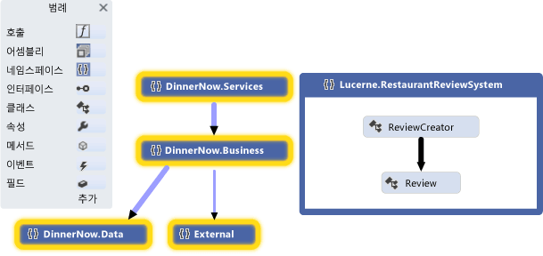
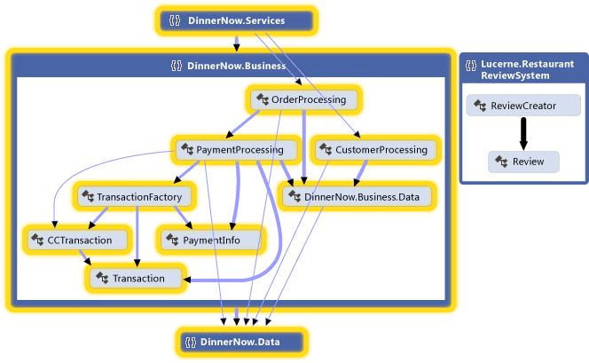
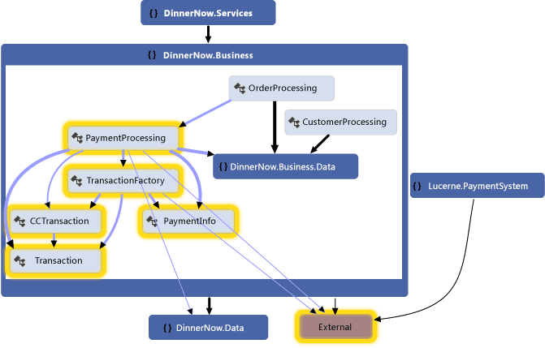
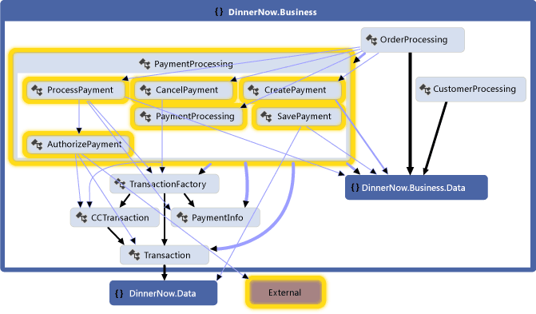
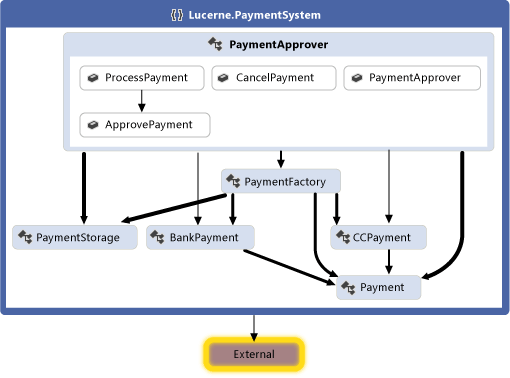
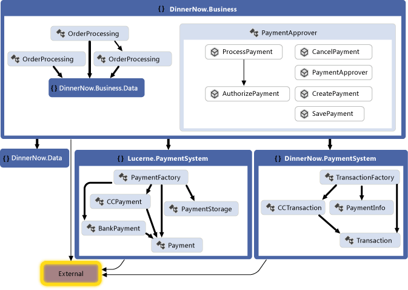
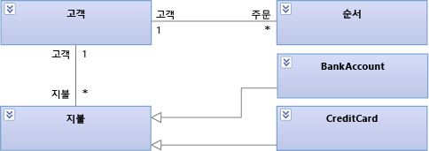
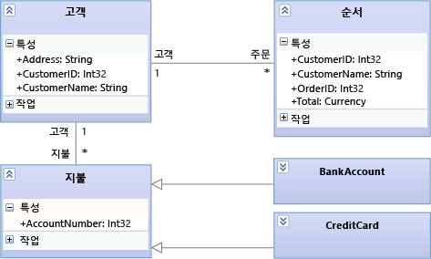
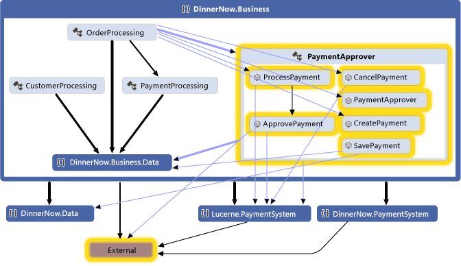
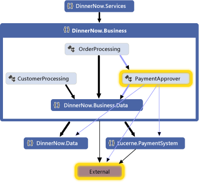

# 시나리오: 시각화 및 모델링을 사용하여 디자인 변경
Visual Studio에서 시각화 및 모델링 도구를 사용하여 소프트웨어 시스템이 사용자의 요구를 충족하는지 확인합니다.
코드 맵, 종속성 다이어그램 및 클래스 다이어그램을와 같은 도구를 사용 합니다.  

 각 도구를 지원하는 Visual Studio 버전을 확인하려면 [Version support for architecture and modeling tools](../modeling/what-s-new-for-design-in-visual-studio.md#VersionSupport)을 참조하세요.  

-   사용자의 요구 사항 및 비즈니스 프로세스를 분명하게 설명합니다.  

-   기존 코드를 시각화하고 탐색합니다.  

-   기존 시스템의 변경 내용을 설명합니다.  

-   시스템이 요구 사항을 충족하는지 확인합니다.  

-   코드와 디자인의 일관성을 유지합니다.  

 이 연습의 내용은 다음과 같습니다.  

-   어떻게 하면 이러한 도구를 소프트웨어 프로젝트에 유용하게 사용할 수 있는지 설명합니다.  

-   개발 접근 방식과 관계없이 예제 시나리오에서 이러한 도구를 사용하는 방법을 보여 줍니다.  

 이러한 도구 및 도구가 지원하는 시나리오에 대한 자세한 내용은 다음을 참조하세요.  

-   [아키텍처 분석 및 모델링](../modeling/analyze-and-model-your-architecture.md)  

-   [코드 시각화](../modeling/visualize-code.md)  

##   시나리오 개요  
 이 시나리오에서는 Dinner Now 및 Lucerne Publishing이라는 가상 회사 두 개의 소프트웨어 개발 수명 주기에 따른 에피소드를 설명합니다. Dinner Now는 시애틀에서 웹 기반 음식 배달 서비스를 제공합니다. 고객은 Dinner Now 웹 사이트에서 음식을 주문하고 결제할 수 있습니다. 주문은 배달을 위해 해당 현지 음식점에 전송됩니다. 뉴욕에 있는 회사인 Lucerne Publishing은 오프라인과 온라인으로 여러 가지 비즈니스를 운영합니다. 예를 들어 고객이 음식점 리뷰를 게시할 수 있는 웹 사이트를 운영합니다.  

 Lucerne은 최근에 Dinner Now를 인수했고, 다음과 같이 변경하고자 합니다.  

-   Dinner Now에 음식점 리뷰 기능을 추가하여 웹 사이트를 통합합니다.  

-   Dinner Now의 결제 시스템을 Lucerne 시스템으로 바꿉니다.  

-   전체 지역으로 Dinner Now 서비스를 확장합니다.  

 Dinner Now는 SCRUM 및 eXtreme 프로그래밍을 사용합니다. 강도 높은 테스트 검사를 수행하지만 지원되지 않는 코드가 거의 없습니다. 작지만 실제로 작동하는 시스템 버전을 만들고, 기능을 점차 추가하여 위험을 최소화합니다. 짧게 자주 반복하는 방식으로 코드를 개발합니다. 이를 통해 변경 사항을 자신 있게 포함하고, 코드를 자주 리팩터링하며, "BDUF(Big Design Up Front)"를 피합니다.  

 Lucerne은 매우 크고 복잡한 시스템 모음을 유지 관리하며 시스템의 일부는 40년 이상 사용하고 있습니다. 레거시 코드의 복잡성과 범위 때문에 변경하는 데 매우 신중합니다. 더 철저한 개발 프로세스를 따르면서 기본적으로 세부 솔루션을 디자인하고 개발 중에 발생하는 디자인 및 변경을 문서화하고자 합니다.  

 두 팀에서는 모두 사용자의 요구를 충족하는 시스템을 개발하도록 도와주는 Visual Studio의 모델링 다이어그램을 사용합니다. 작업을 계획, 구성 및 관리하도록 도와주는 다른 도구와 함께 Team Foundation Server를 사용합니다.  

 Team Foundation Server에 대한 자세한 내용은 다음을 참조하세요.  

-   [작업 계획 및 추적](#PlanningTracking)  

-   [업데이트된 코드 테스트, 유효성 검사 및 체크 인](#TestValidateCheckInCode)  

##   소프트웨어 개발에서 아키텍처 및 모델링 다이어그램의 역할  
 다음 표에서는 소프트웨어 개발 수명 주기의 여러 다양한 단계에서 이들 도구가 수행할 수 있는 역할에 대해 설명합니다.  

||**사용자 요구 사항 모델링**|**비즈니스 프로세스 모델링**|**시스템 아키텍처 및 디자인**|**코드 시각화 및 탐색**|**확인**|  
|------|------------------------------------|-----------------------------------|--------------------------------------|------------------------------------------|----------------------|  
|DSL(도메인별 언어) 다이어그램|예|예|예|||  
|종속성 다이어그램, 레이어 유효성 검사|||예|예|예|  
|코드 맵|||예|예|예|  
|클래스 디자이너(코드 기반)||||예||  

종속성 다이어그램을 그리려면 모델링 프로젝트는 기존 솔루션이 나 새 솔루션의 일부로 만들어야 합니다. 이들 다이어그램은 모델링 프로젝트에서 만들어야 합니다.
종속성 다이어그램의 항목 모델링 프로젝트에 있지만 일반 모델에 저장 되지 않습니다. 코드에서 생성된 코드 맵 및 .NET 클래스 다이어그램은 모델링 프로젝트 외부에 있습니다.  

 참조  

-   [코드에서 종속성 다이어그램 만들기](../modeling/create-layer-diagrams-from-your-code.md)  

-   [솔루션 전체의 종속성 매핑](../modeling/map-dependencies-across-your-solutions.md)  

-   [방법: 프로젝트에 클래스 다이어그램 추가(클래스 디자이너)](../ide/how-to-add-class-diagrams-to-projects-class-designer.md)  

-   [Visual Studio용 모델링 SDK - 도메인별 언어](../modeling/modeling-sdk-for-visual-studio-domain-specific-languages.md)  

[!INCLUDE[modeling_sdk_info](includes/modeling_sdk_info.md)]

 두 팀에서는 또한 종속성 유효성 검사를 사용 하 여 개발 중인 코드와 디자인의 일관성이 유지 되도록 합니다.  

 참조  

-   [코드와 디자인의 일관성 유지](#ValidatingCode)  

-   [논리적 아키텍처 설명: 종속성 다이어그램](#DescribeLayers)  

-   [종속성 다이어그램을 사용하여 코드 유효성 검사](../modeling/validate-code-with-layer-diagrams.md)  

    > [!NOTE]
    >  일부 버전의 Visual Studio 시각화 및 모델링에 대 한 종속성 유효성 검사 및 코드 맵 읽기 전용 버전을 지원합니다. 이 기능을 지원하는 Visual Studio 버전을 확인하려면 [Version support for architecture and modeling tools](../modeling/what-s-new-for-design-in-visual-studio.md#VersionSupport)을 참조하세요.  

##   시스템에 대한 정보 이해 및 전달  
 Visual Studio 모델링 다이어그램을 사용하는 데는 미리 정의된 순서가 없으므로 요구나 접근 방식에 맞게 사용할 수 있습니다. 일반적으로 팀에서는 프로젝트 내내 모델을 반복적으로 자주 다시 확인합니다. 각 다이어그램은 개발 중인 시스템의 다양한 측면을 이해, 설명 및 전달하도록 도와주는 특정 기능을 제공합니다.  

 Dinner Now 및 Lucerne은 다이어그램을 공통 언어로 사용하여 서로 소통하고 프로젝트 이해 관계자와 소통합니다. 예를 들어 Dinner Now는 다이어그램을 사용하여 다음 작업을 수행합니다.  

-   기존 코드를 시각화합니다.  

-   신규 또는 업데이트된 사용자 스토리에 대해 Lucerne과 소통합니다.  

-   신규 또는 업데이트된 사용자 스토리를 지원하는 데 필요한 변경 사항을 파악합니다.  

 Lucerne은 다이어그램을 사용하여 다음 작업을 수행합니다.  

-   Dinner Now의 비즈니스 프로세스를 알아봅니다.  

-   시스템 디자인을 이해합니다.  

-   신규 또는 업데이트된 사용자 요구 사항에 대해 Dinner Now와 소통합니다.  

-   시스템에 대한 업데이트를 문서화합니다.  

 다이어그램은 Team Foundation Server와 통합되므로 팀에서는 작업을 더 쉽게 계획, 관리 및 추적할 수 있습니다. 예를 들어 모델을 사용하여 테스트 사례 및 개발 작업을 식별하고 작업을 예측합니다. Lucerne은 Team Foundation Server 작업 항목을 모델 요소에 연결하여 진행 상황을 모니터링하고 시스템이 사용자 요구 사항을 충족하는지 확인할 수 있습니다. 예를 들어 사용 사례를 테스트 사례 작업 항목에 연결하여 모든 테스트를 통과할 때 사용 사례가 처리되는지 확인할 수 있습니다.  

 팀에서는 해당 변경 내용에서 체크 전에 유효성을 검사 하면 테스트 및 디자인에 대해 코드 종속성 유효성 검사 및 자동화 된 테스트를 포함 하는 빌드를 실행 하 여 합니다. 이렇게 하면 업데이트된 코드가 디자인과 충돌하지 않고 코드로 인해 이전에 작동한 기능이 중단되지 않는지 확인할 수 있습니다.  

 참조  

-   [기존 시스템에 대한 변경 식별](#DeterminingChanges)  

-   [Keeping code consistent with the design](#ValidatingCode)  

-   [모델 만들기 및 사용에 대한 일반적인 팁](#GeneralTips)  

-   [작업 계획 및 추적](#PlanningTracking)  

-   [업데이트된 코드 테스트, 유효성 검사 및 체크 인](#TestValidateCheckInCode)  

###   Identifying Changes to the Existing System  
 Dinner Now는 새 요구 사항을 충족하기 위한 비용을 예측해야 합니다. 비용은 부분적으로 이 변경이 시스템의 다른 부분에 얼마나 영향을 미치는지에 따라 달라집니다. 이 흐름을 이해하는 데 도움이 되도록 Dinner Now 개발자 한 명이 기존 코드에서 다음 맵 및 다이어그램을 만듭니다.  

|**맵 또는 다이어그램**|**보여 주는 것**|  
|------------------------|---------------|  
|*코드 맵*   참조   -   [솔루션 전체의 종속성 매핑](../modeling/map-dependencies-across-your-solutions.md) -   [찾아보기 및 코드 맵을 다시 정렬](../modeling/browse-and-rearrange-code-maps.md) -   [DGML 파일을 편집 하 여 코드 맵 사용자 지정](../modeling/customize-code-maps-by-editing-the-dgml-files.md)|코드의 종속성 및 기타 관계.   예를 들어 Dinner Now는 어셈블리 및 해당 종속성을 살펴보기 위해 먼저 어셈블리 코드 맵을 검토할 수 있습니다. 맵을 분석하여 해당 어셈블리의 네임스페이스 및 클래스를 살펴볼 수 있습니다.   Dinner Now에서 맵을 만들어서 코드의 특정 영역 및 다른 관계 종류를 살펴볼 수도 있습니다. 솔루션 탐색기를 사용하여 관심 있는 영역 및 관계를 찾고 선택합니다.|  
|*코드 기반 클래스 다이어그램*   [How to: Add Class Diagrams to Projects (Class Designer)](../ide/how-to-add-class-diagrams-to-projects-class-designer.md)을 참조하세요.|코드의 기존 클래스|  

 예를 들어 개발자는 코드 맵을 만듭니다. 범위를 조정하여 새 시나리오가 영향을 미치는 영역에 초점을 맞춥니다. 맵에서 다음 영역이 선택되고 강조 표시됩니다.  

   

 **네임스페이스 코드 맵**  

 개발자는 선택된 네임스페이스를 확장하여 클래스, 메서드 및 관계를 표시합니다.  

   

 **그룹 간 링크가 표시된 확장된 네임스페이스 코드 맵**  

 개발자는 코드를 검사하여 영향을 받는 클래스 및 메서드를 찾습니다. 변경할 때 각 변경이 미치는 영향을 확인하기 위해 각 변경 후에 코드 맵을 다시 생성합니다. 참조 [코드를 시각화](../modeling/visualize-code.md)합니다.  

 구성 요소 또는 상호 작용과 같은 시스템의 다른 부분에 대한 변경 내용을 설명하기 위해 팀에서는 화이트보드에 이들 요소를 그릴 수 있습니다. 두 팀 모두가 세부 정보를 캡처, 관리 및 이해할 수 있도록 Visual Studio에서 다음 다이어그램을 그릴 수도 있습니다.  

|**다이어그램**|**설명 내용**|  
|------------------|-------------------|  
|*코드 기반 클래스 다이어그램*   [How to: Add Class Diagrams to Projects (Class Designer)](../ide/how-to-add-class-diagrams-to-projects-class-designer.md)을 참조하세요.|코드의 기존 클래스.|  

###   코드와 디자인의 일관성 유지  
 Dinner Now는 업데이트된 코드와 디자인의 일관성이 유지되는지 확인해야 합니다. 시스템의 기능 레이어를 설명, 및 연결 솔루션 아티팩트를 레이어에 간에 허용 되는 종속성을 지정 하는 종속성 다이어그램을 만듭니다.  

|**다이어그램**|**설명 내용**|  
|-----------------|-------------------|  
|*종속성 다이어그램*   참조   -   [코드에서 종속성 다이어그램 만들기](../modeling/create-layer-diagrams-from-your-code.md) -   [종속성 다이어그램: 참조](../modeling/layer-diagrams-reference.md) -   [종속성 다이어그램: 지침](../modeling/layer-diagrams-guidelines.md) -   [종속성 다이어그램으로 코드 유효성 검사](../modeling/validate-code-with-layer-diagrams.md)|코드의 논리적 아키텍처.   종속성 다이어그램을 구성 하 고의 아티팩트를 매핑하는 [!INCLUDE[vsprvs](../code-quality/includes/vsprvs_md.md)] 라는 추상 그룹에는 솔루션 *레이어*합니다. 이들 레이어는 아티팩트가 시스템에서 수행하는 역할, 작업 또는 기능을 식별합니다.   레이어 다이어그램은 의도한 시스템 디자인을 설명하고 해당 디자인에 대해 발전하는 코드의 유효성을 검사하는 데 유용합니다.   레이어를 만들려면 솔루션 탐색기, 코드 맵, 클래스 뷰 및 개체 브라우저에서 항목을 끌어옵니다. 새 레이어를 그리려면 도구 상자를 사용하거나 다이어그램 곡면을 마우스 오른쪽 단추로 클릭합니다.   기존 종속성을 보려면 레이어 다이어그램 곡면을 마우스 오른쪽 단추로 클릭하고 **종속성 생성**을 클릭합니다. 의도한 종속성을 지정하려면 새 종속성을 그립니다.|  

 예를 들어 다음 종속성 다이어그램에서는 레이어 간 종속성 및 각 레이어와 연결 된 아티팩트의 수를 설명 합니다.  

   

 **종속성 다이어그램**  

 코드 개발 중에 디자인 충돌이 발생 하지 않는 하려면 빌드에 종속성 유효성 검사에 사용 하 여 팀이 Team Foundation Build에서 실행 됩니다. 체크 인 작업에서 종속성 유효성 검사를 요구 하는 사용자 지정 MSBuild 작업을 만들 수도 있습니다. 빌드 보고서를 사용하여 유효성 검사 오류를 수집합니다.  

 참조  

-   [빌드 프로세스 정의](http://msdn.microsoft.com/Library/61593e10-d24b-492f-b19a-af4d85abea6b)  

-   [제어된 체크 인 빌드 프로세스를 사용하여 변경 내용 유효성 검사](http://msdn.microsoft.com/Library/9cfc8b9c-1023-40fd-8ab5-1b1bd9c172ec)  

-   [빌드 프로세스 템플릿 사용자 지정](http://msdn.microsoft.com/Library/b94c58f2-ae6f-4245-bedb-82cd114f6039)  

###   General Tips for Creating and Using Models  

-   대부분 다이어그램은 선으로 연결된 노드로 구성됩니다. 각 다이어그램 유형에 대한 도구 상자에서는 다양한 도구 및 선을 제공합니다.  

     도구 상자를 열려면 **보기** 메뉴에서 **도구 상자**를 클릭합니다.  

-   노드를 만들려면 도구 상자에서 다이어그램으로 노드를 끌어옵니다. 특정 노드 종류는 기존 노드에 끌어서 놓아야 합니다. 예를 들어 구성 요소 다이어그램에서 새 포트는 기존 구성 요소에 추가해야 합니다.  

-   선 또는 연결을 만들려면 도구 상자에서 해당 도구를 클릭하고 소스 노드, 대상 노드를 차례로 클릭합니다. 일부 선은 특정 노드 종류 사이에서만 만들 수 있습니다. 포인터를 가능한 소스 또는 대상 위로 이동하면 포인터가 연결을 만들 수 있는지 여부를 표시합니다.  

###   Planning and Tracking Work  
 Visual Studio 모델링 다이어그램은 Team Foundation Server와 통합되므로 작업을 더 쉽게 계획, 관리 및 추적할 수 있습니다. 두 팀에서는 모두 모델을 사용하여 테스트 사례 및 개발 작업을 식별하고 작업을 예측합니다. Lucerne은 Team Foundation Server 작업 항목을 만들고 사용 사례 및 구성 요소 등의 모델 요소에 연결합니다. 이렇게 하면 진행 상황을 모니터링하고 작업을 다시 사용자 요구 사항에 맞춰 추적할 수 있습니다. 이를 통해 변경 내용이 해당 요구 사항을 계속 충족하는지 확인할 수 있습니다.  

 작업이 진행됨에 따라 팀에서는 작업 항목을 업데이트하여 작업에 걸린 시간을 반영합니다. 다음 Team Foundation Server 기능을 사용하여 작업 상태를 모니터링 및 보고합니다.  

-   일일 *번다운(Burndown) 보고서* - 계획된 작업을 예상 시간 안에 완료할지를 보여 줍니다. Team Foundation Server에서 기타 비슷한 보고서를 생성하여 버그 진행 상황을 추적합니다.  

-   *반복 워크시트* - Microsoft Excel을 사용하여 팀에서 구성원 간의 작업 부하를 모니터링하고 균형을 맞추도록 도와줍니다. 이 워크시트는 Team Foundation Server에 연결되고 정기적인 진행 회의 중에 논의할 중점 사안을 제공합니다.  

-   *개발 대시보드* - Office Project를 사용하여 중요한 프로젝트 정보를 팀에 지속적으로 제공합니다.  

 참조  

-   [Visual Studio Team Services 또는 Team Foundation Server를 사용하여 작업 추적](http://msdn.microsoft.com/Library/52aa8bc9-fc7e-4fae-9946-2ab255ca7503)  

-   [Visual Studio ALM용 차트, 대시보드 및 보고서](http://msdn.microsoft.com/Library/1f28ba6c-c5e5-46d3-9209-ede24ae78e48)  

-   [Project를 사용하여 백로그 및 작업 만들기](http://msdn.microsoft.com/Library/be5cef4f-755f-4ffe-8dd7-876d1e02c330)  

###   코드 테스트, 유효성 검사 및 체크 인  
 팀에서 각 작업을 완료하면 코드를 Team Foundation 버전 제어에 체크 인하고 잊지 않도록 Team Foundation Server에서 미리 알림을 수신합니다. Team Foundation Server가 체크 인을 승인, 하기 전에 팀에서는 단위 테스트 및 테스트 사례 및 디자인에 대 한 코드를 확인 하는 종속성 유효성 검사를 실행 합니다. Team Foundation Server를 사용 하 여 빌드를 실행 하는 이러한 자동화 된 단위 테스트 및 종속성 유효성 검사를 정기적으로 합니다. 이렇게 하면 코드가 다음 기준을 충족하는지 확인할 수 있습니다.  

-   예상대로 작동합니다.  

-   이전에 작동한 코드가 중단되지 않습니다.  

-   디자인과 충돌하지 않습니다.  

 Dinner Now의 자동화된 대규모 테스트 컬렉션은 지금도 거의 모두 적용되고 있기 때문에 Lucerne이 다시 사용할 수 있습니다. Lucerne은 이들 테스트를 기반으로 빌드하고 새 기능을 다루는 새 테스트를 추가할 수 있습니다. 두 팀에서는 모두 Visual Studio를 사용한 수동 테스트도 실행합니다.  

 을 코드의 디자인을 따르는지 확인 하기 위해 팀에서는 종속성 유효성 검사를 포함 하도록 Team Foundation Build에서 해당 빌드를 구성 합니다. 충돌이 발생하면 세부 정보가 포함된 보고서가 생성됩니다.  

 참조  

-   [응용 프로그램 테스트](https://www.visualstudio.com/docs/test/overview)  

-   [개발하는 동안 시스템 유효성 검사](../modeling/validate-your-system-during-development.md)  

-   [버전 제어 사용](http://go.microsoft.com/fwlink/?LinkID=525605)  

-   [빌드 및 릴리스](/vsts/build-release/index)  

##   Updating the System Using Visualization and Modeling  
 Lucerne과 Dinner Now는 결제 시스템을 통합해야 합니다. 다음 섹션에서는 이 작업을 하는 데 도움이 되는 Visual Studio의 모델링 다이어그램을 보여 줍니다.  

-   [기존 코드 시각화: 코드 맵](#VisualizeCode)  

-   [형식 용어집 정의: 클래스 다이어그램](#DefineClasses)  

-   [논리적 아키텍처 설명: 종속성 다이어그램](#DescribeLayers)  

 참조  

-   [코드 시각화](../modeling/visualize-code.md)  

-   [개발 프로세스에서 모델 사용](../modeling/use-models-in-your-development-process.md)  

-   [앱의 아키텍처 모델링](../modeling/model-your-app-s-architecture.md)  

###   기존 코드 시각화: 코드 맵  
 코드 맵은 코드의 현재 구성 및 관계를 보여 줍니다. 항목은 맵에서 *노드* 로 표시되고 관계는 *링크*로 표시됩니다. 코드 맵을 통해 다음과 같은 작업을 수행할 수 있습니다.  

-   친숙하지 않은 코드를 살펴봅니다.  

-   제안된 변경이 기존 코드에 영향을 미칠 수 있는 경우 및 방식을 이해합니다.  

-   복잡성, 자연 스러운 종속성 또는 패턴의 영역이 나 향상 된 기능을 이용할 수 있는 기타 영역을 찾습니다.  

 예를 들어 Dinner Now는 PaymentProcessing 구성 요소 업데이트 비용을 예측해야 합니다. 비용은 부분적으로 이 변경이 시스템의 다른 부분에 얼마나 영향을 미치는지에 따라 달라집니다. 이 흐름을 이해하는 데 도움이 되도록 Dinner Now 개발자의 한 명이 코드에서 코드 맵을 생성하고 변경이 영향을 미칠 수 있는 영역에서 범위 초점을 조정합니다.  

 다음 맵은 PaymentProcessing 클래스와 선택된 것으로 표시되는 Dinner Now 시스템 다른 파트 간의 종속성을 보여 줍니다.  

   

 **Dinner Now 결제 시스템에 대한 코드 맵**  

 개발자는 PaymentProcessing 클래스를 확장하고 해당 구성원을 선택하여 영향을 받을 수 있는 영역을 확인하는 방식으로 맵을 살펴봅니다.  

   

 **PaymentProcessing 클래스 내부 메서드 및 해당 종속성**  

 Lucerne 결제 시스템에 대한 다음 맵을 생성하여 클래스, 메서드 및 종속성을 검사합니다. 팀에서는 Lucerne 시스템에 Dinner Now의 다른 부분과 상호 작용하기 위해 작업이 필요한지를 확인합니다.  

   

 **Lucerne 결제 시스템에 대한 코드 맵**  

 두 팀이 모두 협력하여 두 시스템을 통합하는 데 필요한 변경 내용을 결정합니다. 더 쉽게 업데이트할 수 있게 일부 코드를 리팩터링하도록 결정합니다. PaymentApprover 클래스는 DinnerNow.Business 네임스페이스로 이동하며 몇 가지 새로운 메서드가 필요합니다. 트랜잭션을 처리하는 Dinner Now 클래스에는 자체 네임스페이스가 있습니다. 팀에서는 작업 항목을 만들고 사용하여 작업을 계획, 구성 및 추적합니다. 필요할 경우 작업 항목을 모델 요소에 연결합니다.  

 코드를 재구성하고 나서 팀에서는 새 코드 맵을 생성하여 업데이트된 구조와 관계를 확인합니다.  

   

 **코드를 재구성한 코드 맵**  

 이 맵은 PaymentApprover 클래스가 현재 DinnerNow.Business 네임스페이스에 있고 몇 가지 새로운 메서드를 포함한다는 것을 보여 줍니다. Dinner Now 트랜잭션 클래스에는 현재 자체 PaymentSystem 네임스페이스가 있고 이를 통해 나중에 해당 코드를 더 쉽게 처리할 수 있습니다.  

#### 코드 맵 만들기  

-   소스 코드의 간략한 개요를 확인하려면 다음 단계에 따라 코드 맵을 생성합니다.  

     **아키텍처** 메뉴에서 **솔루션용 코드 맵 생성**을 클릭합니다.  

     컴파일된 코드의 간략한 개요를 확인하려면 빈 코드 맵을 만들고 어셈블리 파일이나 이진 파일을 맵 표면으로 끌어옵니다.  

-   특정 코드 또는 솔루션 항목을 살펴보려면 솔루션 탐색기를 사용하여 시각화할 항목 및 관계를 선택합니다. 그다음에 새 맵을 생성하거나 선택된 항목을 기존 맵에 추가할 수 있습니다. 참조 [솔루션 전체의 종속성 매핑](../modeling/map-dependencies-across-your-solutions.md)합니다.  

-   맵을 살펴보는 데 도움이 되도록 수행할 작업 종류에 맞게 레이아웃을 다시 정렬합니다.  

     예를 들어 코드에서 레이어를 시각화하려면 트리 레이아웃을 선택합니다. 참조 [찾아보기 및 다시 정렬 코드 맵](../modeling/browse-and-rearrange-code-maps.md)합니다.  

#### 요약: 코드 맵의 장점  
 코드 맵을 통해 다음을 수행할 수 있습니다.  

-   기존 코드의 구성 및 관계에 대해 알아봅니다.  

-   제안된 변경이 영향을 받을 수 있는 영역을 식별합니다.  

-   복잡성, 패턴, 레이어의 영역이나 코드를 더 쉽게 유지 관리, 변경 및 다시 사용하도록 향상할 수 있는 기타 영역을 찾습니다.  

#### 다른 다이어그램과의 관계  

|**다이어그램**|**설명 내용**|  
|-----------------|-------------------|  
|종속성 다이어그램|시스템의 논리적 아키텍처. 종속성 유효성 검사를 사용 하 여 코드와 디자인의 일관성이 유지 되도록 합니다.   를 기존 dependencys 또는 의도 된 dependencys 식별할 수 있도록 코드 맵을 만들고 관련된 항목을 그룹화 합니다. 종속성 다이어그램을 만들려면 다음을 참조 하세요.   -   [코드에서 종속성 다이어그램 만들기](../modeling/create-layer-diagrams-from-your-code.md) -   [종속성 다이어그램: 지침](../modeling/layer-diagrams-guidelines.md)|  
|클래스 다이어그램(코드 기반)|특정 프로젝트에 대한 코드의 기존 클래스.   코드에서 기존 클래스를 시각화 및 수정하려면 클래스 디자이너를 사용합니다.   [How to: Add Class Diagrams to Projects (Class Designer)](../ide/how-to-add-class-diagrams-to-projects-class-designer.md)을 참조하세요.|  

###   형식 용어집 정의: 클래스 다이어그램  
 클래스 다이어그램에서는 시스템에 참가하는 엔터티, 용어 또는 개념과 서로 간의 관계를 정의합니다. 예를 들어 개발 중에 이들 다이어그램을 사용하여 구현 언어나 스타일과 관계없이 각 클래스에 대한 특성 및 작업을 설명할 수 있습니다.  

 Lucerne은 Process Payment 사용 사례에 참가하는 엔터티를 설명하고 논의하는 데 도움이 되도록 다음 클래스 다이어그램을 그립니다.  

   

 **클래스 다이어그램의 Process Payment 엔터티**  

 이 다이어그램에서는 고객에게 많은 주문과 다양한 주문 결제 방법이 있음을 보여 줍니다. BankAccount 및 CreditCard는 둘 다 Payment에서 상속됩니다.  

 개발 중에 Lucerne은 다음 클래스 다이어그램을 사용하여 각 클래스의 세부 정보를 설명하고 논의합니다.  

   

 **클래스 다이어그램의 Process Payment 세부 정보**  

#### 클래스 다이어그램 그리기  
 클래스 다이어그램의 주요 기능은 다음과 같습니다.  

-   클래스, 인터페이스 및 열거형 등의 형식:  

    -   *클래스* 는 특정 구조 또는 동작 특성을 공유하는 개체의 정의입니다.  

    -   *인터페이스* 는 개체의 외부적으로 표시되는 동작 파트를 정의합니다.  

    -   *열거형* 은 리터럴 값 목록을 포함하는 분류자입니다.  

-   *특성* 은 *분류자*의 각 인스턴스를 설명하는 특정 형식 값입니다. 분류자는 형식, 구성 요소, 사용 사례 및 행위자의 일반 이름입니다.  

-   *작업* 은 분류자의 인스턴스가 수행할 수 있는 메서드 또는 함수입니다.  

-   *연결* 은 두 분류자 간의 몇 가지 관계를 나타냅니다.  

    -   *집합체* 는 분류자 간에 공유되는 소유권을 나타내는 연결입니다.  

    -   *컴퍼지션* 은 분류자 간에 전체-부분 관계를 나타내는 연결입니다.  

     집합체 또는 컴퍼지션을 표시하려면 연결에서 **집합체** 속성을 설정합니다. **공유** 는 집합체를 표시하고 **복합** 은 컴퍼지션을 표시합니다.  

-   *종속성* 은 한 분류자의 정의를 변경하면 다른 분류자의 정의가 변경될 수 있음을 나타냅니다.  

-   *일반화* 는 특정 분류자가 일반 분류자에서 정의 파트를 상속함을 나타냅니다. *인식* 은 클래스가 인터페이스에서 제공된 작업 및 특성을 구현함을 나타냅니다.  

     이들 관계를 만들려면 **상속** 도구를 사용합니다. 인식이 *롤리팝*으로 표시될 수도 있습니다.  

-   *패키지* 는 분류자, 연결, 수명선, 구성 요소 및 기타 패키지의 그룹입니다. *가져오기* 관계는 한 패키지에 다른 패키지의 모든 정의가 포함됨을 나타냅니다.  

 기존 클래스를 살펴보고 논의하려면 먼저 클래스 디자이너를 사용하여 코드에서 클래스 다이어그램을 만듭니다.  

-   [방법: 프로젝트에 클래스 다이어그램 추가(클래스 디자이너)](../ide/how-to-add-class-diagrams-to-projects-class-designer.md)  

#### 요약: 클래스 다이어그램의 장점  
 클래스 다이어그램을 통해 다음을 정의할 수 있습니다.  

-   사용자 요구 및 시스템에 참가하는 엔터티에 대해 논의할 때 사용할 일반 용어집. 참조 [사용자 요구 사항을 모델링할](../modeling/model-user-requirements.md)합니다.  

-   구현과 관계없이 구성 요소와 같은 시스템 파트에서 사용되는 형식. 참조 [응용 프로그램의 아키텍처 모델링](../modeling/model-your-app-s-architecture.md)합니다.  

-   종속성과 같은 형식 간 관계. 예를 들어 한 형식을 다른 형식의 여러 인스턴스와 연결할 수 있다는 것을 표시할 수 있습니다.  

#### 다른 다이어그램과의 관계  

|**다이어그램**|**설명**|  
|-----------------|---------------------|  
|종속성 다이어그램|시스템의 논리적 아키텍처를 클래스에 대한 관계로 설명합니다.   종속성 유효성 검사를 사용 하 여 코드와 디자인의 일관성이 유지 되도록 합니다.   참조   -   [코드에서 종속성 다이어그램 만들기](../modeling/create-layer-diagrams-from-your-code.md) -   [종속성 다이어그램: 참조](../modeling/layer-diagrams-reference.md) -   [종속성 다이어그램: 지침](../modeling/layer-diagrams-guidelines.md) -   [종속성 다이어그램으로 코드 유효성 검사](../modeling/validate-code-with-layer-diagrams.md)|  
|코드 맵|기존 코드에서 구성 및 관계를 시각화합니다.   클래스, 해당 관계 및 해당 메서드를 식별하려면 해당 요소를 표시하는 코드 맵을 만듭니다.   참조   -   [솔루션 전체의 종속성 매핑](../modeling/map-dependencies-across-your-solutions.md)|  

###   논리적 아키텍처 설명: 종속성 다이어그램  
 솔루션의 아티팩트를 추상 그룹으로 구성 하 여 시스템의 논리적 아키텍처를 설명 하는 종속성 다이어그램 또는 *레이어*합니다. 아티팩트는 네임스페이스, 프로젝트, 클래스, 메서드 등 다양한 항목에 해당할 수 있습니다. 레이어는 아티팩트가 시스템에서 수행하는 역할 또는 작업을 표시하고 설명합니다. 빌드 및 체크 인 작업에 레이어 유효성 검사를 포함하여 코드와 디자인의 일관성이 유지되는지 확인할 수도 있습니다.  

 코드와 디자인의 일관성을 유지 하기 위해 Dinner Now 및 Lucerne 발전 함에 따라 코드의 유효성을 검사 하려면 다음 종속성 다이어그램을 사용 합니다.  

   

 **Lucerne과 Dinner Now에 대 한 종속성 다이어그램 통합**  

 이 다이어그램의 레이어는 해당하는 Dinner Now 및 Lucerne 솔루션 아티팩트에 연결됩니다. 예를 들어 비즈니스 레이어는 현재 PaymentApprover 클래스를 포함하는 DinnerNow.Business 네임스페이스 및 해당 구성원에 연결됩니다. 리소스 액세스 레이어는 DinnerNow.Data 네임스페이스에 연결됩니다. 화살표 또는 *종속성*은 비즈니스 레이어에서만 리소스 액세스 레이어의 기능을 사용할 수 있도록 지정합니다. 팀에서 해당 코드를 업데이트하면 레이어 유효성 검사가 주기적으로 수행되어 충돌이 발생할 때 이를 catch하고 팀에서 충돌을 빠르게 해결하도록 도와줍니다.  

 팀에서는 협력하여 두 시스템을 점차 통합하고 테스트합니다. PaymentProcessing을 처리하기 전에 먼저 PaymentApprover와 Dinner Now의 나머지 부분이 서로 성공적으로 연동되는지 확인합니다.  

 다음 코드 맵은 Dinner Now와 PaymentApprover 간의 새로운 호출을 보여 줍니다.  

   

 **메서드 호출이 업데이트된 코드 맵**  

 시스템이 예상대로 작동하는지 확인하고 나서 Dinner Now는 PaymentProcessing 코드를 주석으로 처리합니다. 레이어 유효성 검사 보고서는 분명하며, 결과 코드 맵은 PaymentProcessing 종속성이 존재하지 않음을 보여 줍니다.  

   

 **PaymentProcessing이 없는 코드 맵**  

#### 종속성 다이어그램 그리기  
 종속성 다이어그램의 주요 기능은 다음과 같습니다.  

-   *레이어* - 아티팩트의 논리 그룹을 설명합니다.  

-   *링크* - 레이어와 아티팩트 간 연결입니다.  

     아티팩트에서 레이어를 만들려면 솔루션 탐색기, 코드 맵, 클래스 뷰 또는 개체 브라우저에서 항목을 끌어옵니다. 새 레이어를 그리고 아티팩트에 연결하려면 도구 상자를 사용하거나 다이어그램 곡면을 마우스 오른쪽 단추로 클릭하여 레이어를 만들고 항목을 해당 레이어에 끌어옵니다.  

     레이어의 숫자는 해당 레이어에 연결된 아티팩트의 수를 나타냅니다. 이들 아티팩트는 네임스페이스, 프로젝트, 클래스, 메서드 등에 해당할 수 있습니다. 레이어의 아티팩트 수를 해석할 때 다음을 고려하세요.  

    -   레이어가 직접 연결되지 않은 다른 아티팩트를 포함하는 아티팩트에 연결된 경우 연결된 아티팩트만 숫자에 포함됩니다. 그러나 레이어 유효성 검사 중에는 직접 연결되지 않은 다른 아티팩트도 분석을 위해 포함됩니다.  

         예를 들어 레이어가 단일 네임스페이스에 연결된 경우 해당 네임스페이스에 클래스가 들어 있더라도 연결된 아티팩트의 수는 1입니다. 레이어가 네임스페이스의 각 클래스에도 연결되어 있으면 연결된 클래스가 숫자에 포함됩니다.  

    -   레이어가 아티팩트에 연결된 다른 레이어를 포함하면 컨테이너 레이어가 이 아티팩트에도 연결됩니다. 단, 컨테이너 레이어의 숫자에는 이러한 아티팩트가 포함되지 않습니다.  

     계층에 연결 된 아티팩트를 보려면 종속성을 마우스 오른쪽 단추로 클릭 하 고 클릭 **링크 보기** 열려는 **레이어 탐색기**합니다.  

-   *종속성* 은 한 레이어에서 다른 레이어의 기능을 사용할 수 있지만 반대의 경우는 불가능함을 나타냅니다. *양방향 종속성* 은 한 레이어에서 다른 레이어의 기능을 사용할 수 있고 반대 방향으로도 가능함을 나타냅니다.  

     종속성 다이어그램에 기존 종속성을 표시 하려면 다이어그램 곡면을 마우스 오른쪽 단추로 클릭 하 고 클릭 **종속성 생성**합니다. 의도한 종속성을 설명하려면 새 종속성을 그립니다.  

 참조  

-   [코드에서 종속성 다이어그램 만들기](../modeling/create-layer-diagrams-from-your-code.md)  

-   [종속성 다이어그램: 참조](../modeling/layer-diagrams-reference.md)  

-   [종속성 다이어그램: 지침](../modeling/layer-diagrams-guidelines.md)  

-   [종속성 다이어그램을 사용하여 코드 유효성 검사](../modeling/validate-code-with-layer-diagrams.md)  

#### 요약: 종속성 다이어그램의 장점  
 종속성 다이어그램 데 유용 합니다.  

-   아티팩트의 기능에 따라 시스템의 논리적 아키텍처를 설명합니다.  

-   개발 중인 코드가 지정된 디자인을 준수하는지 확인합니다.  

#### 다른 다이어그램과의 관계  

|**다이어그램**|**설명**|  
|-----------------|---------------------|  
|코드 맵|기존 코드에서 구성 및 관계를 시각화합니다.   레이어를 만들려면 코드 맵을 생성하고 맵에서 항목을 잠재적인 레이어로 그룹화합니다. 맵에서 그룹 종속성 다이어그램으로 끌어 옵니다.   참조   -   [솔루션 전체의 종속성 매핑](../modeling/map-dependencies-across-your-solutions.md) -   [찾아보기 및 코드 맵을 다시 정렬](../modeling/browse-and-rearrange-code-maps.md)|  

## 외부 리소스  

|**범주**|**Links**|  
|------------------|---------------|  
|**포럼**|-   [Visual Studio 시각화 및 모델링 도구](http://go.microsoft.com/fwlink/?LinkId=184720) -   [Visual Studio 시각화 및 모델링 SDK(DSL 도구)](http://go.microsoft.com/fwlink/?LinkId=184721)|  

## 참고자료

[코드 시각화](../modeling/visualize-code.md)   
[개발 프로세스에서 모델을 사용 하 여](../modeling/use-models-in-your-development-process.md)   
[Agile 개발에서 모델 사용](http://msdn.microsoft.com/592ac27c-3d3e-454a-9c38-b76658ed137f)   
[개발하는 동안 시스템 유효성 검사](../modeling/validate-your-system-during-development.md)
