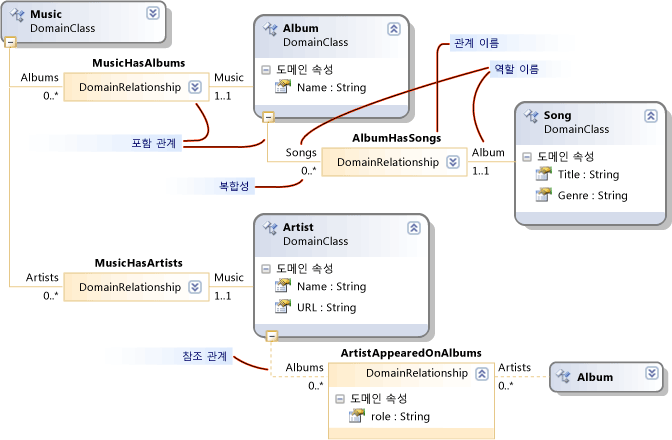
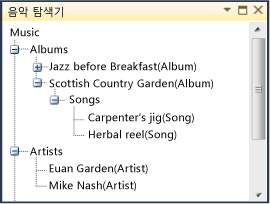

# 모델, 클래스 및 관계 이해
도메인 특정 언어 DSL ()는 작성할 수 있는 모든 사용자 지정 프로그램 코드와 함께 해당 DSL 정의 파일에 의해 정의 됩니다. DSL 솔루션에 있는 프로그램 코드의 대부분은이 파일에서 생성 됩니다.  
  
 이 항목에서는 DSL 정의의 핵심 기능에 설명 합니다.  
  
## DSL 정의  
 열 때 `Dsl\DslDefinition.dsl`, [!INCLUDE[vsprvs](../code-quality/includes/vsprvs_md.md)] 창이 다음 그림과 유사 합니다.  
  
   
  
 DSL 정의에서 가장 중요 한 정보는 DSL 정의 다이어그램에 표시 됩니다. 추가 정보를 DslDefinition.dsl의 일부 이기도 한 경우 다이어그램의 측면에 일반적으로 표시 하는 DSL 탐색기에 표시 됩니다. 가장 자주 발생 하는 작업에 대 한 다이어그램 및 DSL 탐색기 고급 사용자 지정 작업 있습니다.  
  
 DSL 정의 다이어그램의 모델 요소와 모델 요소 간에 링크를 정의 하는 관계를 정의 하는 도메인 클래스를 보여 줍니다. 또한 셰이프 및 사용자에 게 모델 요소를 표시 하는 데 사용 되는 연결선을 보여줍니다.  
  
   
  
 DSL 정의 다이어그램 또는 DSL 탐색기에서 항목을 선택할 때 속성 창에서 항목에 대 한 정보가 표시 됩니다. 자세한 내용은 DSL 세부 정보 창에 표시 될 수 있습니다.  
  
### 모델은 Dsl의 인스턴스  
 A *모델* 사용자가 만든 DSL의 인스턴스입니다. 모델을 정의 하는 도메인 클래스 및 요소를 정의 하는 도메인 관계의 인스턴스 간 연결의 인스턴스인 모델 요소를 포함 합니다. 모양 및 다이어그램의 모델 요소와 링크를 표시 하는 연결선 모델 있을 수도 있습니다. DSL 정의 모양 클래스, 커넥터 클래스 다이어그램에 대 한 클래스를 포함 합니다.  
  
 DSL 정의 라고도 *도메인 모델*합니다. DSL 정의 또는 도메인 모델은 모델에는 도메인 특정 언어의 런타임 인스턴스화는 도메인 특정 언어의 디자인 타임 표현 합니다.  
  
## 도메인 클래스 모델 요소를 정의합니다.  
 도메인 관계는 않은 요소 사이 링크 및 도메인 클래스는 도메인에서 다양 한 요소를 만드는 데 사용 됩니다. 이들은 요소 및 해당 모델을 만들 때 디자인 특정 언어의 사용자가 인스턴스화할 수 있는 링크의 디자인 타임 표현입니다.  
  
 이 그림의 음악 라이브러리 DSL 사용자가 작성 된 모델을 보여 줍니다. 음악 앨범 노래 목록이 포함 된 상자에 의해 표현 됩니다. 아티스트 모퉁이가 둥근 상자에 의해 표시 되 고 작성 되었습니다 앨범에 연결 됩니다.  
  
   
  
 DSL 정의 두 가지 측면을 구분합니다. 모델 다이어그램에서 모델 요소의 모양은 모양 클래스 및 커넥터 클래스를 사용 하 여 정의 됩니다. 모델에 포함 되어 있는 정보 도메인 클래스 및 도메인 관계를 사용 하 여 정의 됩니다.  
  
 다음 그림의 음악 라이브러리 DSL 정의에 도메인 클래스 및 관계를 보여 줍니다.  
  
   
  
 그림 4 개의 도메인 클래스에서: 음악, 앨범, 음악가 및 노래 합니다. 도메인 클래스 이름, 제목, 등 도메인 속성을 정의합니다. 인스턴스 모델에서 이러한 속성 중 일부의 값은 다이어그램에 표시 됩니다.  
  
 클래스 사이는 도메인 관계: MusicHasAlbums, MusicHasArtists, AlbumbHasSongs, 및 ArtistAppearedOnAlbums 합니다. 관계 복합성 1.. 1 인, 같은 0.. * 합니다. 예를 들어 모든 노래 AlbumHasSongs 관계를 통해 정확히 하나의 앨범으로 관련 되어야 합니다. 모든 앨범 노래 개수에 관계 없이 있을 수 있습니다.  
  
### DSL 정의 다이어그램을 다시 정렬  
 이 그림의 앨범 마찬가지로 도메인 클래스 DSL 정의 다이어그램에 여러 번 나타날 수를 확인 합니다. 항상 하나의 주 보기 및 일부 수 *참조* 뷰.  
  
 DSL 정의 다이어그램을 다시 정렬 하려면 다음을 수행할 수 있습니다.  
  
-   주 교환이 하 고 뷰를 사용 하 여 참조는 **여기 트리 Bring** 및 **분할 트리** 명령입니다. 이 명령은 표시에 대 한 단일 도메인 클래스를 마우스 오른쪽 단추로 클릭 합니다.  
  
-   Ctrl + Up 및 Ctrl + 아래쪽 키를 눌러 도메인 클래스 및 모양 클래스 순서입니다.  
  
-   축소 또는 각 셰이프의 상단 오른쪽에 있는 아이콘을 사용 하 여 클래스를 확장 합니다.  
  
-   도메인 클래스의 맨 아래에 있는 빼기 기호 (-)를 클릭 하 여 트리의 특정 부분을 축소 합니다.  
  
## 상속  
 도메인 클래스 상속을 사용 하 여 정의할 수 있습니다. 상속 파생을 만들려면 상속 도구를 클릭 하 고 파생된 클래스를 다음 기본 클래스를 클릭 합니다. 모델 요소에 해당 기본 클래스에서 상속 되며, 모든 속성의 자체 도메인 클래스에 정의 된 모든 속성이 있습니다. 또한 관계에 해당 역할을 상속합니다.  
  
 관계, 셰이프 및 연결선 간에 상속을 사용할 수도 있습니다. 상속 동일한 그룹 내에서 유지 해야 합니다. 셰이프는 도메인 클래스에서 상속할 수 없습니다.  
  
## 도메인 관계  
 관계를 통해 모델 요소를 연결할 수 있습니다. 링크는 항상 이진; 정확히 두 개의 요소를 연결 합니다. 그러나 모든 요소에 다른 개체에 많은 링크가 있고 둘 이상의 링크 요소의 동일한 쌍 간의 수 있습니다.  
  
 다양 한 유형의 요소를 정의 하려면와 마찬가지로 다양 한 유형의 링크를 정의할 수 있습니다. 링크의 클래스 라고는 *도메인 관계*합니다. 도메인 관계 인스턴스에 연결할 수 있는 어떤 유형의 요소를 지정 합니다. 관계의 각 끝에 호출 되는 *역할*, 도메인 관계 이름을 두 역할에 대 한 것은 물론 관계 자체를 정의 하 고 있습니다.  
  
 도메인 관계의 두 종류가: 관계 및 참조 관계를 포함 합니다. DSL 정의 다이어그램에서 포함 관계는 실선에 각 역할 있는데 참조 관계 파선입니다.  
  
### 관계를 포함합니다.  
 해당 루트를 제외한 모델의 모든 요소에는 하나의 포함 링크의 대상입니다. 따라서 전체 모델은 단일 트리도 링크를 포함 합니다. 포함 관계를 포함 또는 소유권을 나타냅니다. 이 방법으로 관련 된 두 모델 요소는 부모 및 자식 라고도 합니다. 자식 부모에 포함할 컴퓨터 라고 합니다.  
  
 포함 하는 링크가 표시 되지 않습니다 일반적으로 명시적으로 다이어그램에 있는 연결선으로. 대신, 일반적으로 표시 되는 포함 합니다. 모델의 루트 다이어그램에서 표시 되 고 항목에 포함 된 요소에는 다이어그램에서 모양으로 표시 됩니다.  
  
 예제에서는 루트 클래스 음악 MusicHasAlbums 노래를 포함 한 AlbumHasSongs 있는 앨범에는 포함 관계를 있습니다. 노래 각 앨범 내에 있는 목록에 항목으로 표시 됩니다. 음악 그 인스턴스로 다이어그램에서 모양을으로 표시 아티스트 클래스에는 포함 MusicHasArtists에 있습니다.  
  
 포함 된 요소가 기본적으로 부모를 삭제 한 경우 자동으로 지워집니다.  
  
 모델을 저장 하는 경우 XML 형식의 파일에 포함 된 요소 내에 중첩 된 부모 serialization을 사용자 지정 하지 않는 한 합니다.  
  
> [!NOTE]
>  포함은 상속과는 다릅니다. 포함 관계의 자식 부모의 속성을 상속 하지 않습니다. 포함 하는 모델 요소 사이 링크의 형식입니다. 상속은 클래스 간의 관계 및 모델 요소 간에 링크를 만들지 않습니다.  
  
### 포함 규칙  
 인스턴스 모델의 모든 요소에는 모델의 루트를 제외 하 고 정확히 하나의 포함 링크의 대상 이어야 합니다.  
  
 따라서 루트 클래스를 제외한 모든 추상이 아닌 도메인 클래스 하나 이상 포함 관계의 대상 이거나 포함 기본 클래스에서 상속 해야 합니다. 클래스에 포함 된 두 개 이상의의 대상이 될 수 있지만 해당 인스턴스 모델 요소를 한 번에 하나의 부모를 하나만 사용할 수 있습니다. 소스에 대 한 대상 복합성이 0..1 또는 1.. 1 인 이어야 합니다.  
  
### 탐색기 포함 트리를 표시합니다.  
 DSL 정의는 또한 사용자가 모델 다이어그램와 함께 볼 수 있는 탐색기, 만듭니다.  
  
   
  
 탐색기를 이더라도 모든 셰이프를 정의 하지 않은 모델의 모든 요소를 보여 줍니다. 요소 및 포함 관계를 표시 하지만 관계를 참조 하지 않습니다.  
  
 요소의 도메인 속성의 값을 보려면 사용자 모델 다이어그램 또는 모델 탐색기에서 요소를 선택 하 고 속성 창을 엽니다. 다이어그램에 표시 되지 않는 포함 하 여 모든 도메인 속성을 표시 됩니다. 예제에서는 각 노래 제목과 장르를 갖지만 제목의 값만 다이어그램에 표시 됩니다.  
  
## 참조 관계  
 참조 관계를 포함 하지는 관계의 모든 종류를 나타냅니다.  
  
 참조 관계는 일반적으로 셰이프 사이의 커넥터로 다이어그램에 표시 됩니다.  
  
 모델의 XML 표현에서 두 요소 사이의 참조 링크를 사용 하 여 표시 됩니다 *모니커 합니다.* 즉, 모니커는 모델의 각 요소를 고유 하 게 식별 하는 이름입니다. 각 모델 요소에 대 한 XML 노드는 관계의 이름 및 다른 요소의 모니커를 지정 하는 노드를 포함 합니다.  
  
## 역할  
 모든 도메인 관계에는 두 개의 역할, 원본 역할 및 대상 역할에 있습니다.  
  
 다음 그림에서는 사이의 선에 **게시자** 도메인 클래스 및 **PublisherCatalog** 도메인 관계 원본 역할입니다. 도메인 관계 사이 선 및 **앨범** 도메인 클래스는 대상 역할입니다.  
  
 ![역할 및 속성 ] (../modeling/media/propertycode.png "PropertyCode")  
  
 관계와 관련 된 이름을 모델을 통과 하는 프로그램 코드를 작성 하는 경우에 특히 중요 합니다. 예를 들어 DSL 솔루션을 빌드할 때 생성된 된 클래스 게시자에는 속성이 카탈로그는 앨범의 컬렉션입니다. 앨범 클래스에는 속성이 게시자 클래스의 단일 인스턴스가 게시자.  
  
 DSL 정의의 관계를 만들 때 속성 및 관계 이름에는 기본값이 지정 됩니다. 변경할 수 있습니다.  
  
## 복합성  
 복합성 요소 수는 도메인 관계에 동일한 역할 점이 지정 합니다. 예제에서는 0 대 다 (0..\*) 복합성 설정에는 **카탈로그** 역할을 지정 하는의 모든 인스턴스는 **게시자** 도메인 클래스 만큼 가질 수  **PublisherCatalog** 관계 이름을 원하는 대로 연결 합니다.  
  
 다이어그램에 입력 하거나 수정 하 여 역할의 복합성 구성는 `Multiplicity` 속성에는 **속성** 창. 다음 표에서이 속성에 대 한 설정을 설명합니다.  
  
|복합성 유형|설명|  
|-----------------------|-----------------|  
|0.. * (0 개 이상)|도메인 클래스의 각 인스턴스는 관계의 여러 인스턴스 또는 관계의 인스턴스가 있을 수 있습니다.|  
|0..1 (영 대 일)|도메인 클래스의 각 인스턴스는 관계의 둘 이상의 인스턴스 또는 관계의 인스턴스가 있을 수 있습니다.|  
|1.. 1 인 (1 개)|도메인 클래스의 각 인스턴스는 관계의 한 인스턴스를 가질 수 있습니다. 역할 클래스의 모든 인스턴스에서이 관계의 둘 이상의 인스턴스를 만들 수 없습니다. 유효성 검사를 사용 하는 경우 역할 클래스의 모든 인스턴스에 관계의 인스턴스 유효성 검사 오류가 나타납니다.|  
|1.. * (일대다)|이 복합성을 가진 역할에 대 한 클래스의 각 인스턴스는 관계의 여러 인스턴스를 가질 수 및 각 인스턴스에 관계의 인스턴스를 하나 이상 있어야 합니다. 유효성 검사를 사용 하는 경우 역할 클래스의 모든 인스턴스에 관계의 인스턴스 유효성 검사 오류가 나타납니다.|  
  
## 도메인 관계 클래스  
 링크는 LinkElement ModelElement의 파생 클래스의 인스턴스 저장소에 표시 됩니다. 도메인 관계에 있는 도메인 모델 다이어그램에 이러한 속성을 정의할 수 있습니다.  
  
 또한 원본 또는 대상이 다른 관계의 관계를 만들 수 있습니다. 도메인 모델 다이어그램에서 도메인 관계를 마우스 오른쪽 단추로 클릭 하 고 클릭 **클래스 표시**합니다. 추가 클래스 상자가 표시 됩니다. 그런 다음 관계를에 연결할 수 있습니다.  
  
 도메인 클래스와 함께 경우와 마찬가지로 상속에 의해 부분적으로 관계를 정의할 수 있습니다. 파생된 관계를 선택 하 고 설정 **자료 관계** 속성 창에서.  
  
 파생된 관계를 특수화는 기본 관계입니다. 도메인 클래스를 링크에서 파생 되어야 한다는 또는 기본 관계에서 링크 된 클래스와 동일 합니다. 모델에서는 파생된 관계의 링크를 만들 때 되었기 파생 된 인스턴스와 기본 관계입니다. 프로그램 코드에서 기본 또는 파생된 클래스를 생성 하는 속성을 사용 하 여 링크의 반대쪽 끝으로 이동할 수 있습니다.  
  
## 참고 항목  
 [도메인 특정 언어 도구 용어집](http://msdn.microsoft.com/en-us/ca5e84cb-a315-465c-be24-76aa3df276aa)
