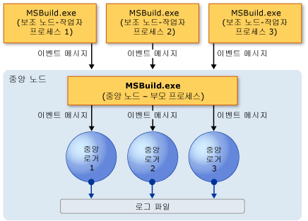
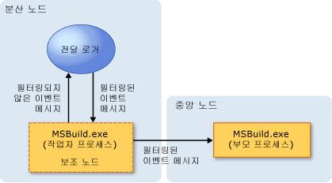

# 다중 프로세서 인식 로거 작성
[!INCLUDE[vs2017banner](../code-quality/includes/vs2017banner.md)]

다중 프로세서를 사용할 수 있는 [!INCLUDE[vstecmsbuild](../extensibility/internals/includes/vstecmsbuild_md.md)] 의 능력은 프로젝트 빌드 시간을 줄일 수 있는 반면, 빌드 이벤트 로깅은 복잡해집니다.  단일 프로세서 환경에서는 이벤트, 메시지, 경고 및 오류가 예측 가능한 순차적인 방법으로 로거에 도착합니다.  그러나 다중 프로세서 환경에서는 여러 소스의 이벤트가 동시에 또는 순서 없이 도착할 수 있습니다.  이러한 문제를 방지하기 위해, [!INCLUDE[vstecmsbuild](../extensibility/internals/includes/vstecmsbuild_md.md)] 은 다중 프로세서 인식 로거와 새 로깅 모델이 제공되며, 사용자 지정 "전달 로거"를 만들 수 있습니다.  
  
## 다중 프로세서 로깅 문제  
 다중 프로세서 또는 다중 핵심 프로세서에서 하나 이상의 프로젝트를 빌드하면 모든 프로젝트에 대한 [!INCLUDE[vstecmsbuild](../extensibility/internals/includes/vstecmsbuild_md.md)] 빌드 이벤트가 동시에 생성됩니다.  따라서 많은 이벤트 메시지가 로거에 동시에 또는 순서 없이 도착할 수 있습니다.  [!INCLUDE[vstecmsbuild](../extensibility/internals/includes/vstecmsbuild_md.md)] 2.0 로거는 이러한 상황을 처리하도록 설계되지 않았기 때문에 과부하가 걸릴 수 있고 빌드 시간이 늘어나거나 로거 출력이 잘못되거나 심지어 빌드가 손상될 수 있습니다.  이러한 문제를 해결하기 위해, 로거 \( [!INCLUDE[vstecmsbuild](../extensibility/internals/includes/vstecmsbuild_md.md)] 3.5 에서 시작한\)는 순서 없는 이벤트를 처리하고 이벤트와 해당 소스를 서로 연결할 수 있습니다.  
  
 사용자 지정 전달 로거를 만들면 로깅 효율성을 훨씬 더 향상시킬 수 있습니다.  사용자 지정 전달 로거는 빌드하기 전에 모니터링할 이벤트만 선택할 수 있는 필터 역할을 합니다.  사용자 지정 로거를 사용하면 원하지 않는 이벤트에 의해 로거에 과부하가 걸리거나 로그가 복잡해지거나 빌드 시간이 느려지지 않습니다.  
  
## 다중 프로세서 로깅 모델  
 다중 프로세서 관련 빌드 이슈를 제공하기 위해, [!INCLUDE[vstecmsbuild](../extensibility/internals/includes/vstecmsbuild_md.md)] 는 두 개의 로깅 모델인, 중앙 로깅 모델 및 분산 로깅 모델을 지원합니다.  
  
### 중앙 로깅 모델  
 중앙 로깅 모델에서는 MSBuild.exe의 단일 인스턴스가 "중앙 노드" 역할을 하며, 중앙 노드의 자식 인스턴스\("보조 노드"\)가 빌드 작업을 수행하는 데 도움이 되도록 중앙 노드에 연결됩니다.  
  
   
  
 중앙 노드에 연결되는 다양한 형식의 로거를 "중앙 로거"라고 합니다. 중앙 노드에는 각 로거 형식의 인스턴스가 하나씩만 동시에 연결될 수 있습니다.  
  
 빌드가 발생하면 보조 노드는 해당 빌드 이벤트를 중앙 노드에 라우트합니다.  중앙 노드는 해당 이벤트뿐 아니라 보조 노드의 이벤트도 모두 하나 이상의 연결된 중앙 로거에 라우트합니다.  그러면 중앙 로거는 들어오는 데이터를 기반으로 로그 파일을 만듭니다.  
  
 중앙 로거에서 <xref:Microsoft.Build.Framework.ILogger>만 구현하면 되지만 빌드에 참여하는 노드 수만큼 중앙 로거를 초기화하려면 <xref:Microsoft.Build.Framework.INodeLogger>를 구현하는 것이 좋습니다.  <xref:Microsoft.Build.Framework.ILogger.Initialize%2A> 메서드의 다음 오버로드는 엔진에 의해 로거가 초기화될 때 호출됩니다.  
  
```  
public interface INodeLogger: ILogger  
{  
    public void Initialize(IEventSource eventSource, int nodeCount);  
}  
```  
  
 기존의 모든 <xref:Microsoft.Build.Framework.ILogger> 기반 로거는 중앙 로거 역할을 할 수 있으며, 빌드에 연결될 수 있습니다.  그러나 다중 프로세서 로깅 시나리오 및 순서 없는 이벤트에 대한 명시적 지원 없이 빌드된 중앙 로거는 빌드를 손상시키거나 의미 없는 출력을 생성할 수 있습니다.  
  
### 분산 로깅 모델  
 중앙 로깅 모델에서 동시에 많은 프로젝트를 빌드할 때처럼 들어오는 메시지 트래픽이 너무 많으면 중앙 노드에 과부하가 걸릴 수 있습니다.  그러면 시스템 리소스가 과도하게 사용되고 빌드 성능이 저하될 수 있습니다.  이러한 문제를 해결하기 위해, [!INCLUDE[vstecmsbuild](../extensibility/internals/includes/vstecmsbuild_md.md)] 는 분산 로깅 모델을 지원합니다.  
  
   
  
 분산 로깅 모델은 전달 로거를 만들 수 있게 하여 중앙 로깅 모델을 확장합니다.  
  
#### 전달 로거  
 전달 로거는 간단한 형태의 보조 로거로, 보조 노드에 연결된 이벤트 필터를 가지고 있으며 보조 노드에서 들어오는 빌드 이벤트를 받습니다.  전달 로거는 들어오는 이벤트를 필터링하고 지정한 이벤트만 중앙 노드에 전달합니다.  따라서 중앙 노드에 전달되는 메시지 트래픽이 줄어들고 전반적인 빌드 성능이 향상됩니다.  
  
 분산 로깅을 사용하는 방법은 다음과 같은 두 가지가 있습니다.  
  
-   <xref:Microsoft.Build.BuildEngine.ConfigurableForwardingLogger>라는 미리 작성된 전달 로거 사용자 지정  
  
-   사용자 지정 전달 로거 작성  
  
 요구 사항에 따라 ConfigurableForwardingLogger를 수정할 수 있습니다.  이렇게 하려면 MSBuild.exe를 사용하여 명령줄에서 로거를 호출하고 로거에서 중앙 노드로 전달할 빌드 이벤트를 나열합니다.  
  
 또는 사용자 지정 전달 로거를 만들 수 있습니다.  사용자 지정 전달 로거를 만들면 로거 동작을 세부적으로 조정할 수 있습니다.  사용자 지정 전달 로거를 만드는 것은 ConfigurableForwardingLogger를 사용자 지정하는 것보다 복잡합니다.  자세한 내용은 [전달 로거 만들기](../msbuild/creating-forwarding-loggers.md)을 참조하십시오.  
  
## 간단한 분산 로깅에 ConfigurableForwardingLogger 사용  
 ConfigurableForwardingLogger 또는 사용자 지정 로거를 연결하려면 MSBuild.exe 명령줄 빌드에서 `/distributedlogger` 스위치\(줄여서 `/dl`\)를 사용합니다.  로거 형식 및 클래스의 이름을 지정하는 형식은 분산 로거가 항상 두 개의 로깅 클래스, 전달 로거와 중앙 로거 중 하나가 아니라 둘 다로 구성된다는 점을 제외하고 `/logger` 스위치와 같습니다.  다음 예제에서는 XMLForwardingLogger라는 사용자 지정 전달 로거를 연결하는 방법을 보여 줍니다.  
  
```  
msbuild.exe myproj.proj/distributedlogger:XMLCentralLogger,MyLogger,Version=1.0.2,Culture=neutral*XMLForwardingLogger,MyLogger,Version=1.0.2,Culture=neutral  
```  
  
> [!NOTE]
>  별표\(\*\)는 `/dl` 스위치에 있는 두 개의 로거 이름을 구분해야 합니다.  
  
 ConfigurableForwardingLogger를 사용하는 방법은 일반적인 [!INCLUDE[vstecmsbuild](../extensibility/internals/includes/vstecmsbuild_md.md)] 로거 대신 ConfigurableForwardingLogger 로거를 연결하고 ConfigurableForwardingLogger에서 중앙 노드로 전달할 이벤트를 매개 변수로 지정한다는 점을 제외하고 [빌드 로그 가져오기](../msbuild/obtaining-build-logs-with-msbuild.md)에 설명된 대로 다른 모든 로거를 사용하는 방법과 같습니다.  
  
 예를 들어, 빌드가 시작되고 끝날 때와 오류가 발생할 때만 알림을 받으려면 `BUILDSTARTEDEVENT`, `BUILDFINISHEDEVENT` 및 `ERROREVENT`를 매개 변수로 전달할 수 있습니다.  세미콜론으로 구분하여 매개 변수를 여러 개 전달할 수도 있습니다.  다음 예제에서는 ConfigurableForwardingLogger를 사용하여 `BUILDSTARTEDEVENT`, `BUILDFINISHEDEVENT` 및 `ERROREVENT` 이벤트만 전달하는 방법을 보여 줍니다.  
  
```  
msbuild.exe myproj.proj /distributedlogger:XMLCentralLogger,MyLogger,Version=1.0.2,Culture=neutral*ConfigureableForwardingLogger,C:\My.dll;BUILDSTARTEDEVENT; BUILDFINISHEDEVENT;ERROREVENT  
```  
  
 다음은 사용 가능한 ConfigurableForwardingLogger 매개 변수 목록입니다.  
  
|ConfigurableForwardingLogger 매개 변수|  
|----------------------------------------|  
|BUILDSTARTEDEVENT|  
|BUILDFINISHEDEVENT|  
|PROJECTSTARTEDEVENT|  
|PROJECTFINISHEDEVENT|  
|TARGETSTARTEDEVENT|  
|TARGETFINISHEDEVENT|  
|TASKSTARTEDEVENT|  
|TASKFINISHEDEVENT|  
|ERROREVENT|  
|WARNINGEVENT|  
|HIGHMESSAGEEVENT|  
|NORMALMESSAGEEVENT|  
|LOWMESSAGEEVENT|  
|CUSTOMEVENT|  
|COMMANDLINE|  
|PERFORMANCESUMMARY|  
|NOSUMMARY|  
|SHOWCOMMANDLINE|  
  
## 참고 항목  
 [전달 로거 만들기](../msbuild/creating-forwarding-loggers.md)