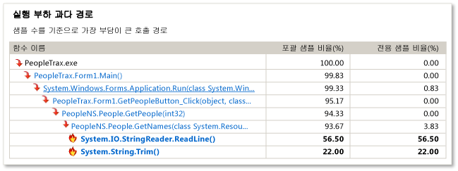
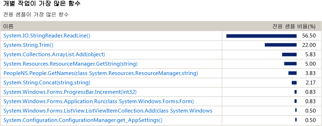
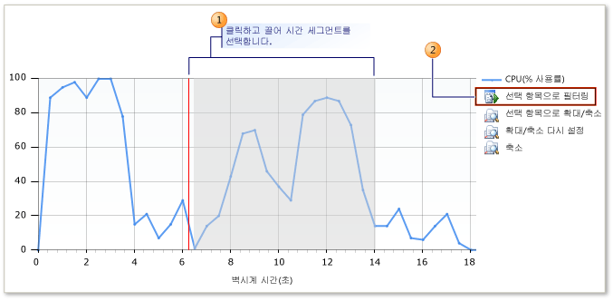

# CPU 샘플링 초보자를 위한 지침
Visual Studio 프로파일링 도구를 사용하여 애플리케이션의 성능 문제를 분석할 수 있습니다. 다음 절차에서는 **샘플링** 데이터 사용 방법을 보여 줍니다.

> [!NOTE]
>  계측 지원과 같은 특수 기능이 필요하지 않은 경우, 레거시 CPU 샘플링 도구 대신 진단 도구 창에서 [CPU 사용량](../profiling/beginners-guide-to-performance-profiling.md) 도구를 사용하는 것이 좋습니다.
  
 **샘플링**은 애플리케이션에서 대부분의 사용자 모드 작업을 수행하는 함수를 표시하는 통계 프로파일링 방법입니다. 애플리케이션의 속도를 빠르게 만드는 영역을 찾으려는 경우 샘플링으로 시작하면 좋습니다.  
  
 **샘플링** 방법은 애플리케이션에서 실행되는 함수에 대한 정보를 지정된 간격으로 수집합니다. 프로파일링 실행이 끝나면 프로파일링 데이터의 **요약** 뷰에 **실행 부하 과다 경로**라고 하는 가장 활동적인 함수 호출 트리가 표시됩니다. 여기서 대부분의 애플리케이션 작업이 수행됩니다. 또한 이 뷰에는 대부분의 개별 작업을 수행하는 함수가  표시되고 샘플링 세션의 특정 세그먼트를 집중적으로 확인할 수 있는 시간 표시 막대 그래프도 표시됩니다.  
  
 **샘플링**으로 필요한 데이터를 얻지 못할 경우 다른 프로파일링 도구 수집 방법으로 유용한 다른 종류의 정보를 얻을 수 있습니다. 이러한 다른 메서드에 대한 자세한 내용은 [방법: 수집 방법 선택](../profiling/how-to-choose-collection-methods.md)을 참조하세요.  
  
> [!TIP]
>  Windows 함수를 호출하는 코드를 프로파일링하는 경우 가장 최근의 .*pdb* 파일이 있는지 확인해야 합니다. 이 파일이 없으면 보고서 뷰에 암호화되어 이해하기 어려운 Windows 함수 이름이 표시됩니다. 필요한 파일이 있는지 확인하는 방법에 대한 자세한 내용은 [방법: Windows 기호 정보 참조](../profiling/how-to-reference-windows-symbol-information.md)를 참조하세요.  
  
## 성능 세션 만들기 및 실행  
 분석이 필요한 데이터를 가져오려면 먼저 성능 세션을 만든 후 세션을 실행해야 합니다. **성능 마법사**로 두 작업을 모두 수행할 수 있습니다.  
  
 Windows 데스크톱 앱 또는 ASP.NET 앱을 프로파일링하지 않는 경우 다른 프로파일링 도구 중 하나를 사용해야 합니다. [프로파일링 도구 살펴보기](../profiling/profiling-feature-tour.md)를 참조하세요.  
  
#### 성능 세션을 만들고 실행하려면  
  
1.  Visual Studio에서 솔루션을 엽니다. 구성을 해제로 설정합니다. 도구 모음에서 기본적으로 **디버그**로 설정되어 있는 **솔루션 구성**을 찾습니다. 이 항목을 **해제**로 변경합니다.  
  
    > [!IMPORTANT]
    >  사용 중인 컴퓨터에서 관리자가 아닌 경우 프로파일러를 사용하는 동안 Visual Studio를 관리자 권한으로 실행해야 합니다. Visual Studio 애플리케이션 아이콘을 마우스 오른쪽 단추로 클릭하고 **관리자 권한으로 실행**을 클릭합니다.  
  
2.  **디버그** 메뉴에서 **프로파일러**를 선택한 다음 **성능 프로파일러**을 선택합니다.  
  
3.  **성능 마법사** 옵션을 클릭하고 **시작**을 클릭합니다.  
  
4.  **CPU 샘플링(권장)** 옵션을 클릭하고 **마침**을 클릭합니다.  
  
5.  애플리케이션이 시작되고 프로파일러가 데이터를 수집하기 시작합니다.  
  
6.  성능 문제가 있을 수 있는 기능을 실행합니다.  
  
7.  평소처럼 애플리케이션을 닫습니다.  
  
     애플리케이션 실행이 끝나면 프로파일링 데이터의 **요약** 뷰가 주 Visual Studio 창에 나타나고 새 세션에 대한 아이콘이 **성능 탐색기** 창에 표시됩니다.  
  
## 2단계: 샘플링 데이터 분석  
 성능 세션 실행이 끝나면 프로파일링 보고서의 **요약** 뷰가 Visual Studio의 주 창에 나타납니다.  
  
 **실행 부하 과다 경로**를 검사한 다음 가장 많은 작업을 수행하는 함수 목록을 검사하고 마지막으로 **요약 타임라인**을 사용하여 다른 함수를 중점으로 데이터를 분석하는 것이 좋습니다. **오류 목록** 창에서 프로파일링 권장 사항 및 경고를 볼 수도 있습니다.  
  
 샘플링 방법으로 필요한 정보를 얻지 못할 수도 있습니다. 예를 들어 샘플은 애플리케이션이 사용자 모드 코드를 실행하는 경우에만 수집됩니다. 따라서 입력 및 출력 작업 등의 일부 기능은 샘플링을 통해 캡처되지 않습니다. 프로파일링 도구는 중요한 데이터에 초점을 맞출 수 있도록 하는 여러 컬렉션 메서드를 제공합니다. 다른 메서드에 대한 자세한 내용은 [방법: 수집 방법 선택](../profiling/how-to-choose-collection-methods.md)을 참조하세요.  
  
 그림에서 번호가 매겨진 각 영역은 절차의 단계와 관련되어 있습니다.  
  
   
  
#### 샘플링 데이터를 분석하려면  
  
1.  **요약** 뷰에서 **실행 부하 과다 경로**에는 포괄 샘플이 가장 많은 애플리케이션의 호출 트리 분기를 보여 줍니다. 이 분기는 데이터가 수집될 때 가장 활발하게 작업 중이던 실행 경로입니다. 포괄 값이 많으면 호출 트리를 생성하는 알고리즘이 최적화될 수 있습니다. 코드에서 최하위 경로에 있는 함수를 찾을 수 있습니다. 경로에 시스템 함수 또는 외부 모듈의 함수도 포함될 수 있습니다.  
  
       
  
    1.  **포괄 샘플**은 해당 함수와 이 함수가 호출한 함수가 수행한 작업의 양을 나타냅니다. 포괄 횟수가 많으면 전반적인 비용이 가장 많이 드는 함수인 것입니다.  
  
    2.  **전용 샘플**은 해당 함수가 호출한 함수에 의해 수행된 작업은 제외하고 함수 본문의 코드에 의해 수행된 작업의 양을 나타냅니다. 전용 횟수가 많으면 함수 자체 내에서 성능 병목 현상이 있는 것일 수 있습니다.  
  
2.  함수 이름을 클릭하면 프로파일링 데이터에 대한 **함수 정보** 뷰가 표시됩니다. **함수 정보** 뷰에는 선택한 함수에 대한 프로파일링 데이터의 그래픽 뷰가 제공되고, 해당 함수를 호출한 모든 함수 및 선택한 함수에 의해 호출된 모든 함수가 표시됩니다.  
  
    -   호출하는 함수 및 호출되는 함수의 블록 크기는 함수의 상대적인 호출 빈도를 나타냅니다.  
  
    -   호출하는 함수 및 호출되는 함수의 이름을 클릭하여 함수 정보 뷰의 선택된 함수로 나타낼 수 있습니다.  
  
    -   **함수 정보** 창의 아래쪽 창에는 함수 코드 자체가 표시됩니다. 코드를 검사하고 성능을 최적화할 기회를 얻은 경우 소스 파일 이름을 클릭하여 Visual Studio 편집기에서 파일을 엽니다.  
  
3.  분석을 계속하려면 **뷰** 드롭다운 목록에서 **요약**을 선택하여 **요약** 뷰로 돌아갑니다. 그런 후 **개별 작업이 가장 많은 함수**에서 함수를 검토합니다. 이 목록에는 전용 샘플이 가장 많은 함수가 표시됩니다. 이러한 함수의 함수 본문에 포함된 코드는 중요한 작업을 수행한 것이며 코드를 최적화할 수 있습니다. 특정 함수를 추가적으로 분석하려면 함수 이름을 클릭하여 **함수 정보** 뷰에 표시합니다.  
  
       
  
     프로파일링 실행을 계속 조사하려면 **요약** 뷰의 타임라인을 통해 프로파일링 데이터의 세그먼트를 다시 분석하여 선택한 세그먼트의 **실행 부하 과다 경로** 및 **개별 작업이 가장 많은 함수**를 표시할 수 있습니다. 예를 들어 타임라인에서 좀 더 낮은 정점에 주안점을 두면 전체 프로파일링 실행을 분석할 때는 표시되지 않던 비용이 많이 드는 호출 트리 및 함수가 드러날 수 있습니다.  
  
     세그먼트를 다시 분석하려면 **요약 타임라인** 상자에서 세그먼트를 선택하고 **선택 항목으로 필터링**을 클릭합니다.  
  
       
  
4.  또한 프로파일러는 규칙 집합을 사용하여 프로파일링 실행을 개선하는 방법을 제안하고 잠재적인 성능 문제를 식별합니다. 문제가 발견되면 **오류 목록** 창에 경고가 표시됩니다. **오류 목록** 창을 열려면 **뷰** 메뉴에서 **오류 목록**을 클릭합니다.  
  
    -   경고를 발생시킨 함수를 확인하려면 **함수 정보** 뷰에서 해당 경고를 두 번 클릭합니다.  
  
    -   경고에 대한 자세한 내용을 보려면 오류를 마우스 오른쪽 단추로 클릭하고 **오류 도움말 표시**를 클릭합니다.  
  
## 3단계: 코드 수정 및 세션 다시 실행  
 하나 이상의 함수를 찾아서 최적화한 후에는 프로파일링 실행을 반복하고 데이터를 비교하여 변경 내용이 애플리케이션 성능에 가져온 차이를 확인할 수 있습니다.  
  
#### 코드를 수정하고 프로파일러를 다시 실행하려면  
  
1.  코드를 변경합니다.  
  
2.  **성능 탐색기**를 열려면 **디버그** 메뉴에서 **프로파일러**, **성능 탐색기**, **성능 탐색기 표시**를 차례로 클릭합니다.  
  
3.  **성능 탐색기**에서 다시 실행할 세션을 마우스 오른쪽 단추로 클릭하고 **프로파일링 시작**을 클릭합니다.  
  
4.  세션을 다시 실행하면 **성능 탐색기**에서 해당 세션에 대한 *보고서* 폴더에 다른 데이터 파일이 추가됩니다. 원본 및 새 프로파일링 데이터를 둘 다 선택하고 선택 영역을 마우스 오른쪽 단추로 클릭한 후 **성능 보고서 비교**를 클릭합니다.  
  
     새 보고서 창이 열리고 비교 결과가 표시됩니다. 비교 보기를 사용하는 방법에 대한 자세한 내용은 [방법: 성능 데이터 파일 비교](../profiling/how-to-compare-performance-data-files.md)를 참조하세요.
  
## 참고 항목  
 [성능 탐색기](../profiling/performance-explorer.md)   
 [시작](../profiling/getting-started-with-performance-tools.md)   
 [개요](../profiling/overviews-performance-tools.md)  
 [Visual Studio의 프로파일링](../profiling/index.md)  
 [프로파일링 도구 살펴보기](../profiling/profiling-feature-tour.md)
