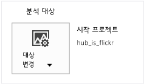
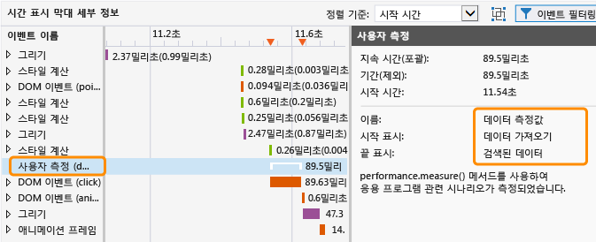
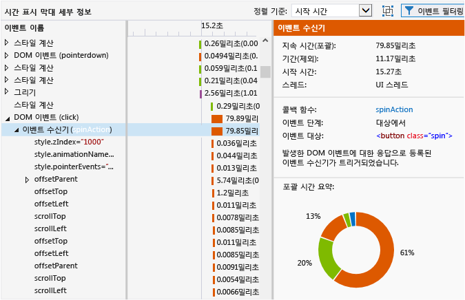
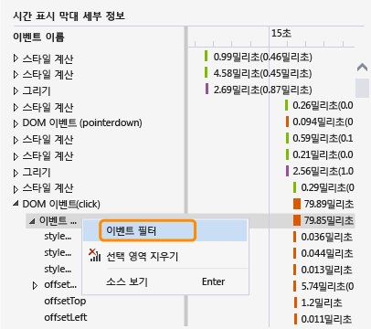
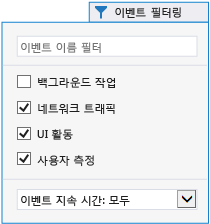
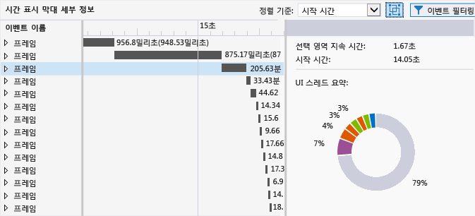

# <a name="analyze-html-ui-responsiveness-in-universal-windows-apps"></a>유니버설 Windows 앱의 HTML UI 응답성 분석
이 항목에서는 유니버설 Windows 앱에 사용할 수 있는 성능 도구인 UI 응답성 프로파일러를 사용하여 앱에서 성능 문제를 격리하는 방법에 대해 설명합니다.  
  
 UI 응답성 프로파일러는 일반적으로 다음과 같은 증상과 함께 발생하는 UI 응답성 문제 또는 플랫폼의 의도하지 않은 결과와 같은 문제를 격리하는 데 유용합니다.  
  
-   UI의 응답성 부족. UI 스레드가 차단될 경우 앱의 응답 속도가 느려질 수 있습니다. UI 스레드를 차단할 수 있는 몇 가지 원인에는 과도한 동기 JavaScript 코드, 과도한 CSS 레이아웃 또는 CSS 계산 작업, 동기 XHR 요청, 가비지 수집, 과도한 그리기 시간 또는 프로세서를 많이 사용하는 JavaScript 코드가 포함됩니다.  
  
-   앱 또는 페이지의 로딩 시간을 느리게 합니다. 일반적으로 리소스를 로드하는 데 과도한 시간이 소요될 때 발생합니다.  
  
-   예상보다 빈도가 낮은 시각적 개체 업데이트. UI 스레드의 사용량이 너무 많아 부드러운 프레임 속도를 유지할 수 없을 경우 발생합니다. 예를 들어, UI 스레드가 사용 중인 경우 프레임이 손실될 수도 있습니다. 또한 네트워크 요청, 이미지 디코딩, 그리기 등의 일부 UI가 아닌 스레드 작업이 시각적 개체 업데이트 빈도를 제한할 수도 있습니다. (모든 그리기가 UI 스레드에서 수행되지는 않습니다.)  
  
##  <a name="RunningProfiler"></a> HTML UI 응답성 도구 실행  
 Visual Studio에 작업 중인 Windows 유니버설 또는 Windows 스토어 앱이 열려 있거나 Windows 8 이상을 실행 중인 컴퓨터에 설치되어 있는 경우 HTML UI 응답성 도구를 사용할 수 있습니다.  
  
1.  Visual Studio에서 응용 프로그램을 실행하는 경우 **표준** 도구 모음의 **디버깅 시작** 목록에서 Windows Phone 에뮬레이터, **로컬 컴퓨터**, **시뮬레이터**또는 **원격 컴퓨터**등의 배포 대상을 선택합니다.  
  
2.  **디버그** 메뉴에서 **성능 프로파일러...**를 선택합니다.  
  
     프로파일러의 분석 대상을 변경하려면**대상 변경**을 선택합니다.  
  
       
  
     분석 대상에 사용할 수 있는 옵션은 다음과 같습니다.  
  
    -   **시작 프로젝트**. 현재 시작 프로젝트를 분석하려면 이 옵션을 선택합니다. 원격 컴퓨터 또는 장치에서 앱을 실행 중인 경우 기본값인 이 설정을 사용해야 합니다.  
  
    -   **실행 중인 응용 프로그램**. 실행 중인 응용 프로그램 목록에서 Windows 스토어 앱을 선택하려면 이 옵션을 선택합니다. 원격 컴퓨터 또는 장치에서 앱을 실행 중인 경우 이 옵션을 사용할 수 없습니다.  
  
         소스 코드에 액세스할 수 없을 때 이 옵션을 사용하여 컴퓨터에서 실행 중인 앱의 성능을 분석할 수 있습니다.  
  
    -   **설치된 응용 프로그램**. 분석할 설치된 응용 프로그램을 선택하려면 이 옵션을 선택합니다. 원격 컴퓨터 또는 장치에서 앱을 실행 중인 경우 이 옵션을 사용할 수 없습니다.  
  
         소스 코드에 액세스할 수 없을 때 이 옵션을 사용하여 컴퓨터에 설치한 앱의 성능을 분석할 수 있습니다. 사용자가 직접 개발하는 응용 프로그램을 제외한 모든 응용 프로그램의 성능을 분석하려는 경우에도 이 옵션이 유용할 수 있습니다.  
  
3.  
                **사용 가능한 도구**에서 **HTML UI 응답성**을 선택한 다음 **시작**을 선택합니다.  
  
4.  UI 응답성 프로파일러를 시작할 때 사용자 계정 컨트롤 창이 표시되어 Visual Studio ETW Collector.exe를 실행할 수 있는 권한을 요청할 수 있습니다. **예**를 선택합니다.  
  
     앱과 상호 작용하여 관련된 성능 시나리오를 테스트합니다. 자세한 워크플로는 [UI 응답성 격리](#Workflow) 및 [시각적 처리량 문제 격리](#IsolateVisualThroughput)를 참조하세요.  
  
5.  Alt+Tab을 눌러 Visual Studio로 전환합니다.  
  
6.  응용 프로그램의 프로파일링을 중지하고 프로파일러가 수집한 데이터를 보려면 **수집 중지**를 선택합니다.  
  
##  <a name="IsolateAnIssue"></a> 문제 격리  
 다음 섹션에서는 성능 문제를 격리하는 데 도움이 되는 제안 사항을 제공합니다. 샘플 성능 테스트 앱을 사용하여 성능 문제를 확인 및 수정하는 방법에 대한 단계별 설명은 [연습: UI 응답성 향상(HTML)](../profiling/walkthrough-improving-ui-responsiveness-html.md)을 참조하세요.  
  
###  <a name="Workflow"></a> UI 응답성 문제 격리  
 다음 단계에서는 UI 응답성 프로파일러를 보다 효과적으로 사용할 수 있는 제안 워크플로를 제공합니다.  
  
1.  Visual Studio에서 앱을 엽니다.  
  
2.  응용 프로그램에서 UI 응답성 문제를 테스트합니다. (Ctrl+F5 키를 눌러 디버깅 없이 응용 프로그램을 시작합니다.)  
  
     문제가 발견되면 계속해서 문제가 발생한 시간대를 좁히거나 동작의 원인이 되는 트리거를 파악합니다.  
  
3.  Visual Studio로 전환하고(Alt+Tab) 응용 프로그램을 중지합니다(Shift+F5).  
  
4.  선택적으로 [분석을 위한 코드 표시](#ProfileMark)를 사용해서 사용자 표시를 코드에 추가합니다.  
  
    > [!TIP]
    >  사용자 표식을 사용하면 프로파일러 데이터를 보는 동안 응답성 문제를 식별하는 데 도움이 될 수 있습니다. 예를 들어 응답성 문제를 일으키는 코드 섹션의 시작 및 끝 부분에 사용자 표식을 추가할 수 있습니다.  
  
5.  이전 섹션의 지침에 따라 UI 응답성 프로파일러를 실행합니다.  
  
6.  UI 응답성 문제를 일으키는 상태로 응용 프로그램을 설정합니다.  
  
7.  Visual Studio로 전환하고(Alt+Tab) UI 응답성 프로파일러의 프로파일러 탭에서 **수집 중지** 를 선택합니다.  
  
8.  사용자 표식을 추가한 경우 프로파일러의 [진단 세션 타임라인 보기](#Ruler) 에 나타납니다. 다음 그림에서는 코드에서 특정 작업을 지정하는 데 사용되는 단일 사용자 표식을 보여 줍니다.  
  
       
  
9. 사용자 표시, 응용 프로그램 수명 주기 이벤트 또는 그래프에 표시되는 데이터를 사용해서 타임라인 및 프로파일러 그래프에서 관심 영역을 식별합니다. 다음은 그래프에서 데이터를 분석 및 사용하는 데 도움이 되는 몇 가지 지침입니다.  
  
    -   [진단 세션 타임라인 보기](#Ruler) 을 사용해 [분석을 위한 코드 표시](#ProfileMark), 앱 수명 주기 이벤트 및 이러한 이벤트에 연결된 타임라인과 다른 그래프의 데이터에 대한 타임라인을 확인합니다.  
  
    -   [CPU utilization graph](#CPUutilization) 를 사용해 CPU 작업 및 특정 기간에 CPU에서 처리하는 작업 유형에 관한 일반적인 정보를 볼 수 있습니다. CPU 작업이 과도한 기간에는 응답성 문제 및 프레임 저하가 발생할 가능성이 높습니다.  
  
    -   게임 또는 리치 미디어 앱을 개발하는 경우 [시각적 처리량 보기(FPS)](#VisualThroughput) 를 사용하여 프레임 속도가 떨어지는 기간을 식별합니다.  
  
10. 그래프의 한 부분을 클릭하고 포인터를 끌어 선택하거나 Tab 키와 화살표 키를 사용해서 그래프 중 하나의 관심 영역을 선택합니다. 기간을 선택하면 프로파일러 아래쪽 창의 시간 표시 막대 정보 그래프가 선택한 기간에 대해서만 표시하도록 변경됩니다.  
  
     다음 그림은 관심 영역이 강조 표시된 CPU 사용률 그래프를 보여줍니다.  
  
       
  
11. [타임라인 세부 정보 보기](#TimelineDetails) 를 사용하여 너무 자주 실행되거나 완료되는 데 너무 많은 시간이 걸리는 이벤트에 대한 자세한 정보를 확인합니다. 예를 들어, 다음을 확인합니다.  
  
    -   이벤트 수신기, 타이머 및 애니메이션 프레임 콜백. 특정 이벤트에 따라 제공되는 데이터에는 수정된 DOM 요소의 ID, 수정된 CSS 속성, 소스 위치에 대한 링크, 연결된 이벤트 또는 콜백 함수의 이름이 포함될 수 있습니다.  
  
    -   렌더링 요소를 발생시킨 레이아웃 또는 스크립팅 이벤트(예: `window.getComputedStyles`호출). 이벤트의 연결된 DOM 요소가 제공됩니다.  
  
    -   응용 프로그램에서 로드되는 페이지 또는 URL 리소스(예: HTML 구문 분석 이벤트에 대한 스크립트 계산). 파일 이름 또는 리소스가 제공됩니다.  
  
    -   다른 이벤트는 [Profiler event reference](#ProfilerEvents)에 지정되어 있습니다.  
  
    > [!TIP]
    >  프로파일러의 대부분의 유용한 정보는 타임라인 세부 정보 그래프에 표시됩니다.  
  
12. CPU 사용률 또는 시각적 처리량(FPS) 그래프에서 한 영역을 선택하고 **확대** (단추 또는 상황에 맞는 메뉴 사용)를 눌러서 더 자세한 정보를 확인할 수 있습니다. 그래프의 시간 표시 막대가 선택한 기간만 표시하도록 변경됩니다.  
  
13. 확대할 때는 CPU 사용률 또는 시각적 처리량 그래프의 한 부분을 선택합니다. 선택하면 프로파일러 아래쪽 창의 시간 표시 막대 정보 그래프가 선택한 기간에 대해서만 표시하도록 변경됩니다.  
  
###  <a name="IsolateVisualThroughput"></a> 시각적 처리량 문제 격리  
 CPU 사용률이 과도한 기간은 프레임 속도가 낮거나 일관적이지 않을 수 있습니다. 리치 미디어 응용 프로그램 및 게임을 개발하는 경우 시각적 처리량 그래프는 CPU 사용률 그래프보다 중요한 데이터를 제공할 수 있습니다.  
  
 시각적 처리량 문제를 격리하려면 이전 섹션에 설명된 단계를 수행하지만 시각적 처리량 그래프를 주요 데이터 요소 중 하나로 사용합니다.  
  
###  <a name="ProfileMark"></a> 분석을 위한 코드 표시  
 그래프에 표시되는 데이터 관련 앱 코드의 섹션을 분리하도록 하기 위해, 함수가 실행되는 순간 프로파일러가 사용자 표시(역삼각형)를 타임라인에 삽입하도록 지시하는 함수 호출을 응용 프로그램에 추가할 수 있습니다. CPU 사용률 그래프, 시각적 처리량 그래프 및 시간 표시 막대 정보 그래프의 타임라인에 추가한 모든 사용자 표시가 나타납니다.  
  
 사용자 표식을 추가하려면 응용 프로그램에 다음 코드를 추가합니다. 이 예제에서는 이벤트 설명으로 "데이터 가져오기"가 사용됩니다.  
  
```javascript  
if (performance && performance.mark) {  
    performance.mark("getting data");  
}  
  
```  
  
 사용자 표시 위에 마우스 포인터를 놓으면 이벤트에 대한 이 설명이 도구 설명으로 표시됩니다. 필요한 만큼 사용자 표식을 추가할 수 있습니다.  
  
> [!NOTE]
> Chrome 명령인  `console.timeStamp` 명령도 사용자 표식으로 표시됩니다.  
  
 다음 그림은 단일 사용자 표시 및 해당 도구 설명이 포함된 진단 눈금자를 나타냅니다.  
  
   
  
 또한 타임라인 세부 정보 보기에서 도구 생성 이벤트를 만들어 두 사용자 표식 간에 경과되는 시간을 표시할 수 있습니다. 다음 코드는 두 번째 사용자 표식 및 두 사용자 표식을 실행하는 중간에 경과되는 시간 단위를 추가합니다(이전 코드는 첫 번째 사용자 표식을 표시).  
  
```javascript  
if (performance.mark && performance.measure) {  
    performance.mark("data retrieved");  
    performance.measure("data measure", "getting data", "data retrieved");  
}  
```  
  
 두 번째 사용자 표식을 지정하지 않은 경우 `performance.measure` 는 타임스탬프를 두 번째 사용자 표식으로 사용합니다. 첫 번째 사용자 표식이 필요합니다.  
  
 기간 단위는 타임라인 세부 정보 보기에서 **사용자 측정** 이벤트로 표시되며 선택 시 자세한 정보를 보여줍니다.  
  
   
  
##  <a name="AnalyzeData"></a> 데이터 분석  
 다음 단원에서는 프로파일러에 표시되는 데이터를 해석하기 위한 정보를 제공합니다.  
  
###  <a name="Ruler"></a> 진단 세션 시간 표시 막대 보기  
 프로파일러 위쪽에 있는 눈금자는 프로파일링된 정보의 타임라인을 보여 줍니다. 이 타임라인은 CPU 사용률 그래프 및 시각적 처리량 그래프 모두에 적용됩니다.  
  
 여러 가지 응용 프로그램 수명 주기 이벤트에 대해 표시되는 도구 설명이 포함된 진단 세션 타임라인의 모양은 다음과 같습니다.  
  
   
  
 타임라인은 활성화 이벤트와 같은 응용 프로그램 수명 주기 이벤트가 발생할 때 표시되며, 사용자 코드에 추가할 수 있는 사용자 표시(사용자 표식 삼각형)를 표시합니다. 이벤트를 선택하여 추가 정보와 함께 도구 설명을 표시할 수 있습니다. 사용자 표식에 대한 자세한 내용은 이 항목의 [분석을 위한 코드 표시](#ProfileMark) 를 참조하세요.  
  
 응용 프로그램 수명 주기 이벤트는 다이아몬드 기호로 표시됩니다. 이는 DOM 이벤트로, 다음을 포함합니다.  
  
-   코드의 활성화된 이벤트 처리기에서 일반적으로 발생하는 `DOMContentLoaded` 및 `Load` 이벤트. 이벤트에 대한 도구 설명으로 특정 이벤트 및 해당 URL을 표시합니다.  
  
-   다른 페이지를 탐색할 때 발생하는 탐색 이벤트. 이벤트에 대한 도구 설명으로 대상 페이지 URL을 표시합니다.  
  
###  <a name="CPUUtilization"></a> CPU 사용률 보기  
 CPU 사용률 그래프에서는 과도한 CPU 작업이 있던 기간을 확인할 수 있습니다. 여기에서는 일정 기간에 걸쳐 응용 프로그램의 평균 CPU 사용에 대한 정보를 제공합니다. 정보는 **로드**, **스크립팅**, 가비지 수집(**GC**), **스타일 지정**, **렌더링**, **이미지 디코딩**과 같은 특정 범주를 나타내도록 색으로 구분되어 있습니다. 이러한 범주에 대한 자세한 내용은 이 항목 뒷부분에 나오는 [Profiler event reference](#ProfilerEvents) 를 참조하세요.  
  
 CPU 사용률 그래프는 전체 앱 스레드에 소요된 시간을 하나 이상의 CPU에 대한 CPU 사용률 값을 단일 백분율 값으로 결합하여 보여 줍니다. 둘 이상의 CPU를 사용 중일 경우 CPU 사용률 값은 100%를 초과할 수 있습니다.  
  
> [!NOTE]
>  GPU 사용량은 그래프에 표시되지 않습니다.  
  
 다음 예제에서는 CPU 사용률 그래프의 모양을 보여 줍니다.  
  
   
  
 이 그래프를 사용하여 다음을 수행합니다.  
  
-   일반적인 문제 영역을 식별합니다.  
  
-   시간 표시 막대 정보 그래프에 표시하려는 특정 기간을 선택합니다. 기간을 선택하려면 그래프의 한 부분을 선택하고 포인터를 끌어서 선택합니다.  
  
-   **확대** 단추를 선택하여 선택한 기간에 대해 보다 자세한 보기를 표시합니다.  
  
 그래프 사용에 대한 자세한 내용은 이 항목의 [Isolate a UI responsiveness problem](#Workflow) 를 참조하세요.  
  
###  <a name="VisualThroughput"></a> 시각적 처리량 보기(FPS)  
 시각적 처리량 그래프에서는 프레임이 손실된 기간을 확인할 수 있습니다. 응용 프로그램에 대한 FPS(초당 프레임 수)를 표시합니다. 이 그래프는 게임 및 리치 미디어 앱 개발에 매우 유용합니다.  
  
 표시된 FPS 값은 실제 프레임 속도와 다를 수 있습니다. 이 그래프에서 데이터를 검토할 때는 다음 정보에 유의하세요.  
  
-   그래프는 앱이 특정 시간에 달성할 수 있는 FPS를 보여 줍니다. 앱이 유휴 상태이면 FPS는 모니터 화면 주사율과 같습니다.  
  
-   앱이 시각적 업데이트가 필요한 작업을 수행 중이라면 실제 FPS의 그래프를 보여 줍니다.  
  
-   프레임이 손실되는 경우 그래프에&0; 값을 보여 줍니다.  
  
 다음 예제에서는 시각적 처리량 그래프의 모양을 보여 줍니다.  
  
   
  
 시각적 처리량 그래프를 사용하여 다음을 수행합니다.  
  
-   일반적인 문제 영역을 식별합니다.  
  
-   시간 표시 막대 정보 그래프에 표시하려는 특정 기간을 선택합니다. 기간을 선택하려면 그래프의 한 부분을 선택하고 포인터를 끌어서 선택합니다.  
  
-   **확대** 단추를 선택하여 선택한 기간에 대해 보다 자세한 보기를 표시합니다.  
  
###  <a name="TimelineDetails"></a> 시간 표시 막대 세부 정보 보기  
 타임라인 세부 정보 그래프는 UI 응답성 프로파일러의 하단 창에 표시됩니다. 여기에는 선택한 기간 중 CPU 시간 소비가 가장 높은 이벤트에 대한 순차적 및 계층적 정보가 제공됩니다. 이 그래프는 특정 이벤트를 트리거한 항목과 일부 이벤트에 대해 이벤트가 소스 코드로 다시 매핑되는 방법을 확인하는 데 도움이 됩니다. 또한 이 그래프로부터 화면에 시각적 개체 업데이트를 그리는 데 필요한 시간을 확인할 수도 있습니다.  
  
 이 그래프는 시각적 개체 업데이트를 느려지게 할 수 있는 UI 스레드 작업 및 백그라운드 스레드 작업을 보여 줍니다. 이 그래프에는 JavaScript JIT 작업, 비동기 GPU 작업, 호스트 프로세스 외부에서 수행된 작업(예: RuntimeBroker.exe 및 dwm.exe 작업) 또는 프로파일링에 대해 아직 계측되지 않은 Windows 런타임 영역의 작업(예: 디스크 I/O)은 표시되지 않습니다.  
  
> [!TIP]
>  백그라운드 스레드에서 이벤트가 발생할 때 스레드 ID는 이벤트 이름 옆 괄호 안에 표시됩니다.  
  
 다음 예제에서는 DOM 클릭 이벤트를 위한 이벤트 수신기가 선택된 경우의 시간 표시 막대 정보 그래프 모양을 보여 줍니다.  
  
   
  
 이 그림에서 **이벤트 이름** 열의 **spinAction** 이벤트 처리기는 선택 시 소스 코드의 이벤트 처리기로 연결되는 링크입니다. 오른쪽 창에서 **콜백 함수** 속성은 소스 코드에 대한 같은 링크를 제공합니다. 또한 다른 속성에는 관련 DOM 요소와 같은 이벤트에 대한 정보가 제공됩니다.  
  
 CPU 사용률 및 시각적 처리량(FPS) 그래프의 타임라인 부분을 선택하면 시간 표시 막대 정보 그래프에는 선택한 기간에 대한 자세한 정보가 표시됩니다.  
  
 시간 표시 막대 정보 그래프의 이벤트는 CPU 사용률 그래프에 표시된 것과 같은 작업 범주를 표시하도록 색이 지정됩니다. 이벤트 범주 및 특정 이벤트에 대한 자세한 내용은 이 항목의 [Profiler event reference](#ProfilerEvents) 를 참조하세요.  
  
 시간 표시 막대 정보 그래프를 사용하여 다음을 수행합니다.  
  
-   이벤트의 대략적인 시작 시간, 지속 시간 및 종료 시간을 시간 표시 막대 뷰 및 표 뷰에서 봅니다. 시간 표시 막대 정보 그래프는 표 뷰에서 확대/축소 상태에 따라 30밀리초에서 30초까지 범위의 지속 시간을 표시할 수 있습니다. 기간 값:  
  
    -   포괄 시간은 이벤트 자식을 포함하는 이벤트의 지속 시간을 나타냅니다. 이 값은 표 뷰에 가장 먼저 표시됩니다.  
  
    -   전용 시간은 이벤트 자식을 포함하지 않는 이벤트의 지속 시간을 나타냅니다. 이 값은 표 뷰에 괄호로 묶여 표시됩니다.  
  
-   자식 이벤트를 보려면 계층 구조의 이벤트를 확장합니다. 이벤트 자식은 부모 이벤트에 의해 발생한 다른 이벤트입니다. 예를 들어, DOM 이벤트에는 자식으로 표시되는 이벤트 수신기가 있을 수 있습니다. 이벤트 수신기에는 레이아웃 이벤트와 같은 자신의 결과인 다른 이벤트가 있을 수 있습니다.  
  
-   시작 시간(기본값) 또는 지속 시간을 기준으로 이벤트를 정렬합니다. **정렬 기준** 목록을 사용하여 정렬 방법을 선택합니다.  
  
-   오른쪽 창의 세부 정보 창에 각 이벤트에 대한 세부 정보가 표시됩니다. 다음 예에서 볼 수 있듯이 속성은 특정 이벤트에 따라 달라집니다.  
  
    -   타이머, 이벤트 수신기(DOM 이벤트) 및 애니메이션 프레임 콜백의 경우, 해당 **콜백 함수** 속성은 소스 코드 위치에 대한 링크와 이벤트 처리기 또는 콜백 함수의 이름을 함께 제공합니다.  
  
    -   타이머, 이벤트 수신기(DOM 이벤트), 레이아웃 이벤트 및 애니메이션 프레임 콜백의 경우 **포괄 시간 요약** 섹션(색으로 구분된 링)에 선택한 이벤트 및 해당 자식의 색으로 구분된 요약을 표시할 수 있습니다. 각 이미지의 색으로 구분된 조각은 이벤트 형식을 나타냅니다. 도구 설명에는 이벤트 형식 이름이 제공됩니다.  
  
    > [!TIP]
    >  시간 표시 막대 정보 그래프 및 **포괄 시간 요약** 을 통해 최적화할 영역을 식별할 수 있습니다. 이러한 뷰 중 하나에 작은 작업이 여러 개 표시되면 해당 이벤트를 최적화할 수 있습니다. 예를 들어 앱에서 DOM 요소를 자주 새로 고쳐서 레이아웃 및 HTML 구문 분석 이벤트가 많이 발생할 수 있습니다. 이 작업을 일괄 처리하여 성능을 최적화할 수 있습니다.  
  
###  <a name="FilterTimelineDetails"></a> 시간 표시 막대 세부 정보 필터링  
 특정 이벤트의 상황에 맞는 메뉴에서 **이벤트 필터** 를 선택하여 타임 라인 세부 정보의 뷰를 특정 이벤트로 필터링할 수 있습니다. 이 옵션을 선택하면 타임라인 및 표 뷰가 선택된 이벤트로 범위가 정해집니다. CPU 사용률 그래프에서의 선택도 특정 이벤트로 범위가 정해집니다.  
  
   
  
###  <a name="FilterEvents"></a> 필터 이벤트  
 타임라인 세부 정보 그래프에서 일부 이벤트를 필터링해 데이터의 노이즈를 줄이거나 성능 시나리오와 관련되지 않은 데이터를 제거할 수 있습니다. 이벤트 이름 또는 이벤트 기간으로 필터링하거나 여기서 설명하는 특정 필터로 필터링할 수 있습니다.  
  
 이미지 디코딩, 잘못된 다운로드 및 GC 이벤트를 필터링하려면 아래쪽 창의 필터 아이콘에서 **백그라운드 작업** 옵션의 선택을 취소합니다. 이러한 이벤트는 실행 가능성이 높지 않지만 기본적으로 숨겨집니다.  
  
   
  
 HTTP 요청 이벤트를 필터링하려면 아래쪽 창의 필터 아이콘에서 **네트워크 트래픽** 옵션의 선택을 취소합니다. 기본적으로 이러한 이벤트는 타임라인 세부 정보 그래프에 표시됩니다.  
  
 UI 스레드 작업을 필터링하려면 **UI 작업** 옵션의 선택을 취소합니다.  
  
> [!TIP]
>  네트워크 대기 시간과 관련된 문제를 확인하려면 이 옵션의 선택을 취소하고 네트워크 트래픽 옵션을 선택합니다.  
  
 사용자 측정을 필터링하려면 **사용자 측정** 옵션의 선택을 취소합니다. 사용자 측정은 자식이 없는 최상위 이벤트입니다.  
  
###  <a name="GroupFrames"></a> 프레임별 이벤트 그룹화  
 타임라인 세부 정보 보기에서 개별 프레임에 나타나는 이벤트를 그룹화할 수 있습니다. 이러한 프레임 이벤트는 도구로 생성된 이벤트이며, paint 이벤트 간에 발생하는 모든 UI 스레드 작업의 최상위 이벤트 컨테이너를 나타냅니다. 이 뷰를 사용하도록 설정하려면 **프레임별 최상위 이벤트 그룹화**를 선택합니다.  
  
   
  
 프레임별로 이벤트를 그룹화하는 경우 타임라인 세부 정보 보기의 최상위 이벤트는 각각 프레임을 나타냅니다.  
  
   
  
##  <a name="SaveSession"></a> 진단 세션 저장  
 Visual Studio에서 진단 세션과 연결된 탭을 닫을 때 이 세션을 저장할 수 있습니다. 저장된 세션은 나중에 다시 열 수 있습니다.  
  
##  <a name="ProfilerEvents"></a> 프로파일러 이벤트 참조  
 UI 응답성 프로파일러에서 프로파일러 이벤트는 항목별로 분류되어 색이 지정됩니다. 다음은 이러한 이벤트 범주입니다.  
  
-   **로드.** 앱이 처음 로드될 때 앱 리소스를 검색하고 HTML 및 CSS를 구문 분석하는 데 걸린 시간을 나타냅니다. 여기에는 네트워크 요청이 포함될 수 있습니다.  
  
-   **스크립팅.** JavaScript의 구문 분석 및 실행에 걸린 시간을 나타냅니다. 여기에는 DOM 이벤트, 타이머, 스크립트 평가 및 애니메이션 프레임 작업이 포함됩니다. 여기에는 사용자 코드와 라이브러리 코드가 모두 포함됩니다.  
  
-   **GC.** 가비지 컬렉션에 걸린 시간을 나타냅니다.  
  
-   **스타일 지정.** CSS를 구문 분석하고 요소 프레젠테이션 및 레이아웃을 계산하는 데 걸린 시간을 나타냅니다.  
  
-   **렌더링.** 화면 그리기에 걸린 시간을 나타냅니다.  
  
-   **이미지 디코딩.** 이미지의 압축을 풀고 디코딩하는 데 걸린 시간을 나타냅니다.  
  
 스크립트 및 스타일 지정 범주의 경우, UI 응답성 프로파일러에서 시간 표시 막대 정보 그래프에 작업할 수 있는 데이터를 제공할 수 있습니다. 스크립팅 이슈를 문제로 식별한 경우, UI 응답성 프로파일러로 CPU 샘플링 프로파일러를 실행할 수 있습니다. 또는 Visual Studio 함수 프로파일러를 사용하여 보다 자세한 데이터를 얻을 수도 있습니다. 자세한 내용은 [JavaScript 메모리](../profiling/javascript-memory.md)를 참조하세요.  
  
 다른 이벤트 범주의 경우 앱에 기능을 추가하여 발생하는 플랫폼의 의도하지 않은 결과를 식별할 수 있지만, 이 경우 UI 응답 프로파일러를 사용하여 특정 성능 문제를 해결할 수는 없습니다.  
  
 다음 표에서는 이벤트 및 해당 설명을 보여 줍니다.  
  
|이벤트|이벤트 범주|발생 경우|  
|-----------|--------------------|-----------------|  
|CSS 구문 분석|로드|새 CSS 콘텐츠가 발견되어 이 CSS 콘텐츠를 구문 분석하려고 했습니다.|  
|HTML 구문 분석|로드|새 HTML 콘텐츠가 발견되어 이 콘텐츠를 노드로 구문 분석하고 DOM 트리에 콘텐츠를 삽입하려고 했습니다.|  
|HTTP 요청|로드|DOM에서 원격 리소스가 발견되었거나 XMLHttpRequest가 생성되어 HTTP 요청이 발생했습니다.|  
|잘못된 다운로드|로드|페이지의 HTML 콘텐츠가 필요한 리소스에 대해 검색되어 해당 리소스에 대한 후속 HTTP 요청이 빠르게 예약될 수 있습니다.|  
|애니메이션 프레임 콜백 함수|스크립팅|브라우저에서 다른 프레임을 렌더링하려고 했고, 이것이 앱 제공 콜백 함수를 트리거했습니다.|  
|DOM 이벤트|스크립팅|DOM 이벤트가 발생하여 실행되었습니다.<br /><br /> `context` 또는  `DOMContentLoaded` 과 같은 DOM 이벤트에 대한 `click`속성이 괄호 안에 표시됩니다.|  
|이벤트 수신기|스크립팅|이벤트 수신기가 호출되어 실행되었습니다.|  
|미디어 쿼리 수신기|스크립팅|등록된 미디어 쿼리가 무효화되어 연결된 수신기가 실행되었습니다.|  
|Mutation observer|스크립팅|하나 이상의 관찰된 DOM 요소가 수정되어 MutationObserver의 연결된 콜백이 실행되었습니다.|  
|스크립트 계산|스크립팅|새 SCRIPT 요소가 DOM에서 발견되어 이 스크립트를 구문 분석하고 실행하려고 했습니다.|  
|Timer|스크립팅|예약된 타이머의 시간이 지나 연결된 해당 콜백 함수가 실행되었습니다.|  
|Windows 런타임 비동기 콜백 함수|스크립팅|Windows 런타임 개체에서 `Promise` 콜백 함수를 트리거한 비동기 작업이 완료되었습니다.|  
|Windows 런타임 이벤트|스크립팅|Windows 런타임 개체에서 등록된 수신기를 트리거한 이벤트가 발생했습니다.|  
|가비지 수집|GC|더 이상 사용 중이 아닌 개체의 메모리 수집에 걸린 시간입니다.|  
|CSS 계산|스타일 지정|DOM에서 영향을 받는 모든 요소의 스타일 속성을 다시 계산해야 하는 항목이 변경되었습니다.|  
|레이아웃|스타일 지정|DOM에서 영향을 받는 모든 요소의 크기 및/또는 위치를 다시 계산해야 하는 항목이 변경되었습니다.|  
|그리기|렌더링|DOM에서 시각적 항목이 변경되었고 페이지의 일부를 다시 렌더링하려고 했습니다.|  
|레이어 렌더링|렌더링|독립적으로 렌더링된 DOM 조각(레이어라고 함)에서 페이지의 일부분을 렌더링해야 하는 시각적 항목이 변경되었습니다.|  
|이미지 디코딩|이미지 디코딩|DOM에 이미지가 포함되어 해당 이미지를 원본 형식에서 비트맵으로 압축 해제하고 디코딩하려 했습니다.|  
|프레임|N/A|DOM에서 시각적 항목이 변경되어 페이지에서 영향을 받는 모든 부분이 다시 그려져야 합니다. 그룹화에 사용되는 도구 생성 이벤트입니다.|  
|사용자 측정|N/A|앱 관련 시나리오는 `performance.measure` 메서드를 사용하여 측정되었습니다. 코드 분석에 사용되는 도구 생성 이벤트입니다.|  
  
##  <a name="Tips"></a> 추가 정보  
  
-   UI 응답성 프로파일러에 대한 Build 2013 컨퍼런스에서 [이 비디오](http://channel9.msdn.com/Events/Build/2013/3-316) 를 시청하십시오.  
  
-   JavaScript를 사용하여 Windows에 대해 빌드된 Windows 저장소 앱의 성능 팁을 읽어 보세요. 자세한 내용은 [JavaScript를 사용하는 Windows 스토어 앱의 성능 모범 사례](http://msdn.microsoft.com/library/windows/apps/hh465194.aspx)를 참조하십시오.  
  
-   단일 스레드 코드 실행 모델 및 성능에 대한 자세한 내용은 [코드 실행 중](http://msdn.microsoft.com/library/windows/apps/hh781217.aspx)을 참조하십시오.  
  
## <a name="see-also"></a>참고 항목  
 [프로파일링 도구](../profiling/profiling-tools.md)
