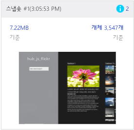
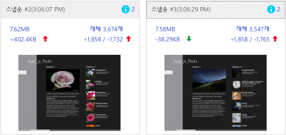
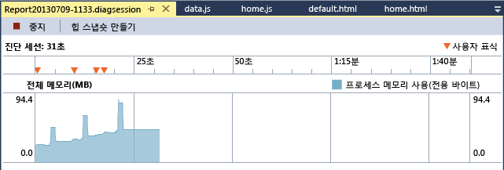
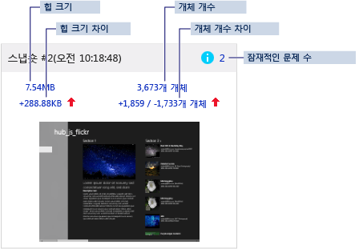
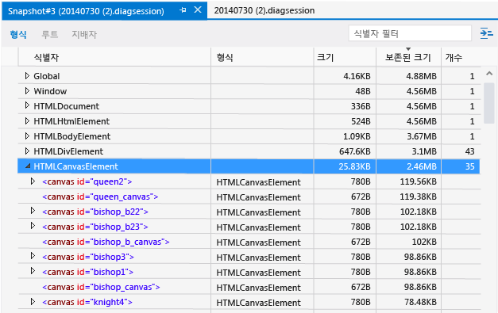
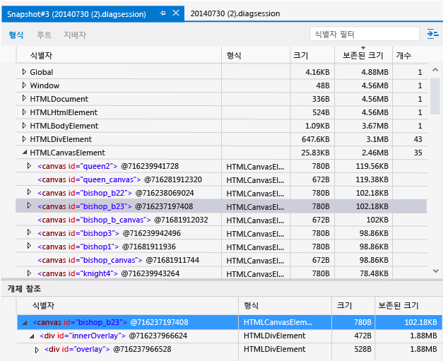

# <a name="analyze-javascript-memory-usage-in-uwp-apps"></a>UWP 앱에서 JavaScript 메모리 사용량 분석
Visual Studio에서 제공하는 JavaScript 메모리 분석기를 사용하면 JavaScript를 사용하여 Windows용으로 작성된 UWP 앱의 메모리 사용량을 파악하고 메모리 누수를 찾을 수 있습니다. 지원되는 앱으로는 유니버설 Windows 앱을 위한 앱이 있습니다.
  
 JavaScript 메모리 분석기는 다음과 같은 작업을 수행할 수 있습니다.  
  
-   앱에서 메모리 사용 문제를 신속하게 찾을 수 있도록 관련성이 가장 높은 데이터를 강조합니다.  
  
     이 데이터는 두 스냅숏의 차이점 설명과 더 자세한 보기 링크가 있는 스냅숏 요약에서 찾을 수 있습니다.  
  
-   문제를 격리하는 데 도움이 되는 지배자, 형식 및 루트 뷰를 제공합니다.  
  
-   JavaScript 힙 데이터에서 사용할 수 없는 정보를 줄입니다.  
  
     앱 코드에서 직접 만들지 않은 개체는 자동으로 필터링됩니다. 또한 개체 이름으로 데이터를 필터링할 수 있습니다.  
  
##  <a name="Run"></a> JavaScript 메모리 분석기 실행  
 작업 중인 UWP 앱이 Visual Studio에서 열려 있는 경우 메모리 분석기를 사용할 수 있습니다.
  
#### <a name="to-run-the-memory-analyzer"></a>메모리 분석기를 실행하려면  
  
1.  Visual Studio를 엽니다.  
  
2.  Visual Studio에서 앱을 실행하는 경우 **표준** 도구 모음의 **디버깅 시작** 목록에서 프로젝트에 대한 디버그 대상을 **로컬 컴퓨터** 또는 **장치** 중에서 선택합니다.  
  
3.  메뉴 모음에서 **디버그**, **성능 프로파일러...** 를 차례로 선택합니다.  
  
     기본적으로 현재 시작 프로젝트를 분석합니다. 분석 대상을 변경하려면 **대상 변경**을 선택합니다.  
  
       
  
     분석 대상에 사용할 수 있는 옵션은 다음과 같습니다.  
  
    -   **시작 프로젝트**. 현재 시작 프로젝트를 분석합니다. 원격 컴퓨터에서 앱을 실행 중인 경우 기본값인 이 옵션을 선택해야 합니다.  
  
    -   **실행 중인 응용 프로그램**. 실행 중인 앱 목록에서 UWP 앱을 선택할 수 있습니다. 원격 컴퓨터에서 앱을 실행 중인 경우 이 옵션을 사용할 수 없습니다.  
  
         소스 코드에 액세스할 수 없을 때 이 옵션을 사용하여 컴퓨터에서 실행 중인 앱의 메모리 사용을 분석할 수 있습니다.  
  
    -   **설치된 응용 프로그램**. 설치된 UWP 앱을 선택하여 분석할 수 있습니다. 원격 컴퓨터에서 앱을 실행 중인 경우 이 옵션을 사용할 수 없습니다.  
  
         소스 코드에 액세스할 수 없을 때 이 옵션을 사용하여 컴퓨터에 설치된 앱의 메모리 사용을 분석할 수 있습니다. 사용자가 직접 개발하지 않은 앱의 메모리 사용을 분석하려는 경우에도 이 옵션이 유용할 수 있습니다.  
  
4.  **사용 가능한 도구**에서 **JavaScript 메모리** 확인란을 선택한 다음 **시작**을 선택합니다.  
  
5.  메모리 분석기를 시작하면 사용자 계정 컨트롤 창에서 Visual Studio ETW Collector.exe 실행 권한을 요청할 수 있습니다. **예**를 선택합니다.  
  
     다음 단원의 설명에 따라 앱을 조작하여 관련된 메모리 사용 시나리오를 테스트하고 메모리 그래프를 봅니다.  
  
6.  Alt+Tab을 눌러 Visual Studio로 전환합니다.  
  
7.  메모리 분석기로 수집 중인 데이터를 보려면 **힙 스냅숏 만들기**를 선택합니다. 자세한 내용은 이 항목의 뒷부분에 나오는 [View a snapshot summary](#SnapshotSummary) 를 참조하세요.  
  
##  <a name="Check"></a> 메모리 사용량 확인  
 JavaScript 메모리 분석기에서 서로 다른 뷰를 사용하여 메모리 누수를 식별할 수 있습니다. 앱에 메모리 누수가 있다고 의심되는 경우 [Isolate a memory leak](#Isolate) 에서 제안된 워크플로를 참조하세요.  
  
 다음 뷰를 사용해서 응용 프로그램에서 메모리 누수를 식별합니다.  
  
-   [라이브 메모리 사용 요약 보기](#LiveMemory)을(를) 참조하세요. 메모리 사용량 그래프를 사용해서 특정 작업으로 인해 메모리 사용량이 급격하게 증가하거나 지속적으로 증가하는지 확인합니다. 라이브 메모리 사용 요약 뷰를 사용하여 힙의 스냅숏을 만듭니다. 스냅숏은 메모리 사용 그래프 아래에 컬렉션으로 표시됩니다.  
  
    > [!TIP]
    >  스냅숏을 수행할 때 메모리 사용량에 스파이크가 나타납니다. 증가를 더 정확하게 나타내려면 스냅숏 요약을 사용합니다.  
  
-   [View a snapshot summary](#SnapshotSummary)을(를) 참조하세요. 메모리 프로파일링 세션 중 또는 이후에 스냅숏 요약 정보를 볼 수 있습니다. 스냅숏 요약을 사용해서 스냅숏 세부 정보 및 스냅숏 차이 뷰에 연결합니다.  
  
    > [!TIP]
    >  일반적으로 스냅숏 차이 뷰에는 메모리 누수에 대해 가장 유용한 정보가 제공됩니다.  
  
-   [스냅숏 정보 보기](#SnapshotDetails)을(를) 참조하세요. 단일 스냅숏에 대한 메모리 사용 데이터를 자세히 보여 줍니다.  
  
-   [스냅숏 차이 보기](#SnapshotDiff)을(를) 참조하세요. 스냅숏 간의 차이 값을 표시합니다. 이러한 뷰에서는 개체 크기 및 개체 수에서의 차이를 보여줍니다.  
  
##  <a name="Isolate"></a> Isolate a memory leak  
 이러한 단계에서는 JavaScript 메모리 분석기를 보다 효율적으로 사용할 수 있도록 도와줄 수 있는 워크플로를 제공합니다. 이러한 단계는 응용 프로그램에 메모리 누수가 있다고 의심될 경우에 유용할 수 있습니다. 작업 중인 앱에서 메모리 누수를 확인하는 과정을 안내하는 자습서는 [연습: 메모리 누수 찾기(JavaScript)](../profiling/walkthrough-find-a-memory-leak-javascript.md)를 참조하세요.  
  
1.  Visual Studio에서 앱을 엽니다.  
  
2.  JavaScript 메모리 분석기를 실행합니다. 자세한 내용은 [JavaScript 메모리 분석기 실행](#Run)을 참조하세요.  
  
3.  테스트하려는 시나리오에서 앱을 실행합니다. 예를 들어, 특정 페이지 로드 시나 앱 시작 시 시나리오에 대규모 DOM 변환이 관련될 수 있습니다.  
  
4.  시나리오 1~4를 추가로 반복합니다.  
  
    > [!TIP]
    >  테스트 시나리오를 여러 번 반복하면 초기화 작업을 결과에서 필터링할 수 있는지 확인하는 데 도움이 될 수 있습니다.  
  
5.  Visual Studio로 전환합니다(Alt+Tab).  
  
6.  **힙 스냅숏 만들기**를 선택하여 기본 힙 스냅숏을 만듭니다.  
  
     다음 그림에서는 기본 스냅숏의 예를 보여 줍니다.  
  
       
  
    > [!TIP]
    >  스냅숏 타이밍을 보다 정밀하게 제어하려면 코드에서 [Associate source code with memory usage data](#JSConsoleCommands) 명령을 사용하면 됩니다.  
  
7.  앱으로 전환하고 테스트 중인 시나리오를 반복합니다(한 번만 반복).  
  
8.  Visual Studio로 전환하고 두 번째 스냅숏을 작성합니다.  
  
9. 앱으로 전환하고 테스트 중인 시나리오를 반복합니다(한 번만 반복).  
  
10. Visual Studio로 전환하고 세 번째 스냅숏을 작성합니다.  
  
     다음 그림에서는 두 번째 및 세 번째 스냅숏의 예를 보여줍니다.  
  
       
  
     이 워크플로의 기본, 두 번째 및 세 번째 스냅숏을 작성하여 메모리 누수와 관련이 없는 변경 내용을 보다 쉽게 필터링할 수 있습니다. 예를 들어, 페이지에서 머리글 및 바닥글 업데이트와 같이 메모리 사용량을 변경하지만 메모리 누수와는 관련이 없을 수 있는 예상 변경 내용이 있을 수 있습니다.  
  
11. 세 번째 스냅숏에서 다음과 같은 차이 뷰 중 하나에 대한 링크를 선택합니다.  
  
    -   힙 크기 차이(힙 크기 아래의 왼쪽 링크)입니다. 링크 텍스트는 현재 스냅숏과 이전 스냅숏 간의 힙 크기 차이를 보여 줍니다.  
  
    -   개체 수 차이(개체 개수 아래의 오른쪽 링크)입니다. 링크 텍스트는 두 값(예: +1858/-1765)을 보여줍니다. 첫 번째 값은 이전 스냅숏 이후에 추가된 새 개체의 수이고, 두 번째 값은 이전 스냅숏 이후에 제거된 개체 수입니다.  
  
     이러한 링크는 힙에 대한 유형의 스냅숏 차이 정보 보기를 열고 열린 링크에 따라 보존 크기 또는 개체 수를 기준으로 정렬됩니다.  
  
12. 메모리 사용 문제를 식별하려면 다음 **범위** 필터 옵션 중 하나를 선택합니다.  
  
    -   **스냅숏 #2에서 남은 개체**.  
  
    -   **스냅숏 #2와 #3 사이에 추가된 개체**  
  
    > [!TIP]
    >  이전 스냅숏에서 남은 개체의 필터링된 뷰를 사용하여 메모리 누수를 확인합니다. 예를 들어 개체 수 차이가 +205/-195인 경우 이 뷰에 개체가 10개 남았다고 표시되고 이러한 개체가 메모리 누수 후보가 될 수 있습니다.  
  
     다음 그림에서는 스냅숏 #2에서 남은 개체의 차이 뷰를 보여줍니다.  
  
       
  
     앞의 그림에는 이전 스냅숏에서 남은 개체 두 개가 표시됩니다. 특정 앱에 대해 예상된 동작인지 여부를 확인합니다. 그렇지 않으면 메모리 누수를 나타낼 수 있습니다.  
  
13. 차이 뷰에서 개체가 가비지 수집되지 않도록 방지하는 개체의 루트 전역 개체 위치를 찾아보려면 해당 개체의 바로 가기 메뉴를 연 다음 **루트 뷰에서 보기**를 선택합니다. 루트 개체가 전역 개체인 단일 개체(또는 몇 개의 개체)가 참조하므로 많은 개체가 메모리에 보존될 수 있습니다.  
  
14. 남아 있는 개체 뷰에 개체가 너무 많으면 메모리 누수가 발생하는 기간을 추가로 격리한 후 스냅숏 세 개를 다시 만들어 보세요. 메모리 누수를 추가로 격리하려면 [Associate source code with memory usage data](#JSConsoleCommands), [Associate source code with memory usage data](#JSConsoleCommands)및 메모리 분석기에서 제공되는 다른 메모리 사용 데이터를 사용합니다.  
  
##  <a name="LiveMemory"></a> 라이브 메모리 사용 요약 보기  
 라이브 메모리 사용 요약 뷰는 모든 스냅숏 요약 타일의 모음과 실행 중인 앱에 대한 메모리 사용 그래프를 제공합니다. 이 뷰에서 스냅숏 만들기, 요약 정보 분석, 다른 뷰로 이동 등의 기본적인 작업을 수행할 수 있습니다. 데이터 수집을 중지하면 메모리 그래프가 사라지고 [View a snapshot summary](#SnapshotSummary) 뷰만 표시됩니다.  
  
 메모리 그래프는 전용 바이트, 기본 메모리 및 JavaScript 힙을 포함하는 앱 프로세스 메모리의 라이브 뷰를 보여 줍니다. 메모리 그래프는 프로세스 메모리의 스크롤 가능한 뷰입니다. 다음과 같이 나타납니다.  
  
   
  
 앱 코드에 사용자 표식을 추가한 경우( [Associate source code with memory usage data](#JSConsoleCommands)참조), 메모리 사용 그래프에 역삼각형이 나타나 해당 코드 섹션에 도달하는 시점을 알려줍니다.  
  
 메모리 그래프에 표시되는 메모리 중 일부는 JavaScript 런타임에서 할당합니다. 앱에서 이 메모리 사용을 제어할 수는 없습니다. 그래프에 표시된 메모리 사용량은 첫 번째 스냅숏을 만들 때 증가하고, 스냅숏을 추가로 만들 때마다 아주 조금씩 증가합니다.  
  
##  <a name="SnapshotSummary"></a> View a snapshot summary  
 현재 상태의 앱 메모리 사용량에 대한 스냅숏을 만들려면 메모리 그래프에서 **힙 스냅숏 만들기** 를 선택합니다. 라이브 메모리 사용 요약(앱 실행 중)과 스냅숏 요약(앱 중지됨) 양쪽에 나타나는 스냅숏 요약 타일은 JavaScript 힙에 대한 정보와 보다 자세한 정보에 대한 링크를 제공합니다. 스냅숏을 여러 개 만든 경우, 특정 스냅숏의 데이터와 이전 스냅숏의 데이터를 비교하여 추가 정보를 제공합니다.  
  
> [!NOTE]
>  JavaScript 메모리 분석기는 각 스냅숏 전에 강제로 가비지를 수집합니다. 이로써 실행 간에 결과의 일관성이 높아집니다.  
  
 다음은 스냅숏을 여러 개 만드는 경우의 스냅숏 요약 예제입니다.  
  
   
  
 이 스냅숏 요약에는 다음이 포함됩니다.  
  
-   스냅숏 제목 및 타임스탬프.  
  
-   잠재적인 문제 수(파란색 정보 아이콘으로 표시). 표시되는 숫자는 DOM에 연결되지 않은 노드 등 잠재적인 메모리 문제를 나타냅니다. 개수는 스냅숏의 형식 뷰와 연결되어 있으며, 문제 유형별로 정렬된 이 뷰에는 잠재적인 문제가 강조 표시되어 있습니다. 문제에 대한 설명은 도구 설명에 표시됩니다.  
  
-   힙 크기. 이 번호에는 JavaScript 런타임 엔진이 JavaScript 힙에 추가하는 DOM 요소와 개체가 포함됩니다. 힙 크기는 스냅숏의 형식 뷰와 연결됩니다.  
  
-   힙 크기 차이. 이 값은 현재 스냅숏과 이전 스냅숏 간의 힙 크기 차이를 보여 줍니다. 메모리 증가이면 빨간색 위쪽 화살표, 메모리 감소이면 녹색 아래쪽 화살표가 값 뒤에 표시됩니다. 스냅숏 간에 힙 크기가 달라지지 않는 경우, 숫자 대신 **변경 안 함** 이라는 텍스트가 나타납니다. 첫 번째 스냅숏에는 **기본**텍스트가 표시됩니다. 힙 크기 차이는 스냅숏 차이의 형식 뷰와 연결됩니다.  
  
-   개체 수. 이 숫자는 앱에서 만든 개체만 표시하며 JavaScript 런타임에서 생성된 기본 제공 개체는 필터링합니다. 개체 수는 스냅숏 정보의 형식 뷰에 연결됩니다.  
  
-   개체 수 차이. 두 값을 보여줍니다. 첫 번째 값은 이전 스냅숏 이후에 추가된 새 개체의 수이고, 두 번째 값은 이전 스냅숏 이후에 제거된 개체 수입니다. 예를 들어 그림에서는 1,859개의 개체가 추가되고 스냅숏 #1부터 1,733개의 개체를 제거했습니다. 총 개체 수가 늘었으면 이 정보 다음에 빨간색 위쪽 화살표가 나타나고, 총 개체 수가 줄었으면 녹색 아래쪽 화살표가 나타납니다. 스냅숏 간에 개체 수가 달라지지 않는 경우, 숫자 대신 **변경 안 함** 이라는 텍스트가 나타납니다. 첫 번째 스냅숏에는 **기본**텍스트가 표시됩니다. 개체 수 차이는 스냅숏 차이의 형식 뷰와 연결됩니다.  
  
-   스냅숏이 만들어질 당시의 화면 스크린 샷입니다.  
  
##  <a name="SnapshotDetails"></a> 스냅숏 정보 보기  
 스냅숏 정보 뷰에서 스냅숏별 메모리 사용량에 대한 자세한 정보를 볼 수 있습니다.  
  
 스냅숏 정보를 보려면 스냅숏 요약 뷰에서 링크를 선택합니다. 예를 들어, 힙 크기 링크를 선택하면 기본적으로 형식 뷰가 열리면서 스냅숏 정보가 표시됩니다.  
  
 이 그림은 메모리 사용 데이터가 보존 크기별로 정렬되어 있는 스냅숏 정보를 담은 형식 뷰를 보여 줍니다.  
  
   
  
 스냅숏 정보 뷰의 도구 모음에서 옵션을 선택하여 형식, 루트 또는 도미네이터별로 메모리 사용량 데이터를 검토할 수 있습니다.  
  
-   **형식**. 힙에서 인스턴스 수와 총 개체 크기를 개체 형식별로 그룹화하여 표시합니다. 기본적으로 인스턴스 수를 기준으로 정렬됩니다.  
  
    > [!TIP]
    >  일반적으로 개체 힙에 대한 형식의 차이 뷰가 메모리 누수 식별에 가장 유용한 뷰입니다. 이러한 뷰는 남은 개체 식별에 도움이 되는 **범위** 필터를 제공합니다.  
  
-   **루트**. 루트 개체에서 자식 참조까지 개체의 계층적 뷰를 보여 줍니다. 기본적으로 자식 노드는 보존 크기 열을 기준으로 정렬되며 맨 위에 가장 큰 값이 표시됩니다.  
  
-   **지배자**. 힙에서 다른 개체를 단독으로 참조하는 개체 목록을 표시합니다. 지배자는 보존 크기에 따라 정렬됩니다.  
  
    > [!TIP]
    >  지배자를 메모리에서 제거하면 개체가 보존하는 모든 메모리가 회수됩니다. 몇 가지 앱의 경우 전체 개체 참조 체인을 확인할 수 있으므로 도미네이터 뷰가 보존된 메모리 크기를 명확히 파악하는 데 도움이 될 수 있습니다  
  
 세 가지 뷰 모두 값 형식은 유사합니다.  
  
-   **식별자**. 개체를 가장 잘 식별하는 이름입니다. 예를 들어, HTML 요소에 ID 특성을 사용한 경우 스냅숏 정보에 그 값이 표시됩니다.  
  
-   **형식**. 개체 형식(예: HTML link 요소 또는 div 요소).  
  
-   **크기**. 개체 크기이며 참조 개체의 크기는 포함하지 않습니다.  
  
-   **보존 크기**. 개체 크기에 다른 부모가 없는 모든 자식 개체의 크기를 더한 합계입니다. 실무에서는 개체에 의해 보존된 메모리 양을 의미하며, 따라서 해당 개체를 삭제하면 지정된 만큼의 메모리 양을 회수할 수 있습니다.  
  
-   **개수**. 개체의 인스턴스 수입니다. 이 값은 형식 뷰에만 나타납니다.  
  
##  <a name="SnapshotDiff"></a> 스냅숏 차이 보기  
 JavaScript 메모리 분석기의 스냅숏 차이 뷰에서 스냅숏을 이전 스냅숏과 비교할 수 있습니다.  
  
 스냅숏 요약 뷰에서는 두 개 이상의 스냅숏을 작성한 후 차등적 힙 크기 또는 차등적 개체 수 링크를 선택하여 차등적 스냅숏 세부 정보를 볼 수 있습니다.  
  
 형식, 루트 및 도미네이터에 대한 차이 정보를 볼 수 있습니다. 스냅숏 차이는 두 스냅숏 사이의 힙에 추가된 개체와 같은 정보를 보여 줍니다.  
  
 다음 그림은 스냅숏 차이의 형식 뷰를 보여 줍니다.  
  
   
  
 스냅숏 차이 창의 지배자, 형식 및 루트 뷰는 [스냅숏 정보 보기](#SnapshotDetails) 창과 동일합니다. 스냅숏 차이에는 스냅숏 정보와 동일한 정보 외에 다음 값이 추가로 표시됩니다.  
  
-   **크기 차이**. 현재 스냅숏과 이전 스냅숏의 개체 크기 차이이며, 참조된 개체의 크기는 포함하지 않습니다.  
  
-   **보존된 크기 차이**. 현재 스냅숏과 이전 스냅숏의 보존된 개체 크기 차이입니다. 보존 크기에는 개체 크기와 다른 부모가 없는 모든 자식 개체의 크기가 포함됩니다. 보존 크기는 개체에서 사용하는 메모리 양이므로 개체를 삭제할 경우 지정된 메모리 양을 가져오게 됩니다.  
  
 스냅숏 간의 차이 정보를 필터링하려면 차이 뷰 상단에 있는 **범위** 필터 중 하나를 선택합니다.  
  
-   **스냅숏 #\<number>** 에서 남은 개체. 이 필터는 기본 스냅숏 및 이전 스냅숏과 비교하여 힙에 추가된 개체와 힙에서 제거된 개체 간의 차이를 보여줍니다. 예를 들어 스냅숏 요약에서 개체 수가 +205/-195로 표시된 경우 이 필터는 제거된 것이 아닌 추가된 개체 10개를 보여줍니다.  
  
    > [!TIP]
    >  이 필터에서 가장 유용한 정보를 표시하려면 [Isolate a memory leak](#Isolate)에 설명된 단계를 따르세요.  
  
-   **스냅숏 #\<number> 및 #\<number>** 사이에 추가된 개체. 이 필터는 이전 스냅숏에서 힙에 추가된 모든 개체를 보여줍니다.  
  
-   **스냅숏 #\<number>** 의 모든 개체. 이 필터 설정은 힙에서 어떤 개체도 필터링하지 않습니다.  
  
 현재 **범위** 필터와 일치하지 않는 개체 참조를 표시하려면 창의 오른쪽 상단에 있는 설정 목록 에서 **일치하지 않는 참조 표시**를 선택합니다. 이 설정을 사용하도록 설정하는 경우 일치하지 않는 참조가 회색 텍스트로 표시됩니다.  
  
> [!TIP]
>  메모리가 누수되는 개체를 식별하려면 [Isolate a memory leak](#Isolate) 단계에 따라 **범위** 필터를 통해 남은 개체를 사용하여 메모리가 누수되는 개체를 사용하는 것이 좋습니다.  
  
##  <a name="FoldObjects"></a> 도미네이터별 개체 보기  
 형식 및 도미네이터 뷰에서 도미네이터로 접힌 개체를 볼지 여부를 선택할 수 있습니다(도미네이터 탭의 기본 뷰). 이 뷰를 선택하는 경우 개체의 최상위 뷰에 도미네이터만 표시됩니다. 비전역 개체의 하위 항목에 해당하는 개체는 최상위 뷰에서 숨겨집니다. 일부 앱에서는 이를 통해 데이터의 노이즈를 줄임으로써 메모리 누수를 유발하는 개체를 확인할 수 있습니다.  
  
 도미네이터별로 개체 뷰를 전환하려면 **도미네이터별 개체 접기** 단추를 선택합니다.   
  
 지배자에 대한 자세한 내용은 [스냅숏 정보 보기](#SnapshotDetails)을(를) 참조하세요.  
  
##  <a name="Filter"></a> 식별자별 데이터 필터링  
 지배자 및 형식 뷰에서 특정 식별자를 검색하여 데이터를 필터링할 수 있습니다. 식별자를 검색하려면 오른쪽 위에 있는 **식별자 필터** 텍스트 상자에 이름을 입력하면 됩니다. 입력하기 시작하면 입력된 문자를 포함하지 않는 식별자가 필터링됩니다.  
  
 뷰마다 자체 필터가 있으므로 다른 뷰로 전환하면 필터는 사라집니다.  
  
##  <a name="ShowInRootsView"></a> 개체 트리에서 개체 찾기  
 형식 및 도미네이터 뷰에서는 특정 개체와 `Global` 개체의 관계를 볼 수 있습니다. `Global` 개체가 루트인 개체는 가비지 수집되지 않습니다. `Global` 개체 트리를 검색하지 않고도 루트 뷰에서 손쉽게 알려진 개체를 찾을 수 있습니다. 이렇게 하려면 지배자 또는 형식 뷰에서 개체에 대한 바로 가기 메뉴를 열고 **루트 뷰에서 보기**를 선택합니다.  
  
##  <a name="References"></a> 공유 개체 참조 보기  
 형식 및 도미네이터 뷰의 아래쪽 창에는 공유 참조가 표시된 개체 참조 목록이 있습니다. 위쪽 창에서 개체를 선택하면 해당 개체를 가리키는 모든 개체가 개체 참조 목록에 표시됩니다.  
  
> [!NOTE]
>  순환 참조는 별표(*) 및 정보 도구 설명과 함께 표시되며 확장될 수 없습니다. 그렇지 않으면 순환 참조는 참조 트리에서 위로 이동하는 것을 금지해 메모리를 보유 중인 개체를 식별하지 못하게 합니다.  
  
 해당하는 개체를 식별하는 데 더 자세한 도움이 필요하면 위쪽 창의 오른쪽 상단에 있는 설정 목록 에서 **개체 ID 표시**를 선택합니다. 이 옵션을 선택하면 **식별자** 목록의 개체 이름 옆에 개체 ID가 표시됩니다(개체 참조 목록뿐 아니라 모든 뷰에 ID가 표시됨). ID가 동일한 개체들은 공유되는 참조입니다.  
  
 다음 그림에는 선택한 항목의 개체 참조 목록이 ID와 함께 표시되어 있습니다.  
  
   
  
##  <a name="BuiltInValues"></a> 기본 제공 개체 표시  
 지배자 및 형식 뷰에는 기본적으로 앱에서 만든 개체만 표시됩니다. 이는 불필요한 정보를 필터링하고 앱 관련 문제를 격리하는 데 도움이 됩니다. 그러나 JavaScript 런타임에서 앱에 대해 생성하는 모든 개체를 보아야 할 경우도 있습니다.  
  
 이러한 개체를 표시하려면 창 오른쪽 상단의 설정 목록 에서 **기본 제공 항목 표시**를 선택합니다.  
  
##  <a name="Save"></a> 진단 세션 파일 저장  
 진단 스냅숏 요약과 관련 정보 뷰는 .diagsession 파일로 저장됩니다. **솔루션 탐색기** 의 진단 세션 폴더에는 이전 진단 세션이 표시됩니다. **솔루션 탐색기**에서 이전 세션을 열거나 파일을 제거하거나 파일 이름을 바꿀 수 있습니다.  
  
##  <a name="JSConsoleCommands"></a> Associate source code with memory usage data  
 메모리 문제가 있는 코드 부분을 분리하려면 다음 방법을 사용합니다.  
  
-   세부 정보와 다른 뷰에서 DOM 요소의 클래스 이름 및 ID를 찾습니다.  
  
-   세부 정보 및 기타 뷰에서 소스 코드와 연결할 수 있는 문자열 값을 찾습니다.  
  
-   개체 트리를 탐색하려면 [개체 트리에서 개체 찾기](#ShowInRootsView) 명령을 사용합니다. 이를 통해 연결된 소스 코드를 확인할 수도 있습니다.  
  
-   소스 코드에 메모리 분석기 명령을 추가합니다.  
  
 소스 코드에서 다음 명령을 사용할 수 있습니다.  
  
-   `console.takeHeapSnapshot` 은 JavaScript 메모리 분석기에 나타나는 힙 스냅숏을 만듭니다. 이 명령은 [JavaScript Console commands](../debugger/javascript-console-commands.md).  
  
-   `performance.mark` 는 응용 프로그램을 실행하는 동안 요약 뷰의 메모리 그래프 타임라인에 나타나는 사용자 표시(역삼각형)를 설정합니다. 이 명령은 이벤트를 기술하는 하나의 문자열 인수를 사용하며 메모리 그래프에 도구 설명으로 나타납니다. 이 설명은 100자를 초과할 수 없습니다.  
  
> [!TIP]
>  `console.takeHeapSnapshot` 을 사용해서 메모리 사용량 시나리오를 반복할 때 분석을 빠르게 수행할 수 있습니다.  
  
 이러한 명령을 응용 프로그램에 추가하고 JavaScript 메모리 분석기 외부에서 응용 프로그램을 실행하면 명령이 예외를 throw합니다. 그러나 명령을 사용하기 전에 이러한 명령이 있는지 여부를 테스트할 수 있습니다. (세션 시작 단계 초기에는 명령이 존재하지 않습니다.) `takeHeapSnapshot`을 안전하게 호출할 수 있는지 확인하려면 이 코드를 사용합니다.  
  
```javascript  
if (console && console.takeHeapSnapshot) {  
    console.takeHeapSnapshot();  
}  
```  
  
 `performance.mark`을 안전하게 호출할 수 있는지 확인하려면 이 코드를 사용합니다.  
  
```javascript  
if (performance && performance.mark) {  
    performance.mark("message_string");  
}  
  
```  
  
 다음은 몇 가지 사용자 표시 및 현재 선택된 사용자 표시의 도구 설명을 포함하는 메모리 그래프입니다. `performance.mark` 문자열 인수는 "데이터 생성됨"으로 설정되어 있습니다.  
  
   
  
##  <a name="Tips"></a> 메모리 문제 식별 팁  
  
-   메모리 누수 가능성이 있는 개체를 식별하려면 [메모리 누수 격리](#Isolate)에 설명된 워크플로를 따르고 차이 뷰에서 **스냅숏 #\<number>에서 남은 개체** 필터를 사용합니다.  
  
-   [개체 트리에서 개체 찾기](#ShowInRootsView) 를 사용합니다. 루트 뷰는 개체의 루트 개체가 전역 개체가 되는 방식을 보여 줍니다. 이 경우 해당 개체는 가비지 수집되지 않습니다.  
  
-   메모리 문제의 원인을 식별하기 어려울 때는 여러 가지 뷰(예: 도미네이터 및 형식)를 사용하여 공통점을 찾습니다. 이는 특히 뷰에 표시된 여러 다른 개체에 대한 참조를 포함할 수 있는 하나의 개체(또는 몇 가지 개체)를 식별하는데 도움이 됩니다.  
  
-   사용자가 새 페이지로 이동한 후 우연히 메모리에 남겨진 개체를 찾습니다. 이것은 메모리 문제의 일반적인 원인입니다. 예:  
  
    -   [URL.CreateObjectUrl](http://msdn.microsoft.com/library/windows/apps/hh453196.aspx) 함수를 잘못 사용하면 이 문제가 발생할 수 있습니다.  
  
    -   일부 개체는 사용할 `dispose` 메서드 및 권장 사항을 제공할 수 있습니다. 예를 들어 목록의 `dispose` 메서드를 호출한 다음 페이지에서 벗어날 경우 [WinJS.Binding.List](http://msdn.microsoft.com/library/windows/apps/Hh700774.aspx) 에서 `createFiltered` 를 호출해야 합니다.  
  
    -   하나 이상의 이벤트 수신기를 제거해야 할 수 있습니다. 자세한 내용은 [View DOM event listeners](../debugger/view-dom-event-listeners.md)을 참조하세요.  
  
-   JavaScript 메모리 분석기에 대한 Build 2013 컨퍼런스에서 [이 비디오](http://channel9.msdn.com/Events/Build/2013/3-316) 의 뒷부분을 시청하세요.  
  
-   [UWP 앱에서 메모리 관리](http://msdn.microsoft.com/magazine/jj651575.aspx)를 참조하세요.  
  
-   임시로 코드를 수정하여 문제를 격리하는 방법도 있습니다. 예를 들어, 다음을 수행합니다.  
  
    -   메모리 분석기용 명령인 `console.takeSnapshot` 및 `performance.mark`를 사용합니다. [Associate source code with memory usage data](#JSConsoleCommands)를 참조하세요.  
  
         이러한 명령을 사용하면 힙 스냅숏을 직접 만드는 것으로는 격리되지 않는 문제도 격리할 수 있습니다.  
  
    -   테스트 개체를 만들고 형식 뷰 등 JavaScript 메모리 분석기의 뷰에서 추적합니다. 예를 들어, 초대형 개체를 다른 개체에 연결하여 특정 개체나 요소가 가비지 수집되었는지 확인할 수 있습니다.  