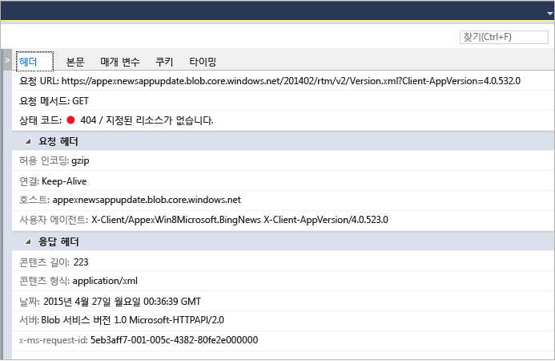

# UWP 앱에서 네트워크 사용 분석
Visual Studio **네트워크** 진단 도구는 [Windows.Web.Http API](/uwp/api/windows.web.http)를 사용하여 수행된 네트워크 작업에 대한 데이터를 수집합니다. 데이터를 분석하면 액세스 및 인증 문제, 잘못된 캐시 사용 및 저하된 디스플레이와 다운로드 성능을 해결하는 데 도움이 될 수 있습니다.  
  
 네트워크 도구는 UWP 앱만 지원합니다. 지금은 다른 플랫폼이 지원되지 않습니다.  
  
> [!NOTE]
>  네트워크 도구에 대한 자세한 설명은 [Introducing Visual Studio's network tool](https://blogs.msdn.microsoft.com/visualstudio/2015/05/04/introducing-visual-studios-network-tool/)(Visual Studio 네트워크 도구 소개)을 참조하세요.  
  
## 네트워크 도구 데이터 수집  
 Visual Studio가 설치된 컴퓨터에 열려 있는 Visual Studio 프로젝트로 **네트워크** 도구를 실행해야 합니다.  
  
1. Visual Studio에서 프로젝트를 엽니다.  
  
2. 메뉴에서 **디버그/성능 프로파일러**를 클릭합니다. **네트워크**를 선택한 다음 **시작**을 선택합니다.  
  
3. 네트워크 도구에서 앱의 HTTP 트래픽 수집을 시작합니다.  
  
    앱을 실행하면 왼쪽 창의 요약 보기에 캡처된 HTTP 작업 목록이 자동으로 표시됩니다. 요약 보기에서 항목을 선택하면 오른쪽 창의 세부 정보 패널에서 자세한 내용을 볼 수 있습니다.  
  
4. 앱을 닫으려면 **중지** 를 선택합니다.  
  
   보고서 창의 모습은 다음과 같아야 합니다.  
  
     
  
## 데이터 분석  
 앱이 실행되는 동안 또는 앱을 닫은 후에도, 요약 보기에 표시된 네트워크 작업 중에서 선택하여 캡처된 HTTP 트래픽을 분석할 수 있습니다.  
  
 **네트워크** 요약 보기에는 앱을 실행하는 동안의 각 네트워크 작업에 대한 데이터가 표시됩니다. 열 머리글을 선택하여 목록을 정렬하거나, **콘텐츠 형식** 필터 보기에 표시할 콘텐츠 형식을 선택합니다.  
  
 **HAR로 저장**을 선택하여 Fiddler와 같은 타사 도구에서 사용할 수 있는 JSON 파일을 만듭니다.  
  
 **네트워크** 세부 정보 보기에는 요약 보기에 있는 네트워크 작업에 대한 자세한 정보가 표시됩니다.  
  
   
  
|||  
|-|-|  
|**헤더**|이벤트의 요청 헤더에 대한 정보입니다.|  
|**본문**|요청 및 응답 페이로드 데이터입니다.|  
|**매개 변수**|쿼리 문자열 매개 변수 이름 및 값입니다.|  
|**쿠키**|응답 및 요청 쿠키 데이터입니다.|  
|**타이밍**|선택한 리소스를 획득하기 위한 단계의 그래프입니다.|  
  
 네트워크 **요약** 막대에는 지정된 지점에서 표시되는 네트워크 작업 수, 전송된 데이터의 양, 다운로드에 소요된 시간, 표시되는 오류의 수(요청과 4xx 또는 5xx개의 응답)가 표시됩니다.  
  
### 분석 팁  
 이 도구는 네트워크 관련 분석을 실행할 때 유용할 수 있는 특정 영역을 강조 표시합니다.  
  
1.  캐시에서 완전히 처리되는 요청은 **받음** 열에 **(캐시에서)** 로 표시됩니다. 이렇게 하면 사용자 대역폭 절약을 위해 캐시를 효과적으로 사용하는지, 아니면 실수로 응답을 캐시하고 애플리케이션의 최종 사용자에게 오래된 데이터를 제공하고 있는지 결정하는 데 도움이 될 수 있습니다.  
  
2.  오류 응답(4xx 또는 5xx)은 빨간색 상태 코드로 **결과** 열에 표시되며 요약 막대에도 강조 표시됩니다. 따라서 애플리케이션에서 많은 잠재적 요청 중 오류를 쉽게 파악할 수 있습니다.  
  
3.  응답 자동 서식 지정 단추(본문 탭 내부)를 사용하면 콘텐츠 가독성을 높여 JSON, XML, HTML, CSS, JavaScript 및 TypeScript 응답 페이로드를 통해 구문 분석하는 데 도움이 될 수 있습니다.  
  
## 참고 항목  
 [디버거를 사용하거나 사용하지 않고 프로파일링 도구 실행](../profiling/running-profiling-tools-with-or-without-the-debugger.md)  
 [Visual Studio 블로그: Visual Studio의 네트워크 검사기 소개](http://go.microsoft.com/fwlink/?LinkId=535022)   
 [Channel 9 비디오: VS 진단 도구 – 새 네트워크 프로파일러](https://channel9.msdn.com/Series/ConnectOn-Demand/206)  
 [Visual Studio의 프로파일링](../profiling/index.md)  
 [프로파일링 도구 살펴보기](../profiling/profiling-feature-tour.md)
