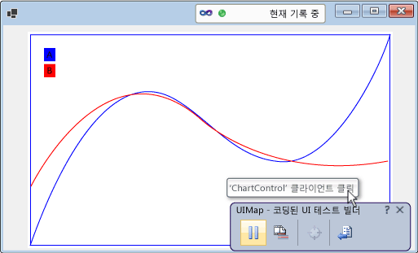
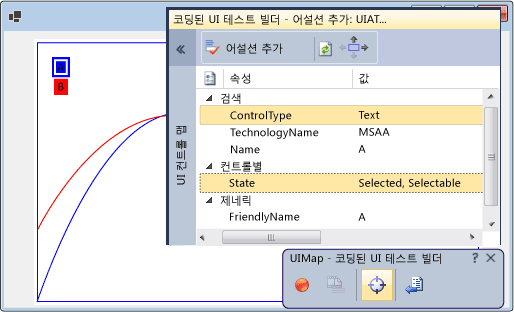

# 컨트롤의 코딩된 UI 테스트 사용
[!INCLUDE[vs2017banner](../code-quality/includes/vs2017banner.md)]

코딩된 UI 테스트 프레임 워크에 대한 지원을 구현하는 경우 컨트롤에 더 쉽게 테스트할 수 있습니다.  점차적으로 증가하는 수준의 지원 추가할 수 있습니다.  레코드와 재생 및 속성 유효성 검사를 지원하여 시작할 수 있습니다.  컨트롤의 사용자 지정 속성을 인식하여 코딩된 UI 테스트 빌더를 사용을 구축하고 생성된 코드에서 해당 속성에 액세스 하는 사용자 지정 클래스를 제공합니다.  또한 기록되고 작업의 의도에 더 가까운 방식으로는 코딩된 UI 테스트 작성기에서 캡처 작업을 도와줄 수 있습니다.  
  
 **항목 내용**  
  
1.  [내게 필요한 옵션을 구현하여 기록 및 재생, 속성 유효성 검사를 지원](../test/enable-coded-ui-testing-of-your-controls.md#recordandplayback)  
  
2.  [속성 공급자를 구현하여 사용자 지정 속성의 유효성 검사를 지원](../test/enable-coded-ui-testing-of-your-controls.md#customproprties)  
  
3.  [사용자 지정 속성에 액세스하기 위해 클래스를 구현하여 코드 생성을 지원](../test/enable-coded-ui-testing-of-your-controls.md#codegeneration)  
  
4.  [작업 필터를 구현하여 의도 인식 작업을 지원](../test/enable-coded-ui-testing-of-your-controls.md#intentawareactions)  
  
   
  
##  <a name="recordandplayback"></a> 내게 필요한 옵션을 구현하여 기록 및 재생, 속성 유효성 검사를 지원  
 코딩된 UI 테스트 작성기는 컨트롤을 기록하는 동안 발견하고 해당 세션을 재생하는 코드를 생성하는 것에 대한 정보를 캡처합니다  컨트롤이 내게 필요한 옵션을 지원하지 않을 경우, 코딩된 UI 테스트 빌더는 화면 좌표를 사용하여 작업\(예: 마우스 클릭\)을 캡처합니다.  테스트 재생을 할 때, 생성된 코드는 같은 화면 좌표에서 마우스 클릭이 발생합니다.  테스트 재생될 때 컨트롤이 화면에 다른 위치에 나타나면, 생성되는 코드 컨트롤에 작업을 수행이 실패합니다.  테스트 UI 레이아웃이 변경 된 후, 다른 환경에서 다른 화면 구성을 동시에 재생하는 경우 오류가 발생할 수 있습니다.  
  
   
  
 액세스 가능성을 구현하는 경우, UI 테스트 빌더는 테스트와 코드 생성을 기록할 때의 컨트롤 정보를 캡처하기 위해 사용합니다.  다음, 테스트를 실행할 때, 생성된 코드는 비록 어딘가 다른 사용자 컨트롤인 컨트롤에 반하여 이러한 이벤트들을 다시 재생합니다.  테스트 작성자는 컨트롤의 기본 속성을 사용하는 주장으로 생성할 수 없습니다.  
  
   
  
### Windows Forms 컨트롤의 기록 및 재생, 속성 유효성 검사 및 탐색을 지원하려면  
 프로시저를 따르는 개요의 컨트롤의 액세스 가능성을 구현하고, <xref:System.Windows.Forms.AccessibleObject> 을 자세히 설명합니다.  
  
   
  
1.  이 <xref:System.Windows.Forms.Control.ControlAccessibleObject> 로 부터 얻어진 클래스를 구현하고, 클래스의 개체를 반환하는 <xref:System.Windows.Forms.Control.AccessibilityObject%2A> 속성을 재정의합니다.  
  
    ```c#  
    public partial class ChartControl : UserControl  
    {  
        // Overridden to return the custom AccessibleObject for the control.  
        protected override AccessibleObject CreateAccessibilityInstance()  
        {  
            return new ChartControlAccessibleObject(this);  
        }  
  
        // Inner class ChartControlAccessibleObject represents accessible information  
        // associated with the ChartControl and is used when recording tests.  
        public class ChartControlAccessibleObject : ControlAccessibleObject  
        {  
            ChartControl myControl;  
            public ChartControlAccessibleObject(ChartControl ctrl)  
                : base(ctrl)  
            {  
                myControl = ctrl;  
            }  
        }  
    }  
    ```  
  
2.  이 <xref:System.Windows.Forms.AccessibleObject.Role%2A>, <xref:System.Windows.Forms.AccessibleObject.State%2A>, <xref:System.Windows.Forms.AccessibleObject.GetChild%2A> 및 <xref:System.Windows.Forms.AccessibleObject.GetChildCount%2A> 개체의 메서드와 속성의 액세스 가능성을 재정의합니다.  
  
3.  자식 컨트롤의 다른 액세스 가능성 개체를 구현하고, 액세스 가능 개체를 반환하는 자식 컨트롤의 <xref:System.Windows.Forms.Control.AccessibilityObject%2A> 속성을 재구성합니다.  
  
4.  여기, <xref:System.Windows.Forms.AccessibleObject.Bounds%2A>, <xref:System.Windows.Forms.AccessibleObject.Name%2A>, <xref:System.Windows.Forms.AccessibleObject.Parent%2A>, <xref:System.Windows.Forms.AccessibleObject.Role%2A>, <xref:System.Windows.Forms.AccessibleObject.State%2A>, <xref:System.Windows.Forms.AccessibleObject.Navigate%2A>, 및 <xref:System.Windows.Forms.AccessibleObject.Select%2A> 속성 및 메서드는 자식 컨트롤의 내게 필요한 옵션 지원 개체에 대해 재정의 합니다.  
  
> [!NOTE]
>  이 항목은 프로시저의 <xref:System.Windows.Forms.AccessibleObject> 샘플의 액세스 가능성과 함께 시작하고, 나머지 프로시저를 빌드합니다.  액세스 가능 샘플의 작업 버전 생성을 원하는 경우, 콘솔 응용 프로그램을 만들고, 샘플 코드의 Program.cs 코드를 대체합니다.  내게 필요한 옵션, System.Drawing 및 System.Windows.Forms에 대한 참조를 추가해야 합니다.  빌드 경고를 제거하기 하려면 내게 필요한 옵션의 **Interop 형식 포함** 를 False로 변경해야합니다.  응용 프로그램을 실행할 때 콘솔 창이 나타나지 않도록 Windows 응용 프로그램과 콘솔 응용 프로그램에서 프로젝트의 출력 형식을 변경할 수 있습니다.  
  
##  <a name="customproprties"></a> 속성 공급자를 구현하여 사용자 지정 속성의 유효성 검사를 지원  
 레코드 및 재생 및 속성 유효성 검사에 대한 기본 지원을 구현했고, <xref:Microsoft.VisualStudio.TestTools.UITesting.UITestPropertyProvider> 플러그인을 구현하여 UI 테스트 컨트롤의 사용자 지정 속성을 만들 수 있습니다.  예를 들어, 다음 절차는 코딩된 UI 테스트에서 상태 차트 컨트롤의 CurveLegend 자식 컨트롤의 속성에 액세스할 수 있는 속성 공급자를 만듭니다.  
  
   
  
### 사용자 지정 속성의 유효성 검사를 지원하려면  
   
  
1.  세미콜론\(;\)으로 주요 설명\(다른 여러 속성으로 구현된 경우\)으로 부터 나누어지고, 문자열로 표현된 서식 속성 값을 통과하는 액세스 가능 곡선 범례 개체의 <xref:System.Windows.Forms.AccessibleObject.Description%2A> 속성을 재정의 합니다.  
  
    ```c#  
    public class CurveLegendAccessibleObject : AccessibleObject  
    {  
        // add the state property value to the description  
        public override string Description  
        {  
            get  
            {  
                // Add “;” and the state value to the end  
                // of the curve legend’s description  
                return "CurveLegend; " + State.ToString();  
            }  
        }  
    }  
    ```  
  
2.  클래스 라이브러리 프로젝트를 만들어 컨트롤에 대해 UI 테스트 확장 패키지 만들기 및 내게 필요한 옵션, Microsoft.VisualStudio.TestTools.UITesting, Microsoft.VisualStudio.TestTools.UITest.Common, 및 Microsoft.VisualStudio.TestTools.Extension에 대한 참조를 추가합니다.  내게 필요한 옵션을 false로 **Interop 형식 포함** 를 변경합니다.  
  
3.  이 <xref:Microsoft.VisualStudio.TestTools.UITesting.UITestPropertyProvider> 로 파생된 속성 공급자 클래스를 추가합니다.  
  
    ```c#  
    using System;  
    using System.Collections.Generic;  
    using Accessibility;  
    using Microsoft.VisualStudio.TestTools.UITesting;  
    using Microsoft.VisualStudio.TestTools.UITest.Extension;  
    using Microsoft.VisualStudio.TestTools.UITesting.WinControls;  
    using Microsoft.VisualStudio.TestTools.UITest.Common;  
  
    namespace ChartControlExtensionPackage  
    {  
        public class ChartControlPropertyProvider : UITestPropertyProvider  
        {  
        }  
    }  
    ```  
  
4.  속성 이름에서의 속성 제공자와 <xref:System.Collections.Generic.Dictionary%602> 의 속성 서술자를 구현합니다.  
  
<CodeContentPlaceHolder>3</CodeContentPlaceHolder>  
5.  어셈블리가 컨트롤 및 해당 자식을 별도 컨트롤로 제공하는 것을 나타내기 위해 <xref:Microsoft.VisualStudio.TestTools.UITesting.UITestPropertyProvider.GetControlSupportLevel%2A?displayProperty=fullName> 를 재정의합니다.  
  
<CodeContentPlaceHolder>4</CodeContentPlaceHolder>  
6.  이는 <xref:Microsoft.VisualStudio.TestTools.UITesting.UITestPropertyProvider?displayProperty=fullName> 의 추상 메서드를 남기는 것을 재정의합니다.  
  
<CodeContentPlaceHolder>5</CodeContentPlaceHolder>  
7.  이는 <xref:Microsoft.VisualStudio.TestTools.UITest.Extension.UITestExtensionPackage> 로 부터 파생된 확장 패키지 클래스를 추가합니다.  
  
<CodeContentPlaceHolder>6</CodeContentPlaceHolder>  
8.  어셈블리에 대한 `UITestExtensionPackage` 특성을 정의합니다.  
  
<CodeContentPlaceHolder>7</CodeContentPlaceHolder>  
9. 확장 패키지 클레스에서, 속성 제공자가 요청할 때 속성 제공자 클래스를 반환하기 위한 <xref:Microsoft.VisualStudio.TestTools.UITest.Extension.UITestExtensionPackage.GetService%2A?displayProperty=fullName> 를 재정의합니다.  
  
<CodeContentPlaceHolder>8</CodeContentPlaceHolder>  
10. 추상 메서드와 <xref:Microsoft.VisualStudio.TestTools.UITest.Extension.UITestExtensionPackage> 의 속성를 남기는 것을 재정의합니다.  
  
<CodeContentPlaceHolder>9</CodeContentPlaceHolder>  
11. 바이너리를 빌드하고 이를 **% ProgramFiles %\\Common\\Microsoft Shared\\VSTT\\10.0\\UITestExtensionPackages** 로 복사합니다.  
  
> [!NOTE]
>  이 확장 패키지는 "Text" 형식의 모든 컨트롤에 적용됩니다.  같은 형식의 여러 컨트롤을 테스트할 경우, 개별적으로 테스트하고 테스트를 기록할 때 확장 패키지는 배포 관리를 해야 합니다.  
  
##  <a name="codegeneration"></a> 사용자 지정 속성에 액세스하기 위해 클래스를 구현하여 코드 생성을 지원  
 코딩된 UI 테스트 빌더를 세션 기록에서 코드를 생성할 때, 컨트롤을 액세스하는 <xref:Microsoft.VisualStudio.TestTools.UITesting.UITestControl> 클래스를 사용합니다.  
  
<CodeContentPlaceHolder>10</CodeContentPlaceHolder>  
 컨트롤의 사용자 정의 속성인 액세스를 제공하는 속성 제공자를 구현하는 경우, 생성된 코드가 간편하기 때문에 이 속성을 액세스로 사용하는 특수한 클래스를 더할 수 있습니다.  
  
<CodeContentPlaceHolder>11</CodeContentPlaceHolder>  
### 컨트롤에 액세스하는 특수화 클래스를 추가하려면  
   
  
1.  이 <xref:Microsoft.VisualStudio.TestTools.UITesting.WinControls.WinControl> 로 부터 파생된 클래스를 구현하고 생성자의 검색 속성 수집기를 컨트롤의 타입을 추가합니다.  
  
<CodeContentPlaceHolder>12</CodeContentPlaceHolder>  
2.  컨트롤의 사용자 지정 속성을 클래스의 속성으로 구현합니다.  
  
<CodeContentPlaceHolder>13</CodeContentPlaceHolder>  
3.  곡성 번례 자식 컨트롤의 새로운 클래스의 형식을 반환하는 속성 제공자의 <xref:Microsoft.VisualStudio.TestTools.UITesting.UITestPropertyProvider.GetSpecializedClass%2A?displayProperty=fullName> 메소드를 재정의합니다.  
  
<CodeContentPlaceHolder>14</CodeContentPlaceHolder>  
4.  새로운 클래스의 PropertyNames 메서드의 형식을 반환하는 속성 제공자의 <xref:Microsoft.VisualStudio.TestTools.UITesting.UITestPropertyProvider.GetPropertyNamesClassType%2A> 메서드를 재정의 합니다.  
  
<CodeContentPlaceHolder>15</CodeContentPlaceHolder>  
##  <a name="intentawareactions"></a> 작업 필터를 구현하여 의도 인식 작업을 지원  
 Visual Studio 레코드를 테스트 할 때, 각 마우스 및 키보드 이벤트를 캡처합니다.  그러나 경우에 따라서는 작업의 목적은 일련의 마우스 및 키보드 이벤트에 손실 될 수 있습니다.  예를 들어, 컨트롤에 자동 완성 기능을 지원하는 경우, 다른 값을 다른 환경에서 다시 테스트를 재생할 때, 마우스 및 키보드 이벤트 같은 집합이 될 수 있습니다.  단일 동작을 사용하여 일련의 키보드 및 마우스 이벤트를 대체하는 작업 필터 플러그 인을 추가할 수 있습니다.  이러한 방법으로, 일련의 결과 값을 설정하는 단일 작업을 통해 값을 선택하는 마우스 및 키보드 이벤트를 바꿀 수 있습니다.  그렇게 다른 환경에서 자동 완성의 차이에서 코딩된 UI 테스트를 보호합니다.  
  
### 의도 인식 작업을 지원하려면  
   
  
1.  이 <xref:Microsoft.VisualStudio.TestTools.UITest.Common.UITestActionFilter.ApplyTimeout%2A>, <xref:Microsoft.VisualStudio.TestTools.UITest.Common.UITestActionFilter.Category%2A>, <xref:Microsoft.VisualStudio.TestTools.UITest.Common.UITestActionFilter.Enabled%2A>, <xref:Microsoft.VisualStudio.TestTools.UITest.Common.UITestActionFilter.FilterType%2A>, <xref:Microsoft.VisualStudio.TestTools.UITest.Common.UITestActionFilter.Group%2A>, <xref:Microsoft.VisualStudio.TestTools.UITest.Common.UITestActionFilter.Name%2A> 속성을 재정의 하여, <xref:Microsoft.VisualStudio.TestTools.UITest.Common.UITestActionFilter> 로 파생된 작업 필터 클래스를 구현합니다.  
  
<CodeContentPlaceHolder>16</CodeContentPlaceHolder>  
2.  <xref:Microsoft.VisualStudio.TestTools.UITest.Common.UITestActionFilter.ProcessRule%2A>를 재정의합니다.  이 예제에서는 단일 클릭 동작을 두번 클릭 동장으로 대체합니다.  
  
<CodeContentPlaceHolder>17</CodeContentPlaceHolder>  
3.  확장 패키지의 <xref:Microsoft.VisualStudio.TestTools.UITest.Extension.UITestExtensionPackage.GetService%2A> 메서드를 작업 필터에 추가합니다.  
  
<CodeContentPlaceHolder>18</CodeContentPlaceHolder>  
4.  바이너를 빌드하고 이를 %ProgramFiles%\\Common Files\\Microsoft Shared\\VSTT\\10.0\\UITestExtensionPackages 로 복사합니다.  
  
> [!NOTE]
>  작업 필터는 액세스 가능성 구현 혹은 속성 공급자에 종속되지 않습니다.  
  
## 속성 공급자 또는 작업 필터 디버그  
 속성 제공자와 작업 필터는 응용 프로그램으로 부터 별도 프로세스의 UI 테스트 빌더로써 실행하고 로드되는 확장 패키지로 구현됩니다.  
  
#### 속성 공급자 또는 작업 필터를 디버그하려면  
  
1.  여기, % ProgramFiles %\\Common Files\\Microsoft Shared\\VSTT\\10.0\\UITestExtensionPackages 의 .Dll 및.pdb 파일인 확장 패키지 복사본의 디버그 버전을 빌드합니다.  
  
2.  \(디버거에서 아닌\)응용 프로그램을 실행합니다.  
  
3.  코딩된 UI 테스트 빌더를 실행합니다.  
  
     `codedUITestBuilder.exe  /standalone`  
  
4.  디버거를 codedUITestBuilder 프로세스에 연결합니다.  
  
5.  코드에 중단점 설정.  
  
6.  코딩된 UI 테스트 빌더에서, 속성 관리자의 행동을 만들고 작업 필터의 행동을 위한 행동을 기록합니다.  
  
## 외부 리소스  
  
### 지침  
 [Visual Studio 2012를 사용한 연속 배달 테스트 – 2장: 단위 테스트: 내부 테스트](http://go.microsoft.com/fwlink/?LinkID=255188)  
  
## 참고 항목  
 <xref:System.Windows.Forms.AccessibleObject>   
 [UI 자동화를 사용하여 코드 테스트](../test/use-ui-automation-to-test-your-code.md)