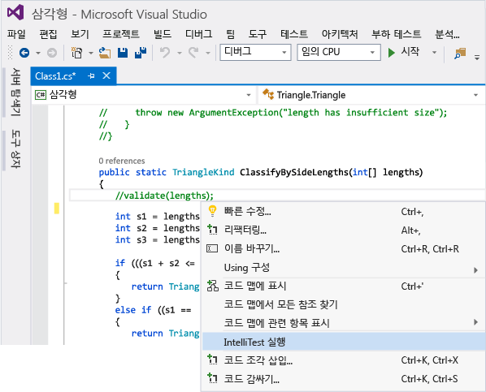
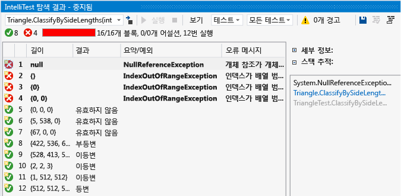
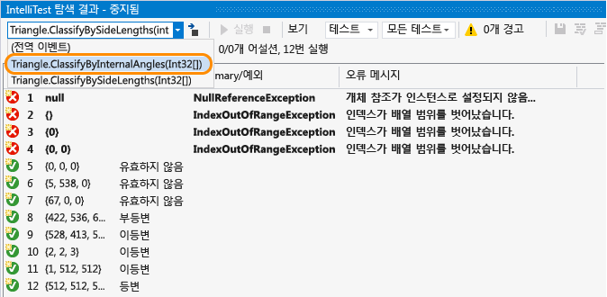
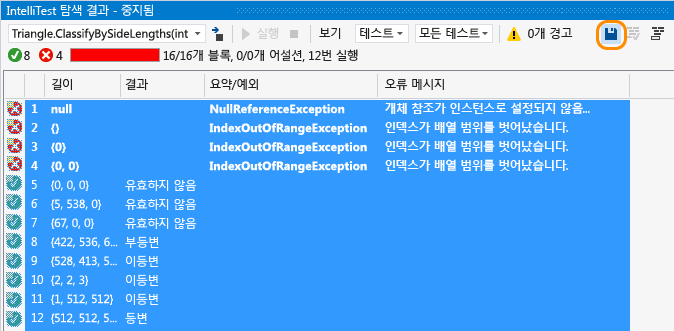
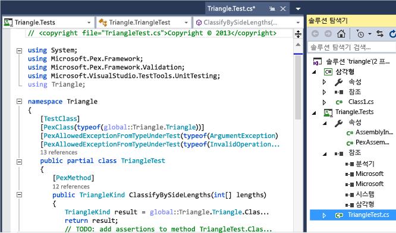
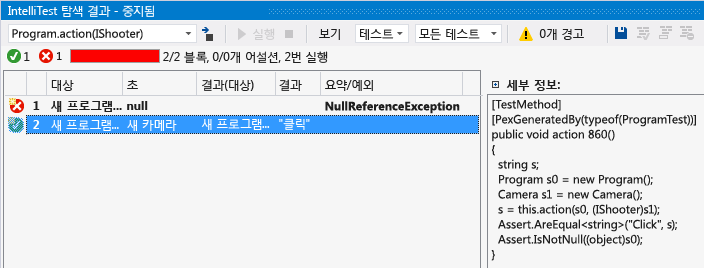

# IntelliTest를 사용하여 코드에 대한 단위 테스트 생성
[!INCLUDE[vs2017banner](../code-quality/includes/vs2017banner.md)]

IntelliTest는 .NET 코드를 탐색하여 테스트 데이터 및 단위 테스트 도구 모음을 생성합니다. 코드의 모든 문에 대해 해당 문을 실행할 테스트 입력이 생성됩니다. 코드의 모든 조건부 분기에 대해 사례 분석이 수행됩니다. 예를 들어 if 문, 어설션 및 예외를 throw할 수 있는 모든 작업이 분석됩니다. 이 분석은 각 메서드에 대해 매개 변수가 있는 단위 테스트용 테스트 데이터를 생성하는 데 사용됩니다\(높은 코드 검사가 포함된 단위 테스트 생성\).  
  
 IntelliTest를 실행하면 오류가 발생하는 테스트를 쉽게 확인하고 필요한 코드를 추가하여 수정할 수 있습니다. 생성된 테스트 중에서 재발 테스트 모음을 제공하기 위해 테스트 프로젝트에 저장할 테스트를 선택할 수 있습니다. 코드를 변경하면 IntelliTest를 다시 실행하여 생성된 테스트를 코드 변경 내용과 동기화합니다.  
  
 IntelliTest는 C\#에만 사용할 수 있으며 x64 구성을 지원하지 않습니다.  
  
## IntelliTest 시작  
 Visual Studio Enterprise가 필요할 것입니다.  
  
### 탐색: IntelliTest를 사용하여 코드 경로를 탐색하고 단위 테스트 생성  
 단위 테스트를 생성하려면 형식이 공용이어야 합니다. 그렇지 않은 경우 먼저 [단위 테스트를 만든](#NoRun) 후에 생성합니다.  
  
1.  Visual Studio에서 솔루션을 엽니다. 그런 다음 테스트할 메서드가 있는 클래스 파일을 엽니다.  
  
2.  코드에서 메서드를 마우스 오른쪽 단추로 클릭하고 **IntelliTest 실행**을 선택하여 메서드의 코드에 대한 단위 테스트를 생성합니다.  
  
       
  
     IntelliTest는 서로 다른 입력을 사용하여 코드를 여러 번 실행합니다. 각 실행은 입력 테스트 데이터 및 결과 출력 또는 예외와 함께 표에 나타납니다.  
  
       
  
     클래스의 모든 공용 메서드에 대해 단위 테스트를 생성하려는 경우 특정 메서드가 아니라 해당 클래스를 마우스 오른쪽 단추로 클릭하면 됩니다. 그런 다음 **IntelliTest 실행**을 선택합니다. 탐색 결과 창의 드롭다운 목록을 사용하여 클래스의 각 메서드에 대한 단위 테스트 및 입력 데이터를 표시합니다.  
  
       
  
     통과한 테스트의 경우, 결과 열에 보고된 결과가 코드에 대한 예상과 일치하는지 확인합니다. 테스트가 실패하는 경우 코드를 적절하게 수정하세요. 그런 다음 IntelliTest를 다시 실행하여 수정 사항의 유효성을 검사합니다.  
  
### 유지: 단위 테스트를 재발 테스트 모음으로 저장  
  
1.  매개 변수가 있는 단위 테스트와 함께 테스트 프로젝트에 저장할 데이터 행을 선택합니다.  
  
       
  
     생성된 매개 변수가 있는 단위 테스트 및 테스트 프로젝트를 볼 수 있습니다. 각 행에 해당하는 개별 단위 테스트는 테스트 프로젝트의 .g.cs 파일에 저장되고, 매개 변수가 있는 단위 테스트는 해당 .cs 파일에 저장됩니다. 수동으로 만든 단위 테스트와 마찬가지로 단위 테스트를 실행하고 테스트 탐색기에서 결과를 볼 수 있습니다.  
  
       
  
     필요한 참조도 테스트 프로젝트에 추가됩니다.  
  
     메서드 코드가 변경된 경우 IntelliTest를 다시 실행하여 단위 테스트를 변경 내용과 동기화합니다.  
  
### 지원: IntelliTest를 사용하여 코드 탐색에 포커스 두기  
  
1.  더 복잡한 코드가 있을 경우 IntelliTest에서는 코드의 탐색에 포커스를 두는 단계를 지원합니다. 예를 들어 인터페이스를 매개 변수로 사용하는 메서드가 있고 해당 인터페이스를 구현하는 클래스가 두 개 이상 있을 경우 IntelliTest는 이러한 클래스를 검색하고 경고를 보고합니다.  
  
     경고를 보고 수행할 작업을 결정합니다.  
  
       
  
2.  코드를 검토하고 테스트할 내용을 파악했으면 경고를 수정하여 인터페이스를 테스트하는 데 사용할 클래스를 선택할 수 있습니다.  
  
       
  
     선택한 클래스는 PexAssemblyInfo.cs 파일에 추가됩니다.  
  
     `[assembly: PexUseType(typeof(Camera))]`  
  
3.  이제 IntelliTest를 다시 실행하여 수정한 클래스만 사용해 매개 변수가 있는 단위 테스트 및 테스트 데이터를 생성할 수 있습니다.  
  
       
  
### 선택: IntelliTest를 사용하여 코드에서 지정하는 정확성 속성의 유효성을 검사합니다.  
 생성된 단위 테스트를 통해 유효성을 검사할 입력과 출력 간의 일반적인 관계를 지정합니다. 이 사양은 테스트 메서드처럼 보이지만 전체적으로 수치화된 메서드에서 캡슐화됩니다. 이것은 매개 변수가 있는 단위 테스트 메서드이며, 만든 모든 어설션은 IntelliTest에서 생성할 수 있는 모든 입력 값에 대해 적용되어야 합니다.  
  
##   Q&A  
  
### Q: 비관리 코드에 IntelliTest를 사용할 수 있나요?  
 **A:** 아니요. IntelliTest는 관리 코드를 대상으로만 작동됩니다.  
  
### Q: 생성된 테스트가 통과하거나 실패하는 경우는 언제입니까?  
 **A:** 예외가 발생하지 않을 경우에는 다른 단위 테스트처럼 통과합니다. 어설션이 실패하거나 테스트 중인 코드가 처리되지 않은 예외를 throw하는 경우에는 실패합니다.  
  
 특정 예외가 throw되어도 성공할 수 있는 테스트가 있는 경우, 요구 사항에 따라 테스트 메서드, 테스트 클래스 또는 어셈블리 수준에서 다음 속성 중 하나를 설정할 수 있습니다.  
  
-   **PexAllowedExceptionAttribute**  
  
-   **PexAllowedExceptionFromTypeAttribute**  
  
-   **PexAllowedExceptionFromTypeUnderTestAttribute**  
  
-   **PexAllowedExceptionFromAssemblyAttribute**  
  
### Q: 매개 변수가 있는 단위 테스트에 가정을 추가할 수 있습니까?  
 **A:** 예. 가정을 사용하여 특정 메서드에 대한 단위 테스트에 필요하지 않은 테스트 데이터를 지정할 수 있습니다. 가정을 추가하려면 <xref:Microsoft.Pex.Framework.PexAssume> 클래스를 사용합니다. 예를 들어 다음과 같이 lengths 변수가 null이 아니라는 가정을 추가할 수 있습니다.  
  
 `PexAssume.IsNotNull(lengths);`  
  
 가정을 추가하고 IntelliTest를 다시 실행하면 더 이상 관련이 없는 테스트 데이터가 제거됩니다.  
  
### Q: 매개 변수가 있는 단위 테스트에 어설션을 추가할 수 있습니까?  
 **A:** 예. IntelliTest는 단위 테스트를 실행할 때 문에서 어설션된 항목이 실제로 올바른지 확인합니다. 어설션을 추가하려면 테스트 프레임워크와 함께 제공되는 <xref:Microsoft.Pex.Framework.PexAssert> 클래스 또는 어설션 API를 사용합니다. 예를 들어 두 변수가 동일하다는 어설션을 추가할 수 있습니다.  
  
 `PexAssert.AreEqual(a, b);`  
  
 어설션을 추가하고 IntelliTest를 다시 실행하면 IntelliTest가 어설션이 유효한지 확인하고 유효하지 않을 경우 테스트가 실패합니다.  
  
###   Q: IntelliTest를 먼저 실행하지 않고 매개 변수가 있는 단위 테스트를 생성할 수 있나요?  
 **A:** 예, 클래스 또는 메서드를 마우스 오른쪽 단추로 클릭하고 **IntelliTest 만들기**를 선택합니다.  
  
   
  
 기본 형식을 적용하여 테스트를 생성하거나 프로젝트 및 테스트 이름 지정 방법을 변경합니다. 새 테스트 프로젝트를 만들거나 기존 프로젝트에 테스트를 저장할 수 있습니다.  
  
   
  
### Q: IntelliTest와 함께 다른 단위 테스트 프레임워크를 사용할 수 있나요?  
 **A:** 예, 다음 단계에 따라 [다른 프레임워크를 찾아서 설치](../test/install-third-party-unit-test-frameworks.md)합니다. Visual Studio를 다시 시작하고 솔루션을 다시 연 후 클래스 또는 메서드를 마우스 오른쪽 단추로 클릭하고 **IntelliTest 만들기**를 선택합니다. 여기서 설치된 프레임워크를 선택합니다.  
  
   
  
 그런 다음 IntelliTest를 실행하여 해당 .g.cs 파일에 개별 단위 테스트를 생성합니다.  
  
### Q: 테스트가 생성되는 방식에 대해 자세히 알아볼 수 있나요?  
 **A:** 예, 개괄적인 개요를 확인하려면 이 [블로그 게시물](http://blogs.msdn.com/b/visualstudioalm/archive/2015/07/05/intellitest-one-test-to-rule-them-all.aspx)을 참조하세요.