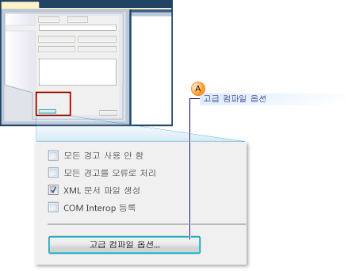
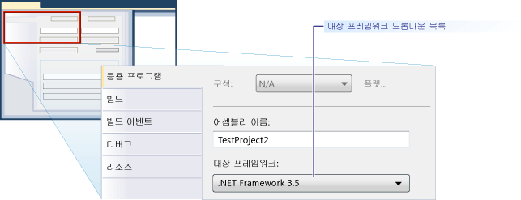

# <a name="how-to-configure-unit-tests-to-target-an-earlier-version-of-the-net-framework"></a>방법: 이전 버전의 .NET Framework를 대상으로 사용하도록 단위 테스트 구성

Microsoft Visual Studio에서 테스트 프로젝트를 만들 때 .NET Framework의 가장 최근 버전이 기본적으로 대상으로 설정됩니다. 또한 Visual Studio의 이전 버전에서 테스트 프로젝트를 업그레이드할 경우 해당 프로젝트는 .NET Framework의 가장 최근 버전을 대상으로 지정하도록 업그레이드됩니다. 프로젝트 속성을 편집하여 .NET Framework의 이전 버전을 프로젝트 대상으로 명시적으로 지정할 수 있습니다.

.NET Framework의 특정 버전을 대상으로 지정하는 단위 테스트 프로젝트를 만들 수 있습니다. 대상으로 지정된 버전은 3.5 이상이어야 하며 클라이언트 버전일 수 없습니다. Visual Studio를 통해 특정 버전을 대상으로 지정하는 단위 테스트에 대한 다음과 같은 기본 지원을 제공할 수 있습니다.

- 단위 테스트 프로젝트를 만들고 .NET Framework의 특정 버전을 프로젝트 대상으로 지정할 수 있습니다.

- 로컬 컴퓨터의 Visual Studio에서 .NET Framework의 특정 버전을 대상으로 지정하는 단위 테스트를 실행할 수 있습니다.

- 명령 프롬프트에서 MSTest.exe를 사용하여 .NET Framework의 특정 버전을 대상으로 지정하는 단위 테스트를 실행할 수 있습니다.

- 빌드 에이전트에서 단위 테스트를 빌드의 일부로 실행할 수 있습니다.

**SharePoint 응용 프로그램 테스트**

위에 나열된 기능을 통해 Visual Studio를 사용하는 SharePoint 응용 프로그램에 대한 단위 테스트 및 통합 테스트를 작성할 수 있습니다. Visual Studio를 사용하여 SharePoint 응용 프로그램을 개발하는 방법에 대한 자세한 내용은 [SharePoint 솔루션 만들기](/office-dev/office-dev/create-sharepoint-solutions), [SharePoint 솔루션 빌드 및 디버깅](/office-dev/office-dev/building-and-debugging-sharepoint-solutions) 및 [SharePoint 코드 확인 및 디버깅](/office-dev/office-dev/verifying-and-debugging-sharepoint-code)을 참조하세요.

**제한 사항**

.NET Framework의 이전 버전을 사용하기 위해 테스트 프로젝트의 대상으로 다시 지정할 경우 다음 제한 사항에 적용됩니다.

- .NET Framework 3.5에서는 단위 테스트만 포함된 테스트 프로젝트에 대해 여러 대상을 지정할 수 있습니다. .NET Framework 3.5에서는 코딩된 UI 또는 로드 테스트 등의 다른 테스트 형식을 지원하지 않습니다. 단위 테스트 이외의 테스트 형식에 대한 대상은 다시 지정할 수 없습니다.

- .NET Framework의 이전 버전이 대상으로 지정된 테스트는 기본 호스트 어댑터에서만 실행할 수 있습니다. ASP.NET 호스트 어댑터에서는 이 기능이 지원되지 않습니다. ASP.NET 개발 서버 컨텍스트에서 실행해야 하는 ASP.NET 응용 프로그램은 .NET Framework의 현재 버전과 호환되어야 합니다.

- .NET Framework 3.5 멀티 타기팅을 지원하는 테스트를 실행할 경우 데이터 수집 지원이 사용하지 않도록 설정됩니다. Visual Studio 명령줄 도구를 사용하여 코드 검사를 실행할 수 있습니다.

- .NET Framework 3.5를 사용하는 단위 테스트는 원격 컴퓨터에서 실행할 수 없습니다.

- 프레임워크의 이전 클라이언트 버전을 단위 테스트의 대상으로 지정할 수 없습니다.

## <a name="re-targeting-to-a-specific-version-of-the-net-framework-for-visual-basic-unit-test-projects"></a>Visual Basic 단위 테스트 프로젝트용 특정 버전 .NET Framework로 대상 다시 지정

1.  새 Visual Basic 단위 테스트 프로젝트를 만듭니다. **파일** 메뉴에서 **새로 만들기**, **프로젝트**를 차례로 선택합니다.

     **새 프로젝트** 대화 상자가 표시됩니다.

2.  **설치된 템플릿**에서 **Visual Basic**을 클릭합니다. **테스트**를 선택하고 **테스트 프로젝트** 템플릿을 선택합니다.

3.  **이름** 텍스트 상자에 Visual Basic 테스트 프로젝트의 이름을 입력하고 **확인**을 선택합니다.

4.  [솔루션 탐색기]에 있는 새 Visual Basic 테스트 프로젝트의 바로 가기 메뉴에서 **속성**을 선택합니다.

     Visual Basic 테스트 프로젝트의 속성이 표시됩니다.

5.  **컴파일** 탭에서 다음 그림과 같이 **고급 컴파일 옵션**을 선택합니다.

     

6.  **대상 프레임워크(모든 구성)** 드롭다운 목록을 사용하여 다음 그림의 설명선 B에 표시된 대로 대상 프레임워크를 **.NET Framework 3.5** 이상으로 변경합니다. 클라이언트 버전을 지정하면 안 됩니다.

     

## <a name="re-targeting-to-a-specific-version-of-the-net-framework-for-visual-c-unit-test-projects"></a>Visual C# 단위 테스트 프로젝트용 특정 버전 .NET Framework로 대상 다시 지정

1.  새 Visual C# 단위 테스트 프로젝트를 만듭니다. **파일** 메뉴에서 **새로 만들기**, **프로젝트**를 차례로 선택합니다.

     **새 프로젝트** 대화 상자가 표시됩니다.

2.  **설치된 템플릿**에서 **Visual C#**을 클릭합니다. **테스트**를 선택하고 **테스트 프로젝트** 템플릿을 선택합니다.

3.  **이름** 텍스트 상자에 Visual C# 테스트 프로젝트의 이름을 입력하고 **확인**을 선택합니다.

4.  [솔루션 탐색기]에 있는 새 Visual C# 테스트 프로젝트의 바로 가기 메뉴에서 **속성**을 선택합니다.

     Visual C# 테스트 프로젝트의 속성이 표시됩니다.

5.  **응용 프로그램** 탭에서 **대상 프레임워크**를 선택합니다. 드롭다운 목록에서 다음 그림과 같이 **.NET Framework 3.5** 이상 버전을 선택합니다. 클라이언트 버전을 지정하면 안 됩니다.

     

## <a name="re-targeting-to-a-specific-version-of-the-net-framework-for-ccli-unit-test-projects"></a>C++/CLI 단위 테스트 프로젝트용 특정 버전 .NET Framework로 대상 다시 지정

1.  새 C++ 단위 테스트 프로젝트를 만듭니다. **파일** 메뉴에서 **새로 만들기**를 선택하고 **프로젝트**를 클릭합니다.

     **새 프로젝트** 대화 상자가 표시됩니다.

    > [!WARNING]
    > Visual C++용 .NET Framework의 이전 버전에 대한 C++/CLI 단위 테스트를 빌드하려면 Visual Studio의 해당 버전을 사용해야 합니다. 예를 들어 .NET Framework 3.5를 대상으로 지정하려면 Visual Studio 2008 및 Visual Studio 2008 서비스 팩 1을 설치해야 합니다.

2.  **설치된 템플릿**에서 **Visual C ++**를 확장합니다. **테스트**를 선택하고 **테스트 프로젝트** 템플릿을 선택합니다.

3.  **이름** 텍스트 상자에 Visual C++ 테스트 프로젝트의 이름을 입력하고 **확인**을 클릭합니다.

4.  [솔루션 탐색기]의 새 Visual C++ 테스트 프로젝트에서 **프로젝트 언로드**를 선택합니다.

5.  [솔루션 탐색기]에서 언로드된 Visual C++ 테스트 프로젝트를 선택하고 **\<프로젝트 이름>.vcxproj 편집**을 선택합니다.

     .vcxproj 파일이 편집기에서 열립니다.

6.  `PropertyGroup` 레이블이 지정된 `"Globals"`에서 `TargetFrameworkVersion`을 버전 3.5 이상으로 설정합니다. 클라이언트 버전을 지정하면 안 됩니다.

    ```xml
    <PropertyGroup Label="Globals">
        <TargetName>DefaultTest</TargetName>
        <ProjectTypes>{3AC096D0-A1C2-E12C-1390-A8335801FDAB};{8BC9CEB8-8B4A-11D0-8D11-00A0C91BC942}</ProjectTypes>
        <ProjectGUID>{CE16D77A-E364-4ACD-948B-1EB6218B0EA3}</ProjectGUID>
        <TargetFrameworkVersion>3.5</TargetFrameworkVersion>
        <Keyword>ManagedCProj</Keyword>
        <RootNamespace>CPP_Test</RootNamespace>
      </PropertyGroup>
    ```

7.  .vcxproj 파일을 저장하고 닫습니다.

8.  [솔루션 탐색기]에 있는 새 Visual C++ 테스트 프로젝트의 바로 가기 메뉴에서 **프로젝트 다시 로드**를 선택합니다.

## <a name="see-also"></a>참고 항목

- [SharePoint 솔루션 만들기](/office-dev/office-dev/create-sharepoint-solutions)
- [SharePoint 솔루션 빌드 및 디버깅](/office-dev/office-dev/building-and-debugging-sharepoint-solutions)
- [고급 컴파일러 설정 대화 상자(Visual Basic)](../ide/reference/advanced-compiler-settings-dialog-box-visual-basic.md)
