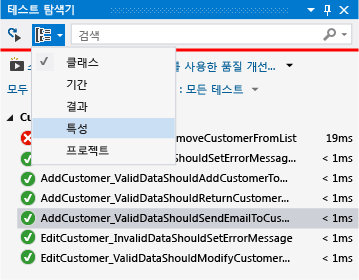
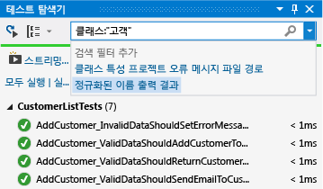
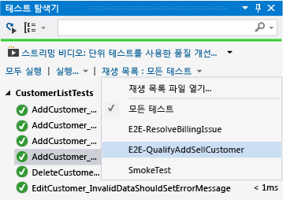

# 테스트 탐색기를 사용하여 단위 테스트 실행
[!INCLUDE[vs2017banner](../code-quality/includes/vs2017banner.md)]

테스트 탐색기를 사용하여 Visual Studio 또는 타사 단위 테스트 프로젝트에서 단위 테스트를 실행하고, 테스트를 범주로 그룹화하며, 테스트 목록을 필터링하고, 테스트 PLAYLIST를 만들어 저장하고 실행할 수 있습니다. 테스트를 디버그하고 테스트 성능 및 코드 검사를 분석할 수도 있습니다.  
  
##  <a name="BKMK_Contents"></a> 목차  
 [단위 테스트 프레임워크 및 테스트 프로젝트](#BKMK_Unit_test_frameworks_and_test_projects)  
  
 [테스트 탐색기에서 테스트 실행](#BKMK_Run_tests_in_Test_Explorer)  
  
 [테스트 결과 보기](#BKMK_View_test_results)  
  
 [테스트 목록 그룹화 및 필터링](#BKMK_Group_and_filter_the_test_list)  
  
 [사용자 지정 재생 목록 만들기](#BKMK_Create_custom_playlists)  
  
 [단위 테스트 디버그 및 분석](#BKMK_Debug_and_analyze_unit_tests)  
  
 [외부 리소스](#BKMK_External_resources)  
  
##  <a name="BKMK_Unit_test_frameworks_and_test_projects"></a> 단위 테스트 프레임워크 및 테스트 프로젝트  
 Visual Studio에는 관리 코드 및 네이티브 코드에 대한 Microsoft 단위 테스트 프레임워크가 있습니다. 그러나 테스트 탐색기도 테스트 탐색기 어댑터를 구현한 단위 테스트 프레임워크를 실행할 수 있습니다. 타사 단위 테스트 프레임워크를 설치하는 방법에 대한 자세한 내용은 [타사 단위 테스트 프레임워크 설치](../test/install-third-party-unit-test-frameworks.md) 항목을 참조하세요.  
  
 테스트 탐색기는 솔루션의 여러 테스트 프로젝트 및 프로덕션 코드 프로젝트의 일부인 테스트 클래스에서 테스트를 실행할 수 있습니다. 테스트 프로젝트에 서로 다른 단위 테스트 프레임워크를 사용할 수 있습니다. 테스트 중인 코드가 .NET Framework용으로 작성된 경우 테스트 프로젝트는 대상 코드의 언어에 관계없이 .NET Framework를 대상으로 하는 임의의 언어로 작성할 수 있습니다. 네이티브 C\/C\+\+ 코드 프로젝트는 C\+\+ 단위 테스트 프레임워크를 사용하여 테스트해야 합니다.  
  
  [목차](#BKMK_Contents)  
  
##  <a name="BKMK_Run_tests_in_Test_Explorer"></a> 테스트 탐색기에서 테스트 실행  
 [테스트 실행](#BKMK_Run_tests) **&#124;** [각 빌드 후 테스트 실행](#BKMK_Run_tests_after_every_build)  
  
 테스트 프로젝트를 빌드하면 테스트가 테스트 탐색기에 나타납니다. 테스트 탐색기가 표시되지 않는 경우 Visual Studio 메뉴에서 **테스트**를 선택하고 **Windows**를 선택한 다음 **테스트 탐색기**를 선택합니다.  
  
   
  
 테스트를 실행하고 작성하고 다시 실행하면 테스트 탐색기는**실패한 테스트**, **통과한 테스트**, **건너뛴 테스트** 및 **실행하지 않은 테스트**의 기본 그룹에 결과를 표시합니다. 테스트 탐색기의 테스트 그룹화 방식을 변경할 수 있습니다.  
  
 테스트 탐색기 도구 모음에서 테스트를 찾고 구성하고 실행하는 작업 중 많은 부분을 수행할 수 있습니다.  
  
   
  
  [목차](#BKMK_Contents)  
  
###  <a name="BKMK_Run_tests"></a> 테스트 실행  
 솔루션의 모든 테스트, 그룹의 모든 테스트 또는 선택한 테스트 집합을 실행할 수 있습니다. 다음 작업 중 하나를 수행합니다.  
  
-   솔루션의 모든 테스트를 실행하려면 **모두 실행**을 선택합니다.  
  
-   기본 그룹의 모든 테스트를 실행하려면 **실행...**을 선택한 다음 메뉴에서 그룹을 선택합니다.  
  
-   실행할 개별 테스트를 선택하고 선택한 테스트에 대한 상황에 맞는 메뉴를 연 다음 **선택한 테스트 실행**을 선택합니다.  
  
-   개별 테스트에 종속성이 없어 임의 순서로 실행할 수 있는 경우 도구 모음의  토글 단추를 사용하여 병렬 테스트 실행을 켭니다. 이렇게 하면 모든 테스트를 실행하는 데 걸리는 시간을 훨씬 줄일 수 있습니다.  
  
 테스트가 실행되면 테스트 탐색기 창 위쪽의 통과\/실패 표시줄에 애니메이션 효과가 적용됩니다. 테스트 실행이 끝날 때 통과\/실패 표시줄은 모든 테스트가 통과했으면 녹색이 되고 실패한 테스트가 있으면 빨간색이 됩니다.  
  
  [목차](#BKMK_Contents)  
  
###  <a name="BKMK_Run_tests_after_every_build"></a> 각 빌드 후 테스트 실행  
  
> [!WARNING]
>  각 빌드 후 단위 테스트 실행은 Visual Studio Enterprise에서 지원됩니다.  
  
|||  
|-|-|  
||각 로컬 빌드 후 단위 테스트를 실행하려면 표준 메뉴에서 **테스트**를 선택한 다음 테스트 탐색기 도구 모음에서 **빌드 후 테스트 실행**을 선택합니다.|  
  
  [목차](#BKMK_Contents)  
  
##  <a name="BKMK_View_test_results"></a> 테스트 결과 보기  
 [테스트 정보 보기](#BKMK_View_test_details) **&#124;** [테스트 메서드의 소스 코드 보기](#BKMK_View_the_source_code_of_a_test_method)  
  
 테스트를 실행하고 작성하고 다시 실행하면 테스트 탐색기는 **실패한 테스트**, **통과한 테스트**, **건너뛴 테스트** 및 **실행하지 않은 테스트**의 그룹에 결과를 표시합니다. 테스트 탐색기 아래쪽의 세부 정보 창에 테스트 실행에 대한 요약이 표시됩니다.  
  
###  <a name="BKMK_View_test_details"></a> 테스트 정보 보기  
 개별 테스트의 정보를 보려면 해당 테스트를 선택합니다.  
  
   
  
 테스트 정보 창에는 다음 정보가 표시됩니다.  
  
-   테스트 메서드의 소스 파일 이름 및 줄 번호  
  
-   테스트의 상태입니다.  
  
-   테스트 메서드가 실행되는 데 걸린 시간  
  
 테스트가 실패할 경우 세부 정보 창에는 다음과 같은 정보도 표시됩니다.  
  
-   단위 테스트 프레임워크에서 테스트에 대해 반환된 메시지  
  
-   테스트 실패 시의 스택 추적  
  
  [목차](#BKMK_Contents)  
  
###  <a name="BKMK_View_the_source_code_of_a_test_method"></a> 테스트 메서드의 소스 코드 보기  
 Visual Studio 편집기에서 테스트 메서드의 소스 코드를 표시하려면 테스트를 선택한 다음 상황에 맞는 메뉴에서 **테스트 열기**\(키보드: F12\)를 선택합니다.  
  
  [목차](#BKMK_Contents)  
  
##  <a name="BKMK_Group_and_filter_the_test_list"></a> 테스트 목록 그룹화 및 필터링  
 [테스트 목록 그룹화](#BKMK_Grouping_the_test_list) **&#124;** [특성(trait)별 그룹화](#BKMK_Group_by_traits) **&#124;** [테스트 목록 검색 및 필터링](#BKMK_Search_and_filter_the_test_list)  
  
 테스트 탐색기를 사용하면 미리 정의된 범주로 테스트를 그룹화할 수 있습니다. 테스트 탐색기에서 실행되는 대부분의 단위 테스트 프레임워크에서는 고유의 범주 및 범주\/값 쌍을 정의하여 테스트를 그룹화할 수 있습니다. 또한 테스트 속성과 비교하여 일치하는 문자열을 찾아 테스트 목록을 필터링할 수도 있습니다.  
  
###  <a name="BKMK_Grouping_the_test_list"></a> 테스트 목록 그룹화  
 테스트 구성 방식을 변경하려면 **그룹화 방법** 단추  옆에 있는 아래쪽 화살표를 선택하고 새 그룹화 기준을 선택합니다.  
  
   
  
### 테스트 탐색기 그룹  
  
|그룹화|설명|  
|---------|--------|  
|**기간**|실행 시간을 기준으로 **빠름**, **보통**, **느림**으로 테스트를 그룹화합니다.|  
|**결과**|실행 결과를 기준으로 **실패한 테스트**, **건너뛴 테스트**, **통과한 테스트**로 테스트를 그룹화합니다.|  
|**특성**|정의한 범주\/값 쌍을 기준으로 테스트를 그룹화합니다. 특성\(trait\) 범주 및 값을 지정하는 구문은 단위 테스트 프레임워크에 의해 정의됩니다.|  
|**프로젝트**|프로젝트 이름을 기준으로 테스트를 그룹화합니다.|  
  
  [목차](#BKMK_Contents)  
  
###  <a name="BKMK_Group_by_traits"></a> 특성\(trait\)별 그룹화  
 특성\(trait\)은 일반적으로 범주 이름\/값 쌍이지만 단일 범주일 수도 있습니다. 특성\(trait\)은 단위 테스트 프레임워크에서 테스트 메서드로 식별하는 메서드에 할당할 수 있습니다. 단위 테스트 프레임워크는 특성\(trait\) 범주를 정의할 수 있습니다. 특성\(trait\) 범주에 고유한 범주 이름\/값 쌍을 정의하는 값을 추가할 수 있습니다. 특성\(trait\) 범주 및 값을 지정하는 구문은 단위 테스트 프레임워크에 의해 정의됩니다.  
  
 **Microsoft 단위 테스트 프레임워크의 관리 코드 관련 특성\(trait\)**  
  
 관리되는 앱에 대한 Microsoft 단위 테스트 프레임워크에서 특성\(trait\) 이름\/값 쌍을 <xref:Microsoft.VisualStudio.TestTools.UnitTesting.TestPropertyAttribute> 특성에 정의합니다. 테스트 프레임워크에는 다음과 같은 미리 정의된 특성\(trait\)이 있습니다.  
  
|특성|설명|  
|--------|--------|  
|<xref:Microsoft.VisualStudio.TestTools.UnitTesting.OwnerAttribute>|소유자 범주는 단위 테스트 프레임워크에 의해 정의되며, 소유자의 문자열 값을 제공해야 합니다.|  
|<xref:Microsoft.VisualStudio.TestTools.UnitTesting.PriorityAttribute>|우선순위 범주는 단위 테스트 프레임워크에 의해 정의되며, 우선순위의 정수 값을 제공해야 합니다.|  
|<xref:Microsoft.VisualStudio.TestTools.UnitTesting.TestCategoryAttribute>|TestCategory 특성을 사용하면 값이 없는 범주를 제공할 수 있습니다. TestCategory 특성으로 정의된 범주는 TestProperty 특성의 범주도 될 수 있습니다.|  
|<xref:Microsoft.VisualStudio.TestTools.UnitTesting.TestPropertyAttribute>|TestProperty 특성을 사용하여 특성\(trait\) 범주\/값 쌍을 정의할 수 있습니다.|  
  
 **Microsoft 단위 테스트 프레임워크의 C\+\+ 관련 특성\(trait\)**  
  
 특성\(trait\)을 정의하려면 `TEST_METHOD_ATTRIBUTE` 매크로를 사용합니다. 예를 들어 `TEST_MY_TRAIT`라는 특성\(trait\)을 정의하는 경우 다음과 같습니다.  
  
```cpp  
#define TEST_MY_TRAIT(traitValue) TEST_METHOD_ATTRIBUTE(L"MyTrait", traitValue)  
```  
  
 단위 테스트에서 정의된 특성\(trait\)을 사용하려면 다음과 같습니다.  
  
```  
BEGIN_TEST_METHOD_ATTRIBUTE(Method1)  
    TEST_OWNER(L"OwnerName")  
    TEST_PRIORITY(1)  
    TEST_MY_TRAIT(L"thisTraitValue")  
END_TEST_METHOD_ATTRIBUTE()  
  
TEST_METHOD(Method1)  
{     
    Logger::WriteMessage("In Method1");  
    Assert::AreEqual(0, 0);  
}  
```  
  
### C\+\+ 성분 특성 매크로  
  
|매크로|설명|  
|---------|--------|  
|`TEST_METHOD_ATTRIBUTE(attributeName, attributeValue)`|TEST\_METHOD\_ATTRIBUTE 매크로를 사용하여 특성\(trait\)을 정의합니다.|  
|`TEST_OWNER(ownerAlias)`|미리 정의된 소유자 특성\(trait\)을 사용하여 테스트 메서드의 소유자를 지정합니다.|  
|`TEST_PRIORITY(priority)`|미리 정의된 우선순위 특성\(trait\)을 사용하여 테스트 메서드에 상대적 우선순위를 할당합니다.|  
  
  [목차](#BKMK_Contents)  
  
###  <a name="BKMK_Search_and_filter_the_test_list"></a> 테스트 목록 검색 및 필터링  
 테스트 탐색기 필터를 사용하여 프로젝트에서 보고 실행하는 테스트 메서드를 제한할 수 있습니다.  
  
 테스트 탐색기 검색 상자에 문자열을 입력하고 Enter 키를 선택하면 테스트 목록이 필터링되어 정규화된 이름에 문자열이 포함된 테스트만 표시됩니다.  
  
 다른 기준으로 필터링하려면  
  
1.  검색 상자 오른쪽에 있는 드롭다운 목록을 엽니다.  
  
2.  새 조건을 선택합니다.  
  
3.  필터 값을 따옴표 사이에 입력합니다.  
  
   
  
> [!NOTE]
>  검색은 대\/소문자를 구분하지 않으며 지정된 문자열이 조건 값의 어느 부분에라도 일치하는지 확인합니다.  
  
|한정자|설명|  
|---------|--------|  
|**특성**|특성\(trait\) 범주와 일치 항목의 값을 검색합니다. 특성\(trait\) 범주와 값을 지정하는 구문은 단위 테스트 프레임워크에 의해 정의됩니다.|  
|**프로젝트**|테스트 프로젝트 이름에서 일치 항목을 검색합니다.|  
|**오류 메시지**|어설션 오류에 의해 반환되는 사용자 정의 오류 메시지에서 일치 항목을 검색합니다.|  
|**파일 경로**|테스트 소스 파일의 정규화된 파일 이름에서 일치 항목을 검색합니다.|  
|**정규화된 이름**|테스트 네임스페이스, 클래스 및 메서드의 정규화된 파일 이름에서 일치 항목을 검색합니다.|  
|**출력**|표준 출력\(stdout\) 또는 표준 오류\(stderr\)에 기록된 사용자 정의 오류 메시지를 검색합니다. 출력 메시지를 지정하는 구문은 단위 테스트 프레임워크에 의해 정의됩니다.|  
|**결과**|테스트 탐색기 범주 이름에서 **실패한 테스트**, **건너뛴 테스트**, **통과한 테스트** 등의 일치 항목을 검색합니다.|  
  
 필터 결과의 하위 집합을 제외하려면 다음 구문을 사용합니다.  
  
```  
FilterName:"Criteria" -FilterName:"SubsetCriteria"  
```  
  
 예를 들면 다음과 같습니다.  
  
```  
FullName:"MyClass" - FullName:"PerfTest"  
```  
  
 이름에 "PerfTest"가 들어 있는 경우를 제외하고 "MyClass"가 들어 있는 모든 테스트를 반환합니다.  
  
  [목차](#BKMK_Contents)  
  
##  <a name="BKMK_Create_custom_playlists"></a> 사용자 지정 재생 목록 만들기  
 실행하거나 그룹으로 보려는 테스트 목록을 만들어 저장할 수 있습니다. 재생 목록을 선택하면 목록의 테스트가 테스트 탐색기에 표시됩니다. 두 개 이상의 재생 목록에 테스트를 추가할 수 있으며 기본 재생 목록인 **모든 테스트**를 선택하면 프로젝트의 모든 테스트를 사용할 수 있습니다.  
  
   
  
 **재생 목록을 만들려면** 테스트 탐색기에서 하나 이상의 테스트를 선택합니다. 상황에 맞는 메뉴에서 **재생 목록에 추가**, **새 재생 목록**을 선택합니다.**새 재생 목록 만들기** 대화 상자에서 지정한 이름과 위치를 사용해 파일을 저장합니다.  
  
 **재생 목록에 테스트를 추가하려면** 테스트 탐색기에서 하나 이상의 테스트를 선택합니다. 상황에 맞는 메뉴에서 **재생 목록에 추가**를 선택한 다음 테스트를 추가할 재생 목록을 선택합니다.  
  
 **재생 목록을 열려면** Visual Studio 메뉴에서 테스트, 재생 목록을 선택한 다음 최근에 사용한 재생 목록 중에서 선택하거나 재생 목록 열기를 선택하여 재생 목록의 이름과 위치를 지정합니다.  
  
 개별 테스트에 종속성이 없어 임의 순서로 실행할 수 있는 경우 도구 모음의  토글 단추를 사용하여 병렬 테스트 실행을 켭니다. 이렇게 하면 모든 테스트를 실행하는 데 걸리는 시간을 훨씬 줄일 수 있습니다.  
  
  [목차](#BKMK_Contents)  
  
##  <a name="BKMK_Debug_and_analyze_unit_tests"></a> 단위 테스트 디버그 및 분석  
 [단위 테스트 디버그](#BKMK_Debug_unit_tests) **&#124;** [테스트 메서드 성능 문제 진단](#BKMK_Diagnose_test_method_performance_issues) **&#124;** [단위 테스트 코드 검사 분석](#BKMK_Analyzeunit_test_code_coverage)  
  
###  <a name="BKMK_Debug_unit_tests"></a> 단위 테스트 디버그  
 테스트 탐색기를 사용하여 테스트에 대한 디버깅 세션을 시작할 수 있습니다. Visual Studio 디버거에서 코드를 단계별로 실행하면 단위 테스트 및 테스트 중인 프로젝트 간을 앞뒤로 매끄럽게 이동할 수 있습니다. 디버깅을 시작하려면  
  
1.  Visual Studio 편집기에서 디버그하려는 하나 이상의 테스트 메서드에서 중단점을 설정합니다.  
  
    > [!NOTE]
    >  테스트 메서드는 순서에 관계 없이 실행할 수 있기 때문에 디버그하려는 모든 테스트 메서드에 중단점을 설정합니다.  
  
2.  테스트 탐색기에서 테스트 메서드를 선택한 다음 상황에 맞는 메뉴에서 **선택한 테스트 디버그**를 선택합니다.  
  
 디버거에 대한 자세한 내용은 [Visual Studio의 디버깅](../debugger/debugging-in-visual-studio.md) 항목을 참조하세요.  
  
  [목차](#BKMK_Contents)  
  
###  <a name="BKMK_Diagnose_test_method_performance_issues"></a> 테스트 메서드 성능 문제 진단  
 테스트 메서드에 너무 많은 시간이 소요되는 이유를 진단하려면 테스트 탐색기에서 메서드를 선택하고 상황에 맞는 메뉴에서 프로필을 선택합니다.[프로파일링 도구 사용](../profiling/performance-explorer.md)을 참조하세요.  
  
###  <a name="BKMK_Analyzeunit_test_code_coverage"></a> 단위 테스트 코드 검사 분석  
  
> [!NOTE]
>  단위 테스트 코드 검사는 Visual Studio Enterprise에서만 사용할 수 있습니다.  
  
 Visual Studio 코드 검사 도구를 사용하여 실제로 단위 테스트를 통해 테스트되는 제품 코드의 양을 결정할 수 있습니다. 솔루션의 선택된 테스트 또는 모든 테스트에 대해 코드 검사를 실행할 수 있습니다.  
  
 솔루션에서 테스트 메서드에 대한 코드 검사를 실행하려면  
  
1.  Visual Studio 메뉴에서 **테스트**를 선택한 다음 **코드 검사 분석**을 선택합니다.  
  
2.  하위 메뉴에서 다음 명령 중 하나를 선택합니다.  
  
    -   **선택한 테스트**는 테스트 탐색기에서 선택한 테스트 메서드를 실행합니다.  
  
    -   **모든 테스트**는 솔루션의 모든 테스트 메서드를 실행합니다.  
  
 코드 검사 결과 창에는 실행된 제품 코드 블록의 백분율이 줄, 함수, 클래스, 네임스페이스 및 모듈별로 표시됩니다.  
  
 자세한 내용은 [코드 검사를 사용하여 테스트할 코드 범위 결정](../test/using-code-coverage-to-determine-how-much-code-is-being-tested.md)을 참조하십시오.  
  
  [목차](#BKMK_Contents)  
  
##  <a name="BKMK_External_resources"></a> 외부 리소스  
  
###  <a name="BKMK_Guidance"></a> 지침  
 [Visual Studio 2012를 사용한 연속 배달 테스트 \- 2장: 단위 테스트: 내부 테스트](http://go.microsoft.com/fwlink/?LinkID=255188)  
  
## 참고 항목  
 [코드 단위 테스트](../test/unit-test-your-code.md)   
 [단위 테스트를 64비트 프로세스로 실행](../test/run-a-unit-test-as-a-64-bit-process.md)