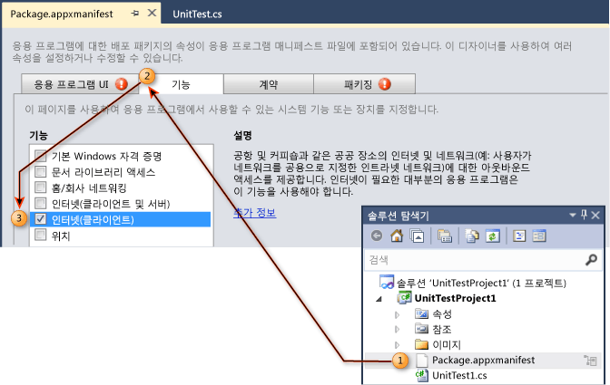
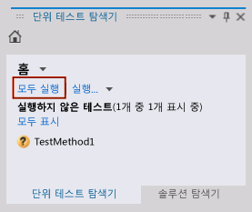

# 연습: UWP 앱의 유닛 테스트 만들기 및 실행

Visual Studio에는 단위 테스트 UWP(유니버설 Windows 플랫폼) 앱에 대한 지원이 포함되어 있습니다. Visual Studio에는 Visual C#, Visual Basic 및 Visual C++에 대한 단위 테스트 프로젝트 템플릿이 포함되어 있습니다.

> [!TIP]
> UWP 앱 개발에 대한 자세한 내용은 [UWP 앱 시작하기](/windows/uwp/get-started/)를 참조하세요.

다음 절차에서는 관리되는 UWP 앱에 대한 단위 테스트를 작성, 실행 및 디버깅하는 단계를 설명합니다.

## UWP 앱에 대한 단위 테스트 프로젝트 만들기

1.  **파일** 메뉴에서 **새 프로젝트**를 선택합니다.

     **새 프로젝트** 대화 상자가 표시됩니다.

2.  템플릿에서 단위 테스트를 만들 프로그래밍 언어를 선택하고 연결된 Windows 유니버설 단위 테스트 라이브러리를 선택합니다. 예를 들면 **Visual C#** 를 선택하고 **Windows 유니버셜**을 선택한 다음 **단위 테스트 라이브러리(유니버셜 Windows)** 를 선택합니다.

3.  (선택 사항) **이름** 텍스트 상자에 프로젝트에 사용할 이름을 입력합니다.

4.  (선택 사항) **위치** 텍스트 상자에 입력하거나 **찾아보기** 단추를 선택하여 프로젝트를 만들 경로를 수정합니다.

5.  (선택 사항) **솔루션** 이름 텍스트 상자에 솔루션에 사용할 이름을 입력합니다.

6.  **솔루션용 디렉터리 만들기** 옵션을 선택한 상태에서 **확인** 단추를 선택합니다.

     

     **솔루션 탐색기**는 UWP 단위 테스트 프로젝트로 채워지며 코드 편집기에는 UnitTest1이라는 제목의 기본 단위 테스트가 표시됩니다.

     

## 단위 테스트 프로젝트의 UWP 앱 매니페스트 파일 편집

1.  **솔루션 탐색기**에서 *Package.appxmanifest* 파일을 마우스 오른쪽 단추로 클릭하고 **열기**를 선택합니다.

     편집하기 위해 **매니페스트 디자이너**를 표시합니다.

2.  **매니페스트 디자이너**에서 **기능** 탭을 선택합니다.

3.  **기능**의 목록에서 단위 테스트와 테스트하는 코드에 필요한 기능을 선택합니다. 예를 들어, 단위 테스트에 필요하고 테스트하려는 코드에 인터넷 액세스 기능이 있어야 하는 경우 **인터넷** 확인란을 선택합니다.

    > [!NOTE]
    > 선택하는 기능에는 단위 테스트가 제대로 작동하는 데 필요한 기능만 포함되어야 합니다.

     

## UWP 앱에 대한 단위 테스트 코딩

**코드 편집기**에서 단위 테스트를 편집하고 테스트에 필요한 어설션과 논리를 추가합니다.

## 단위 테스트 실행

### 솔루션을 빌드하고 테스트 탐색기를 사용하여 단위 테스트를 실행하려면

1.  **테스트** 메뉴에서 **창**을 선택한 다음 **테스트 탐색기**를 선택합니다.

     **테스트 탐색기**가 테스트를 나열하지 않고 표시됩니다.

2.  **빌드** 메뉴에서 **솔루션 빌드**를 선택합니다.

     단위 테스트가 지금 나열됩니다.

    > [!NOTE]
    > 테스트 탐색기에서 단위 테스트 목록을 업데이트하는 솔루션을 빌드해야 합니다.

3.  **테스트 탐색기**에서 만든 단위 테스트를 선택합니다.

    > [!TIP]
    > 테스트 탐색기는 **소스:** 옆의 소스 코드에 대한 링크를 제공합니다.

4.  **모두 실행**을 선택합니다.

     

    > [!TIP]
    > 탐색기에 나열된 하나 이상의 단위 테스트를 선택하고 마우스 오른쪽 단추를 클릭한 다음 **선택한 테스트 실행**을 선택합니다.
    >
    > 또한 **선택한 테스트 디버그**, **테스트 열기**를 선택하고 **속성** 옵션을 사용할 수 있습니다.
    >
    > 

    단위 테스트가 실행됩니다. 작업이 완료되면 **테스트 탐색기**는 테스트 상태와 경과된 시간을 표시하고 원본에 대한 링크를 제공합니다.

    

## 참고 항목

- [Visual Studio를 사용하여 UWP 앱 테스트](../test/unit-test-your-code.md)
- [UWP 앱 빌드 및 테스트](/azure/devops/pipelines/apps/windows/universal?tabs=vsts)