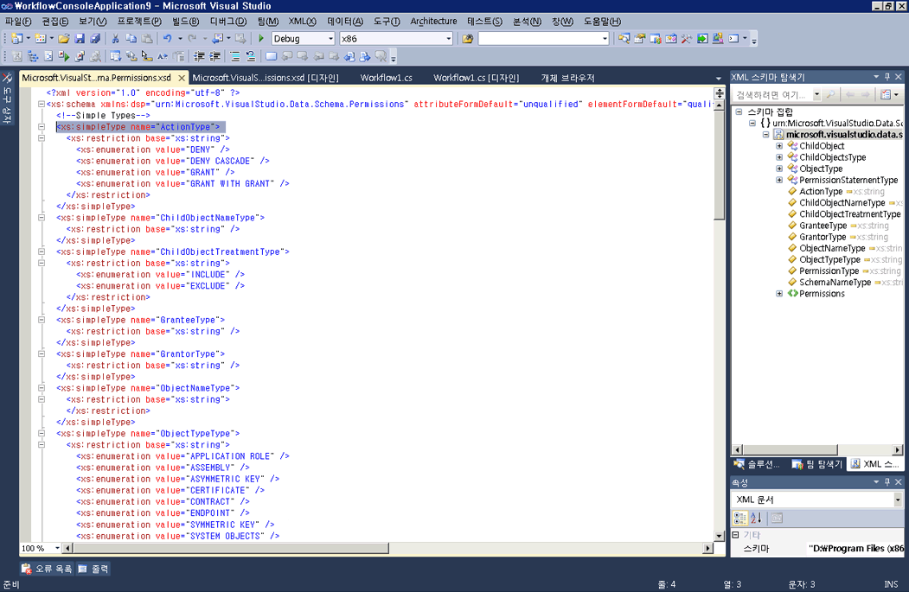

# XML 리터럴과 XML 스키마 탐색기와의 통합
Visual Basic XML 조각을 Visual Basic 코드에 직접 통합할 수 있습니다 의미 하는 XML 리터럴을 지원 합니다. 자세한 내용은 참조 [XML 리터럴 개요](http://go.microsoft.com/fwlink/?LinkId=140325)합니다.  
  
 Visual Basic 프로젝트의 XSD 파일에 XML 리터럴이 들어 있는 경우 XML 스키마 탐색기에서 XML 스키마 집합을 볼 수 있습니다. XML 리터럴의와 연결 된 스키마 집합을 보려면 XML 리터럴 또는 XML 네임 스페이스 가져오기에서 XML 노드를 마우스 오른쪽 단추로 클릭 하 고 선택 **스키마 탐색기에 표시**합니다.  
  
   
  
 이렇게 하면 XML 스키마 탐색기가 Visual Basic 파일과 나란히 열립니다.  
  
 
  
## 참고 항목  
[방법: XML 리터럴과 함께 XML 스키마 디자이너 사용](../xml-tools/how-to-use-the-xml-schema-designer-with-xml-literals.md)