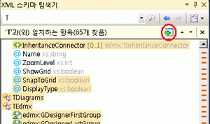

# 스키마 집합 검색
[!INCLUDE[vs2017banner](../code-quality/includes/vs2017banner.md)]

XML 스키마 탐색기를 사용하면 다음 방법으로 스키마 집합을 검색할 수 있습니다.  
  
-   키워드 검색  
  
-   스키마 관련 검색  
  
## 키워드 검색  
 XML 스키마 탐색기 도구 모음의 **스키마 집합 검색** 입력란에 부분 문자열을 입력하여 키워드 검색을 수행합니다.  
  
   
  
 XML 스키마 탐색기에서는 스키마 집합에서 다음을 검색합니다.  
  
-   지정된 키워드와 일치하는 `name` 또는 `ref` 특성.요소, 특성, 형식과 이름을 기준으로 찾을 수도 있습니다.  
  
-   include 문의 `schemaLocation` 특성  
  
-   import 문의 `namespace` 특성  
  
## 스키마 관련 검색  
 XML 스키마 탐색기에는 XML 스키마 탐색기의 상황에 맞는 메뉴를 사용하여 액세스할 수 있는 기본 제공 검색 기능도 포함되어 있습니다.사용할 수 있는 상황에 맞는 메뉴에 대한 자세한 내용은 [상황에 맞는 메뉴](../xml-tools/context-menus-xml-schema-explorer.md)를 참조하십시오.또한 시작 뷰에서 스키마 관련 검색을 수행할 수 있습니다. 자세한 내용은 [시작 뷰](../xml-tools/start-view.md) 항목의 "스키마 집합 정보" 단원을 참조하십시오.  
  
## 검색 결과 표시 및 탐색  
 검색이 완료되면 검색 결과와 함께 요약 결과 창이 도구 모음에 추가됩니다.또한 검색 결과가 XML 스키마 탐색기에서 강조 표시되고 세로 스크롤 막대의 눈금 표시로 나타납니다.XML 스키마 탐색기 도구 모음의 요약 결과 창에서 **다음 검색 결과로 이동** 및 **이전 검색 결과로 이동** 단추를 사용하거나, 키보드 키의 F3 키 및 Shift\+F3을 사용하거나, 스크롤 막대의 눈금 표시를 클릭하여 검색 결과를 탐색할 수 있습니다.  
  
 요약 결과 창에서 **작업 영역에 선택한 노드 추가** 단추를 클릭하여 작업 영역에 검색 결과를 추가할 수 있습니다.  
  
   
  
## 검색 결과 지우기  
 검색 결과를 지우려면 XML 스키마 탐색기 검색 도구 모음의 요약 결과 창에서 **x** 단추를 클릭합니다.  
  
## 참고 항목  
 [XML 스키마 탐색기](../xml-tools/xml-schema-explorer.md)